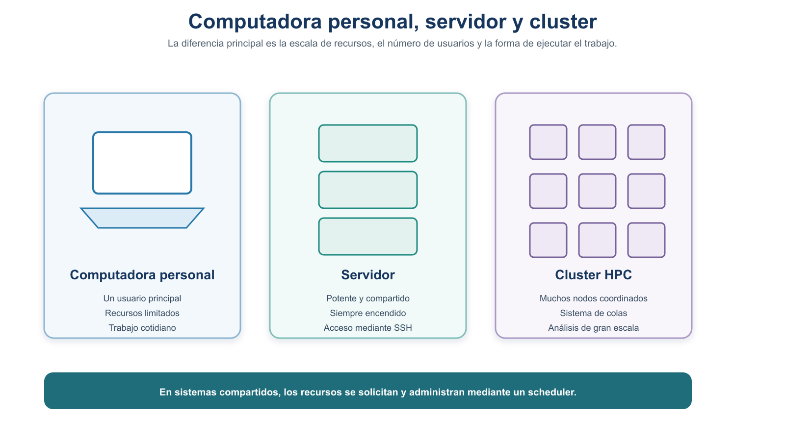
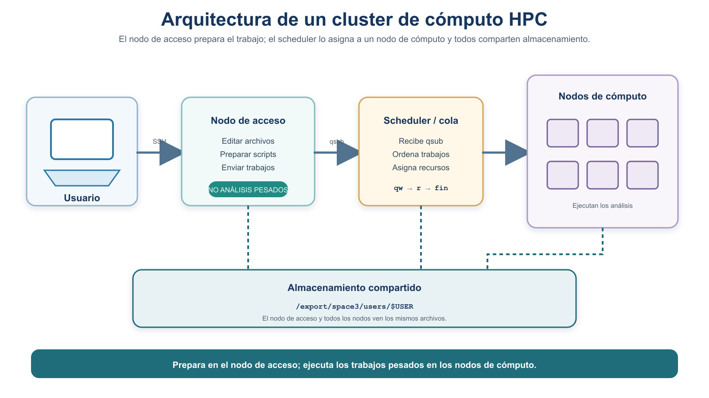
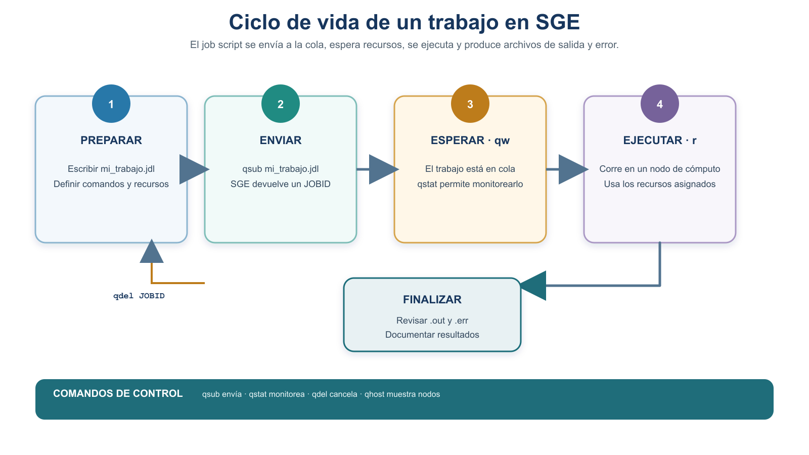

# Borrador reubicado — Introducción al cluster de cómputo (HPC) y SGE

> **ESTADO EDITORIAL — NO PUBLICAR COMO PARTE DE LA UNIDAD 2.** Este material ya no sigue a S5 ni
> constituye el cierre de la Unidad 2. Se conserva como borrador para reubicarlo después de que el
> alumnado practique procesamiento de datos, tuberías y scripts, cerca de la aplicación con BLAST.
> Antes de publicarlo deben definirse su unidad y sesión, actualizar sus referencias internas y
> validar en Chaac las directivas, rutas y comandos institucionales.

La meta futura del material es que, a **nivel usuario**, el estudiante comprenda qué es un cluster y
sepa **enviar, monitorear y cancelar** un trabajo sencillo en su sistema de colas, antes de aplicar el
mismo ciclo a un análisis bioinformático de mayor costo.

> **NOTA:** Esta sección es una **introducción a nivel usuario**. El objetivo **no** es que administres
> un cluster, sino que entiendas su lógica y sepas conectarte, enviar un trabajo y vigilarlo. Muchos
> cursos posteriores y proyectos de investigación lo requieren.

## Ficha del módulo

| Elemento | Descripción |
| --- | --- |
| **Sesión** | Por definir; posterior al procesamiento de datos y al scripting |
| **Tema** | Introducción a clusters de cómputo (HPC) y al planificador SGE |
| **Competencia** | B — Dominio del entorno Unix y del cómputo científico **[Nuevo]** |
| **Resultado (plan)** | Envía, monitorea y cancela un trabajo sencillo en un cluster, a nivel usuario |
| **Lectura base** | Este módulo + documentación del cluster del CCG (consultar con quien imparte el curso) |
| **Evidencia** | Job enviado, monitoreado y finalizado o cancelado, con `.out`/`.err` revisados |

## Relación con los procesos, el scripting y el proyecto integrador

En la Unidad 2 aprendiste que un **proceso** es un programa en ejecución. Después practicarás
procesamiento de datos y construirás scripts reproducibles. Entonces este material introducirá la
solución institucional para análisis más demandantes: en lugar de lanzar el proceso a mano, lo
**describes en un archivo** y se lo entregas a un **planificador** que decide cuándo y dónde
ejecutarlo. La aplicación auténtica se vinculará con BLAST masivo **[Integración]**.

## Resultados de aprendizaje de la sesión

Al terminar este módulo futuro, el estudiante es capaz de:

1. **Distinguir** computadora personal, servidor y cluster, y **describir** la arquitectura de un
   cluster (nodo de acceso, nodos de cómputo, almacenamiento compartido, planificador).
2. **Explicar** qué hace un sistema de colas y qué significan los estados `qw` y `r`.
3. **Escribir** un *job script* mínimo y autocontenido para SGE.
4. **Enviar** el trabajo con `qsub`, **monitorearlo** con `qstat`, **cancelarlo** con `qdel` y
   **revisar** sus archivos `.out` y `.err`.

## Antes de la sesión

| Elemento | Detalle |
| --- | --- |
| **Lectura obligatoria** | Este módulo completo. |
| **Preparación técnica** | Acceso al cluster (habilidad de S3) y tu espacio `/export/space3/users/$USER`. |
| **Primer intento** | Escribe **a mano** un *job script* mínimo (usa el ejemplo de §4 como base). |
| **Producto para el taller** | Tu *job script* escrito a mano y tus dudas. |
| **Tiempo estimado** | Lectura ~45 min · primer intento ~25 min. |

---

## 1. Computadora personal vs. servidor vs. cluster

- **Computadora personal:** una máquina para tu trabajo diario. Recursos limitados.
- **Servidor:** una computadora potente, compartida y siempre encendida, a la que te conectas por SSH
  (lo hiciste en S3).
- **Cluster de cómputo de alto desempeño (HPC):** un **conjunto de muchos servidores** (llamados
  *nodos*) conectados entre sí y coordinados para trabajar como un solo sistema muy potente.



*Figura 1. De la computadora personal al cluster: cada nivel ofrece más capacidad de cómputo y de almacenamiento compartido.*

> **IMPORTANTE — un cluster no vuelve paralelo tu programa.** Tener muchos nodos **no** hace que un
> programa cualquiera corra "en paralelo" automáticamente. Un trabajo usa un nodo, o varios recursos,
> **solo si el programa y la solicitud lo permiten**. Por defecto, tu trabajo usa lo que pidas y lo que
> el programa sepa aprovechar.

## 2. Arquitectura de un cluster

Un cluster tiene tres piezas que debes conocer como usuario:

- **Nodo de acceso (*login node*):** la máquina a la que te conectas por SSH. Sirve para **preparar**
  tu trabajo (editar archivos, organizar datos), **no** para correr análisis pesados.
- **Nodos de cómputo:** las máquinas donde realmente se ejecutan los análisis. No te conectas a ellos
  directamente: les envías el trabajo a través del sistema de colas.
- **Almacenamiento compartido:** un sistema de archivos que **todos los nodos ven por igual**, así tus
  datos están disponibles sin importar en qué nodo corra el trabajo. En el cluster del curso, tu
  espacio de trabajo está bajo `/export/space3/users/$USER`.



*Figura 2. Arquitectura de un cluster: te conectas por SSH al nodo de acceso; el sistema de colas reparte los trabajos entre los nodos de cómputo; todos comparten el mismo almacenamiento.*

> **IMPORTANTE:** No ejecutes análisis pesados en el **nodo de acceso**: lo comparten todos los
> usuarios y lo saturarías. Los trabajos pesados **siempre** se envían a los nodos de cómputo mediante
> el sistema de colas.

## 3. El sistema de colas (*scheduler*)

Como muchos usuarios comparten el cluster, no todos pueden correr al mismo tiempo. Un **sistema de
colas** (o *planificador* / *scheduler*) recibe los trabajos de todos, los **ordena en una cola** y
los asigna a los nodos conforme se liberan recursos. Tú no eliges el nodo: **describes** qué necesita
tu trabajo y el sistema decide cuándo y dónde ejecutarlo.

El cluster del curso usa el planificador **SGE** (*Sun/Son of Grid Engine*). Sus comandos principales
son `qsub` (enviar), `qstat` (monitorear), `qdel` (cancelar) y `qhost` (ver nodos).

## 4. El *job script*: un trabajo mínimo y autocontenido

Para pedirle trabajo a SGE escribes un pequeño **script de trabajo** (*job script*): un archivo de
texto con **directivas** de recursos (líneas que empiezan con `#$`) y los **comandos** a ejecutar.

> **NOTA — sobre la extensión `.jdl`.** En este curso nombramos los *job scripts* con la extensión
> `.jdl` por **convención del curso**, para reconocerlos fácilmente. **No** es un requisito de SGE: el
> planificador acepta el script sin importar su extensión.

Para tu primer trabajo usaremos un ejemplo **autocontenido** que no depende de bases de datos ni de
programas que aún no conoces. El siguiente bloque es el *job script* `prueba_cluster.jdl`:

```bash
#!/bin/bash
#$ -N prueba_cluster                  # nombre del trabajo
#$ -cwd                               # ejecutar en el directorio actual
#$ -S /bin/bash                       # shell a utilizar
#$ -o salida-$JOB_NAME-$JOB_ID.out    # archivo de salida estándar
#$ -e salida-$JOB_NAME-$JOB_ID.err    # archivo de errores

hostname
date
echo "Trabajo ejecutado mediante SGE"
sleep 30
date
```

Este trabajo solo imprime en qué nodo corrió (`hostname`), la fecha antes y después, un mensaje, y
espera 30 segundos. Es suficiente para **verlo en la cola**, **dejarlo terminar** y **revisar** su
salida.

> **NOTA — directivas `#$`.** Las líneas que empiezan con `#$` son **directivas** para SGE (nombre del
> trabajo, directorio de ejecución, archivos de salida y error). Las variables `$JOB_NAME` y `$JOB_ID`
> las rellena SGE al enviar el trabajo.

> **PENDIENTE DE VALIDACIÓN EN CHAAC.** Algunos clusters requieren cargar el entorno con una línea como
> `source /etc/bashrc` al inicio del script, y ciertas **directivas de recursos** (elegir cola con
> `-q`, pedir núcleos con `-pe`, límites de memoria o de tiempo). Estas opciones **dependen de la
> configuración institucional** y **no** se incluyen aquí como confirmadas. Verifícalas con la
> documentación del cluster y con una cuenta de estudiante antes de publicar. No se enseñan opciones
> avanzadas (`-q`, `-pe`, *arrayjobs* `-t`) en esta unidad; se ven en cursos posteriores.

## 5. Enviar, monitorear y cancelar

El siguiente bloque muestra los comandos esenciales de un usuario de SGE:

```bash
qhost                 # ver los nodos del cluster y su estado
qstat -g c            # ver las colas disponibles y su ocupación
qsub prueba_cluster.jdl    # ENVIAR el trabajo a la cola (devuelve un JOBID)
qstat                 # MONITOREAR: ver el estado de tus trabajos
qdel 12345            # CANCELAR el trabajo con identificador (JOBID) 12345
```

- **`qhost`** y **`qstat -g c`**: exploran el cluster (nodos y colas) antes de enviar.
- **`qsub`**: envía tu *job script* a la cola y te devuelve un **JOBID** (número de trabajo).
- **`qstat`**: muestra tus trabajos y su **estado**.
- **`qdel`**: cancela un trabajo enviado, usando su JOBID.

### Cómo leer el estado de un trabajo



*Figura 3. Ciclo de un trabajo en SGE: preparar → enviar (`qsub`) → esperar en cola (`qw`) → ejecutar (`r`) → finalizar (revisar `.out` y `.err`). `qdel` lleva el trabajo a un estado **cancelado**.*

Estados y hechos que debes tener claros:

- **`qw`** significa que el trabajo **espera en cola** (aún no corre).
- **`r`** significa que se está **ejecutando** en un nodo.
- Cuando el trabajo **termina**, normalmente **desaparece de `qstat`**: dejar de aparecer es lo
  esperado, no un estado permanente llamado "fin".
- **Desaparecer de `qstat` no garantiza éxito.** Un trabajo puede terminar por error. Siempre revisa
  los archivos **`.out`** (salida estándar) y **`.err`** (errores) y, si está habilitado,
  `qacct -j JOBID` para ver su contabilidad.

> **NOTA DE REVISIÓN (docente).** En la Figura 3 conviene verificar dos puntos antes de publicar:
> (1) `qdel` debe llevar el trabajo a un estado **"Cancelado"**, no de regreso a "Preparar"; y (2) el
> final del ciclo no debe representarse como un estado permanente "fin" dentro de la cola, ya que un
> trabajo terminado normalmente **desaparece de `qstat`**. El texto de esta lectura describe el
> comportamiento correcto para no reproducir una representación equívoca.

> **NOTA — sobre `watch` y `qstat`.** Para monitorear puedes repetir `qstat` **a mano** cada tanto, o
> usar `watch` con un intervalo **moderado**. Evita `watch -n 1 qstat` (una consulta por segundo) como
> recomendación general: sobrecarga innecesariamente el planificador cuando lo usa toda la clase.
>
> ```bash
> watch -n 5 qstat    # consulta cada 5 segundos (intervalo moderado)
> qstat               # o consúltalo manualmente cuando quieras
> ```

## 6. Recursos: CPU, memoria y tiempo

Al enviar un trabajo puedes declarar cuántos recursos necesita:

- **CPU (procesadores / *cores*):** cuántos núcleos usará. Más núcleos aceleran **solo** programas que
  sepan trabajar en paralelo.
- **Memoria RAM:** cuánta memoria necesita el análisis. Si pides poca y el programa necesita más, puede
  fallar.
- **Tiempo de ejecución (*walltime*):** tiempo máximo estimado. Si lo superas, el sistema puede
  detener el trabajo.

> **COMENTARIO:** Estimar bien los recursos es parte del oficio: pedir de más desperdicia recursos
> compartidos y retrasa tu turno; pedir de menos hace que el trabajo falle.

> **PENDIENTE DE VALIDACIÓN EN CHAAC — plantilla de recursos.** Las directivas exactas para pedir
> núcleos, memoria o tiempo, y los **nombres de las colas y sus límites**, dependen de la configuración
> del cluster del curso y **no** se dan aquí como confirmadas. Plantilla para que la complete quien
> imparte el curso:
>
> ```text
> Cola(s) disponible(s):        __________  (PENDIENTE DE VALIDACIÓN EN CHAAC)
> Directiva para N núcleos:     __________  (PENDIENTE DE VALIDACIÓN EN CHAAC)
> Directiva para memoria:       __________  (PENDIENTE DE VALIDACIÓN EN CHAAC)
> Directiva para walltime:      __________  (PENDIENTE DE VALIDACIÓN EN CHAAC)
> ¿Requiere 'source /etc/bashrc'? __________ (PENDIENTE DE VALIDACIÓN EN CHAAC)
> ```

## 7. ¿Cuándo se necesita un cluster?

Ejemplos típicos en bioinformática en los que conviene el cluster:

- **Ensamblado de genomas:** requiere mucha memoria RAM.
- **Análisis de RNA-seq:** procesa muchas muestras y archivos grandes.
- **Búsquedas masivas con BLAST:** comparar miles de secuencias contra bases enormes.

Estos ejemplos reaparecen en la Unidad 6 (BLAST) y en cursos posteriores **[Integración]**. En esta
unidad **no** usamos BLAST todavía: tu primer trabajo es el ejemplo autocontenido de §4.

---

## Práctica futura — Enviar, monitorear y cancelar un trabajo

> **Regla — primero a mano.** Escribe **tú** el *job script* antes de usar IA. Documenta cada comando y
> su resultado. Confirma con quien imparte el curso el nombre del servidor y las rutas antes de enviar.

Diseñaremos **dos** ejercicios complementarios:

### Ejercicio A — un trabajo que se cancela

1. Conéctate por SSH al **nodo de acceso** (`ssh usuario@servidor`, con la dirección, el usuario y la
   contraseña que se dieron en clase) y ubícate en tu espacio `/export/space3/users/$USER`.
2. Explora el cluster con `qhost` y `qstat -g c`.
3. Escribe un *job script* **suficientemente largo** para poder observarlo (por ejemplo, con un
   `sleep` de varios minutos en lugar de 30 segundos).
4. Envíalo con `qsub` y anota el **JOBID**.
5. Monitoréalo con `qstat` (a mano o `watch -n 5 qstat`) hasta verlo en estado `qw` y luego `r`.
6. **Cancélalo** con `qdel JOBID` y confirma que desapareció de `qstat`.

### Ejercicio B — un trabajo que termina y deja `.out` y `.err`

1. Usa el *job script* autocontenido `prueba_cluster.jdl` de §4 (el del `sleep 30`).
2. Envíalo con `qsub` y anota el JOBID.
3. Monitoréalo con `qstat` hasta que **desaparezca** (señal de que terminó).
4. **Revisa** los archivos `salida-prueba_cluster-<JOBID>.out` y `...-<JOBID>.err`: confirma que el `.out`
   contiene el `hostname`, las fechas y el mensaje, y que el `.err` está vacío (o interpreta su
   contenido).
5. Documenta en tu bitácora todos los comandos usados y lo que observaste.

### Antes de clase (primer intento)

Escribe a mano tu *job script* mínimo (§4) y, si tienes acceso, intenta enviarlo una vez. Anota
cualquier error.

### Durante el taller

Ejecutamos juntos los ejercicios A y B, comparamos estrategias de monitoreo y corregimos errores.

### Después del taller (entrega final) — Evidencia de HPC

Entrega un registro reproducible que incluya: el *job script*, el comando `qsub` y su JOBID, capturas o
copias del estado en `qstat`, la **cancelación** (ejercicio A) y la **revisión de `.out` y `.err`**
(ejercicio B), con una nota de si el trabajo tuvo éxito.

### Actividad formativa de IA — revisar el mismo job con IA

> **NOTA:** Actividad **formativa**. Revisa **el mismo** *job script* sencillo que escribiste a mano,
> no un caso nuevo. La actividad de IA con **BLAST** se reserva para la **Unidad 6**.

1. Prompt sugerido:
   > "Revisa este *job script* para el planificador **SGE (Grid Engine)**: [pega tu `prueba_cluster.jdl`].
   > ¿Las directivas son correctas para SGE? Explícame cada línea `#$`."
2. **Compara y detecta alucinaciones.** Vigila que la IA **no mezcle SGE con Slurm**: si te propone
   `#SBATCH` o `sbatch` en lugar de `#$` y `qsub`, es un error, porque son planificadores distintos.

   | Concepto | SGE (nuestro cluster) | Slurm (otro planificador) |
   | --- | --- | --- |
   | Directiva en el script | `#$` | `#SBATCH` |
   | Enviar trabajo | `qsub` | `sbatch` |
   | Monitorear | `qstat` | `squeue` |
   | Cancelar | `qdel` | `scancel` |

3. Registra en tu `bitacora-ia.md` qué corregiste y por qué. Contrasta siempre con la documentación del
   cluster del curso.

## Errores frecuentes y cómo diagnosticarlos

| Síntoma | Causa probable | Cómo diagnosticar / corregir |
| --- | --- | --- |
| `qsub: command not found` | No estás en el nodo/entorno correcto | Confirma que entraste al cluster; revisa la documentación |
| El trabajo queda siempre en `qw` | No hay recursos libres o la cola está llena | `qstat -g c` para ver ocupación; espera o revisa la solicitud |
| Desaparece de `qstat` pero "no hizo nada" | Terminó con error | Lee el archivo `.err`; revisa rutas y comandos del script |
| El `.out`/`.err` no aparece | Directiva `-o`/`-e` o `-cwd` mal puestas | Revisa las directivas; confirma tu directorio actual |
| La IA propone `#SBATCH`/`sbatch` | Mezcló SGE con Slurm | Corrige a `#$`/`qsub`; contrasta con la doc. del cluster |

## Evidencia de aprendizaje

**Job enviado, monitoreado y finalizado o cancelado**, con la revisión documentada de sus archivos
`.out` y `.err`.

## Criterios de logro

| Criterio | Logrado | Parcialmente logrado | Aún no logrado |
| --- | --- | --- | --- |
| Describir la arquitectura | Explica nodo de acceso, nodos de cómputo, almacenamiento y colas | Explica algunas piezas | No distingue las piezas |
| Escribir el *job script* | Escribe uno mínimo y autocontenido, con directivas correctas | Con errores menores | No logra escribirlo |
| Enviar y monitorear | `qsub` + `qstat`; interpreta `qw`/`r` | Envía pero no interpreta el estado | No envía ni monitorea |
| Cancelar / finalizar | Cancela con `qdel` **o** deja terminar y revisa `.out`/`.err` | Hace uno de los dos | No completa el ciclo |
| Revisión honesta del resultado | Confirma éxito revisando `.out`/`.err`, no solo por desaparecer | Asume éxito por desaparecer | No revisa la salida |

## Autoevaluación — semáforo de salida

- 🟢 **Verde:** envié, monitoreé y cancelé un trabajo, y revisé `.out`/`.err` de uno que terminó.
- 🟡 **Amarillo:** envié y monitoreé, pero dudo de cómo interpretar `.out`/`.err`.
- 🔴 **Rojo:** no logré enviar el trabajo; llevo mi *job script* y el error al taller.

## Ubicación futura dentro del curso

Este módulo no cierra la Unidad 2. Su ubicación se definirá después de las unidades de datos,
procesamiento y scripting, antes de la aplicación de BLAST masivo. La práctica inicial deberá usar
un trabajo pequeño y controlado para aprender el planificador; una actividad posterior aplicará el
mismo ciclo a un proceso bioinformático cuya duración o escala justifique el cluster.

## Alineación resultado–actividad–evidencia–criterio

| Resultado de aprendizaje | Actividad | Evidencia | Criterio de logro |
| --- | --- | --- | --- |
| Describir la arquitectura del cluster | §1–§3; discusión en taller | Participación | Explica las piezas del cluster |
| Escribir un *job script* SGE | §4; primer intento | `prueba_cluster.jdl` | Directivas `#$` correctas y autocontenido |
| Enviar y monitorear | Práctica futura, ejercicios A/B | Registro de `qsub`/`qstat` | Envía e interpreta `qw`/`r` |
| Cancelar / finalizar y revisar | Práctica futura, ejercicios A/B | `.out`/`.err` revisados | Completa el ciclo y verifica la salida |

## Glosario (español–inglés)

| Español | Inglés | Definición breve |
| --- | --- | --- |
| Cluster de alto desempeño | High-performance computing (HPC) cluster | Conjunto de servidores coordinados como un solo sistema. |
| Nodo de acceso | Login node | Máquina de entrada; solo para preparar el trabajo. |
| Nodo de cómputo | Compute node | Máquina donde se ejecutan los análisis. |
| Sistema de colas / planificador | Scheduler | Programa que ordena y asigna los trabajos. |
| Trabajo / *job script* | Job / job script | Archivo con recursos y comandos que se envía a la cola. |
| Identificador de trabajo | Job ID (JOBID) | Número que identifica un trabajo enviado. |
| Salida estándar / error | Standard output / error | Archivos `.out` y `.err` con lo que produjo el trabajo. |

## Referencias

- Notas de uso de servidores y cluster del CCG (SGE), material del curso Bioinformática
  y Estadística II (`lcg-be2-2026-2-servidores`). Consultar con quien imparte el curso.
- Documentación de Grid Engine (SGE): comandos `qsub`, `qstat`, `qdel`, `qhost`, `qacct`.
- Buffalo, V. (2015). *Bioinformatics Data Skills*. O'Reilly Media. Disponible en
  `referencias/bioinformatics-data-skills.pdf`.
