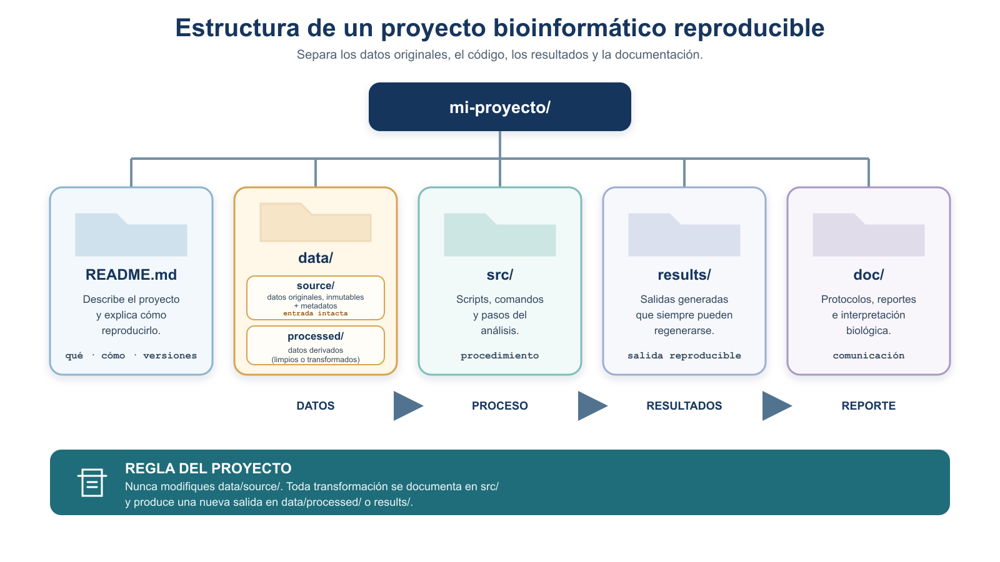
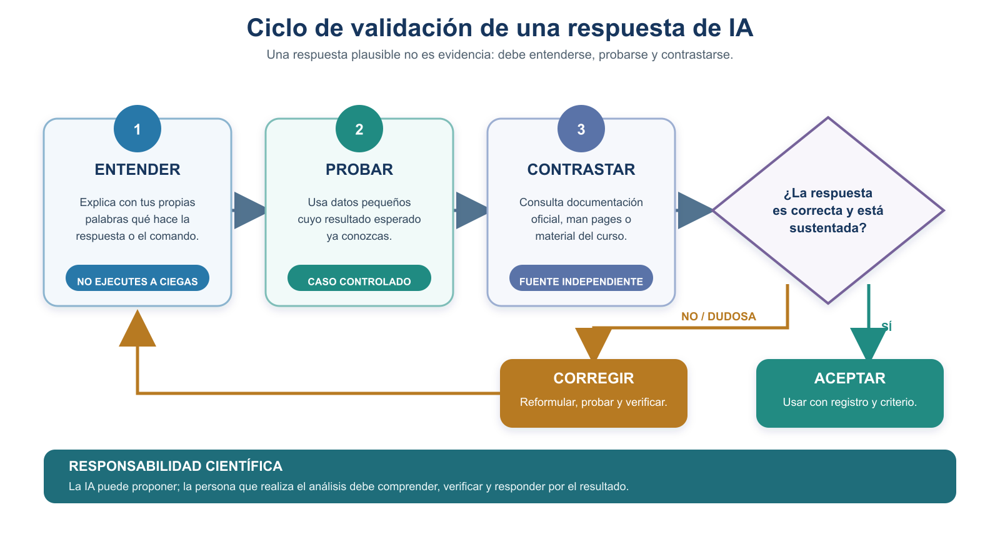

# S2 — Organizar: buenas prácticas FAIR e introducción al prompting científico

> **NOTA — Aula invertida.** Este documento se lee **antes de la sesión S2**. Traes hecho el primer
> intento de la Práctica 1; en el taller se compara y se corrige; después entregas la **Tarea 2**. Los
> primeros intentos son formativos: se evalúa que llegues preparado y puedas explicar tus decisiones.

Segundo módulo de la [Unidad 1](u1-trabajo-reproducible.md). En S1 escribiste una pregunta, una
estrategia y un protocolo. Hoy te ocupas de **dónde viven los datos que vas a usar y cómo se
describen**, porque un análisis impecable sobre datos sin procedencia no es reproducible. Y abres el
eje que recorre el curso entero: usar la IA sin delegarle el criterio.

## Ficha del módulo

| Elemento | Descripción |
| --- | --- |
| **Sesión** | S2 (2 h) |
| **Tema** | Organizar: buenas prácticas FAIR e introducción al prompting científico |
| **Competencias** | A — Trabajo reproducible y comunicación científica; G — Uso responsable de IA |
| **Resultado (plan)** | Aplica principios FAIR y crea metadatos; usa la IA con criterios de validación |
| **Consulta previa (plan)** | Lectura: *A scientist's nightmare* (software / carelessness) |
| **Lectura base** | Este módulo + la lectura previa |
| **Caso conductor** | Dejar el proyecto organizado, con sus datos descritos y su procedencia documentada |
| **Evidencia** | **Tarea 2**: estructura del proyecto + metadatos con diccionario de variables + entradas de la bitácora de IA |
| **Ajuste integrado** | **[Nuevo]** inicio del eje de IA en espiral |

> **NOTA — dónde guardar.** La estructura que construyas hoy en tu equipo es la misma que levantarás
> sobre el servidor en **S4**. Guárdala tal cual: en U2 se traslada, no se rehace.

## Relación con lo anterior

S1 te dejó un protocolo con una pregunta y una estrategia, y una carpeta `doc/`. Faltan dos cosas
para que ese trabajo sea reproducible por otra persona: que **los datos estén descritos** —de dónde
vienen, qué significa cada variable, qué no se sabe de ellos— y que **el proyecto esté organizado**
de forma que cualquiera encuentre lo que busca sin preguntarte.

Esa es la deuda que S2 salda, y por eso la Tarea 2 no es un ejercicio aparte: es lo que le faltaba a
la Tarea 1.

## Resultados de aprendizaje

Al terminar S2, el estudiante es capaz de:

1. **Explicar** los principios FAIR y **distinguirlos** de «datos abiertos».
2. **Enumerar** acciones concretas que contribuyen a cada principio, y reconocer cuáles están a su
   alcance hoy.
3. **Elaborar** la ficha de metadatos de un conjunto de datos, con diccionario de variables, y
   **declarar** honestamente lo que no está documentado.
4. **Organizar** un proyecto reproducible con la estructura del curso, y **justificar** qué va en cada
   directorio.
5. **Explicar** qué es un modelo de lenguaje y qué son las alucinaciones.
6. **Formular** un prompt científico y **validar** su respuesta de forma independiente.
7. **Registrar** el uso de IA en `bitacora-ia.md` según la política del curso.

## Antes de empezar: lista de verificación

- [ ] Tienes `doc/protocolo.md` de S1, con tu pregunta y tu estrategia.
- [ ] Has leído *A scientist's nightmare*.
- [ ] Has hecho el **primer intento** de la Práctica 1.
- [ ] Tienes a mano el conjunto de datos de ejemplo del curso.

## Ruta de S2

| Momento | Qué hacer | Tiempo estimado |
| --- | --- | ---: |
| **Antes de clase** | Leer §1–§4 y hacer el primer intento de la Práctica 1 | 50 + 40 min |
| **Taller (1.ª hora)** | FAIR, metadatos y organización del proyecto; corregir el primer intento | 60 min |
| **Taller (2.ª hora)** | Cápsula de IA: prompt científico, alucinaciones y validación (Práctica 2) | 60 min |
| **Después del taller** | Cerrar la Tarea 2 y las entradas de la bitácora | 90 min |

> **NOTA — dónde encaja el cierre de la unidad.** El quiz, el reto final y el semáforo de salida están
> en la [portada de la Unidad 1](u1-trabajo-reproducible.md), porque cubren S1 y S2 a la vez.

---

## 1. Los principios FAIR para el manejo de datos

El manejo de datos (proceso A) se orienta con un conjunto de **principios guía**: los **principios
FAIR** (Wilkinson et al., 2016). No son un estándar ni una especificación técnica, sino
**recomendaciones** para mejorar la **localización, accesibilidad, interoperabilidad y reutilización**
de los datos y otros objetos digitales de investigación, tanto por **personas** como por **máquinas**.
FAIR es un acrónimo:

- **F**indable (localizable): tiene identificadores y metadatos que permiten encontrarlo.
- **A**ccessible (accesible): se recupera mediante un protocolo claro.
- **I**nteroperable (interoperable): usa formatos y vocabularios estándar.
- **R**eusable (reutilizable): está bien documentado y con licencia clara.


**Figura 4.** Los principios FAIR para datos y software. Son cuatro condiciones complementarias para que un recurso científico conserve su valor y pueda reutilizarse; FAIR no significa necesariamente "abierto" o "gratuito".

> **IMPORTANTE:** FAIR **no se logra al final**, al publicar: **empieza en la obtención**. Si no
> registras la procedencia y los metadatos cuando obtienes el dato (fase A2), esa información se
> pierde y ya no podrás hacerlo FAIR después. Además, **no se cumple automáticamente** por guardar un
> archivo de metadatos en una carpeta local: requiere **varias acciones complementarias** a lo largo
> del proyecto.

> **NOTA:** FAIR **no** equivale a "datos abiertos o gratuitos": significa que, con los permisos que
> correspondan, el dato es localizable, accesible, interoperable y reutilizable.

Existe una versión de estos principios **para software**, los **FAIR4RS** (*FAIR for Research
Software*; Barker et al., 2022): el software requiere considerar además su **versión**, su
**evolución**, su **ejecutabilidad** y sus **dependencias**. El control de versiones (Git) se aborda
en *Programación Aplicada a la Bioinformática I*.

La siguiente tabla muestra, para cada principio, **qué fases y acciones del proceso A contribuyen a
lograrlo**:

| Principio FAIR | Fases del proceso A que contribuyen | Acciones que contribuyen a este principio |
| --- | --- | --- |
| Findable | A1 Obtención · A2 Registro de procedencia | Asignar un identificador y registrar metadatos del archivo en `data/source/` |
| Accessible | A2 Registro de procedencia | Documentar la URL y el procedimiento de obtención en los metadatos |
| Interoperable | A3 Exploración · A7 Documentación | Usar y documentar formatos estándar (FASTA, GFF, CSV) |
| Reusable | A6 Conservación · A7 Documentación | Conservar el original con su checksum, y documentar licencia y diccionario de variables |

> **COMENTARIO:** Los principios FAIR se van logrando **con la forma en que ejecutas** las fases de
> registro de procedencia, conservación y documentación del proceso A; no son un paso extra ni se
> resuelven con un solo archivo. La **ficha de metadatos** que contribuye a ellos la construyes en la
> sección 4, y la estructura de carpetas donde vive, en la sección 6.


**Figura 5.** Dónde encajan el manejo de datos y FAIR en un proyecto: cada fase del proceso A produce algo, se guarda en una carpeta y aplica los principios FAIR que le corresponden. Los metadatos viven junto a los datos en `data/source/`.

---

## 2. La ficha de cada dato: los metadatos

El protocolo documenta el *análisis*. Cada **dato**, además, lleva su propia **ficha**: un archivo de
**metadatos** que lo describe para poder interpretarlo y reutilizarlo (es la forma concreta de aplicar
los **principios FAIR** vistos en la sección 2). Esta ficha **alimenta la sección _Datos_ del
protocolo** y se guarda junto al dato original en `data/source/` (sección 6).

Un **metadato** describe un dato para poder interpretarlo correctamente. El siguiente bloque es una
plantilla; los campos marcados **(mínimo U1)** son los que llenas en esta unidad, el resto se completa
cuando descargues datos reales en unidades posteriores:

```markdown
# Metadatos — <nombre_del_archivo>

- Nombre original del archivo:        (mínimo U1)
- Descripción del contenido:          (mínimo U1)
- Organismo:                          (mínimo U1)
- Base de datos de origen:            (mínimo U1)
- URL:                                (mínimo U1)
- Identificador o accesión:           (mínimo U1)
- Versión o release:
- Fecha de acceso:                    (mínimo U1)
- Formato:                            (mínimo U1)
- Tamaño:
- Checksum (integridad):
- Licencia o condiciones de uso:
- Responsable (quién lo obtuvo):      (mínimo U1)
- Procedimiento de obtención:
- Notas de procedencia:
- Transformaciones realizadas:        (si aplica)
```

Cuando los datos vienen en forma de tabla (columnas), los metadatos deben incluir un **diccionario de
variables**: qué significa cada columna, su tipo y sus unidades. Puedes ver un ejemplo que **modela
la conducta correcta** (documenta solo lo comprobable y marca lo demás como "no documentado") en
[`ejemplos/metadatos_pacientes.md`](ejemplos/metadatos_pacientes.md).

> **TIP:** El **checksum** es una "huella digital" del archivo (un código que cambia si el archivo se
> altera). Sirve para verificar que una descarga llegó íntegra. Aprenderás a calcularlo en la
> Unidad 3; por ahora basta con que sepas para qué sirve y reserves el campo.

> **NOTA — Metadatos de software.** Además de los datos, el **software** también se documenta. En
> esta unidad solo lo **introducimos**: en tu `README.md` reserva una sección mínima de **entorno
> computacional** (herramienta, versión, sistema operativo, fuente, fecha y condiciones de uso) que
> irás completando en unidades posteriores. **No** anotes versiones de herramientas que todavía no has
> usado. La razón de fondo la dan los principios **FAIR4RS** (sección 2): el software exige considerar
> versión, evolución, ejecutabilidad y dependencias.

---

---

## 3. Organización reproducible del proyecto y datos fuente

Un proyecto ordenado separa lo que **entra** (datos originales) de lo que **se produce** (datos
transformados y resultados, siempre regenerables). Sigue esta estructura (Buffalo, 2015, Cap. 2):

```text
proyecto/
├── README.md          # cuaderno del proyecto: qué es y cómo reproducirlo
├── data/              # todos los datos van aquí, separados del código
│   ├── source/        # datos ORIGINALES, inmutables + sus metadatos
│   └── processed/     # datos derivados (limpios o transformados)
├── src/               # scripts y comandos
├── results/           # resultados y evidencia (regenerables)
└── doc/               # documentación y reportes (p. ej. protocolo.md)
```

> **NOTA:** Se agrupan todos los datos bajo `data/` y se separan los **originales**
> (`data/source/`) de los **derivados** (`data/processed/`). Esta es la convención recomendada para
> proyectos de biología computacional (Noble, 2009): mantiene los datos juntos, los separa del código
> y los resultados, y escala bien cuando aparecen datos externos o intermedios.

> **NOTA DE ALINEACIÓN (docente).** El programa del curso menciona una carpeta `data_source`. La
> convención operativa que adopta esta unidad es la anidada **`data/source/`** y **`data/processed/`**
> (Noble, 2009), por ser más clara y escalable. Ambas cumplen el mismo principio (separar originales
> de derivados); se documenta aquí la diferencia sin modificar el programa.



**Figura 7.** Organización de un proyecto reproducible: separa los datos (originales en `data/source/` y derivados en `data/processed/`) del código, los resultados y la documentación (Noble, 2009).

Reglas para los **datos fuente** (`data/source/`), enunciadas con precisión:

- Los archivos originales **pueden leerse y copiarse**.
- **No** deben editarse, sobrescribirse ni reemplazarse.
- Deben **conservar su nombre original y su checksum**.
- Cualquier transformación debe **producir archivos nuevos**.
- Los datos derivados se guardan **fuera** de `data/source/` (en `data/processed/`).
- Los resultados deben poder **regenerarse** a partir de los datos fuente.

> **IMPORTANTE:** La idea no es "no tocar los datos" en abstracto, sino que **el punto de partida
> siempre permanezca recuperable**. Si transformas un archivo, la salida es un archivo nuevo; el
> original queda idéntico, con su nombre y checksum.

> **NOTA:** En esta unidad **no** necesitas crear esta estructura con comandos de Unix. Eso se
> trabaja formalmente en la **Unidad 2**. Para tu primer intento puedes **dibujar** el árbol,
> **escribirlo** como bloque de texto o usar la **carpeta modelo** que proporcione la docente.

---

---

### Práctica 1 — Organización del proyecto y metadatos *(antes de clase, primer intento)*

**Antes de clase (primer intento).** Trabajarás con el conjunto de datos pequeño del curso
[`ejemplos/pacientes.md`](ejemplos/pacientes.md), un conjunto de datos **sintético** (creado
para el ejercicio, no proviene de personas reales) con tres registros y fines exclusivamente
educativos.

1. **Dibuja con Mermaid o escribe en un bloque de código Markdown** la estructura de directorios de
   la sección 6 para un proyecto que utilice estos datos. No necesitas comandos de Unix. Incluye al
   menos `README.md`, `data/source/`, `data/processed/`, `src/`, `results/` y `doc/`, y ubica
   `pacientes.md` dentro de esa estructura.

2. Redacta un borrador de metadatos llamado `pacientes-metadatos.md` y colócalo junto al archivo de
   datos. Incluye los campos **mínimo U1** de la sección 2 y un diccionario para
   las variables `id`, `peso`, `altura`, `sexo`, `edad` y `dx`.

3. Examina el contenido del archivo y distingue entre lo que realmente puedes comprobar y lo que
   falta por documentar. En particular, revisa:

   - Si la extensión `.md` coincide con el formato interno del archivo.
   - En qué unidades están expresados `peso` y `altura`.
   - Qué valores acepta la variable `sexo`.
   - Qué significan los códigos de la variable `dx`.
   - Cuál es el origen, fecha, responsable y licencia de los datos.

   No inventes la información faltante: regístrala explícitamente como **“no documentada”** o
   **“pendiente de confirmar”**.

**Durante el taller.** Compararemos las estructuras propuestas, discutiremos dónde deben guardarse
los datos originales, los archivos derivados y los metadatos, y revisaremos los diccionarios de
variables. Analizaremos por qué una extensión de archivo no siempre permite conocer su formato real
y cómo los metadatos incompletos limitan las preguntas que pueden responderse.

**Después del taller (entrega final).** Entrega el árbol corregido del proyecto y
`pacientes-metadatos.md` con los campos mínimos y el diccionario de variables. Conserva
`pacientes.md` sin modificaciones dentro de `data/source/` y señala claramente cualquier
información que continúe pendiente de confirmar.

---

## 4. Uso responsable de la Inteligencia Artificial

> **NOTA:** Esta sección es el **inicio del eje de IA en espiral** del curso: aquí sentamos las
> bases; se refuerza con tareas reales y se cierra con una discusión crítica al final del semestre.

Los asistentes de IA generativa ya son parte del trabajo cotidiano. En este curso los usamos **como
apoyo**, con criterios claros para que fortalezcan tu razonamiento en lugar de sustituirlo.

> **RECURSO DEL CURSO — ProfeUnix Bioinfo:** Puedes acceder al asistente
> [**ProfeUnix Bioinfo**](https://chatgpt.com/g/g-6893cf2451d88191b11cd0c87de045ab-profeunix-bioinfo)
> para consultas y revisiones sobre Unix aplicado a bioinformática. Algunas actividades te pedirán
> utilizarlo de manera explícita; en las demás es un recurso opcional. No opera tu terminal ni
> garantiza que sus respuestas sean correctas: debes comprender, probar y validar cada propuesta, y
> registrar su uso en `bitacora-ia.md`. Si tu cuenta no permite abrir el GPT, usa otro asistente
> autorizado y anota cuál utilizaste.

### 4.1 Qué es un modelo de lenguaje y qué son las alucinaciones

Un **modelo de lenguaje grande** (LLM) predice la **continuación más probable** de lo que escribes;
**no comprende ni verifica**, genera texto plausible. Por eso puede **sonar seguro y estar
equivocado**: a esas respuestas falsas pero verosímiles —un comando que no existe, una opción
inventada, una cita inexistente— se les llama **alucinaciones**.

### 4.2 Qué es un prompt

Un **prompt** es el texto que le das a un asistente de IA para pedirle una tarea: la instrucción,
la pregunta o el encargo con el que orientas su respuesta. No es un comando de la terminal ni un
programa que se ejecuta solo: es **lenguaje natural** (a veces mezclado con datos de ejemplo) que el
modelo usa como punto de partida para generar texto.

La calidad de lo que obtienes depende en buena medida de lo que pediste. Por eso, en este curso no
bastará con “preguntarle algo”: aprenderás a formular un **prompt científico** —una instrucción
completa y verificable— y a contrastar siempre la respuesta.

### 4.3 Estructura de un prompt científico

Un buen prompt científico incluye:

1. **Contexto** (qué estás haciendo).
2. **Pregunta u objetivo** (qué quieres lograr).
3. **Tipo y formato de los datos** (p. ej. un GFF tabular).
4. **Ambiente de ejecución** (Linux, línea de comandos).
5. **Restricciones** (herramientas permitidas, sin instalar nada).
6. **Resultado esperado** (qué forma tendría la respuesta correcta).
7. **Supuestos** que estás haciendo.
8. **Solicitud de explicación** (que te explique cada paso).
9. **Fuentes o documentación** que deberían consultarse.
10. **Plan de verificación** (cómo comprobarás la respuesta).


**Figura 8.** Los cuatro bloques esenciales de un prompt científico —contexto, objetivo, formato y verificación— con un ejemplo integrado. La lista de arriba los desarrolla en detalle.

> **IMPORTANTE:** Un mejor prompt **no sustituye** la validación independiente. Aunque la respuesta
> parezca perfecta, debes comprobarla tú.

### 4.4 Validación independiente

Tras recibir una respuesta de IA: **(1)** entiéndela —si no puedes explicar qué hace, no la uses—;
**(2)** pruébala en datos pequeños de resultado conocido; **(3)** contrástala con la documentación
oficial o el material del curso.



**Figura 9.** Antes de usar una respuesta de IA hay que entenderla, probarla y contrastarla. Si no es confiable, se corrige y se vuelve a validar; la responsabilidad del resultado es siempre de quien realiza el análisis.

### 4.5 Actividad: detectar una respuesta de IA defectuosa

Un estudiante preguntó a una IA cómo contar los genes de un archivo GFF y recibió esta respuesta
(que contiene errores deliberados):

> "Usa el comando `countgenes archivo.gff`, que devuelve el número exacto de genes. Está descrito en
> Smith et al. (2019), *Journal of Genome Counting*."

Esta respuesta es sospechosa: menciona un comando que **no existe** (`countgenes`) y una **referencia
probablemente inventada**. Tu tarea (se detalla en la Práctica 4) será identificar el error,
explicar por qué es sospechoso, contrastarlo con una fuente confiable, y concluir si la respuesta era
**totalmente, parcialmente o nada** confiable.

### 4.6 Política de uso de IA del curso

- **Usos permitidos:** entender conceptos, explicar comandos, sugerir estrategias, revisar redacción.
- **Usos no permitidos:** entregar como propio texto o código generado sin comprender ni validar;
  usar IA donde el examen o la actividad lo prohíban explícitamente.
- **En tareas:** permitida con **declaración** y bitácora.
- **En el proyecto:** permitida como apoyo; el razonamiento y las conclusiones deben ser tuyos.
- **En exámenes prácticos:** solo si se autoriza expresamente.
- **Datos sensibles:** no compartas datos privados o no públicos en un asistente.
- **Responsabilidad:** el resultado es **tuyo**; respondes por él.
- **Declaración obligatoria:** todo uso de IA se declara en la bitácora.

### 4.7 Bitácora de IA

Registra, por cada uso: **fecha**, **actividad**, **herramienta y modelo** (si se conoce), **consulta
o prompt**, **respuesta relevante**, **error o limitación detectada**, **fuente usada para validar**,
**prueba realizada**, **corrección efectuada** y **conclusión sobre la confiabilidad**.

```markdown
## 2026-08-22 — Tarea 2
- Actividad: entender un campo del formato GFF.
- Herramienta/modelo: (nombre y versión, si se conoce).
- Prompt: "¿Qué representa la columna 3 de un archivo GFF? ..."
- Respuesta relevante: "la columna 3 es el tipo de feature".
- Error/limitación: ninguno detectado.
- Fuente de validación: documentación del formato GFF3.
- Prueba: revisé 3 renglones del archivo y coincidió.
- Corrección: no requerida.
- Conclusión de confiabilidad: respuesta confiable.
```

---

---

### Práctica 2 — Formular y validar el uso de IA *(durante el taller y entrega posterior)*

> **Regla — primero a mano, después con IA.** En las Prácticas 2 y 3 elaboraste los metadatos y la
> estrategia sin ayuda de un asistente. Ahora usarás IA para generar propuestas alternativas y
> compararlas con tu trabajo manual. Tu trabajo previo es la **línea base** de la comparación —**no
> una verdad absoluta**, porque también puede contener errores—. La **referencia final** se construye
> con el archivo original, los metadatos disponibles, la documentación autorizada, pruebas
> controladas y la retroalimentación docente. La validación debe ser **independiente** tanto de la IA
> como de tu primer intento.

**Herramientas.** Puedes utilizar ChatGPT, Claude o los asistentes del curso. Formula tus prompts
siguiendo la estructura de la sección 7.2 y declara todo uso de IA en `bitacora-ia.md`. Recuerda que
el asistente no conoce la procedencia, las unidades ni el significado de las variables a menos que
se los proporciones. No aceptes como hechos las suposiciones que genere.

**Antes de clase (primer intento).** Realiza las siguientes dos actividades y regístralas en
`bitacora-ia.md`.

#### a) Metadatos con IA

En la Práctica 2 redactaste manualmente los metadatos y el diccionario de variables de
`pacientes.md`. Ahora formula un prompt para que un asistente genere su propia propuesta.

Puedes utilizar y adaptar el siguiente prompt:

> Tengo un archivo llamado `pacientes.md` cuyo contenido está separado por comas. Sus columnas son
> `id`, `peso`, `altura`, `sexo`, `edad` y `dx`. Necesito una ficha de metadatos en Markdown con
> origen, formato, fecha de acceso, responsable, licencia y un diccionario de variables que incluya
> descripción, tipo de dato, unidades y valores permitidos. No inventes información. Marca como
> “no documentado” o “pendiente de confirmar” todo lo que no pueda determinarse a partir de la
> información proporcionada. Explica qué información adicional sería necesario conseguir.

Compara la respuesta con `pacientes-metadatos.md` y revisa si la IA:

1. Identificó correctamente el formato interno del archivo y distinguió el formato de la extensión
   `.md`.
2. Supuso o inventó las unidades de `peso` y `altura`.
3. Inventó el significado de los códigos de la variable `dx`.
4. Supuso una fuente, fecha, responsable o licencia.
5. Identificó correctamente los posibles tipos de datos.
6. Distinguió entre información conocida, inferida y faltante.
7. Indicó qué datos adicionales sería necesario documentar.

Registra en `bitacora-ia.md`:

- El prompt completo.
- La respuesta del asistente.
- Las coincidencias con tu ficha manual.
- Las omisiones, suposiciones o invenciones detectadas.
- Las correcciones que realizaste.
- Tu conclusión sobre la confiabilidad de la respuesta.

#### b) Estrategia con IA

En la Práctica 3 construiste manualmente una estrategia para responder la pregunta:

> **¿Los datos de `pacientes.md` son suficientes para evaluar si el índice de masa corporal está
> relacionado con el diagnóstico registrado en `dx`?**

Ahora formula un segundo prompt para que el asistente descomponga la pregunta. Puedes utilizar y
adaptar el siguiente:

> Quiero evaluar si los datos de `pacientes.md` son suficientes para investigar una posible relación
> entre el índice de masa corporal y el diagnóstico registrado en `dx`. Ayúdame a descomponer la
> pregunta en subpreguntas y, para cada una, indica qué evidencia necesitaría, en qué variables
> estaría, qué operación conceptual realizaría y cómo validaría el resultado. No me des comandos.
> No supongas las unidades de `peso` y `altura` ni el significado de `dx`. Considera que el archivo
> contiene únicamente tres pacientes y que cada código de diagnóstico aparece una sola vez. Señala
> las limitaciones y los datos adicionales necesarios.

Compara la respuesta con tu tabla manual y revisa si la IA:

1. Comenzó por la pregunta y no por una herramienta o comando.
2. Propuso subpreguntas relevantes.
3. Relacionó cada subpregunta con evidencia, datos, operaciones y validación.
4. Diferenció una operación conceptual de un comando.
5. Reconoció que las unidades deben confirmarse antes de calcular el IMC.
6. Evitó inventar el significado de `dx`.
7. Reconoció que solo existe un paciente por diagnóstico.
8. Evitó afirmar una asociación que los datos no permiten demostrar.
9. Distinguió entre resultados descriptivos e interpretaciones médicas.
10. Indicó qué datos, controles o metadatos adicionales serían necesarios.

Registra en `bitacora-ia.md`:

- El prompt completo.
- La respuesta del asistente.
- Las coincidencias con tu estrategia manual.
- Las subpreguntas útiles que no habías considerado.
- Las propuestas irrelevantes, incorrectas o no sustentadas.
- Las correcciones que realizaste.
- Tu conclusión sobre la confiabilidad de la respuesta.

#### Reflexión para el taller

Después de completar las dos actividades, responde en `bitacora-ia.md`:

- ¿En qué mejoró la IA tu ficha de metadatos o tu estrategia?
- ¿Qué información omitió, supuso o inventó?
- ¿Qué error habrías aceptado si no hubieras realizado primero el trabajo manual?
- ¿Qué partes del análisis no conviene delegar?
- ¿Qué concepto comprendiste mejor al comparar ambos enfoques?
- ¿La IA fue más útil para generar, revisar, explicar o detectar alternativas? Justifica tu respuesta.

**Durante el taller.** Compararemos los prompts, las respuestas y los criterios utilizados para
validarlas. Identificaremos las suposiciones e invenciones más frecuentes y discutiremos por qué una
respuesta clara y bien redactada puede ser científicamente incorrecta. También compararemos qué
partes del trabajo mejoraron con la IA y cuáles requirieron necesariamente el conocimiento y juicio
del estudiante.

**Después del taller (entrega final).** Entrega las dos entradas corregidas de `bitacora-ia.md`.
Cada entrada debe incluir:

1. El objetivo de la consulta.
2. El prompt completo.
3. La respuesta obtenida.
4. La comparación con el trabajo manual.
5. Los errores, omisiones, suposiciones o limitaciones detectados.
6. El procedimiento utilizado para validar la respuesta.
7. Las correcciones realizadas.
8. Una conclusión que clasifique la respuesta como **confiable, parcialmente confiable o no
   confiable**, con una justificación.
9. La reflexión final sobre qué aportó la IA y qué no debe delegarse.


---

---

## 5. Rúbricas

> **Cómo se evalúa cada momento.** El **primer intento** tiene valor **formativo**: da puntos por
> **preparación**, no por acierto. La **participación en clase** también es formativa. Las **Tareas 1
> y 2** (entrega posterior al taller) llevan la **calificación principal**. Cada criterio se evalúa en
> tres niveles: **Logrado**, **Parcialmente logrado** y **Aún no logrado**.
>
> Recuerda el alcance de U1: el protocolo se construye **hasta la estrategia**; la ejecución de
> comandos, los resultados y la validación ejecutada llegan en unidades posteriores. Aquí la
> validación y la conclusión se evalúan **como diseño anticipado**, no como ejecución.

### 5.1 Primer intento (formativa · puntos por preparación)

| Criterio | Logrado | Parcialmente logrado | Aún no logrado |
| --- | --- | --- | --- |
| Evidencia de lectura | Aplica ideas de las secciones y de Buffalo Cap. 1 | Menciona la lectura sin aplicarla | Sin evidencia de lectura |
| Esfuerzo auténtico | Intenta todas las prácticas asignadas | Intenta algunas | No presenta intento |
| Identificación de dudas | Registra ≥1 duda concreta y accionable | Duda vaga | No registra dudas |
| Registro de dificultades y errores | Señala la parte más difícil y los errores encontrados | Menciona dificultad sin detalle | No registra |

> Los **errores razonables no se penalizan**: este momento premia preparar y llegar con preguntas.

### 5.2 Participación en clase (formativa)

| Criterio | Logrado | Parcialmente logrado | Aún no logrado |
| --- | --- | --- | --- |
| Revisión del propio intento | Revisa y detecta sus errores | Revisa superficialmente | No revisa |
| Formulación de preguntas | Pregunta con precisión | Pregunta de forma vaga | No participa |
| Corrección argumentada | Corrige y explica por qué | Corrige sin justificar | No corrige |
| Comparación de estrategias | Compara con compañeros y aprende | Compara sin analizar | No compara |

### 5.3 Tarea 2 — organización + metadatos + bitácora de IA

| Criterio | Logrado | Parcialmente logrado | Aún no logrado |
| --- | --- | --- | --- |
| Estructura del proyecto | `data/source`, `data/processed`, `src`, `results`, `doc`; original intacto en `data/source` | Estructura incompleta | Sin separación de datos |
| Metadatos y diccionario de variables | Campos mínimos + diccionario de `pacientes.md` | Faltan campos o variables | Ausente |
| Reconocimiento de información no documentada | Marca "no documentado"/"pendiente" en lo no comprobable | Marca algunos; inventa otros | Inventa la información faltante |
| Bitácora de IA | Prompt, respuesta, comparación, validación y conclusión de confiabilidad | Entrada incompleta | Sin bitácora o sin validación |
| Validación de respuestas de IA | Detecta suposiciones/invenciones y las corrige con fuente | Detecta sin corregir | Acepta la IA sin validar |

---

---

## Glosario

| Español | Inglés | Definición breve |
| --- | --- | --- |
| Reproducibilidad | Reproducibility | Regenerar resultados con los mismos datos y procedimientos |
| Replicabilidad | Replicability | Evidencia compatible con datos o estudios independientes |
| Verificación | Verification | Comprobar que archivos, comandos y resultados funcionan como se espera |
| Validación | Validation | Demostrar que el procedimiento responde la pregunta |
| Robustez | Robustness | Que la conclusión no dependa de decisiones frágiles |
| Metadatos | Metadata | Datos que describen un dato |
| Checksum / suma de verificación | Checksum | Huella digital para comprobar integridad de un archivo |
| Procedencia | Provenance | Origen e historia de un dato |
| Feature (elemento) | Feature | Elemento anotado del genoma (gen, región, etc.) |
| Cadena / hebra | Strand | Hebra del ADN donde se ubica un feature (`+` o `-`) |

---

## Referencias

- Buffalo, V. (2015). *Bioinformatics Data Skills: Reproducible and Robust Research with Open Source
  Tools*. O'Reilly Media. — Cap. 1 (reproducibilidad, robustez, Regla de Oro) y Cap. 2 (organización
  de proyectos, documentación, Markdown). Disponible en `referencias/bioinformatics-data-skills.pdf`.
- Wilkinson, M. D., et al. (2016). The FAIR Guiding Principles for scientific data management and
  stewardship. *Scientific Data*, 3, 160018. doi:10.1038/sdata.2016.18.
- Miller, G. (2006). A Scientist's Nightmare: Software Problem Leads to Five Retractions. *Science*,
  314(5807), 1856–1857. doi:10.1126/science.314.5807.1856.
- Cyranoski, D. (2015, 18 de febrero). *Haruko Obokata: the STAP cells controversy*. The Guardian.
  <https://www.theguardian.com/science/2015/feb/18/haruko-obokata-stap-cells-controversy-scientists-lie>
- The Japan Times (2024, 9 de abril). *10 years since STAP*.
  <https://www.japantimes.co.jp/news/2024/04/09/japan/science-health/10-years-since-stap/>
- Popper, K. (1959). *The Logic of Scientific Discovery*. Hutchinson & Co.
- Collado-Torres, L., Nellore, A., Kammers, K., Ellis, S. E., Taub, M. A., Hansen, K. D., Jaffe,
  A. E., Langmead, B., & Leek, J. T. (2017). Reproducible RNA-seq analysis using recount2. *Nature
  Biotechnology*, 35(4), 319–321. doi:10.1038/nbt.3838.
- Barker, M., Chue Hong, N. P., Katz, D. S., et al. (2022). Introducing the FAIR Principles for
  research software (FAIR4RS). *Scientific Data*, 9, 622. doi:10.1038/s41597-022-01710-x.
- Noble, W. S. (2009). A Quick Guide to Organizing Computational Biology Projects. *PLoS
  Computational Biology*, 5(7), e1000424. doi:10.1371/journal.pcbi.1000424. (organización de
  directorios: `data/`, `results/`, `src/`, `doc/`).
- GO-FAIR. FAIR Principles. <https://www.go-fair.org/fair-principles/>
- Markdown — página oficial (John Gruber). <https://daringfireball.net/projects/markdown/>
- Markdown Guide. <https://www.markdownguide.org/>
- StackEdit — editor de Markdown en línea. <https://stackedit.io>
- Mermaid — documentación oficial. <https://mermaid.js.org/>
