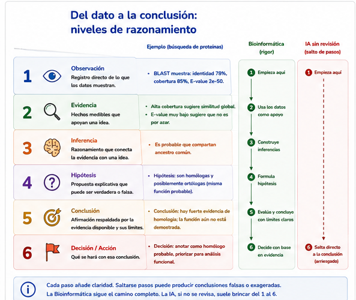

# S33 — Inferir: cuando la similitud no basta

> **NOTA — Aula invertida.** **Antes de clase** lees este módulo, empiezas Fitch (1970) o Koonin
> (2005) y haces un primer intento: separar observación de inferencia sobre un candidato de S32.
> **Durante el taller** trabajas las fronteras similitud/homología y función, y contrastas con las
> globinas. **Después del taller** entregas la sección de inferencia del protocolo y la bitácora de
> IA. El primer intento es **formativo**. El **informe integrador** de una secuencia desconocida es
> S34.

## Ficha del módulo

| Elemento | Descripción |
| --- | --- |
| **Unidad** | 6 — Comparar secuencias para construir hipótesis biológicas ([portada](u6-comparacion-homologia.md)) |
| **Sesión** | S33 · 2 h |
| **Competencias** | F (principal); D, C, A, G (integradas) |
| **Pregunta de la sesión** | ¿Qué evidencia necesito para sostener una hipótesis de homología y cuáles son los límites de esa inferencia? |
| **Datos** | Ranking y métricas de S32 (`ubiE`); globinas α/β/ζ (ortología, paralogía, transferencia de función) |
| **Herramientas** | Ninguna nueva: BLAST y alineamientos ya hechos; Unix para recuperar metadatos |
| **Lectura previa** | Este módulo · Fitch (1970) **o** Koonin (2005) (consulta; ~45–60 min) |
| **Producto** | Sección **Inferencia biológica** del protocolo (hipótesis con alternativas y límites) |
| **Cambio conceptual** | Evidencia rankeada → **hipótesis** con alternativas, límites y evidencia faltante |

## Relación con lo anterior

S32 te dejó con una jerarquía de candidatos y una prohibición explícita: todavía no podías decir
«homólogo», «ortólogo» ni «misma función».

Hoy esa prohibición se levanta —**con condiciones**.

Tienes un hit excelente. Alta identidad, buena cobertura, *E-value* ridículamente bajo. La tentación
es enorme. Y la pregunta cambia otra vez:

> **¿Puedo afirmar que ambas proteínas tienen el mismo origen evolutivo o la misma función?**

```text
SIMILITUD          ≠          HOMOLOGÍA
(se observa)                  (se infiere)

HOMOLOGÍA          ≠          MISMA FUNCIÓN
(ancestro común)              (no está garantizada)
```

Esas dos fronteras son el mensaje de la sesión. En S34 las usarás para **integrar** todo el arco en
un informe sobre una secuencia desconocida.

> **IDEA CLAVE.** Hasta ayer: *tengo evidencia → elijo el mejor candidato*. Hoy: *tengo evidencia →
> construyo una hipótesis → reconozco qué no puedo afirmar todavía*.

## Resultados de aprendizaje

Al terminar S33 podrás:

1. **Distinguir** similitud observada de **homología** inferida, y explicar por qué la segunda no
   tiene porcentaje.
2. **Separar**, por escrito, observación, evidencia, inferencia, hipótesis y conclusión.
3. **Explicar** ortología y paralogía como historias distintas (especiación frente a duplicación),
   usando un caso real —las globinas— sin construir un árbol.
4. **Reconocer** cuándo un dominio compartido o una alta identidad **no** autorizan transferir
   función.
5. **Formular** una hipótesis de homología o de función con alternativas, limitaciones y evidencia
   adicional necesaria.
6. **Evaluar críticamente** una afirmación de IA que salte de un porcentaje a ortología y función.

> **NOTA — nivel real.** Distinguir conceptos y declarar límites se alcanzan plenamente. Integrar
> todo en un informe defendible sobre una secuencia desconocida es el trabajo de **S34**.

## Antes de empezar: lista de verificación

- [ ] Tengo `results/s32/candidatos.md` (o la tabla interpretada de S32) y el protocolo al día.
- [ ] Sé qué significan identidad, cobertura, *bit score* y *E-value* (S32) —hoy **no** se vuelven a
      explicar.
- [ ] Leí (o tengo a mano) Fitch (1970) o Koonin (2005).
- [ ] Sé dónde están las globinas en `data/source/` (copiadas desde `ejemplos/datos-alineamientos/`).

> **NOTA — dónde guardar.** Guarda todo en `results/s33/`.

## Ruta de la sesión

| Momento | Qué hacer | Tiempo estimado |
| --- | --- | ---: |
| **Antes de clase** | Leer §§1–5 · Fitch o Koonin · Práctica 1 | 50 + 50 + 40 min |
| **Durante el taller** | Prácticas 2–5 | 2 h |
| **Después del taller** | Sección de inferencia del protocolo · bitácora | 60 min |

Las secciones 1–6 y 8 son [Indispensable]. La sección 7 (xenología) es [Consulta]: otra
historia posible, sin profundizar.

---

## 1. El salto que la tabla no da [Indispensable]

En S32 construiste evidencia. Eso responde preguntas del tipo:

- ¿Qué tan idéntico es el tramo?
- ¿Cuánto de mi proteína quedó cubierta?
- ¿Es sorprendente por azar en *esta* base?

Ninguna de esas preguntas es:

- ¿Comparten un ancestro?
- ¿Son el «mismo gen» en dos especies?
- ¿Hacen lo mismo?

> **Concepto esencial — la similitud se mide; la homología se argumenta.** Dos secuencias **son o no
> son** homólogas: o descienden de un ancestro común, o no. No existe «un 80 % de homología». Existe
> un 80 % de identidad, que puede **apoyar** una hipótesis de homología —o no bastar—.


**Figura 33.1.** Principio 1 de la unidad: la homología no es un porcentaje.

### La cadena que hay que no saltarse

```text
observación  →  evidencia  →  inferencia  →  hipótesis  →  conclusión
   (dato)        (métricas     (va más       (propuesta     (solo si la
                  + contexto)   allá)         revisable)     evidencia aguanta)
```

| Peldaño | Ejemplo legítimo | Ejemplo ilegítimo |
| --- | --- | --- |
| Observación | «`pident` = 86.6; cobertura ≈ 100 %» | «Son ortólogos» |
| Evidencia | Esas métricas + misma familia anotada + base documentada | «El primer hit siempre es el ortólogo» |
| Inferencia | «El parecido es difícil de explicar solo por azar» | «Por lo tanto misma función» |
| Hipótesis | «Propongo homología; la explicación más simple es ortología, pero…» | «Queda demostrado» |
| Conclusión | Solo lo que sobrevive a alternativas y límites | Cualquier salto que omita el «pero» |



**Figura 33.2.** La Bioinformática habita los peldaños del medio. La IA suele brincar del primero al
último.

## 2. Por qué aparece la palabra «homología» [Indispensable]

No la introducimos porque «tocaba el temario». Aparece porque sin ella no puedes ni formular bien la
pregunta de hoy.

> **Concepto esencial — homología.** Relación entre dos secuencias (o rasgos) que se explica por
> **origen evolutivo común**: descienden de un ancestro compartido. Es una **hipótesis sobre el
> pasado**, no una propiedad que el alineamiento imprima en una columna.

Pearson (2013) —que ya leíste— insiste en el mismo punto desde el título: se busca por *similarity*,
y la palabra *homology* entre comillas avisa el abuso habitual.

Con tu `ubiE` de S31–S32, un hit de *R. africae* con identidad altísima y cobertura completa es
**evidencia fuerte** a favor de homología. Todavía es una hipótesis: la base era pequeña, conocías la
familia de antemano y no exploraste explicaciones alternativas con la misma dureza que exigirías en
un caso abierto.

> **IMPORTANTE.** Afirmar homología no es «subir el tono» de un porcentaje. Es **cambiar de tipo de
> afirmación**: de lo medible a lo histórico.

### Práctica 1 — Separar observación de inferencia *(antes de clase, primer intento)*

**Antes de clase.**

Toma **un** candidato de tu ranking de S32 y llena esta tabla **antes** de leer las secciones 3–4 si
puedes:

| Tipo | Tu texto |
| --- | --- |
| Observación (solo lo que está en el `.tsv` o el alineamiento) | |
| Evidencia (métricas + contexto de la base/anotación) | |
| Inferencia (lo que crees que significan) | |
| Hipótesis (una frase revisable) | |
| Lo que **no** afirmas todavía | |

**Entrega.** La tabla. No la reescribas hasta el taller.

## 3. El contraejemplo que obliga a pensar en historias [Indispensable]

Supón que alguien te dice:

> *«Si dos proteínas son muy parecidas y están en el mismo organismo, seguro hacen lo mismo: son la
> misma cosa.»*

Mira las globinas de la unidad —proteínas que transportan oxígeno, cortas, fáciles de comparar—.

| Comparación | Identidad aproximada (alineamiento global) | Misma especie | Misma cadena |
| --- | ---: | --- | --- |
| HBA1 humana (`NP_000508`) frente a HBA2 humana (`NP_000549`) | **100 %** | sí | α y α (dos genes) |
| α humana frente a α de ratón (`NP_032244`) | **~86.6 %** | no | sí (α) |
| α humana frente a ζ humana (`NP_005323`) | **~59.9 %** | sí | no (α frente a ζ) |
| α humana frente a β de ratón | **~46 %** | no | no |

Lee la tabla otra vez:

1. **100 % de identidad no significa «el mismo gen».** HBA1 y HBA2 son genes distintos que producen
   la misma proteína (duplicación reciente).
2. **α humana se parece más a α de ratón (~87 %) que a ζ humana (~60 %).** La similitud sigue la
   **historia del gen**, no la frontera de la especie.
3. Si transfieres función solo porque «está en humano y se parece», puedes equivocarte: α y ζ son
   parecidas y **no intercambiables** en su biología.

Ahí nace la pregunta que define ortólogos y parálogos —no al revés—.


**Figura 33.3.** El dato que desmonta la intuición «mismo organismo ⇒ misma historia».

### Práctica 2 — Globinas: la similitud no sigue la especie *(durante el taller)*

**Durante el taller.**

1. **Inspecciona** encabezados y longitudes:

   ```bash
   grep '^>' data/source/globinas/*.fasta | head -20
   ```

2. **Contrasta** (puedes usar Clustal Omega sobre pares, o las identidades reportadas en la sección 3
   si el tiempo aprieta —en ese caso **verifica** al menos un par tú):

   - α humana (`NP_000508`) frente a α de ratón (`NP_032244`);
   - α humana frente a ζ humana (`NP_005323`);
   - α humana frente a HBA2 (`NP_000549`).

3. **Interpreta.** En un párrafo: ¿qué comparación apoya mejor una hipótesis de **ortología**? ¿Cuál
   sugiere **paralogía**? ¿Qué problema crea HBA1 = HBA2 para alguien que cree que «100 % = mismo
   gen»?
4. **Documenta** en el protocolo: «La similitud siguió la historia del gen, no la especie, porque…».

**Entrega.** El párrafo y, si los generaste, los archivos de alineamiento en `results/s33/globinas/`.

## 4. Dos historias detrás de un parecido [Indispensable]

Cuando dos genes se parecen, suele haber (al menos) dos relatos posibles:

### Especiación → ortólogos

Un gen ancestral existía en una especie. La especie se divide en dos. Cada linaje hereda **su copia**
del mismo gen. Esas copias son **ortólogas**: se separaron porque se separaron las especies.

### Duplicación → parálogos

Dentro de un genoma, un gen se copia. Las dos copias empiezan iguales y pueden **divergir de
función** con el tiempo. Son **parálogas**: se separaron por duplicación, no por especiación.


**Figura 33.4.** Ortología y paralogía no son etiquetas de porcentaje: son **respuestas distintas a
«¿cómo se separaron?»**.

| | **Ortólogos** | **Parálogos** |
| --- | --- | --- |
| Evento que los separó | Especiación | Duplicación génica |
| Dónde suelen estar | Especies distintas | A menudo la misma especie (también entre especies, vía herencia) |
| Expectativa de función | Con frecuencia similar (no garantizada) | Con frecuencia **divergente** |
| Ejemplo en tus datos | α humana ↔ α de ratón | α humana ↔ ζ humana; HBA1 ↔ HBA2 |

> **Concepto esencial — por qué importa para transferir anotación.** Si tu mejor hit es un
> **parálogo** con función distinta, copiarle la anotación a tu proteína es exactamente el error que
> esta sesión existe para prevenir. Si es un **ortólogo** bien soportado, la transferencia es más
> defendible… y **sigue siendo una hipótesis**, no un certificado.

> **ADVERTENCIA.** Con un solo BLAST no «demuestras» ortología. En la práctica se usan criterios
> adicionales (mejor hit recíproco, sintenia, filogenia…). Hoy aprendes a **nombrar la hipótesis y
> dudar en voz alta**; los métodos finos son de cursos posteriores.

### Práctica 3 — Ortología frente a paralogía como historias *(durante el taller)*

**Durante el taller.**

1. Dibuja (a mano o en Markdown) los dos paneles de la figura 33.4 aplicados a **tu** caso: un escenario
   en el que tu hit favorito sería ortólogo y otro en el que sería parálogo.
2. Para cada escenario escribe: qué evidencia **tienes**, qué evidencia **falta**, y qué harías
   experimental o computacionalmente después (sin inventar métodos que no conoces: basta con
   «buscar el mejor hit recíproco», «revisar anotación», «mirar cobertura otra vez»).
3. Elige cuál escenario te parece **más simple** hoy y por qué. Si no puedes decidir, **eso también
   es un resultado** —escríbelo.

**Entrega.** Los dos escenarios y la decisión (o la no decisión) argumentada.

## 5. Cuando el parecido es solo un pedazo [Indispensable]

S32 ya te mostró la cobertura parcial. Aquí cobra nombre evolutivo:

> **Concepto esencial — dominio compartido.** Dos proteínas pueden compartir un **módulo**
> (dominio) heredado o reclutado, y diferir en el resto. El HSP excelente describe el módulo, no
> necesariamente la proteína entera ni su función global.

Eso conecta tres cosas que ya viste:

- BLAST es **local** (S30–S31);
- cobertura baja engaña si solo miras identidad (S32);
- homología de un dominio **no** autoriza automáticamente transferir la función de toda la proteína
  (hoy).

## 6. Homología no garantiza la misma función [Indispensable]

Segunda frontera:

```text
HOMOLOGÍA  ≠  MISMA FUNCIÓN
```

Razones frecuentes —sin convertirlas en una lista para memorizar—:

- parálogos que se especializaron;
- dominio catalítico compartido con contextos distintos;
- anotación del hit errónea o genérica («domain-containing protein»);
- tu pregunta biológica exige un ensayo que la secuencia sola no reemplaza.


**Figura 33.5.** Principio 2 de la unidad: la similitud no demuestra la misma función.

### Qué puedes afirmar / qué no

| Con la evidencia típica de S31–S33 puedes… | No puedes… |
| --- | --- |
| Proponer homología como hipótesis | Tratarla como hecho medido por BLAST |
| Argumentar por qué ortología parece más simple que paralogía (o al revés) | «Demostrar» ortología sin más datos |
| Decir qué función **sugerirías** como punto de partida experimental | Garantizar la función en vivo |
| Listar qué evidencia adicional resolvería la duda | Cerrar el caso porque el *E-value* era bajo |


**Figura 33.6.** Principio 6: una hipótesis declara sus límites.

### Práctica 4 — ¿Se puede transferir la función? *(durante el taller)*

**Durante el taller.**

1. Elige un hit de tu lista (o una globina) y escribe dos párrafos:

   - **A favor** de usar su anotación como hipótesis de trabajo.
   - **En contra** (paralogía, dominio parcial, anotación débil, base sesgada…).

2. Cierra con una frase en este molde:

   > *«Transferiría la función como hipótesis provisional / no la transferiría todavía, porque…»*

3. Comprueba que tu frase **no** diga «está demostrado».

**Entrega.** Los dos párrafos y la frase final.

## 7. Otra historia posible: transferencia horizontal [Consulta]

A veces un gen se parece mucho al de otro linaje porque **viajó** (transferencia horizontal), no solo
por especiación o duplicación clásica. Esas copias se llaman a veces **xenólogas**.

Para esta unidad basta con saber que **existe** una tercera familia de relatos. No vamos a
diagnosticarla: diagnosticarla exige más que un BLAST. Si en tu informe aparece un hit «demasiado
parecido» en un taxón inesperado, la respuesta correcta no es forzar ortología: es **anotar la
rareza** y pedir evidencia adicional.

### Práctica 5 — La IA salta peldaños *(taller y entrega posterior)*

**Durante el taller (discusión) y después (entrega).**

Una IA responde:

> *«Estas proteínas tienen 92 % de identidad, por lo tanto son ortólogas y realizan exactamente la
> misma función.»*

1. Parte la frase en la tabla observación / inferencia / injustificado (como en S32).
2. Reescribe una versión defendible en **como máximo cuatro frases**, usando el vocabulario de hoy.
3. Registra en `doc/bitacora-ia.md`.

> **TIP.** El veneno sigue estando en «por lo tanto» y en «exactamente».

**Entrega.** La tabla, la reescritura y la entrada de bitácora.

## 8. Lo que hoy ya puedes llevar a S34 [Indispensable]

Al terminar esta sesión tienes el vocabulario y el criterio que faltaban para el cierre de la unidad:

| Llevas a S34 | Todavía no es S34 |
| --- | --- |
| Distinguir similitud de homología | El informe completo de una secuencia desconocida |
| Nombrar ortología/paralogía como **historias** | Integrar S30–S33 en un solo documento defendible |
| Decidir con argumentos si transferirías función | La evidencia integradora calificada como cierre |

> **IMPORTANTE.** Hoy levantamos la prohibición del vocabulario evolutivo **con condiciones**. En S34
> no aprenderás conceptos nuevos: **integrarás** lo que ya sabes sobre una pregunta completa.

---

### Práctica 6 — Anticipar la integración (puente a S34) *(cierre del taller)*

**Durante los últimos minutos del taller.**

Completa en una página:

```text
Para mi candidato de S32 / mi caso ubiE:

Observé: …
Infiero (con límites): …
En S34, si me dan una secuencia desconocida, el primer riesgo que debo evitar es: …
```

Eso no es el informe final: es el **criterio** que llevarás a S34.

**Entrega.** La página, junto con la sección del protocolo.

---

## La sección del protocolo

Añade a `doc/protocolo.md` —sin borrar nada—:

```markdown
## Unidad 6 · S33 — Inferencia biológica

### Pregunta biológica
[La pregunta que conecta S30–S33; en S34 se aplicará a la secuencia desconocida]

### Evidencia considerada
| Fuente (S30/S31/S32) | Qué aporta |
|---|---|

### Interpretación
[Cómo leíste identidad, cobertura y significancia juntas — remite a S32 sin repetir la teoría]

### Hipótesis propuestas
1. [Homología / ortología / paralogía / función — con alcance]
2. […]

### Hipótesis descartadas (o pospuestas)
| Hipótesis | Por qué cae o queda en espera |
|---|---|

### Justificación
[Párrafo: por qué la hipótesis preferida es la más simple *hoy*]

### Limitaciones
[Base, cobertura, anotación, ausencia de filogenia formal, etc.]

### Evidencia faltante
[Qué dato o experimento resolvería la duda]

### Conclusión provisional
[Una o dos frases. Sin «demostrado».]

### Uso de IA
[Qué propuso, qué validaste, qué rechazaste]
```

## Evidencia de la sesión

| Archivo | Contenido |
| --- | --- |
| `results/s33/` | Alineamientos de globinas, notas, escenarios ortólogo/parálogo |
| `doc/protocolo.md` | Sección **Inferencia biológica** |
| `doc/bitacora-ia.md` | Práctica 5 |
| Primer intento | Práctica 1 |

## Errores frecuentes y estrategias de diagnóstico

| Error | Por qué ocurre | Cómo se corrige |
| --- | --- | --- |
| Decir «90 % de homología» | Se usa como sinónimo elegante de identidad | Homología no tiene porcentaje |
| Saltar de `pident` a ortología | La IA y muchos tutoriales lo hacen | Ortología es una historia; exige más que un número |
| Transferir función por el primer hit | Es rápido | Revisa cobertura, paralogía y calidad de la anotación |
| Tratar HBA1/HBA2 como «el mismo gen» | La secuencia es idéntica | Mismo producto ≠ mismo gen |
| Afirmar que α y ζ «hacen lo mismo» | Están en el mismo organismo y se parecen | Parálogos pueden divergir |
| Inventar un árbol filogenético | Para «se vea profesional» | Fuera de alcance; declara que no lo tienes |
| Creer que hoy cierra el curso | Había cuatro sesiones fusionadas | El cierre integrador es **S34** |

## Rúbricas

### Primer intento (Práctica 1) — formativo

| Nivel | Descriptor |
| --- | --- |
| **Logrado** | La tabla separa observación de inferencia y declara explícitamente qué no afirma |
| **Parcialmente logrado** | Hay tabla, pero mezcla observación e hipótesis en la misma frase |
| **Aún no logrado** | No entregó primer intento, o solo pegó el `.tsv` |

### Participación en el taller — formativo

| Nivel | Descriptor |
| --- | --- |
| **Logrado** | Explicó en voz alta ortología/paralogía con el caso de las globinas y señaló un límite al transferir función |
| **Parcialmente logrado** | Participó con definiciones de memoria sin conectar con los números |
| **Aún no logrado** | No participó |

### Tarea 1 — Inferencia con globinas y transferencia (Prácticas 2–4)

| Nivel | Descriptor |
| --- | --- |
| **Logrado** | Usa el patrón α–α frente a α–ζ para explicar ortología/paralogía; la decisión de transferir función declara incertidumbre; no usa «% de homología» |
| **Parcialmente logrado** | Define ortólogo/parálogo de memoria sin conectar con los números del caso |
| **Aún no logrado** | Concluye función idéntica solo por identidad alta |

### Tarea 2 — Crítica de IA y protocolo (Prácticas 5–6)

| Nivel | Descriptor |
| --- | --- |
| **Logrado** | La reescritura de la IA elimina el «por lo tanto» injustificado; el protocolo de inferencia tiene hipótesis, alternativas, límites y evidencia faltante; el puente a S34 nombra un riesgo concreto |
| **Parcialmente logrado** | Critica la IA sin separar peldaños, o el protocolo omite alternativas |
| **Aún no logrado** | Afirma ortología demostrada o no entrega la sección del protocolo |

## Autoevaluación

1. ¿Puedo explicar por qué no existe «un 80 % de homología»?
2. ¿Puedo contar, con las globinas, por qué la similitud no sigue la especie?
3. ¿Puedo definir ortólogo y parálogo como **historias**, no como umbrales?
4. ¿Puedo decir cuándo *no* transferiría una función?
5. ¿Mi protocolo declara explícitamente qué no puede afirmarse?

**Semáforo de salida:**

- 🟢 Puedo formular una hipótesis de homología con alternativas y límites.
- 🟡 Entiendo las definiciones, pero aún salto de la tabla a la conclusión.
- 🔴 Sigo diciendo «porcentaje de homología» o transfiero función sin mirar cobertura/paralogía.

## Cierre con IA: clásico frente a asistido

Ya escribiste a mano la hipótesis del protocolo.

1. Pídele a una IA que, con tu tabla de candidatos, redacte la «hipótesis de homología».
2. Subraya en su texto cada verbo que implique certeza (`son`, `demuestra`, `exactamente`).
3. Contrasta con tu versión. ¿Declaró paralogía como alternativa? ¿Pidió evidencia adicional?
4. Anota en la bitácora: *la IA propone; mis datos delimitan; yo argumento*.

## Anexo A. Correspondencia resultado–actividad–evidencia–criterio

| RA | Actividad | Evidencia | Criterio | Momento | Nivel en S33 |
| --- | --- | --- | --- | --- | --- |
| Distinguir similitud de homología | §§1–2, Práctica 1 | Tabla observación/inferencia | No usa «% de homología» | Antes / taller | Comprensión |
| Explicar ortología/paralogía | §§3–4, Prácticas 2–3 | Párrafo + escenarios | Historias, no umbrales; usa globinas | Taller | Comprensión |
| Límites de transferencia de función | §6, Práctica 4 | Frase provisional | Declara incertidumbre | Taller | Ejecución |
| Formular hipótesis con límites | Protocolo | Sección de inferencia | Alternativas + evidencia faltante | Después | Ejecución |
| Criticar IA | Práctica 5 | Bitácora | Elimina el salto a ortología/función | Después | Ejecución |
| Anticipar la integración | Práctica 6 | Página de puente | Nombra un riesgo para S34 | Taller | Diseño anticipado |

## Anexo B. Alineación transversal

| Dimensión | Cómo se trabaja en S33 |
| --- | --- |
| **Reproducibilidad** | La sección de inferencia remite a archivos de S30–S32 |
| **Verificación** | Se contrastan identidades de globinas con archivos reales; HBA1/HBA2 se comprueba por igualdad de secuencia |
| **Validación** | El primer intento (Práctica 1) es línea base frente a la corrección posterior |
| **Robustez** | Se exigen alternativas (paralogía, dominio, anotación débil) antes de preferir una hipótesis |

## Glosario

| Español | Inglés | Qué es |
| --- | --- | --- |
| Conclusión provisional | *Provisional conclusion* | Afirmación acotada a la evidencia disponible |
| Dominio compartido | *Shared domain* | Módulo de la proteína que explica un HSP parcial |
| Duplicación génica | *Gene duplication* | Origen de parálogos |
| Especiación | *Speciation* | Origen típico de ortólogos |
| Homología | *Homology* | Origen evolutivo común (hipótesis, no porcentaje) |
| Inferencia | *Inference* | Paso más allá de lo directamente observado |
| Ortólogos | *Orthologs* | Homólogos separados por especiación |
| Parálogos | *Paralogs* | Homólogos separados por duplicación |
| Transferencia de función | *Function transfer / annotation transfer* | Usar la función de un hit como hipótesis para la consulta |
| Transferencia horizontal | *Horizontal gene transfer* | Movimiento de genes entre linajes; puede originar xenólogos |
| Xenólogos | *Xenologs* | Homólogos relacionados vía transferencia horizontal |

## Distribución estimada de las dos horas

| Tiempo | Actividad |
| --- | --- |
| 0:00–0:10 | Qué dejó abierto S32. Las dos fronteras en el pizarrón |
| 0:10–0:25 | Similitud ≠ homología. **Figuras 33.1 y 33.2**. Puesta en común de la Práctica 1 |
| 0:25–0:50 | Globinas. **Práctica 2**. **Figura 33.3** |
| 0:50–1:10 | Especiación / duplicación. **Práctica 3**. **Figura 33.4** |
| 1:10–1:25 | Transferencia de función. **Práctica 4**. **Figuras 33.5 y 33.6** |
| 1:25–1:40 | **Práctica 5** — la frase de la IA |
| 1:40–1:55 | **Práctica 6** — puente a S34 |
| 1:55–2:00 | Semáforo. Próxima: integrar todo sobre una secuencia desconocida |

## Lo que todavía falta

Hoy aprendiste a **inferir con límites**: similitud ≠ homología; homología ≠ misma función; ortología y
paralogía son historias distintas.

Todavía falta el último movimiento de la unidad —el mismo patrón que cerró U4 y U5—:

> **¿Cómo integro comparar, buscar, interpretar e inferir en una sola investigación defendible sobre
> una secuencia cuya identidad no me dieron de antemano?**

No hay conceptos nuevos ahí. Hay que **demostrar** que puedes usar todos los anteriores juntos. Ese
es el trabajo de S34.

```text
comparar → buscar → interpretar → inferir → integrar
```
## Referencias

- Fitch, W. M. (1970). Distinguishing homologous from analogous proteins. *Systematic Zoology*,
  19(2), 99–113. <https://doi.org/10.2307/2412448>
  — **lectura de consulta recomendada para esta sesión**
- Koonin, E. V. (2005). Orthologs, paralogs, and evolutionary genomics. *Annual Review of Genetics*,
  39, 309–338. <https://doi.org/10.1146/annurev.genet.39.073003.114725>
  — **lectura de consulta recomendada para esta sesión**
- Pearson, W. R. (2013). An introduction to sequence similarity («homology») searching. *Current
  Protocols in Bioinformatics*, 42, 3.1.1–3.1.8. <https://doi.org/10.1002/0471250953.bi0301s42>
- Altschul, S. F., Gish, W., Miller, W., Myers, E. W., & Lipman, D. J. (1990). Basic local alignment
  search tool. *Journal of Molecular Biology*, 215(3), 403–410.
  <https://doi.org/10.1016/S0022-2836(05)80360-2>

---

> **NOTA DOCENTE — no forma parte del material del estudiante.**
>
> **Título.** *Inferir: cuando la similitud no basta* (prompt `u6-s33.md`). El informe integrador y
> el cierre del curso viven en **S34** (*Integrar: de la evidencia a la hipótesis biológica*).
>
> **Filosofía de conceptos.** Ortología/paralogía/xenología se introducen **después** del
> contraejemplo de las globinas, no como taxonomía inicial.
>
> **Cifras de globinas** (NW simple match +2 / mismatch −1 / gap −2; declarar que no son `pident` de
> BLAST): HBA1=HBA2 100 %; α humana–α ratón ~86.6 %; α–ζ humanas ~59.9 %; α humana–β ratón ~45.7 %.
>
> **Nombre de archivo.** Se mantiene `u6-s33-defender-hipotesis.md` por inercia; el título visible ya
> no dice «defender». Renombrar a `u6-s33-inferir-similitud.md` es opcional en una pasada de limpieza.
>
> **Actualizar al cerrar S34:** portada y README a ruta S30–S34.