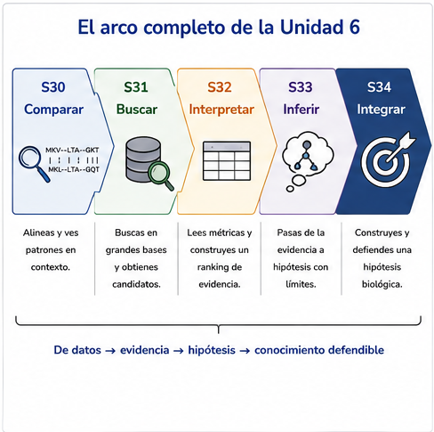
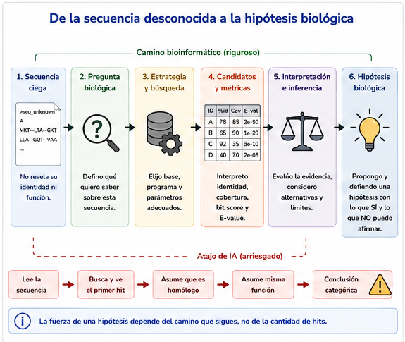
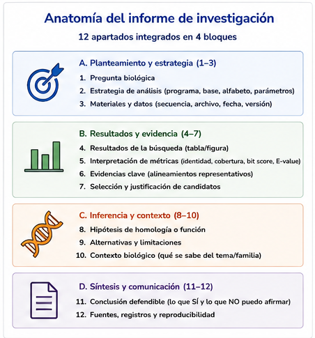
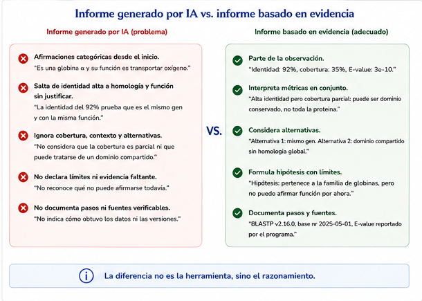

# S34 — Integrar: de la evidencia a la hipótesis biológica

> **NOTA — Aula invertida.** **Antes de clase** lees este módulo (es corto: **no hay conceptos
> nuevos**) y recibes tu secuencia desconocida; formulas la pregunta y recuperas qué piezas de
> S30–S33 vas a reutilizar. **Durante el taller** construyes el informe, contrastas hipótesis y
> revisas críticamente un informe generado por IA. **Después del taller** entregas el informe
> completo y la última sección del protocolo. El primer intento es **formativo**. Esta sesión
> **cierra la Unidad 6 y el curso**.

## Ficha del módulo

| Elemento | Descripción |
| --- | --- |
| **Unidad** | 6 — Comparar secuencias para construir hipótesis biológicas ([portada](u6-comparacion-homologia.md)) |
| **Sesión** | S34 · 2 h · **cierre del curso** · **evidencia integradora** |
| **Competencias** | F (principal); A, C, D, B, G (integradas) |
| **Pregunta de la sesión** | Tengo una secuencia desconocida. ¿Qué hipótesis biológica puedo construir y cómo la defiendo con evidencia reproducible? |
| **Datos** | Uno de tres casos ciegos (`caso_A.faa`, `caso_B.faa`, `caso_C.faa`) preparado a partir del acervo real de globinas de la unidad; reutilizas alineamientos, bases y `.tsv` de S30–S33 |
| **Herramientas** | Ninguna nueva |
| **Lectura previa** | Este módulo · repaso dirigido de tus secciones del protocolo (S30–S33) |
| **Producto** | Informe de investigación (12 apartados) + sección **Hipótesis biológica integrada** del protocolo |
| **Cambio conceptual** | Competencias sueltas → **una investigación** que las usa todas |

## Relación con lo anterior

```text
S30  Comparar     →  la secuencia adquiere significado en contexto
S31  Buscar       →  aparecen candidatos
S32  Interpretar  →  una lista de hits no es una conclusión
S33  Inferir      →  similitud ≠ homología ≠ misma función
S34  Integrar     →  de la evidencia a la hipótesis biológica
```

Hoy **no** aprendes una herramienta nueva ni un término nuevo. Demuestras que puedes recorrer el arco
entero sobre una pregunta real cuya respuesta nadie te adelantó.

> **IDEA CLAVE.** El cierre de la unidad —como en U4 y U5— no introduce contenido: **integra**. Si
> una práctica de hoy pudiera hacerse sin haber cursado S30–S33, estaría mal diseñada.

## Resultados de aprendizaje

Al terminar S34 podrás:

1. **Formular** una pregunta biológica operable sobre una secuencia desconocida.
2. **Seleccionar y justificar** estrategia, alfabeto y base de datos **sin** que te lo indiquen.
3. **Integrar** identidad, cobertura, *bit score* y *E-value* para elegir candidatos con argumentos.
4. **Proponer** una hipótesis de homología o de función con alternativas, límites y evidencia
   faltante.
5. **Documentar** el proceso de forma reproducible en el protocolo y en el informe.
6. **Auditar** un informe generado por IA: separar hechos de inferencias y corregir exageraciones.
7. **Defender** oralmente, en una frase, qué afirmas, con qué evidencia y qué no puedes afirmar.

## Antes de empezar: lista de verificación

- [ ] Tengo `doc/protocolo.md` con las secciones de S30–S33 **sin reiniciar**.
- [ ] Tengo acceso a `results/s30/`, `results/s31/`, `results/s32/`, `results/s33/` (o sé
      reconstruirlos).
- [ ] Recibí **uno** de los archivos `caso_A.faa`, `caso_B.faa` o `caso_C.faa` en `data/source/desconocidas/` y **no** edité el original.
- [ ] Verifiqué que el encabezado usa un seudónimo neutro y que no contiene la anotación funcional.
- [ ] Sé que la calidad se mide por la **argumentación**, no por adivinar el identificador.

## Ruta de la sesión

| Momento | Qué hacer | Tiempo estimado |
| --- | --- | ---: |
| **Antes de clase** | Leer este módulo · Prácticas 1–2 (pregunta + inventario de evidencia) | 30 + 50 min |
| **Durante el taller** | Prácticas 3–5 · defensa breve | 2 h |
| **Después del taller** | Informe final · sección del protocolo · bitácora | 90–120 min |

Todo el módulo es [Indispensable]. No hay secciones de consulta: o integras, o no.

---

## Preparación reproducible del caso de estudio [Indispensable]

La investigación de S34 necesita una secuencia cuya identidad **no esté revelada en el encabezado**. No se modifica la secuencia biológica: únicamente se sustituye el encabezado por un seudónimo neutro.

Para esta edición del curso se preparan tres casos a partir del acervo real de globinas utilizado en la Unidad 6:

| Caso | Archivo entregado | Nivel | Qué evalúa |
| --- | --- | --- | --- |
| **A** | `caso_A.faa` | Conceptual | Si el estudiante sabe detener la conclusión cuando la secuencia por sí sola no distingue entre dos genes |
| **B** | `caso_B.faa` | Intermedio | Si distingue evidencia de similitud de inferencias sobre función e historia génica |
| **C** | `caso_C.faa` | Mayor | Si integra varias piezas de evidencia ante una relación más distante dentro de la familia |

Los archivos para estudiantes contienen únicamente:

```text
>seq_unknown_A
SECUENCIA...
```

o el seudónimo equivalente de su caso.

La correspondencia con los identificadores originales se conserva en:

```text
docente/clave-casos.tsv
```

y **no se entrega hasta después de la defensa**.

> **Concepto esencial — ocultar la etiqueta no es alterar el dato.** La secuencia de aminoácidos se conserva exactamente. Lo único que se elimina es la pista textual que permitiría responder leyendo el encabezado en vez de investigando.

### Práctica 0 — Verificar que el caso está listo para investigarse

**Antes de clase.**

1. El docente genera o distribuye uno de los FASTA ciegos preparados para S34.
2. El estudiante copia su archivo a `data/source/desconocidas/` y **no lo edita**.
3. Comprueba:
   - que contiene una sola secuencia;
   - que el encabezado es neutro;
   - la longitud de la proteína;
   - que el alfabeto corresponde a aminoácidos.
4. Registra en el protocolo el **seudónimo**, no la identidad real.
5. Formula la primera pregunta sin intentar adivinar el nombre original.

Ejemplo de comprobación:

```bash
grep -c '^>' data/source/desconocidas/caso_A.faa
grep '^>' data/source/desconocidas/caso_A.faa
grep -v '^>' data/source/desconocidas/caso_A.faa | tr -d '\n' | wc -c
```

**Entrega.** No hay un producto separado. La verificación queda registrada en el primer bloque del protocolo y habilita la Práctica 1.

> **IMPORTANTE.** El objetivo del caso ciego no es convertir la identificación exacta en un juego de adivinanzas. Si dos explicaciones son indistinguibles con la secuencia disponible, declarar esa imposibilidad con argumentos es un resultado científicamente correcto.


## 1. El problema de hoy [Indispensable]

Recibes una secuencia. El encabezado no te dice qué es —o te da un seudónimo. Nadie te indica si
debes usar `blastp` o `blastn`, ni contra qué base, ni qué hit «es el bueno».

La única pregunta:

> **Tengo una secuencia desconocida. ¿Qué hipótesis biológica puedo construir y cómo puedo
> defenderla utilizando evidencia reproducible?**



**Figura 34.1.** El mismo patrón narrativo de U4 y U5: el cierre **integra**.

## 2. Lo que ya tienes (y no debes reinventar) [Indispensable]

Antes de abrir la terminal, haz inventario. Cada fila es una competencia de una sesión previa.

| Sesión | Qué recuperar | Dónde suele estar |
| --- | --- | --- |
| S30 | Por qué comparar; gaps; identidad con denominador; nucleótidos vs aminoácidos | `results/s30/`, protocolo S30 |
| S31 | Base local, ficha de procedencia, `blastp`/`blastn`, candidatos | `results/s31/` |
| S32 | Ranking con identidad + cobertura + score + *E-value*; descartes | `results/s32/candidatos.md` |
| S33 | Homología vs similitud; ortología/paralogía; límites al transferir función | protocolo S33 |

> **TIP.** Si para tu secuencia desconocida conviene **otra** base o **otro** alfabeto que el de las
> prácticas guiadas, **justifícalo**. Reutilizar el flujo no significa copiar ciegamente los mismos
> parámetros.



**Figura 34.2.** El camino largo es el producto. El atajo de la IA es el objeto de auditoría.

## 3. Cómo se evalúa (léelo antes de escribir) [Indispensable]

| Se evalúa | No se evalúa |
| --- | --- |
| Claridad de la pregunta | Memorizar definiciones |
| Calidad y trazabilidad de la evidencia | Reproducir comandos de memoria |
| Justificación de decisiones | Elegir automáticamente el primer hit |
| Interpretación crítica de métricas | «Acertar» el identificador oculto |
| Reconocimiento de incertidumbre | Redacción florída sin evidencia |
| Reproducibilidad del protocolo | Extensión por sí sola |
| Argumentación científica | |

> **IMPORTANTE.** Una hipótesis honesta que declara no poder decidir entre dos explicaciones puede
> ser un **excelente** informe. Una conclusión categórica sin alternativas suele ser un informe flojo.

## 4. El informe: doce apartados, un solo argumento [Indispensable]

Es el mismo esqueleto de la [portada](u6-comparacion-homologia.md). Hoy lo **llenas** con tu caso.

| # | Apartado | Sesión que lo sostiene |
| ---: | --- | --- |
| 1 | Pregunta biológica | Todo el curso |
| 2 | Procedencia de la secuencia | U3 / U1 |
| 3 | Estrategia justificada | S30–S31 |
| 4 | Parámetros y base | S31 |
| 5 | Resultados seleccionados | S32 |
| 6 | Identidad, cobertura, *E-value* | S32 |
| 7 | Hipótesis de homología o función | S33 |
| 8 | Alternativas consideradas | S33 |
| 9 | Limitaciones | S33 + unidad |
| 10 | Evidencia adicional necesaria | S33 |
| 11 | Declaración de uso de IA | G |
| 12 | Protocolo reproducible | U1–U6 |



**Figura 34.3.** No son doce tareas sueltas: son **un** argumento en doce piezas.

## 5. La IA como adversario útil [Indispensable]

En esta sesión la IA no es un atajo para redactar el informe «bonito». Es el **objeto** de la
Práctica 5: te entrega un informe que suena impecable. Tú decides qué sobrevive.

```text
la IA propone
      ↓
los datos sostienen o contradicen
      ↓
tú analizas
      ↓
la evidencia delimita
      ↓
la conclusión se defiende
```



**Figura 34.4.** Misma regla de toda la unidad, ahora a escala de informe completo.

## 6. Un mapa de decisiones (sin conceptos nuevos) [Indispensable]

Cuando te atasques, no inventes teoría: **elige la siguiente pregunta**.

```text
¿Formulé una pregunta biológica operable?
        │ no → vuelve a la Práctica 1
        ↓ sí
¿Justifiqué alfabeto y base (y qué NO contiene)?
        │ no → S30–S31
        ↓ sí
¿Integré identidad + cobertura + score + E-value?
        │ no → S32
        ↓ sí
¿Separé observación / inferencia / hipótesis / límites?
        │ no → S33
        ↓ sí
¿Tengo al menos una hipótesis alternativa escrita?
        │ no → Práctica 4
        ↓ sí
¿Audité el informe de la IA contra MIS datos?
        │ no → Práctica 5
        ↓ sí
Redacta la conclusión provisional (≤5 líneas) y defiéndela.
```


**Figura 34.5.** No es contenido nuevo: es el **índice operativo** de S30–S33.

| Con tu evidencia de hoy puedes… | No puedes… |
| --- | --- |
| Proponer una hipótesis con alcance | Tratar el acierto del identificador como la nota |
| Declarar empatate entre dos historias | Afirmar ortología «demostrada» solo con BLAST |
| Listar qué experimento o dato faltaría | Garantizar la función en vivo |
| Corregir un informe de IA con el `.tsv` en la mano | Delegar la conclusión a la IA |

---

## Prácticas

Una sola investigación en seis pasos. Guarda todo en `results/s34/` y `doc/`.

### Práctica 1 — Definir la pregunta biológica

**Antes de clase.**

1. Abre la secuencia desconocida que verificaste en la Práctica 0. Anota longitud, alfabeto y seudónimo. **No hay una pista funcional intencional en el nombre del archivo ni en el encabezado.**
2. Escribe **una** pregunta biológica en el molde:

   > *¿Qué puedo afirmar sobre … a partir de su comparación con …?*

3. Lista dos subpreguntas operables (ej. «¿proteína o nucleótido?», «¿contra qué colección?»).

**Entrega.** La pregunta y las subpreguntas. Sin ejecutar búsquedas todavía.

### Práctica 2 — Recuperar la evidencia previa

**Antes de clase / inicio del taller.**

1. Inventaría qué de S30–S33 **reutilizas** y qué **vuelves a correr** (tabla de dos columnas).
2. Si construyes o reutilizas una base, escribe su ficha (como en S31): qué contiene y qué **no**.
3. Predice por escrito qué esperarías encontrar si tu secuencia fuera de la familia `ubiE`, de una
   globina, o de algo fuera de ambas.

**Entrega.** El inventario y la predicción.

### Práctica 3 — Seleccionar los mejores candidatos

**Durante el taller.**

1. Ejecuta la búsqueda justificada (o reutiliza una ya hecha si aplica —**dilo**).
2. Produce una tabla de **como máximo ocho** candidatos con identidad, cobertura, *E-value*,
   *bit score* y decisión.
3. Elige el candidato mejor sustentado **para tu pregunta** y escribe el párrafo de argumento (≥3
   métricas + contexto).
4. Descarta al menos dos con motivos distintos.

**Entrega.** `results/s34/candidatos.md` y los `.tsv` usados.

### Práctica 4 — Comparar hipótesis alternativas

**Durante el taller.**

Escribe al menos **dos** hipótesis rivales, por ejemplo:

- homología con transferencia de función provisional;
- homología sin transferir función (paralogía sospechada / dominio parcial);
- evidencia insuficiente para decidir.

Para cada una: qué la apoya, qué la debilita, qué evidencia adicional la resolvería.

**Entrega.** La tabla de hipótesis (entra a los apartados 7–10 del informe).

### Práctica 5 — Auditar un informe de IA

**Durante el taller (discusión) y después (entrega).**

Usa el informe que te entregue el docente **o** genera uno pidiéndole a una IA un «informe completo
de anotación» sobre tu secuencia. Si necesitas un ejemplo del *tipo* de texto que debes atacar, este
es el género (ajústalo a tus datos reales):

> *«La secuencia desconocida corresponde inequívocamente a ubiE de Rickettsia. El primer hit de
> BLASTP tiene 94 % de identidad y E-value 0, por lo tanto es el ortólogo funcional. La cobertura no
> es relevante porque la identidad es alta. Se recomienda transferir la anotación de metiltransferasa
> con total confianza. BLAST garantiza que no existen parálogos confusos. Si no aparecen más hits,
> la proteína es única de este organismo.»*

1. **Marca** cada afirmación como **hecho verificable**, **inferencia** o **sin evidencia**.
2. Lista al menos **cinco** problemas (exageración, ortología gratuita, cobertura ignorada, base no
   documentada, conclusión categórica, ausencia leída como inexistencia…).
3. **Comprueba** con tu `.tsv` y tu ficha de base cuáles cifras son siquiera correctas.
4. Reescribe los apartados 7–10 de forma defendible.
5. Registra todo en `doc/bitacora-ia.md`.

> **TIP.** Si la IA «acertó» el identificador, eso **no** mejora su nota: la pregunta es si el
> razonamiento se sostiene.

**Entrega.** El informe de la IA anotado, tu reescritura y la bitácora.

### Práctica 6 — Conclusión científica y defensa

**Durante el taller (cierre) y después.**

1. Redacta la conclusión provisional en **cinco líneas o menos**.
2. En voz alta (1–2 min): *qué afirmo, con qué evidencia, qué no puedo afirmar*.
3. Entrega el informe de 12 apartados (puedes partir de esta plantilla) y la sección final del
   protocolo.

Plantilla mínima de `doc/informe-secuencia.md`:

```markdown
# Informe de investigación — secuencia desconocida (S34)

## 1. Pregunta biológica
## 2. Procedencia de la secuencia
## 3. Estrategia de comparación (justificada)
## 4. Parámetros y base de datos
## 5. Resultados seleccionados
## 6. Interpretación (identidad, cobertura, E-value, bit score)
## 7. Hipótesis de homología o de función
## 8. Alternativas consideradas
## 9. Limitaciones
## 10. Evidencia adicional necesaria
## 11. Declaración de uso de IA
## 12. Enlace al protocolo reproducible
```

---

## La sección del protocolo

Añade —sin borrar nada— la última sección de la Unidad 6:

```markdown
## Unidad 6 · S34 — Hipótesis biológica integrada

### Pregunta biológica
[…]

### Secuencia analizada
- Archivo y seudónimo:
- Longitud y alfabeto:
- Procedencia / fecha de asignación:

### Estrategia
- Comparación elegida y por qué:
- Programa, versión, base (ficha):
- Parámetros no por omisión y por qué:

### Búsqueda y criterios de selección
[Remite a results/s34/…; no pegues solo la tabla]

### Evidencia considerada
| Pieza (S30–S33 o nueva) | Aporte |

### Interpretación
[Identidad + cobertura + score + E-value leídos juntos]

### Hipótesis principal
[Con alcance explícito]

### Hipótesis alternativas
| Hipótesis | Por qué no es la preferida (o queda empatada) |

### Limitaciones
[…]

### Evidencia faltante / validación experimental propuesta
[…]

### Uso de IA
[Qué propuso el informe de IA, qué corregiste, cómo lo verificaste]

### Conclusión provisional
[Cinco líneas o menos]
```

## Evidencia de la sesión

| Archivo | Contenido |
| --- | --- |
| `data/source/desconocidas/caso_?.faa` | Secuencia ciega asignada, intacta |
| `results/s34/` | Búsquedas, tablas, notas |
| `doc/informe-secuencia.md` | Informe de 12 apartados |
| `doc/protocolo.md` | Sección **Hipótesis biológica integrada** |
| `doc/bitacora-ia.md` | Auditoría del informe de IA |
| Primer intento | Prácticas 1–2 |

## Errores frecuentes y estrategias de diagnóstico

| Error | Por qué ocurre | Cómo se corrige |
| --- | --- | --- |
| Empezar por el comando | Ansiedad de «hacer algo» | Empieza por la pregunta (Práctica 1) |
| Copiar el flujo de `ubiE` sin justificar | Es lo familiar | La secuencia puede exigir otro alfabeto o base |
| Informe = pegar el `.tsv` | Parece objetivo | Sin hipótesis y límites no hay defensa |
| Declarar ortología «demostrada» | La IA lo modela | En S33 aprendiste que es una historia |
| Ignorar la cobertura | El `pident` brilla más | Relee S32 |
| No declarar uso de IA | Prisa | Apartado 11 obligatorio |
| Reiniciar el protocolo | Costumbre de «documento nuevo» | U6 **añade** la última sección |

## Rúbricas

### Primer intento (Prácticas 1–2) — formativo

| Nivel | Descriptor |
| --- | --- |
| **Logrado** | Pregunta operable + inventario de qué reutiliza de S30–S33 + predicción escrita antes de buscar |
| **Parcialmente logrado** | Hay pregunta, pero el inventario es genérico («usaré BLAST») |
| **Aún no logrado** | Empezó buscando sin pregunta registrada |

### Participación / defensa — formativo

| Nivel | Descriptor |
| --- | --- |
| **Logrado** | En ≤2 min dijo qué afirma, con qué evidencia y qué no puede afirmar |
| **Parcialmente logrado** | Describió comandos o el identificador «correcto» sin límites |
| **Aún no logrado** | No defendió |

### Tarea 1 — Investigación y candidatos (Prácticas 3–4)

| Nivel | Descriptor |
| --- | --- |
| **Logrado** | Estrategia y base justificadas; ranking con ≥3 métricas; ≥2 hipótesis rivales con evidencia a favor/en contra |
| **Parcialmente logrado** | Hay búsqueda, pero elige el hit 1 sin argumento o no hay alternativas |
| **Aún no logrado** | Sin tabla interpretada o sin hipótesis |

### Tarea 2 — Informe, IA y protocolo (Prácticas 5–6)

| Nivel | Descriptor |
| --- | --- |
| **Logrado** | Informe de 12 apartados coherente; auditoría de IA con ≥5 problemas y reescritura; protocolo completo; conclusión ≤5 líneas con incertidumbre explícita |
| **Parcialmente logrado** | Informe incompleto en alternativas/límites, o la IA se «corrige» sin marcar hechos vs inferencias |
| **Aún no logrado** | Entrega el texto de la IA casi intacto, o no hay protocolo |

## Autoevaluación

1. ¿Puedo explicar mi estrategia sin nombrar primero el comando?
2. ¿Mi ranking menciona cobertura además de identidad?
3. ¿Tengo al menos una hipótesis alternativa escrita?
4. ¿Detecté un salto ilegítimo en el informe de la IA?
5. ¿Mi conclusión cabe en cinco líneas y declara un límite?

**Semáforo de salida:**

- 🟢 Puedo defender una hipótesis basada en evidencia reproducible.
- 🟡 Tengo resultados, pero el argumento aún es la tabla.
- 🔴 Dependo del texto de la IA o del primer hit.

## Cierre con IA: clásico frente a asistido

La Práctica 5 **es** el cierre con IA de la unidad.

Añade solo esta reflexión en la bitácora:

> En un párrafo: ¿cuándo te fue útil la IA en U6 y cuándo te habría hecho fallar si no hubieras tenido
> línea base manual? ¿Qué no delegarás en el próximo curso?

## Anexo A. Correspondencia resultado–actividad–evidencia–criterio

| RA | Actividad | Evidencia | Criterio | Momento | Nivel en S34 |
| --- | --- | --- | --- | --- | --- |
| Formular pregunta | Práctica 1 | Texto de pregunta | Operable, no genérica | Antes | Ejecución |
| Justificar estrategia y base | Prácticas 2–3 | Ficha + comandos | Incluye qué no contiene la base | Taller | Ejecución |
| Integrar métricas | Práctica 3 | `candidatos.md` | ≥3 métricas + descartes | Taller | Ejecución |
| Hipótesis con alternativas | Práctica 4 | Apartados 7–10 | Rival explícita | Taller / después | Ejecución |
| Auditar IA | Práctica 5 | Bitácora | ≥5 problemas + reescritura | Después | Ejecución |
| Defender | Práctica 6 | Informe + oral | Argumentación > acierto | Taller / después | Diseño anticipado |

## Anexo B. Alineación transversal

| Dimensión | Cómo se trabaja en S34 |
| --- | --- |
| **Reproducibilidad** | Última sección del protocolo; archivos en `results/s34/`; secuencia original intacta |
| **Verificación** | Cada afirmación del informe de IA se confronta con el `.tsv` y el protocolo previo |
| **Validación** | Predicción escrita antes de buscar; defensa por pares o ante el grupo |
| **Robustez** | Hipótesis alternativas; qué cambiaría con otra base o con filogenia formal |

## Glosario

| Español | Inglés | Qué es |
| --- | --- | --- |
| Evidencia integradora | *Integrative assessment* | Producto que exige combinar competencias de toda la unidad |
| Hipótesis biológica integrada | *Integrated biological hypothesis* | Conclusión provisional sostenida por el arco S30–S33 |
| Informe de investigación | *Research report* | Documento de 12 apartados que defiende la hipótesis |
| Secuencia ciega | *Blind sequence* | Consulta cuya anotación funcional fue ocultada sin modificar la secuencia |
| Validación experimental propuesta | *Proposed experimental validation* | Qué haría falta fuera de la computadora |

*(Los términos de S30–S33 no se repiten: viven en esos glosarios.)*

## Distribución estimada de las dos horas

| Tiempo | Actividad |
| ---: | --- |
| 0:00–0:10 | El arco S30→S34. **Figura 34.1**. Criterios de evaluación en voz alta |
| 0:10–0:25 | Puesta en común de preguntas (Práctica 1) e inventarios (Práctica 2) |
| 0:25–1:05 | **Práctica 3** — búsqueda y ranking |
| 1:05–1:25 | **Práctica 4** — hipótesis rivales. **Figura 34.3** |
| 1:25–1:45 | **Práctica 5** — auditoría del informe de IA. **Figura 34.4** |
| 1:45–1:55 | **Práctica 6** — defensas de 1–2 min. **Figura 34.5** si hace falta |
| 1:55–2:00 | Mensaje final del curso. Semáforo |

## Mensaje final del curso

```text
comparar → buscar → interpretar → inferir → integrar
```

La Bioinformática no consiste en ejecutar BLAST ni en quedarse con el primer hit. Consiste en
**evaluar críticamente evidencia** para construir hipótesis biológicas que puedan sostenerse frente
al escrutinio.

En la era de la inteligencia artificial, esa competencia importa más, no menos.

> La IA puede generar explicaciones. **La evidencia decide cuáles sobreviven.** Tú argumentas.

## Referencias

- Fitch, W. M. (1970). Distinguishing homologous from analogous proteins. *Systematic Zoology*,
  19(2), 99–113. <https://doi.org/10.2307/2412448>
- Koonin, E. V. (2005). Orthologs, paralogs, and evolutionary genomics. *Annual Review of Genetics*,
  39, 309–338. <https://doi.org/10.1146/annurev.genet.39.073003.114725>
- Pearson, W. R. (2013). An introduction to sequence similarity («homology») searching. *Current
  Protocols in Bioinformatics*, 42, 3.1.1–3.1.8. <https://doi.org/10.1002/0471250953.bi0301s42>
- Altschul, S. F., Gish, W., Miller, W., Myers, E. W., & Lipman, D. J. (1990). Basic local alignment
  search tool. *Journal of Molecular Biology*, 215(3), 403–410.
  <https://doi.org/10.1016/S0022-2836(05)80360-2>

*(No se citan fuentes nuevas: el cierre reutiliza el acervo de la unidad.)*

---

> **NOTA DOCENTE — no forma parte del material del estudiante.**
>
> **Título.** *Integrar: de la evidencia a la hipótesis biológica* (recomendación post-U6; sustituye
> «Construir y defender…» / «Defender…» del prompt inicial). Encaja el verbo del arco:
> Comparar → Buscar → Interpretar → Inferir → **Integrar**.
>
> **Sin conceptos nuevos.** Si al revisar aparece una definición larga de homología u ortología,
> recórtala y remite a S33.
>
> **Casos ciegos.** Para esta edición ya se preparó el paquete `s34-casos-secuencia-desconocida/` con
> tres FASTA (`caso_A.faa`, `caso_B.faa`, `caso_C.faa`), un `README.md` para estudiantes y una
> `clave-casos.tsv` de uso exclusivo docente. La secuencia no se modifica; solo se reemplaza el
> encabezado. **No revelar la clave hasta después de la defensa.** El caso A incluye deliberadamente
> una ambigüedad: la misma secuencia proteica está asociada a dos genes humanos del acervo, por lo que
> una conclusión que declare que no puede distinguirlos es científicamente superior a una
> identificación arbitraria.
>
> **Carga.** El éxito depende del trabajo previo (Prácticas 1–2). Si llegan en blanco, la sesión se
> convierte en otra S31.
>
> **Discrepancia D1 actualizada.** Ruta de la unidad: **cinco** sesiones (S30–S34), no cuatro.
> Confirmar semana adicional frente al Plan ajustado (tres sesiones).
