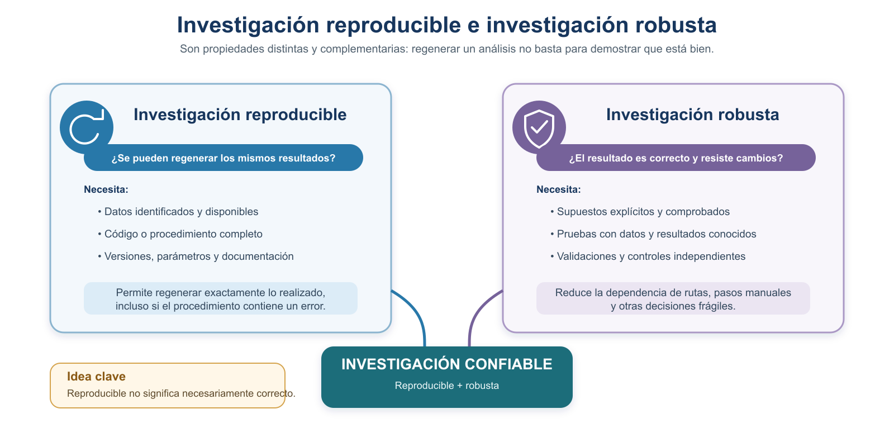
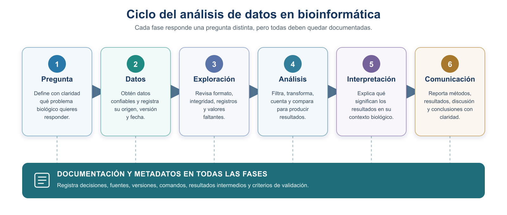
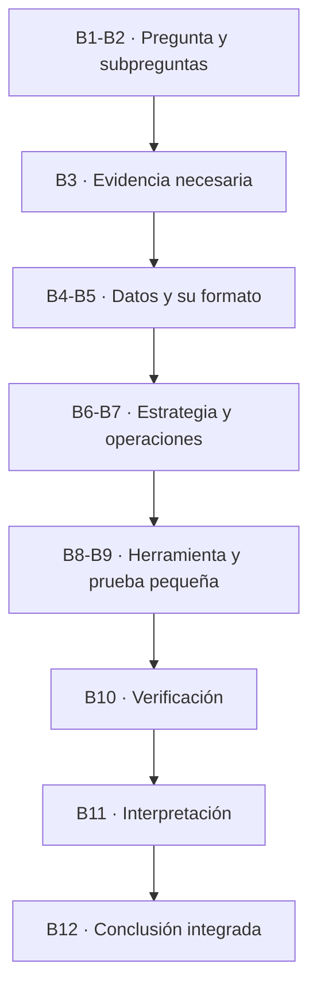

# S1 — Documentar: Markdown y las fases del análisis de datos

::: {.callout-note title="Aula invertida"}
Esta es la primera sesión del curso, así que aquí no hay lectura previa
que traer hecha: el material se lee **junto con la sesión** y las dos prácticas se completan
después. A partir de S2 el orden será el habitual —leer antes, practicar en el taller, corregir
después—.
:::

Primer módulo de la [Unidad 1](u1-trabajo-reproducible.md). Antes de tocar un solo dato biológico hay
que responder algo más básico: **qué distingue un análisis del que uno puede fiarse de otro que
simplemente produjo un número**. Hoy defines esa diferencia, aprendes a escribir de modo que otra
persona pueda seguirte, y abres el documento que crecerá durante todo el semestre.

## Ficha del módulo

| Elemento | Descripción |
| --- | --- |
| **Sesión** | S1 (2 h) |
| **Tema** | Documentar: Markdown y las fases del análisis de datos |
| **Competencia** | A — Trabajo reproducible y comunicación científica |
| **Resultado (plan)** | Documenta reportes y protocolos con Markdown; comprende las fases del análisis de datos |
| **Lectura base** | Este módulo + Buffalo (2015), cap. 1 |
| **Caso conductor** | Convertir una pregunta biológica en una estrategia escrita y comunicable |
| **Evidencia** | **Tarea 1**: `protocolo.md` iniciado (pregunta, subpreguntas, estrategia) + reporte de lectura del cap. 1. Bitácora de IA abierta |
| **Ajuste integrado** | **[Nuevo]** inicio del eje de reproducibilidad del curso |

::: {.callout-note title="dónde guardar"}
Crea tu carpeta de trabajo en tu computadora local antes de empezar las prácticas. La
estructura completa del proyecto se construye en **S2**; hoy basta con crear una carpeta llamada `introbionfo` y dentro una carpeta llamada `doc/`.
:::

## Relación con lo anterior

Es la primera sesión: no hay nada anterior que recuperar. Lo que sí hay es una idea que conviene
desmontar de entrada —que la bioinformática consiste en ejecutar programas—. El resto del curso se
apoya en lo contrario: **las preguntas biológicas permanecen; las estrategias de análisis
evolucionan**.

## Resultados de aprendizaje

Al terminar S1, el estudiante es capaz de:

1. **Explicar** qué es la bioinformática y por qué exige habilidades con datos.
2. **Distinguir** reproducibilidad, replicabilidad, verificación y validación, y usar cada término con
   precisión.
3. **Describir** las fases del manejo y análisis de datos, y las de resolución de un problema
   bioinformático, y **explicar** cómo se complementan.
4. **Convertir** una pregunta biológica en subpreguntas y en una estrategia escrita, sin empezar por
   la herramienta.
5. **Escribir** en Markdown un documento legible y funcional, con encabezados, listas, tablas, código
   y enlaces.
6. **Iniciar** `protocolo.md` como documento vivo y **abrir** la bitácora de IA.

## Ruta de S1

| Momento | Qué hacer | Tiempo estimado |
| --- | --- | ---: |
| **En la sesión** | Presentación del curso; leer §1–§3; primeras decisiones sobre tu pregunta | 120 min |
| **Después** | §4 y §5: redactar el protocolo inicial y el reporte de lectura (Prácticas 1 y 2) | 100–120 min |
| **Antes de S2** | Leer S2 completa y traer el primer intento de su Práctica 1 | 45–60 min |

---

## 1. La bioinformática, las habilidades con datos y la reproducibilidad

### 1.1 ¿Qué es la bioinformática y por qué necesitas habilidades con datos?

Hace algunas décadas, determinar los elementos genéticos de un genoma requería miles de experimentos
a lo largo de muchos años. Por ejemplo, la información sobre la regulación de la expresión de genes
en *Escherichia coli* —recopilada en la base de datos **RegulonDB**— proviene de varios miles de
publicaciones experimentales. Hoy las tecnologías de secuenciación han cambiado el panorama: la
cantidad de datos biológicos generados cada día es **masiva** y crece de forma acelerada (Buffalo,
2015). El repositorio de secuencias **SRA** del NCBI, por citar un caso, ha crecido de manera
exponencial en la última década.

La **bioinformática** es la disciplina que aplica herramientas computacionales para **almacenar,
acceder y analizar** esa avalancha de datos biológicos. La única forma práctica de trabajar con
tantos datos es a través de la computadora, automatizando tareas para ahorrar tiempo y reducir
errores.


**Figura 1.** Qué hace la bioinformática: transforma una pregunta y datos biológicos en evidencia interpretable mediante herramientas computacionales. Las habilidades con datos y el trabajo confiable atraviesan todo el proceso.

::: {.callout-note}
Aprender bioinformática no es memorizar programas, sino desarrollar **habilidades con
datos**: *"la capacidad de improvisar rápidamente una forma de ver conjuntos de datos complejos,
usando un conjunto conocido de herramientas"* (Buffalo, 2015). Se aprende como lo hace un
bioinformático: **probando cosas con datos en la computadora y comprendiendo sus resultados.**
:::

### 1.2 Cuando descuidamos el trabajo: dos casos reales

Tener habilidades técnicas **no basta**: hay que trabajar con cuidado, de forma verificable y
reproducible. Dos casos famosos muestran qué ocurre cuando esto falla.

- **Un problema de descuido.** El caso de las células **STAP** (2014): un resultado presentado como
  un descubrimiento histórico resultó **no reproducible**, en medio de descuido y falta de rigor. El
  episodio terminó en retractaciones y en un enorme costo humano y científico
  ([The Guardian, 2015](https://www.theguardian.com/science/2015/feb/18/haruko-obokata-stap-cells-controversy-scientists-lie);
  [Japan Times, 2024](https://www.japantimes.co.jp/news/2024/04/09/japan/science-health/10-years-since-stap/)).

- **Un problema de software.** Un grupo tuvo que **retractar cinco artículos** cuando se descubrió
  que un **error en su programa** invertía el signo de dos columnas de datos, produciendo estructuras
  de proteínas equivocadas. No hubo mala fe: fue un **error de software no detectado** (Miller, 2006,
  *Science*).

::: {.callout-important}
*"Non-reproducible single occurrences are of no significance to science"* (Karl
Popper, *The Logic of Scientific Discovery*, 1959). Un resultado que ocurre una sola vez y no puede
regenerarse no aporta a la ciencia. Por eso el trabajo reproducible y verificado es parte del
método, no un trámite.
:::

### 1.3 Cómo se ve el trabajo bien hecho

Frente a esos ejemplos de lo que **no** hay que hacer, conviene ver uno de lo que **sí**. Un buen
proyecto bioinformático se reconoce porque:

- Registra el **origen, versión e integridad** de cada dato (metadatos).
- Conserva los **datos originales intactos** y genera los derivados aparte.
- Documenta **cada comando** y lo asocia a la subpregunta que responde.
- **Verifica** los resultados intermedios y **valida** que respondan la pregunta.
- **Interpreta** biológicamente los resultados y cierra con una **conclusión** sustentada.
- Permite que **otra persona regenere** todo el análisis.

Un ejemplo **publicado** de estas buenas prácticas es el trabajo *Reproducible RNA-seq analysis
using recount2* (Collado-Torres et al., 2017, *Nature Biotechnology*). Sus autores no se limitaron a
publicar resultados: pusieron a disposición de la comunidad los **datos ya procesados** de más de
70 000 muestras de RNA-seq provenientes del repositorio público **SRA**, junto con un **paquete de
software documentado** (`recount`) para consultarlos, descargarlos y analizarlos, y **material
reproducible** que permite rehacer los análisis paso a paso. En otras palabras, cualquier persona
puede **regenerar y reutilizar** su trabajo: justo lo contrario de los dos casos anteriores.

::: {.callout-tip title="¿Sabías que?"}
Leonardo Collado-Torres, uno de los autores de recount2, imparte el módulo de
transcriptómica en *Bioinformática y Estadística II*, más adelante en tu formación. El estilo de
trabajo reproducible que empiezas a aprender aquí es el mismo que verás en la investigación real.
:::

::: {.callout-tip title="Un modelo para construir en el curso"}
A menor escala, el reporte
`ejemplos/ReporteGenomeEcoli_Formato_v2.md` muestra ese mismo cuidado aplicado al genoma de
*E. coli*: plantea preguntas, registra la procedencia de los datos, documenta los comandos, muestra
los resultados y los interpreta. Tenlo como referencia de la calidad que construiremos durante el
semestre.
:::

### 1.4 ¿Por qué la reproducibilidad?

Imagina que dentro de un año un revisor te pide rehacer el análisis de tu tesis, o que un compañero
quiere partir de tu trabajo. Si no puedes **regenerar los mismos resultados** a partir de los mismos
datos y procedimientos, tu trabajo no es verificable. En ciencia, un resultado que no puede
regenerarse tiene poco valor.

### 1.5 Cuatro conceptos que usaremos con precisión

La terminología varía entre disciplinas; estas son las definiciones que **este curso** utilizará de
forma consistente. Evitamos la palabra ambigua "repetir".

- **Reproducibilidad.** Otra persona puede **regenerar los resultados** usando los **mismos datos,
  procedimientos, comandos y herramientas** documentados.
  *Ejemplo:* entregas tu genoma, tu protocolo y tus comandos, y tu compañera obtiene el mismo conteo.
- **Replicabilidad.** Se obtiene **evidencia compatible** mediante un **estudio o conjunto de datos
  independiente**.
  *Ejemplo:* otro grupo analiza una cepa distinta de *E. coli* y llega a una conclusión similar.
- **Verificación.** Se comprueba que **archivos, comandos, operaciones y resultados intermedios**
  funcionan como se esperaba.
  *Ejemplo:* confirmas que un archivo se descargó completo comparando su checksum (una "huella
  digital" del archivo: un código que cambia si el archivo se altera).
- **Validación.** Se demuestra que el procedimiento y la evidencia **realmente permiten responder**
  la pregunta biológica.
  *Ejemplo:* verificas que contar líneas de tipo "gene" en el GFF sí corresponde a "número de genes".
- **Robustez.** Se comprueba que la conclusión **no depende de decisiones frágiles**, errores
  silenciosos ni de una única comprobación insuficiente.
  *Ejemplo:* obtienes el mismo conteo por dos caminos distintos.



**Figura 2.** Reproducible no es lo mismo que robusto: un análisis puede regenerarse exactamente y aun así estar equivocado. La investigación confiable es a la vez reproducible y robusta.

::: {.callout-important title="La Regla de Oro de la Bioinformática"}
(Buffalo, 2015, Cap. 1): *nunca confíes
ciegamente en tus herramientas ni en tus datos*. Verifica todo —supuestos, formatos, resultados
intermedios—, porque los conjuntos de datos son enormes y un error silencioso puede propagarse sin
que lo notes. Verificación, validación y robustez son la Regla de Oro convertida en acciones.
:::

::: {.callout-tip}
Estos cuatro principios no son solo teoría: aparecerán como **acciones observables**
dentro de cada práctica, y se retomarán progresivamente en las siguientes unidades y en el
proyecto integrador.
:::

---

## 2. Dos procesos complementarios

Trabajar con datos implica **dos procesos que se relacionan pero no son equivalentes**. Distinguirlos
evita confundir "mover datos de un lado a otro" con "responder una pregunta".



**Figura 3.** El ciclo del análisis de datos. Cada fase responde una pregunta distinta, pero la documentación y los metadatos acompañan a todas.

### A. Fases del manejo y análisis de datos

Describen el **ciclo de vida de los datos**:

1. **Obtención.** Descargar los datos de una fuente confiable.
2. **Registro de procedencia.** Anotar de dónde vienen, su versión y su integridad (metadatos).
3. **Exploración.** Revisar formato, tamaño, campos y posibles problemas.
4. **Limpieza o transformación.** Preparar los datos generando **archivos nuevos** (no sobre el original).
5. **Análisis.** Filtrar, contar, comparar para producir evidencia.
6. **Conservación.** Resguardar los datos originales intactos y los derivados por separado.
7. **Documentación y comunicación.** Registrar y reportar todo de forma reproducible.

::: {.callout-note}
El **cómo** hacer bien estas fases se reparte en el resto de la unidad: los **principios
FAIR** que las guían se ven enseguida; la **ficha de metadatos** de cada dato, en la sección 4; y la
**organización del proyecto**, en la sección 6.
:::

### B. Fases de resolución de un problema bioinformático

Describen **cómo se razona** para responder una pregunta:

1. **Delimitar** la pregunta biológica.
2. **Descomponerla** en subpreguntas.
3. **Definir la evidencia** necesaria para cada subpregunta.
4. **Identificar los datos** requeridos.
5. **Examinar el formato** y los campos disponibles.
6. **Diseñar la estrategia** *antes* de elegir comandos.
7. **Traducir la estrategia** en operaciones computacionales.
8. **Seleccionar y ejecutar** comandos.
9. **Probar primero con un caso pequeño.**
10. **Verificar** los resultados.
11. **Interpretar** cada respuesta.
12. **Integrar** una conclusión.

### Cómo se complementan

El proceso **B** es el **mapa del razonamiento**: decide *qué* preguntar, *qué* evidencia buscar y
*cómo* interpretarla. El proceso **A** es el **manejo cuidadoso de los datos**: ocurre **dentro** de
B, sobre todo cuando B llega a la parte de conseguir y trabajar los datos. Dicho de otro modo, B te
dice *qué* datos necesitas y *para qué*; A te dice *cómo* obtenerlos, resguardarlos y transformarlos
de forma confiable.

La siguiente tabla muestra **dónde cae cada fase del manejo de datos (A) dentro de la resolución del
problema (B)**:

| Fase del manejo de datos (A) | ¿Dónde ocurre dentro de la resolución (B)? |
| --- | --- |
| Obtención | Paso B4 (identificar los datos) → se descargan los datos elegidos |
| Registro de procedencia | Pasos B4–B5 (al identificar y examinar los datos) |
| Exploración | Paso B5 (examinar el formato y los campos disponibles) |
| Limpieza o transformación | Pasos B6–B7 (diseñar la estrategia y traducirla en operaciones) |
| Análisis | Pasos B8–B10 (ejecutar, probar en pequeño y verificar) |
| Conservación | Atraviesa B: resguardar el original y guardar los derivados aparte |
| Documentación y comunicación | Atraviesa todo B: se registra en cada paso y culmina en B12 (conclusión) |

::: {.callout-note}
El proceso **B** organiza el *razonamiento* y el proceso **A** cuida los *datos*: A no es
un proceso paralelo, sino el **manejo de datos que se ejecuta dentro de B**. Primero razonas qué
necesitas (B); en el momento de tocar los datos, lo haces con cuidado (A). No son lo mismo, pero se
encajan uno dentro del otro.
:::

Estas dos secciones que siguen **desarrollan lo que acabamos de ver**: la **sección 3** pone en
práctica el proceso B con un ejemplo concreto, y la **sección 4** muestra cómo todo ese razonamiento
se registra en un documento —el **protocolo**—. Son las dos caras de una misma moneda: *razonar* el
problema (sección 3) y *documentarlo* de forma reproducible (sección 4).

---

## 3. De la pregunta biológica a una solución computacional

Esta sección **aplica el proceso B** de la sección 2 (cómo se razona un problema), recorriendo sus
pasos sobre un ejemplo. La idea central es la misma: **no se empieza eligiendo comandos**. Se empieza
por la pregunta, luego se define qué evidencia la responde, qué datos la contienen y, **al final**,
qué herramienta la obtiene.

::: {.callout-important}
El orden correcto es **pregunta → evidencia → datos → operación → herramienta**.
Empezar por el comando es la causa más común de análisis que "corren" pero no responden nada.
:::

::: {.callout-note}
A lo largo del curso trabajarás con **varios conjuntos de datos** —el genoma de
*E. coli*, sRNAs, datos de ratón y una red de regulación, entre otros—. Aquí ilustramos el proceso
con **uno** de ellos, pero **el mismo razonamiento (pasos B1–B12 de la sección 2) se aplica a todos**.
:::

El siguiente diagrama resume los pasos que recorreremos:



### El proceso B aplicado a un ejemplo

Para ilustrarlo usamos el genoma de la bacteria *E. coli* K-12 y su archivo de anotación en formato
**GFF** (una tabla donde cada renglón es un elemento del genoma —un *feature*—, como un gen o una
región).

**B1–B2. Delimitar y descomponer la pregunta.**
*Pregunta central:* ¿cuántos genes tiene el genoma de *E. coli* K-12 y cómo se distribuyen en el
cromosoma? La dividimos en tres **subpreguntas** manejables: (a) ¿de qué tamaño es el genoma?,
(b) ¿cuántos genes hay?, (c) ¿cómo se distribuyen por cadena?

**B3–B5. Definir la evidencia, identificar los datos y examinar su formato.**
Cada subpregunta se responde con una **evidencia** concreta que vive en un **dato** concreto. Antes
de operar hay que **examinar el formato**: el GFF es tabular; su **columna 3** indica el tipo de
feature (p. ej. `gene`) y su **columna 7** la cadena (`+` o `-`); el tamaño del genoma aparece en el
encabezado del archivo. Conocer las columnas es lo que permite diseñar la estrategia.

**B6–B7. Diseñar la estrategia, antes de elegir comandos.**
Con lo anterior se arma la **tabla de estrategia**: para cada subpregunta, qué evidencia se necesita,
en qué dato está, qué operación conceptual la obtiene, con qué herramienta podría hacerse, cómo se
valida y cómo se interpreta.

| Subpregunta | Evidencia necesaria | Datos | Operación (conceptual) | Herramienta posible | Validación | Interpretación |
| --- | --- | --- | --- | --- | --- | --- |
| ¿De qué tamaño es el genoma? | Longitud total en pares de bases | Encabezado del GFF / FASTA | Leer la región declarada | Visualización de texto | Contrastar el valor del GFF con el del registro en NCBI | Tamaño típico de una bacteria (~4.6 Mb) |
| ¿Cuántos genes hay? | Número de renglones de tipo "gene" | Columna 3 del GFF | Filtrar por "gene" y contar | Filtro + conteo | Comparar con el número reportado por NCBI | Densidad génica del genoma |
| ¿Cómo se distribuyen por cadena? | Conteo de genes en cadena `+` y `-` | Columna 7 del GFF | Agrupar por cadena y contar | Filtro + conteo | La suma `+` y `-` debe igualar el total de genes | Organización del genoma en ambas hebras |

::: {.callout-note}
Esta tabla es el **artefacto central** de la sección: es lo que construirás en la
Práctica 3 y lo que registrarás en el protocolo (sección 4).
:::

**B8–B9. Elegir la herramienta y probar en pequeño.**
Las herramientas de la tabla son "posibles": las aprenderás a ejecutar en las unidades siguientes.
Cuando llegue el momento, **pruébalas primero con un caso pequeño** (unos pocos renglones del GFF, de
resultado conocido) antes de aplicarlas al genoma completo.

**B10–B11. Verificar e interpretar.**
Cada resultado se **verifica** —por ejemplo, la suma de genes en `+` y `-` debe igualar el total— y
se **interpreta** biológicamente: un genoma de ~4.6 Mb con alta densidad génica es típico de una
bacteria.

**B12. Integrar la conclusión.**
Con las respuestas validadas se **integra una conclusión** que responde la pregunta central:
*"El genoma de* E. coli *K-12 mide ~4.6 Mb y contiene N genes distribuidos en ambas cadenas, lo que
indica una alta densidad génica característica de las bacterias."*

::: {.callout-tip title="¿Sabías que?"}
Casi cualquier análisis bioinformático, por complejo que parezca, se resuelve
así: una pregunta grande se parte en subpreguntas pequeñas y verificables. Dominar esta
descomposición es más importante que memorizar comandos.
:::

---

### Práctica 1 — De la pregunta biológica a la estrategia *(en la sesión y después)*

**Antes de clase (primer intento).** Retomarás el archivo `pacientes.md` y los metadatos elaborados
en la práctica anterior.

Un integrante del equipo propone utilizar estos datos para investigar la siguiente pregunta:

> **¿Los datos de `pacientes.md` son suficientes para evaluar si el índice de masa corporal está
> relacionado con el diagnóstico registrado en `dx`?**

**Antes de pensar en comandos**, completa la siguiente tabla:

| Elemento | Tu respuesta |
| --- | --- |
| Pregunta central | |
| Subpreguntas | |
| Evidencia esperada | |
| Datos necesarios | |
| Operaciones requeridas | |
| Posible herramienta | |
| Método de validación | |
| Posible interpretación | |

Para construir tu estrategia, considera:

- ¿Están documentadas las unidades de `peso` y `altura`?
- ¿Qué operación permitiría calcular el índice de masa corporal?
- ¿Qué significa cada código de `dx`?
- ¿Cuántos pacientes hay para cada diagnóstico?
- ¿Es posible distinguir una asociación de una diferencia individual?
- ¿Qué datos o metadatos adicionales serían necesarios?
- ¿Qué conclusión sería válida si la evidencia disponible resulta insuficiente?

No es obligatorio concluir que existe una relación. Determinar que los datos son insuficientes, y
explicar por qué, también constituye un resultado científico válido.

**Durante el taller.** Compararemos las estrategias y discutiremos por qué puede haber varias
descomposiciones correctas de la misma pregunta. Distinguiremos entre calcular una variable,
observar diferencias y demostrar una asociación. Revisaremos qué limitaciones provienen del tamaño
del conjunto de datos y cuáles se deben a metadatos incompletos.

**Después del taller (entrega final).** Integra la tabla corregida en la sección *Estrategia* de
`protocolo.md`. La estrategia debe relacionar claramente pregunta, subpreguntas, evidencia, datos,
operaciones, validación e interpretación. Incluye un apartado breve de **limitaciones de los datos**.
Las secciones *Comandos* y *Resultados* pueden permanecer vacías, porque en esta práctica se evalúa
el razonamiento previo al análisis.

---

## 4. El protocolo de resolución de un problema bioinformático

El razonamiento que acabas de ver en la sección 3 —la pregunta, las subpreguntas, la evidencia, los
datos y la estrategia— **no vive en tu cabeza ni en notas sueltas: se registra en el protocolo**. La
tabla que armaste en la sección 3 es, de hecho, el punto de partida de este documento.

En este curso, el **protocolo** no es una simple propuesta previa ni una lista de comandos: es un
**documento vivo** donde se registra y organiza toda la resolución del problema.

Características del protocolo:

- Es un **documento vivo**: se completa progresivamente durante varias unidades.
- **Organiza el razonamiento**, no solo los comandos.
- **Relaciona cada comando con una subpregunta.**
- Registra **entradas, operaciones, salidas y validaciones**.
- Incluye **resultados e interpretación**.
- Termina con una **conclusión** que responde la pregunta central.
- Permite **reproducir y evaluar** el análisis.

Sus secciones y la función de cada una:

| Sección | Función |
| --- | --- |
| Introducción | Presentar contexto y problema |
| Pregunta central | Delimitar qué se quiere responder |
| Subpreguntas | Dividir el problema |
| Datos | Registrar origen, versión, formato e integridad |
| Estrategia | Explicar cómo se resolverá cada subpregunta |
| Comandos | Documentar la ejecución |
| Resultados | Presentar la evidencia obtenida |
| Validación | Comprobar los resultados |
| Discusión | Interpretar su significado biológico |
| Conclusiones | Integrar las respuestas |

::: {.callout-note}
En la Unidad 1 iniciarás las secciones **Introducción, Pregunta central, Subpreguntas,
Datos y Estrategia**. Las secciones **Comandos, Resultados, Validación, Discusión y Conclusiones**
se completarán en las unidades posteriores, conforme aprendas a ejecutar y verificar los análisis.
Consérvalas en tu plantilla aunque todavía estén vacías.
:::

### 4.1 El protocolo y la escritura científica

Cuando el protocolo se comunica como reporte, sus partes corresponden a las de un artículo
científico. Usa esta correspondencia:

- **Pregunta y contexto → Introducción.**
- **Datos y exploración → Metodología.**
- **Estrategia y procedimientos analíticos → Metodología.**
- **Evidencias obtenidas → Resultados.**
- **Significado biológico y limitaciones → Discusión.**
- **Respuesta integrada → Conclusiones.**
- **Documentación y metadatos → atraviesan todo el proceso.**

::: {.callout-important}
Los **procedimientos analíticos** (cómo obtuviste la evidencia) pertenecen a la
**Metodología**, no a Resultados. En Resultados va la **evidencia**; en Discusión, su
**interpretación**.
:::

Puedes consultar la plantilla en blanco
[`formato_protocolo_v1.0.md`](ejemplos/formato_protocolo_v1.0.md) y un ejemplo ya
trabajado en
[`ReporteGenomeEcoli_Formato_v2.md`](ejemplos/ReporteGenomeEcoli_Formato_v2.md).

### Práctica 2 — Protocolo y reporte de lectura en Markdown *(después de la sesión)*

**Antes de clase (primer intento).** Crea un borrador de `protocolo.md` con la estructura de la
sección 4 (Introducción, Pregunta central, Subpreguntas, Datos, Estrategia; deja Comandos,
Resultados, Validación, Discusión y Conclusiones como secciones vacías rotuladas). Crea también un
`reporte-lectura.md` del **Cap. 1 de Buffalo (2015)** —la lectura base de la unidad— con las
secciones: Referencia, Resumen, Aportación principal, Crítica o duda. Anota al menos una duda y la
parte más difícil.

**Durante el taller.** Revisaremos tu estructura, compararemos cómo distintos estudiantes plantearon
la pregunta central y las subpreguntas, y corregiremos el uso de Markdown según su función
comunicativa.

**Después del taller (entrega final).** Entrega `protocolo.md` y `reporte-lectura.md` corregidos.
Ambos deben usar los elementos de Markdown que aporten claridad (al menos títulos, una lista y un
enlace; tabla y bloque de código solo donde tengan función). Verifica que se ven bien en StackEdit.

---

## 5. Comunicar con Markdown

Comunicar con claridad es parte del método científico. **Markdown** es un lenguaje de marcado
ligero: se escribe texto plano con marcas simples (`#`, `*`, `-`) que luego se convierte a HTML, PDF
u otros formatos. Fue creado por John Gruber para que el texto fuente sea **legible tal cual**
(Buffalo, 2015, Cap. 2). Es el formato de los README de GitHub, de la documentación técnica y de gran
parte del material científico en línea.

Página oficial: <https://daringfireball.net/projects/markdown/>. Guía de referencia:
<https://www.markdownguide.org/>.

### 5.1 La herramienta que usaremos: StackEdit

Practicaremos con **StackEdit**, un editor de Markdown **gratuito que funciona en el navegador**, sin
instalar nada (<https://stackedit.io>). Muestra, lado a lado, **lo que escribes** (panel izquierdo) y
**cómo se verá** (panel derecho, vista previa sincronizada). Tiene, además, una barra de herramientas
que inserta las marcas por ti, un explorador de documentos y opciones para **exportar** a `.md`, HTML
o PDF.


**Figura 6.** Componentes principales de StackEdit: (1) panel de edición, (2) vista previa, (3) barra de herramientas, (4) menú lateral y (5) explorador de documentos. Captura propia de StackEdit (stackedit.io).

::: {.callout-warning}
StackEdit guarda tus documentos en el **navegador**. Para conservar tu trabajo,
**exporta el archivo `.md`** (menú ☰ → Export) y guárdalo en tu carpeta de proyecto. El `.md`
exportado es lo que entregas.
:::

::: {.callout-tip title="Sin conexión"}
Como Markdown es texto plano, si no tienes internet puedes escribir tu
`.md` en **cualquier editor de texto** (por ejemplo, el Bloc de notas, TextEdit en modo texto o
VS Code) y ver la vista previa más tarde. No dependes de una herramienta específica.
:::

### 5.2 Elementos de Markdown

Cada elemento cumple una **función comunicativa**; úsalo cuando aporte claridad, no por obligación.

```markdown
# Título de nivel 1
## Título de nivel 2

Un párrafo normal, con **negrita** para lo importante, *cursiva* para matizar
y `código en línea` para nombres de archivos o comandos, como `genoma.gff`.

- Lista con viñetas (para enumerar sin orden)
1. Lista numerada (para pasos con orden)

[Texto de un enlace](https://www.ncbi.nlm.nih.gov)
```

- **Encabezados** (`#`): estructuran el documento en secciones.
- **Párrafos y énfasis** (`**`, `*`): resaltan ideas clave sin abusar.
- **Listas**: enumeran pasos u opciones.
- **Enlaces**: citan fuentes y datos.
- **Código en línea y bloques** (` ``` `): distinguen comandos y datos del texto.

Las **tablas** y los **bloques de código** son útiles cuando hay datos tabulares o comandos que
mostrar. El siguiente bloque muestra una tabla:

```markdown
| Archivo        | Formato | Descripción           |
| -------------- | ------- | --------------------- |
| genoma.fasta   | FASTA   | Secuencia del genoma  |
| anotacion.gff3 | GFF3    | Anotación de features |
```

::: {.callout-tip title="Ejemplos correcto e incorrecto"}
Un buen documento usa cada elemento con propósito.
*Incorrecto:* poner todo en negrita (nada resalta) o meter una tabla de una sola celda.
*Correcto:* un título por sección, listas para pasos y una tabla solo cuando hay varias columnas
de datos que comparar.
:::

### 5.3 Diagramas con Mermaid (ampliación, opcional)

**Mermaid** permite crear diagramas escribiéndolos como texto (<https://mermaid.js.org>). En esta
unidad es **opcional**; resulta útil sobre todo para representar las **fases de solución** de un
problema, como en el diagrama de la sección 3. El tipo más frecuente es el diagrama de flujo
(`flowchart`).

---

---

## 6. Rúbricas

> **Cómo se evalúa cada momento.** El **primer intento** tiene valor **formativo**: da puntos por
> **preparación**, no por acierto. La **participación en clase** también es formativa. Las **Tareas 1
> y 2** (entrega posterior al taller) llevan la **calificación principal**. Cada criterio se evalúa en
> tres niveles: **Logrado**, **Parcialmente logrado** y **Aún no logrado**.
>
> Recuerda el alcance de U1: el protocolo se construye **hasta la estrategia**; la ejecución de
> comandos, los resultados y la validación ejecutada llegan en unidades posteriores. Aquí la
> validación y la conclusión se evalúan **como diseño anticipado**, no como ejecución.

### 6.1 Primer intento (formativa · puntos por preparación)

| Criterio | Logrado | Parcialmente logrado | Aún no logrado |
| --- | --- | --- | --- |
| Evidencia de lectura | Aplica ideas de las secciones y de Buffalo Cap. 1 | Menciona la lectura sin aplicarla | Sin evidencia de lectura |
| Esfuerzo auténtico | Intenta todas las prácticas asignadas | Intenta algunas | No presenta intento |
| Identificación de dudas | Registra ≥1 duda concreta y accionable | Duda vaga | No registra dudas |
| Registro de dificultades y errores | Señala la parte más difícil y los errores encontrados | Menciona dificultad sin detalle | No registra |

> Los **errores razonables no se penalizan**: este momento premia preparar y llegar con preguntas.

### 6.2 Participación en clase (formativa)

| Criterio | Logrado | Parcialmente logrado | Aún no logrado |
| --- | --- | --- | --- |
| Revisión del propio intento | Revisa y detecta sus errores | Revisa superficialmente | No revisa |
| Formulación de preguntas | Pregunta con precisión | Pregunta de forma vaga | No participa |
| Corrección argumentada | Corrige y explica por qué | Corrige sin justificar | No corrige |
| Comparación de estrategias | Compara con compañeros y aprende | Compara sin analizar | No compara |

### 6.3 Tarea 1 — protocolo iniciado + reporte de lectura

| Criterio | Logrado | Parcialmente logrado | Aún no logrado |
| --- | --- | --- | --- |
| Pregunta y subpreguntas | Pregunta clara; subpreguntas abordables y coherentes | Pregunta o subpreguntas imprecisas | Ausentes o inconexas |
| Estrategia | Relaciona subpregunta–evidencia–datos–operación–validación–interpretación | Relación parcial | Sin relación clara |
| Protocolo (documento) | Estructura hasta *Estrategia*; secciones posteriores rotuladas y vacías | Estructura incompleta | Sin estructura |
| Reporte de lectura (Buffalo Cap. 1) | Referencia, resumen, aportación y crítica claras | Falta algún apartado | Ausente o superficial |
| Markdown funcional | Cada elemento cumple una función comunicativa | Uso decorativo o inconsistente | Sin formato o ilegible |
| Conclusión provisional y limitaciones | Conclusión que **no excede** la evidencia + limitaciones explícitas | Conclusión sin limitaciones | Conclusión que excede la evidencia |

---

## Glosario

| Español | Inglés | Definición breve |
| --- | --- | --- |
| Reproducibilidad | Reproducibility | Regenerar resultados con los mismos datos y procedimientos |
| Replicabilidad | Replicability | Evidencia compatible con datos o estudios independientes |
| Verificación | Verification | Comprobar que archivos, comandos y resultados funcionan como se espera |
| Validación | Validation | Demostrar que el procedimiento responde la pregunta |
| Robustez | Robustness | Que la conclusión no dependa de decisiones frágiles |
| Metadatos | Metadata | Datos que describen un dato |
| Checksum / suma de verificación | Checksum | Huella digital para comprobar integridad de un archivo |
| Procedencia | Provenance | Origen e historia de un dato |
| Feature (elemento) | Feature | Elemento anotado del genoma (gen, región, etc.) |
| Cadena / hebra | Strand | Hebra del ADN donde se ubica un feature (`+` o `-`) |

---

## Referencias

- Buffalo, V. (2015). *Bioinformatics Data Skills: Reproducible and Robust Research with Open Source
  Tools*. O'Reilly Media. — Cap. 1 (reproducibilidad, robustez, Regla de Oro) y Cap. 2 (organización
  de proyectos, documentación, Markdown). Disponible en `referencias/bioinformatics-data-skills.pdf`.
- Wilkinson, M. D., et al. (2016). The FAIR Guiding Principles for scientific data management and
  stewardship. *Scientific Data*, 3, 160018. doi:10.1038/sdata.2016.18.
- Miller, G. (2006). A Scientist's Nightmare: Software Problem Leads to Five Retractions. *Science*,
  314(5807), 1856–1857. doi:10.1126/science.314.5807.1856.
- Cyranoski, D. (2015, 18 de febrero). *Haruko Obokata: the STAP cells controversy*. The Guardian.
  <https://www.theguardian.com/science/2015/feb/18/haruko-obokata-stap-cells-controversy-scientists-lie>
- The Japan Times (2024, 9 de abril). *10 years since STAP*.
  <https://www.japantimes.co.jp/news/2024/04/09/japan/science-health/10-years-since-stap/>
- Popper, K. (1959). *The Logic of Scientific Discovery*. Hutchinson & Co.
- Collado-Torres, L., Nellore, A., Kammers, K., Ellis, S. E., Taub, M. A., Hansen, K. D., Jaffe,
  A. E., Langmead, B., & Leek, J. T. (2017). Reproducible RNA-seq analysis using recount2. *Nature
  Biotechnology*, 35(4), 319–321. doi:10.1038/nbt.3838.
- Barker, M., Chue Hong, N. P., Katz, D. S., et al. (2022). Introducing the FAIR Principles for
  research software (FAIR4RS). *Scientific Data*, 9, 622. doi:10.1038/s41597-022-01710-x.
- Noble, W. S. (2009). A Quick Guide to Organizing Computational Biology Projects. *PLoS
  Computational Biology*, 5(7), e1000424. doi:10.1371/journal.pcbi.1000424. (organización de
  directorios: `data/`, `results/`, `src/`, `doc/`).
- GO-FAIR. FAIR Principles. <https://www.go-fair.org/fair-principles/>
- Markdown — página oficial (John Gruber). <https://daringfireball.net/projects/markdown/>
- Markdown Guide. <https://www.markdownguide.org/>
- StackEdit — editor de Markdown en línea. <https://stackedit.io>
- Mermaid — documentación oficial. <https://mermaid.js.org/>
