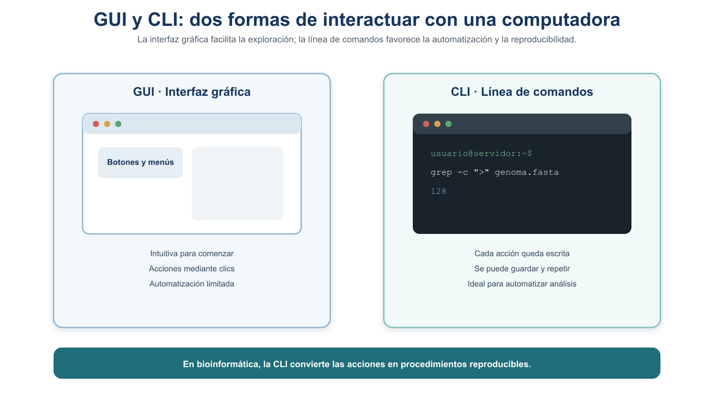
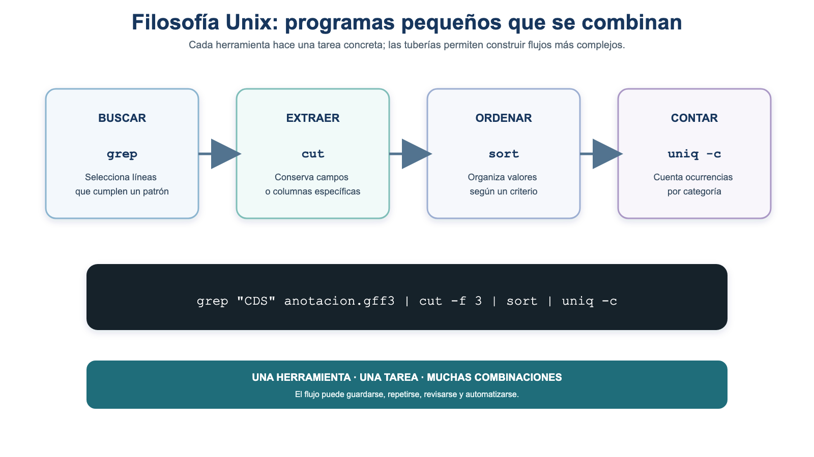
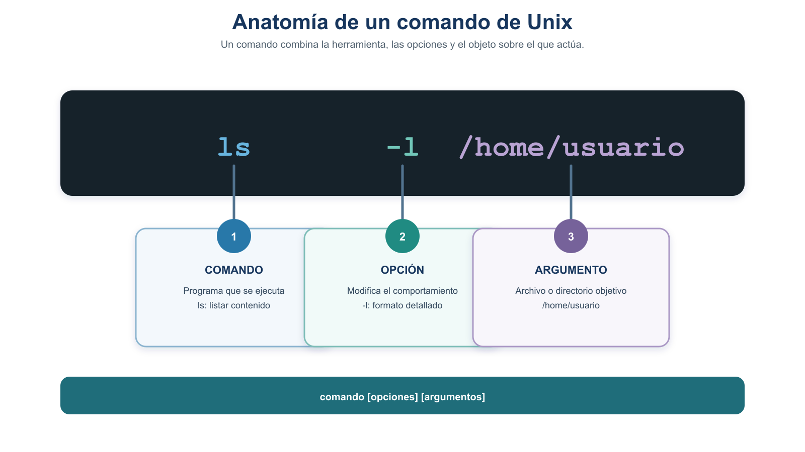
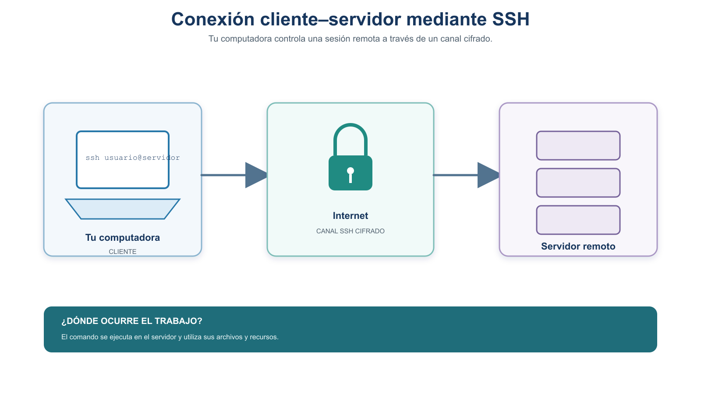
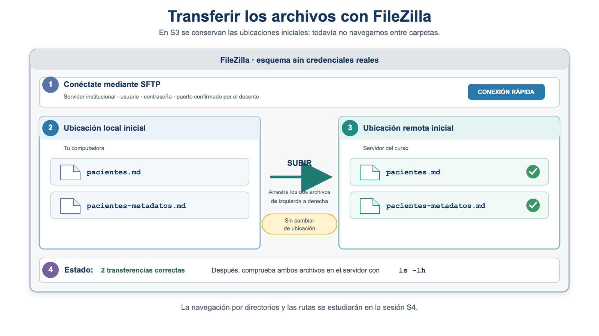

# S3 — Conectar: el shell, el acceso remoto y la transferencia de archivos

::: {.callout-note title="Lectura previa (aula invertida)"}
Este documento se lee **antes de la sesión S3**. Aquí
tienes los conceptos y el problema que resolveremos en clase. La sesión es **práctica**: casi todo
lo ejecutarás en vivo sobre el servidor del curso. Trae tus archivos listos (ver *Antes de la
sesión*) y tus dudas. A lo largo del módulo hay **cinco prácticas** y un **cierre que retoma el
protocolo iniciado en la Unidad 1**.
:::

Primer módulo de la [Unidad 2](u2-entorno-unix.md). Su meta es que, partiendo de un problema real
—**trasladar un archivo de datos y sus metadatos al servidor del curso, comprobar que llegaron
intactos y documentar el procedimiento**—, aprendas a abrir una terminal, entender qué es un comando,
conectarte por SSH, reconocer el entorno remoto y transferir archivos verificando su integridad.

## Ficha del módulo

| Elemento | Descripción |
| --- | --- |
| **Sesión** | S3 (2 h) |
| **Tema** | El shell y protocolos de internet; acceso remoto (SSH) y transferencia |
| **Competencia** | B — Dominio del entorno Unix y del cómputo científico |
| **Resultado (plan)** | Comprende qué es Unix; se conecta a un servidor remoto y transfiere datos |
| **Lectura base** | Buffalo (2015), Cap. 3 ("Why Do We Use Unix…", "shell"); documentación de OpenSSH |
| **Caso conductor** | Trasladar `pacientes.md` y sus metadatos al servidor de forma segura, íntegra y reproducible |
| **Evidencia** | `protocolo.md` actualizado y transferido, con el procedimiento y la comprobación de integridad |

## Relación con la Unidad 1 y con el proyecto integrador

En la Unidad 1 trabajaste con `pacientes.md`, un conjunto de datos **sintético** de tres registros,
elaboraste sus **metadatos** e iniciaste `protocolo.md` como un **documento vivo**. También aprendiste
dos ideas que hoy usaremos: los **datos originales se conservan sin modificaciones**, y deben ir
**acompañados de la información que permite interpretarlos**. A partir de esta unidad, el trabajo
computacional se realiza en el **servidor del curso**. El primer paso es llevar allí tu archivo de
datos y sus metadatos, comprobar que llegaron intactos y agregar el procedimiento al protocolo para
que pueda repetirse.

## Resultados de aprendizaje

Al terminar S3, el estudiante es capaz de:

1. **Explicar** por qué la bioinformática usa Unix y la línea de comandos, en términos de
   reproducibilidad.
2. **Identificar** las partes de un comando, **consultar** la ayuda con `man` y **utilizar** Tab,
   historial y `Ctrl-C` para trabajar con mayor autonomía y seguridad.
3. **Conectarse** al servidor por SSH, **reconocer** el entorno remoto (`hostname`, `whoami`, `pwd`) y
   **salir** correctamente, de forma repetida.
4. **Transferir** un archivo y sus metadatos con SFTP o FileZilla, distinguiendo el lado local del
   remoto.
5. **Comprobar** la integridad de la transferencia con *checksums*, **actualizar** `protocolo.md` y
   **transferirlo** al servidor sin incluir credenciales.

## Antes de la sesión

::: {.callout-important title="credenciales"}
La **dirección del servidor**, tu **usuario** y tu **contraseña** se
te darán **en clase**. Por eso, **antes** de S3 no te pedimos conectarte: preparas tus archivos y tu
entorno. (Si quien imparte el curso te entrega las credenciales y la huella oficial con
anticipación, puedes intentar una primera conexión; en caso contrario, no es necesario.)
:::

| Elemento | Detalle |
| --- | --- |
| **Lectura obligatoria** | Este módulo completo + Buffalo (2015), Cap. 3 (filosofía Unix y shell). |
| **Primer intento (preparación)** | La lista de preflight (abajo). |
| **Producto para el taller** | `pacientes.md`, `pacientes-metadatos.md` y `protocolo.md` localizados; el entorno probado y al menos una duda anotada. |
| **Tiempo estimado** | Lectura ~45 min · Buffalo Cap. 3 (parte) ~30 min · preparación ~20 min. |

### Preflight — prepara tus archivos y tu entorno

Revisa esta lista; si algo falta, resuélvelo o anótalo para el taller:

- [ ] **Localiza `pacientes.md`** en tu computadora (el conjunto de datos sintético de la Unidad 1).
- [ ] **Localiza o termina `pacientes-metadatos.md`**, la ficha de metadatos que elaboraste en la
  Unidad 1. Si necesitas un modelo, consulta [`ejemplos/metadatos_pacientes.md`](ejemplos/metadatos_pacientes.md).
- [ ] **Localiza `protocolo.md`**, el documento vivo que iniciaste en la Unidad 1. No necesitas
  completarlo todavía: lo actualizarás al final de S3.
- [ ] **Instala FileZilla** si vas a usar transferencia con interfaz gráfica
  (<https://filezilla-project.org/>).
- [ ] **Confirma que puedes abrir** tu terminal (macOS/Linux) o tu cliente SSH (en Windows: WSL, Git
  Bash o un cliente SSH).
- [ ] **Anota una duda** de la lectura para llevarla al taller.
- [ ] **Ten los tres archivos a la mano** para trabajar con ellos en clase.

::: {.callout-warning title="seguridad, léela antes de la sesión"}
Nunca compartas contraseñas, llaves privadas
ni *tokens*, ni los registres en tu bitácora o en capturas de pantalla. No proporciones información
sensible a asistentes de IA, y no ejecutes comandos que te sugiera una IA sin entenderlos y
verificarlos. Cuando te conectes por primera vez, **verifica la huella del servidor** (§7) contra la
que dé quien imparte el curso.
:::

---

## Bloque 1 — Por qué Unix, y de qué está hecho el entorno

Antes de conectarnos necesitamos un marco común. Como no todo el grupo tiene el mismo Unix local, en
este bloque las ideas se presentan de forma **conceptual**; la práctica uniforme de comandos vendrá
**después de la primera conexión**, ya sobre el servidor Linux del curso (el entorno común).

### 1. ¿Por qué usamos Unix en bioinformática?

**Unix** es una familia de sistemas operativos creada en los años 70. Hoy casi toda la bioinformática
se ejecuta sobre sistemas **tipo Unix** (Linux y macOS lo son). La razón que más nos importa es la
**reproducibilidad**: en Unix, cada acción es un **comando de texto** que puedes guardar, repetir y
compartir. Volviendo al caso: si trasladas `pacientes.md` "a mano" arrastrando iconos, será difícil
explicar después *cómo* lo hiciste; si lo haces con comandos, tu procedimiento queda escrito y se
puede repetir (Buffalo, 2015, Cap. 3).

### 2. GUI frente a CLI

- **GUI** (*Graphical User Interface*, interfaz gráfica): se opera con el ratón. Es intuitiva, pero
  difícil de **automatizar** y de **documentar** (¿cómo escribes "hice clic aquí" de forma
  reproducible?).
- **CLI** (*Command Line Interface*, interfaz de línea de comandos): se opera **escribiendo
  instrucciones de texto**. Tiene más curva de aprendizaje, pero cada acción es un comando que puedes
  **guardar, repetir, automatizar y compartir**.



**Figura 1.** GUI frente a CLI: la interfaz gráfica se opera con clics difíciles de documentar; la línea de comandos se opera con texto que puede guardarse y repetirse.

### 3. La filosofía Unix

La **filosofía Unix** consiste en tener **muchos programas pequeños**, cada uno de los cuales **hace
una sola cosa y la hace bien**, y que se **combinan** para resolver tareas complejas (lo veremos con
las *tuberías* en la Unidad 4).



**Figura 2.** Filosofía Unix: cada herramienta hace una tarea concreta y las tuberías las combinan en un flujo que puede guardarse y repetirse.

::: {.callout-tip title="¿Sabías que?"}
Unix nació alrededor de 1969–1970 en los Laboratorios Bell (AT&T), de la mano de
Ken Thompson y Dennis Ritchie. Hoy macOS está construido sobre una base tipo Unix y Linux —un
sistema tipo Unix libre— domina los servidores científicos del mundo (Ritchie & Thompson, 1974).
:::

### 4. Terminal y shell: no son lo mismo

- El **shell** es un programa **intérprete de comandos**: lee lo que escribes, se lo pide al sistema
  operativo y te devuelve el resultado. Existen varios (**bash**, **zsh**, **tcsh**, **csh**); el más
  común es **bash**.
- La **terminal** es la **ventana** donde se ejecuta el shell. La terminal es el contenedor; el shell
  es quien interpreta.

### 5. Anatomía de un comando

Un comando de Unix tiene tres partes:

```bash
comando  -opciones  argumentos
# ejemplo:
ls  -l  pacientes.md
```

- **comando:** la herramienta (`ls`, `hostname`, `whoami`…).
- **opciones** (o *flags*): modifican el comportamiento; suelen empezar con `-` (p. ej. `-l`).
- **argumentos:** sobre qué actúa el comando (en este ejemplo, el archivo `pacientes.md`).



**Figura 3.** Anatomía de un comando: el comando, sus opciones y sus argumentos.

### 6. Cliente, servidor y protocolos

Cuando tu computadora pide algo por la red actúa como **cliente** frente a un **servidor** que
responde. Un **servidor** es una computadora —normalmente potente y siempre encendida— que ofrece
servicios o datos. Para entenderse usan **protocolos** (reglas comunes):

- **HTTP** (*HyperText Transfer Protocol*): protocolo de la web que, por sí mismo, no cifra la
  comunicación. **HTTPS** añade una conexión cifrada.
- **FTP** (*File Transfer Protocol*): dedicado a **transferir archivos** (sin cifrar).
- **SSH** (*Secure SHell*): para **conectarse de forma segura** (cifrada) a una máquina remota y
  trabajar en ella. **SFTP** transfiere archivos **sobre** ese canal seguro de SSH.


**Figura 4.** Cliente, servidor y protocolos: el protocolo determina cómo se comunican las dos computadoras. En el curso utilizaremos SSH para el acceso remoto y SFTP para transferir archivos mediante un canal cifrado.

::: {.callout-note}
"Seguro" en SSH significa que la comunicación viaja **cifrada**: aunque alguien intercepte
los datos, no puede leerlos. Por eso para nuestros datos preferimos **SFTP** (sobre SSH) y no FTP
plano.
:::

### Comprueba tu comprensión antes de conectarte

Elige una respuesta antes de abrir la retroalimentación.

#### Pregunta 1 — Anatomía de un comando

Quieres comprobar si `pacientes.md` aparece en una lista detallada de archivos y encuentras esta
instrucción:

```bash
ls -l pacientes.md
```

¿Cuál es la función de cada elemento?

- A. `ls` es el argumento, `-l` es el comando y `pacientes.md` es la opción.
- B. `ls` es el comando, `-l` es la opción y `pacientes.md` es el argumento.
- C. `ls` es el servidor, `-l` es el protocolo y `pacientes.md` es el comando.

<details>
<summary>Ver retroalimentación</summary>

**Respuesta correcta: B.** `ls` es el programa que se ejecuta, `-l` modifica su comportamiento para
producir una lista detallada y `pacientes.md` es el archivo sobre el que actúa. Reconocer estas partes
te ayudará a interpretar comandos nuevos y consultar sus opciones en el manual.

</details>

#### Pregunta 2 — Terminal y shell

Cuando escribes un comando, ¿qué relación existe entre la terminal y el shell?

- A. La terminal es la ventana donde escribes y el shell interpreta el comando.
- B. El shell es la ventana y la terminal es el servidor remoto.
- C. Son dos nombres para el mismo protocolo de internet.

<details>
<summary>Ver retroalimentación</summary>

**Respuesta correcta: A.** La terminal es la interfaz o ventana donde escribes. Dentro de ella se
ejecuta el shell, que interpreta el comando y solicita su ejecución al sistema operativo. Cuando te
conectes por SSH seguirás usando una terminal, pero el shell que responde estará en el servidor.

</details>

#### Pregunta 3 — Transferencia segura

Necesitas enviar `pacientes.md` y sus metadatos al servidor del curso. ¿Qué opción es apropiada?

- A. FTP plano, porque está diseñado para transferir archivos aunque no cifre la conexión.
- B. SFTP, porque transfiere los archivos mediante el canal cifrado de SSH.
- C. HTTP, porque cualquier protocolo de la web protege automáticamente los archivos.

<details>
<summary>Ver retroalimentación</summary>

**Respuesta correcta: B.** SFTP utiliza el canal seguro proporcionado por SSH. Esto protege durante
la transferencia tanto las credenciales como el contenido transmitido. FTP plano no cifra la
comunicación y HTTP no implica cifrado; cuando la web usa cifrado, el protocolo es HTTPS.

</details>

#### Pregunta 4 — Reproducibilidad

¿Por qué utilizar comandos de texto puede favorecer la reproducibilidad?

- A. Porque todo comando produce automáticamente un resultado correcto.
- B. Porque los comandos siempre son más rápidos que una interfaz gráfica.
- C. Porque la instrucción exacta puede registrarse, revisarse, compartirse y ejecutarse nuevamente.

<details>
<summary>Ver retroalimentación</summary>

**Respuesta correcta: C.** Un comando no garantiza por sí mismo que el procedimiento sea correcto.
Su ventaja es que deja una instrucción explícita que puede registrarse en la bitácora, revisarse y
repetirse. La reproducibilidad requiere además conservar los datos, documentar el entorno y verificar
los resultados.

</details>

Si alguna respuesta no fue correcta, vuelve a consultar la sección correspondiente antes de iniciar
la conexión.

---

## Bitácora interactiva de S3

Durante esta sesión trabajarás en la terminal real: te conectarás por SSH, explorarás el servidor y transferirás tus archivos. Esta bitácora te ayudará a registrar lo que observas en cada práctica, anotar tus decisiones y reunir la evidencia que necesitarás para completar `protocolo.md` al final.

**La bitácora no sustituye la terminal ni el protocolo.** Ábrela ahora y mantenla visible mientras realizas las cinco prácticas de S3.

[Abrir en ventana completa — Bitácora interactiva S3 (HTML)](html/u2-s3-bitacora-interactiva.html)

<iframe
  src="html/u2-s3-bitacora-interactiva.html"
  title="Bitácora interactiva — Sesión 3"
  style="width:100%;min-height:860px;border:1px solid #d7cdc7;border-radius:12px;background:#fff;"
  loading="lazy"></iframe>

---

## Bloque 2 — Entrar al servidor y reconocer el entorno

### 7. Conexión por SSH

Para conectarte usas el comando `ssh` con tu usuario y la dirección del servidor. La estructura es
siempre la misma:

**[LOCAL] Ejecuta en tu computadora:**

```bash
ssh usuario@servidor
# la dirección exacta, tu usuario y tu contraseña se dan en clase.
# ejemplo genérico de la estructura:
ssh usuario@servidor.institucion.mx
```

La primera vez, SSH te mostrará la **huella (*fingerprint*)** del servidor y te preguntará si confías
en ella. Después te pedirá la contraseña.

::: {.callout-note title="la contraseña no se ve mientras la escribes"}
Al teclear la contraseña, SSH **no** muestra
caracteres (ni asteriscos). Es normal: escribe con cuidado y presiona Enter.
:::

#### ¿Qué es la huella del servidor?

La **huella** (*fingerprint*) es la "identificación" única del servidor. Cada servidor SSH tiene un par
de llaves criptográficas; la huella es un **resumen corto y legible de su llave pública** (formato
SHA-256). Sirve para responder: *¿la máquina que dice ser el servidor del curso es realmente esa, y no
un impostor que interceptó mi conexión?*

La **primera vez** verás un mensaje como este; la línea clave es la de la huella:

```text
The authenticity of host 'servidor (xxx.xxx.xxx.xxx)' can't be established.
ED25519 key fingerprint is SHA256:uT9k2pXo3mLbQ7...Xw8/Qa4cR2eZ.
Are you sure you want to continue connecting (yes/no/[fingerprint])?
```

- Si la huella **coincide** con la oficial, escribe `yes`. SSH la guarda y no volverá a preguntar.
- Si **no** coincide, escribe `no` y detente: podría ser una suplantación. Consúltalo.
- Aceptar la huella **no** salta la contraseña: solo confirma la **identidad del servidor**.



**Figura 5.** Conexión por SSH: tu computadora (cliente) establece un canal cifrado por internet hacia el servidor remoto.

::: {.callout-warning}
Si algún día SSH te avisa de que la huella **cambió** inesperadamente, no la
aceptes: detente y consúltalo. Un cambio no anunciado puede indicar un problema de seguridad.
:::

::: {.callout-tip title="¿Sabías que?"}
Los servidores de cómputo suelen llevar nombres temáticos (deidades, ríos,
montañas…) en vez de una simple dirección numérica; así es más fácil recordar a cuál te conectas. El
nombre del servidor del curso lo conocerás en clase.
:::

### ¿Local o remoto? Aprende a reconocer dónde estás

Un error clásico al empezar es no saber si un comando se ejecuta en **tu computadora** o **en el
servidor**. Usaremos estas etiquetas en todos los bloques de comandos:

| Contexto | Cómo reconocerlo | Qué controla |
| --- | --- | --- |
| `[LOCAL]` | `hostname` muestra el nombre de **tu** computadora | Archivos de tu computadora |
| `[REMOTO]` | `hostname` muestra el nombre del **servidor** | Archivos y procesos del servidor |
| `[SFTP]` | El *prompt* cambia a `sftp>` | La transferencia entre ambos lados |

::: {.callout-important}
Nunca ejecutes un comando de transferencia sin tener claro **desde qué contexto** lo
corres. Ante la duda, ejecuta `hostname`, `whoami` y `pwd`.
:::

### Práctica 1 — Entrar al servidor, reconocer el entorno y salir

> **Problema.** Antes de mover o procesar datos necesitas entrar al servidor, saber en qué máquina
> estás, con qué cuenta trabajas y dónde comenzó tu sesión, y salir correctamente.

**[LOCAL] Ejecuta en tu computadora:**

```bash
ssh usuario@servidor        # usa las credenciales dadas en clase
```

**[REMOTO] Ejecuta ya dentro del servidor:**

```bash
hostname     # ¿en qué computadora estoy?
whoami       # ¿con qué cuenta trabajo?
pwd          # ¿en qué ubicación comenzó mi sesión?
exit         # cierra la sesión remota
```

Cada comando responde una pregunta:

| Pregunta | Comando |
| --- | --- |
| ¿En qué computadora estoy? | `hostname` |
| ¿Con qué cuenta estoy trabajando? | `whoami` |
| ¿En qué ubicación comenzó mi sesión? | `pwd` |
| ¿Cómo cierro correctamente la sesión remota? | `exit` |

Observa el ***prompt*** (el texto antes del cursor) **antes** y **después** de conectarte: cambia,
porque pasas de tu computadora al servidor.

Ten claro que:

- estás en **tu computadora** hasta que ejecutas `ssh` y aceptas/entras;
- estás **dentro del servidor** entre esa conexión y el `exit`;
- `exit` cierra la **sesión remota**, no la aplicación de terminal;
- `Ctrl-D` también cierra una sesión, pero en esta lección usaremos `exit` como forma principal.

> **Después de la práctica, responde:** (1) ¿Qué observaste en el *prompt* al conectarte y al salir?
> (2) ¿Cómo se relaciona saber "dónde estás" con el problema de trasladar `pacientes.md` sin
> equivocarte de máquina?

> **Bitácora:** registra en tu bitácora qué mostraron `hostname`, `whoami` y `pwd` dentro del servidor, y qué cambio notaste en el *prompt* al conectarte y al salir.

### Práctica 2 — Entrar, salir y volver a entrar

Conectarse es una **habilidad** que se afianza con repetición, no algo que se hace una sola vez. Haz
**tres ciclos** de:

```text
conectarse → hostname → whoami → pwd → exit
```

1. **Primera ronda, acompañada** (sigue los pasos con el docente).
2. **Segunda ronda, con tus notas** (guíate por lo que anotaste).
3. **Tercera ronda, sin instrucciones paso a paso** (de memoria).

Al terminar, explica con tus palabras: cómo sabes que estás en el servidor, con qué usuario trabajas,
cómo sales, cómo vuelves a entrar y qué cambia en el *prompt*.

> **Después de la práctica, responde:** (1) ¿Qué te costó más al principio y qué ya haces sin pensar?
> (2) ¿Por qué conviene dominar la conexión antes de transferir los datos?

---

## Bloque 3 — Comandos y ayuda, ya dentro del servidor

Ahora que todo el grupo comparte el mismo entorno (el servidor Linux), aplicamos la anatomía de
comandos y la consulta de ayuda **en la práctica**.

### Práctica 3 — Reconocer archivos y consultar ayuda en el servidor

> **Problema.** Antes de transferir o procesar datos científicos necesitas reconocer dónde estás, qué
> archivos existen y cómo obtener ayuda cuando no recuerdas una opción.

**[REMOTO] Ejecuta dentro del servidor:**

```bash
pwd          # ¿dónde estoy?
ls           # ¿qué hay aquí?
ls -l        # lo mismo, con detalle (permisos, tamaño, fecha)
man ls       # manual de ls (avanza con la barra espaciadora; sal con q)
ls -lh       # tamaños en formato legible (K, M, G)
history      # lista los comandos que ya ejecutaste
```

Pasos:

1. Ejecuta `pwd`.
2. Ejecuta `ls`.
3. Compara `ls` con `ls -l`: ¿qué información añade?
4. Abre `man ls`.
5. Localiza en el manual la opción `-h`.
6. Sal del manual con `q`.
7. Prueba `ls -lh`.
8. Recupera un comando anterior con la **flecha ↑**.
9. Revisa `history`.
10. En un comando que ejecutaste (p. ej. `ls -lh`), **identifica** comando, opciones y argumentos.

Cada comando resuelve una necesidad real:

- `pwd`: evitar trabajar en la ubicación equivocada;
- `ls` y `ls -l`: comprobar que un archivo existe y ver su información básica;
- `ls -lh`: leer el tamaño de forma legible;
- `man`: resolver dudas sin depender del docente;
- flecha ↑ e `history`: recuperar y documentar lo que hiciste.

::: {.callout-note}
`history` te ayuda a **reconstruir** lo ejecutado, pero **no** sustituye una bitácora
organizada: sigue anotando en tu protocolo qué hiciste y por qué.
:::

> **Después de la práctica, responde:** (1) ¿Qué opción de `ls` encontraste con `man` y para qué
> sirve? (2) ¿Cómo te ayudará `ls -lh` cuando quieras confirmar que `pacientes.md` llegó al servidor?

### Tab: autocompletar para no equivocarte de archivo

> Los archivos científicos suelen tener nombres largos, con identificadores, versiones y sufijos. Un
> error de una sola letra puede hacer que un comando falle o use el archivo equivocado.

La tecla **Tab** autocompleta nombres de comandos y archivos. Práctica breve: en el servidor, empieza
a escribir el nombre de un archivo o carpeta que ya exista en tu directorio (por ejemplo, teclea las
primeras letras de lo que muestre `ls`) y presiona **Tab** para que se complete solo.

::: {.callout-note}
No necesitas que `pacientes.md` ya esté en el servidor para practicar Tab; usa cualquier
nombre existente que aparezca con `ls`.
:::

### `Ctrl-C`: detener algo que no debería seguir

> Un análisis o una descarga puede tardar más de lo esperado, haberse iniciado con parámetros
> incorrectos o estar usando el archivo equivocado. Debes saber **detenerlo** antes de generar más
> trabajo innecesario.

Simulación segura: `sleep` solo hace que la terminal "espere" un rato; lo usamos para representar de
forma controlada un proceso que aún no termina (no tiene fin bioinformático):

**[REMOTO] Ejecuta dentro del servidor:**

```bash
sleep 30     # la terminal queda "ocupada" 30 segundos
# presiona Ctrl-C para detenerlo antes de que termine
```

Inícialo y detenlo con **`Ctrl-C`**: la terminal vuelve a quedar disponible de inmediato.

> **Después de la práctica, responde:** (1) ¿Qué pasó en la terminal al presionar `Ctrl-C`? (2) ¿En
> qué situación real de transferencia te gustaría poder cancelar de inmediato?

---

## Bloque 4 — Transferir los datos y verificar su integridad

Ya sabes entrar, reconocer el entorno y pedir ayuda. Ahora resolvemos el **corazón del caso**: mover
`pacientes.md` y sus metadatos al servidor.

### 8. SFTP y FileZilla (herramientas principales de S3)

En S3 usamos **SFTP** (transferencia segura sobre SSH), ya sea por terminal o con **FileZilla**
(interfaz gráfica). Con SFTP abres una sesión que "ve" los dos lados: el **local** (tu computadora) y
el **remoto** (el servidor).

Si usas **SFTP por terminal**, primero abre la sesión desde tu computadora:

**[LOCAL] En tu computadora:**

```bash
sftp usuario@servidor
```

Cuando el *prompt* cambie a `sftp>`, utiliza este conjunto mínimo:

```text
sftp> lpwd
sftp> lls
sftp> pwd
sftp> ls
sftp> put pacientes.md
sftp> put pacientes-metadatos.md
sftp> exit
```

- `lpwd` y `lls`: muestran la ubicación y los archivos del **lado local**.
- `pwd` y `ls`: muestran la ubicación y los archivos del **lado remoto**.
- `put archivo`: **sube** un archivo desde el lado local al remoto.
- `exit`: cierra SFTP.

::: {.callout-important title="en S3 no cambiamos de ubicación"}
Antes de conectarte, abre la terminal desde el
lugar donde guardaste `pacientes.md` y `pacientes-metadatos.md`, según la indicación del docente.
Al entrar por SFTP, conserva tanto la ubicación local como la ubicación remota inicial. `lpwd` y
`pwd` se usan únicamente para **observar y distinguir** ambos lados; las rutas y la navegación se
estudiarán formalmente en **S4**.
:::

Si usas **FileZilla**:

- usa **SFTP**, no FTP plano;
- identifica el **panel local** (izquierda) y el **panel remoto** (derecha);
- **no** guardes ni muestres credenciales en capturas;
- usa el **puerto institucional** confirmado (normalmente 22, si corresponde).



**Figura 6.** Transferencia en FileZilla (esquema didáctico, no es una captura real): sin cambiar de ubicación, se arrastran `pacientes.md` y `pacientes-metadatos.md` del panel local (izquierda) al remoto (derecha).

::: {.callout-note title="adelanto de S4"}
Existen también `scp` y `rsync` para transferir desde la línea de comandos
sin abrir una sesión interactiva. Los **aplicaremos en S4**, junto con rutas y navegación. La
siguiente tabla los sitúa; en S3 nuestra herramienta práctica es SFTP/FileZilla.

| Herramienta | Cuándo conviene | Se practica en |
| --- | --- | --- |
| **SFTP / FileZilla** | Subir archivos puntuales de forma guiada e interactiva | **S3 (esta sesión)** |
| `scp` | Copiar un archivo o carpeta en una sola orden | S4 |
| `rsync` | Sincronizar muchos archivos; reanudar con `-avP` | S4 |
:::

### Práctica 4 — Transferir los datos y sus metadatos

> **Problema.** `pacientes.md` y `pacientes-metadatos.md` están en tu computadora, pero el trabajo
> posterior se hará en el servidor. El dato debe viajar **acompañado** de la información que permite
> interpretarlo.

Pasos:

1. **Identifica** los dos archivos en tu computadora (`pacientes.md` y `pacientes-metadatos.md`).
2. **Conéctate** por SFTP (terminal) o abre **FileZilla** con SFTP.
3. **Distingue** el lado local del remoto (usa `lpwd`/`pwd`, o los dos paneles de FileZilla).
4. **Sube** `pacientes.md` (con `put` o arrastrando en FileZilla).
5. **Sube** `pacientes-metadatos.md`.
6. **Cierra** la sesión de transferencia (`exit` o desconectar en FileZilla).
7. **Conéctate** por SSH al servidor.
8. **Confirma** con `ls -lh` que ambos archivos llegaron a la ubicación inicial.
9. **Sal** correctamente (`exit`).
10. **Vuelve a conectarte** y comprueba de nuevo que siguen ahí.

**[REMOTO] Tras la transferencia, confirma en el servidor:**

```bash
ls -lh       # deben aparecer pacientes.md y pacientes-metadatos.md
```

> **Después de la práctica, responde:** (1) ¿Cómo distinguiste el lado local del remoto? (2) ¿Por qué
> el dato debe viajar junto con sus metadatos y no solo?

> **Bitácora:** anota qué herramienta usaste (SFTP por terminal o FileZilla), cómo identificaste el lado local y el remoto, y el resultado de `ls -lh` que confirma la llegada de ambos archivos.

### 9. Verificación de integridad con *checksums*

Que el **nombre** del archivo aparezca en el servidor **no** demuestra que su **contenido** sea
idéntico al original: el tamaño o la simple presencia no bastan. La comprobación correcta es un
***checksum*** (suma de verificación): una "huella digital" del contenido. Si la huella del origen y la
del destino coinciden, el archivo es idéntico.

### Práctica 5 — Comprobar que los archivos llegaron intactos

> **Problema.** Antes de analizar datos científicos debemos comprobar que la transferencia no los
> modificó.

Calcula la huella **en tu computadora** (origen) y **en el servidor** (destino) y compáralas.

**[LOCAL] En macOS:**

```bash
shasum -a 256 pacientes.md
shasum -a 256 pacientes-metadatos.md
```

**[LOCAL] En Linux, WSL o Git Bash:**

```bash
sha256sum pacientes.md
sha256sum pacientes-metadatos.md
```

**[REMOTO] En el servidor Linux:**

```bash
sha256sum pacientes.md
sha256sum pacientes-metadatos.md
```

**[LOCAL] En PowerShell de Windows:**

```powershell
Get-FileHash .\pacientes.md -Algorithm SHA256
Get-FileHash .\pacientes-metadatos.md -Algorithm SHA256
```

Completa la tabla:

| Archivo | Checksum local | Checksum remoto | ¿Coinciden? |
| --- | --- | --- | --- |
| `pacientes.md` | | | |
| `pacientes-metadatos.md` | | | |

Ten en cuenta que:

- todos los comandos mostrados usan **SHA-256** (mismo algoritmo, distinto nombre según el sistema);
- se compara la **cadena de la huella**, no el nombre del archivo;
- el **tamaño** o la **presencia** del archivo no bastan;
- si las huellas **no** coinciden, **no uses** el archivo: repite y vuelve a verificar la transferencia.

Esta es tu **primera aplicación** de la verificación de integridad. La retomaremos con datos
biológicos reales al descargar de bases públicas en la **Unidad 3**.

> **Después de la práctica, responde:** (1) ¿Coincidieron las huellas del archivo local y del archivo
> remoto? (2) ¿Por qué no basta con ver que el archivo "está" en el servidor?

> **Bitácora:** registra los *checksums* locales y remotos de `pacientes.md` y `pacientes-metadatos.md`, y anota si coincidieron. Tendrás esta tabla lista para copiarla después en `protocolo.md`.

---

## Cierre de S3 — Actualiza y transfiere tu protocolo

En la Unidad 1 comenzaste `protocolo.md` como un **documento vivo** para registrar la resolución del
problema bioinformático. Ahora agregarás la primera parte ejecutable del procedimiento: el acceso al
servidor, la transferencia de los datos y la comprobación de su integridad.

No repitas innecesariamente la transferencia de `pacientes.md` ni de sus metadatos. Utiliza los
comandos, resultados y *checksums* que fuiste registrando durante las cinco prácticas.

### 10. Documenta el procedimiento en `protocolo.md`

Agrega una sección como la siguiente y complétala con lo que **realmente hiciste**:

```markdown
## Acceso remoto y transferencia de los datos

### Objetivo

Transferir `pacientes.md` y `pacientes-metadatos.md` al servidor del curso mediante una conexión
cifrada y comprobar que los archivos llegaron intactos.

### Entorno utilizado

- Sistema local:
- Cliente utilizado:
- Servidor: nombre institucional, sin usuario ni contraseña
- Protocolo de transferencia: SFTP

### Procedimiento

| Contexto | Acción o comando | Propósito |
| --- | --- | --- |
| Local | | |
| SSH/remoto | | |
| SFTP | | |

### Verificación de integridad

| Archivo | Checksum local | Checksum remoto | ¿Coinciden? |
| --- | --- | --- | --- |
| `pacientes.md` | | | |
| `pacientes-metadatos.md` | | | |

### Resultado

Indica si los archivos fueron transferidos correctamente y explica qué evidencia sustenta tu
afirmación.

### Problemas encontrados

Registra el mensaje de error, el contexto en el que apareció y cómo lo resolviste. Si no encontraste
problemas, indícalo explícitamente.
```

Antes de continuar, revisa que el protocolo:

- distinga con claridad las acciones `[LOCAL]`, `[REMOTO]` y `[SFTP]`;
- contenga los comandos exactos, no una reconstrucción inventada;
- relacione cada acción con el problema que resuelve;
- compare los *checksums* locales y remotos;
- no incluya contraseñas, llaves privadas, *tokens* ni otros datos sensibles.

### 11. Transfiere el protocolo como tercer archivo

Coloca `protocolo.md` junto con los otros dos archivos en la ubicación local indicada por quien
imparte el curso. Sin cambiar de ubicación, abre SFTP y comprueba con `ls` si ya existe un archivo con
ese nombre en el servidor. Si existe, **no lo sobrescribas** sin consultar primero.

**[SFTP] Si el nombre está disponible:**

```text
sftp> put protocolo.md
sftp> exit
```

Después, entra nuevamente por SSH y confirma la presencia de los tres archivos:

**[REMOTO] En el servidor:**

```bash
ls -lh pacientes.md pacientes-metadatos.md protocolo.md
```

Al terminar, el servidor debe contener:

- `pacientes.md`: los datos;
- `pacientes-metadatos.md`: la información necesaria para interpretarlos;
- `protocolo.md`: el registro reproducible del procedimiento.

> **Recuerda — enlace con S4.** En S3 conservamos los archivos en la ubicación inicial del servidor.
> En **S4** construiremos la estructura reproducible del proyecto y aprenderemos a trabajar con
> directorios y rutas.

### 12. Revisión crítica con IA — después de la sesión

Esta actividad retoma el eje de IA iniciado en la Unidad 1. Realízala **después** de escribir el
procedimiento con tus propias palabras: la IA revisará tu documentación, pero no sustituirá la
ejecución ni propondrá comandos nuevos.

Antes de consultar un asistente:

- trabaja con una copia de la sección que redactaste;
- sustituye el servidor y el usuario por marcadores como `[SERVIDOR]` y `[USUARIO]`;
- elimina contraseñas, direcciones IP, huellas institucionales, llaves, *tokens* y datos sensibles;
- conserva tu versión original para poder comparar los cambios.

<details>
<summary>Ver prompt sugerido</summary>

> Estoy aprendiendo acceso remoto y transferencia segura de archivos en un curso de bioinformática.
> Escribí el siguiente registro después de conectarme por SSH, transferir dos archivos mediante SFTP
> y comparar sus checksums. Revisa si otra persona podría reproducir el procedimiento. Identifica
> pasos ambiguos, información faltante o afirmaciones que no estén sustentadas por la evidencia. No
> agregues comandos nuevos ni inventes datos. No reescribas el documento completo: presenta tus
> observaciones en una tabla con las columnas “hallazgo”, “por qué importa” y “corrección sugerida”.

</details>

Compara las observaciones con esta lección y decide cuáles aceptar. Registra en `bitacora-ia.md`:

- el prompt utilizado y la respuesta relevante;
- las observaciones que aceptaste o rechazaste y por qué;
- la fuente o evidencia con que verificaste cada corrección;
- los cambios que finalmente incorporaste al protocolo;
- tu conclusión sobre la confiabilidad de la revisión.

::: {.callout-important}
No ejecutes un comando sugerido por la IA únicamente porque parezca correcto. En
esta actividad la IA funciona como **revisora de documentación**, no como operadora del servidor.
:::

## Evidencia de aprendizaje

La evidencia principal es `protocolo.md` **actualizado y transferido al servidor**. Debe incluir:

- el **objetivo** de la transferencia;
- el **sistema local** y el cliente utilizados;
- la **distinción** entre acciones `[LOCAL]`, `[REMOTO]` y `[SFTP]`;
- los **comandos exactos** ejecutados y el propósito de cada uno;
- la **tabla de checksums** completa;
- una **afirmación sustentada** de que los archivos llegaron intactos;
- el **error** encontrado y cómo lo diagnosticaste, si aplica;
- **ausencia** de credenciales o información sensible.

Como evidencia complementaria, `bitacora-ia.md` debe registrar la revisión crítica realizada después
de la sesión. Una captura de pantalla, por sí sola, **no** sustituye ninguna de estas evidencias.

## Errores frecuentes y cómo diagnosticarlos

| Síntoma | Interpretación o acción |
| --- | --- |
| La contraseña parece no escribirse | SSH no muestra caracteres; es normal |
| `Could not resolve hostname` | Revisar el nombre del servidor, la red o la VPN |
| `Connection refused` | Revisar servidor, puerto, red o disponibilidad |
| `Permission denied` | Revisar usuario, contraseña o método de autenticación |
| La huella no coincide | No aceptar; consultar al responsable |
| No sé si estoy local o remoto | Ejecutar `hostname`, `whoami` y `pwd` |
| El *prompt* muestra `sftp>` | Estás en una sesión SFTP, no en un shell |
| `No such file or directory` | Revisar el contexto (local/remoto) y el nombre del archivo |
| El archivo se transfirió al lugar equivocado | Identificar de nuevo el lado local y el remoto |
| Los checksums no coinciden | No usar el archivo; repetir y verificar la transferencia |
| `ls --help` no funciona localmente en macOS | Usar `man ls`; `--help` depende de la implementación |

## Portabilidad (esencial vs. consulta)

- El **servidor del curso** (Linux) es nuestro **entorno común**: los comandos remotos son iguales
  para todo el grupo.
- `man ls` es la forma **preferida y más portable** de consultar ayuda.
- `ls --help` funciona en GNU/Linux, pero **no** necesariamente en el `ls` estándar de macOS.
- Los comandos ejecutados **localmente** pueden variar según tu sistema; los **remotos** conviene
  probarlos primero en el servidor.

## Criterios de logro

| Criterio | Logrado | Parcialmente logrado | Aún no logrado |
| --- | --- | --- | --- |
| Reconocer el entorno remoto | Usa `hostname`/`whoami`/`pwd` y sabe si está local o remoto | Se conecta pero confunde contextos | No distingue local de remoto |
| Conexión repetida | Entra, sale y vuelve a entrar con autonomía | Lo logra solo con la guía paso a paso | No completa el ciclo |
| Ayuda y comandos | Encuentra una opción con `man` e identifica partes de un comando | Ejecuta sin interpretar | No usa la ayuda |
| Transferencia con metadatos | Sube dato y metadatos, distinguiendo local/remoto | Solo completa una parte | No transfiere |
| Verificación de integridad | Calcula y **compara** checksums; coinciden | Calcula sin comparar | No verifica |
| Protocolo reproducible | Actualiza y transfiere `protocolo.md` con comandos, propósitos, contextos y checksums, sin credenciales | Protocolo incompleto o no transferido | Sin protocolo o con credenciales |
| Revisión crítica con IA | Registra, verifica y decide qué observaciones incorporar | Registra la respuesta sin verificarla | Acepta la respuesta sin revisión o comparte información sensible |

## Autoevaluación — semáforo de salida

- 🟢 **Verde:** entré y salí del servidor varias veces, transferí los tres archivos, mis *checksums*
  coincidieron y `protocolo.md` documenta lo que hice.
- 🟡 **Amarillo:** transferí los archivos, pero dudo de la verificación de integridad o de distinguir
  local/remoto, o mi protocolo está incompleto.
- 🔴 **Rojo:** me atoré en la conexión o la transferencia; llevo el error exacto al taller.

## Distribución orientativa de las dos horas

::: {.tabla-agenda}
| Tiempo | Actividad |
| --- | --- |
| 0–10 min | Recuperación: reproducibilidad, Unix y caso `pacientes.md` |
| 10–25 min | Primera conexión SSH acompañada (Práctica 1) |
| 25–35 min | Tres ciclos de conexión, reconocimiento y salida (Práctica 2) |
| 35–55 min | Comandos, ayuda y atajos dentro del servidor (Práctica 3) |
| 55–80 min | Transferencia guiada con SFTP o FileZilla (Práctica 4) |
| 80–95 min | Verificación mediante checksums (Práctica 5) |
| 95–110 min | Actualización y transferencia de `protocolo.md` |
| 110–115 min | Margen para diagnosticar problemas y confirmar los tres archivos |
| 115–120 min | Semáforo de salida y registro de dudas |
:::

La revisión crítica con IA y su registro en `bitacora-ia.md` se realizan **después de la sesión**.

## Alineación resultado–actividad–evidencia

| Resultado | Actividad principal | Evidencia |
| --- | --- | --- |
| Explica por qué Unix/CLI favorecen la reproducibilidad | Caso conductor y discusión | Explicación breve vinculada con `pacientes.md` |
| Identifica partes de un comando y consulta ayuda | Práctica 3 | Comando analizado y opción localizada con `man` |
| Se conecta y reconoce el entorno remoto | Prácticas 1–2 | Registro de conexión, `hostname`, `whoami`, `pwd` y salida |
| Transfiere datos y metadatos | Práctica 4 | Ambos archivos presentes en el servidor |
| Verifica integridad | Práctica 5 | Checksums locales y remotos coincidentes |
| Documenta de manera reproducible | Cierre de S3 | `protocolo.md` actualizado y transferido, sin credenciales |
| Utiliza IA de forma crítica y declarada | Revisión posterior | Entrada completa y verificada en `bitacora-ia.md` |

## Glosario

| Español | Inglés | Definición breve |
| --- | --- | --- |
| Línea de comandos | Command line (CLI) | Interfaz que se opera escribiendo comandos de texto. |
| Intérprete de comandos / shell | Shell | Programa que interpreta y ejecuta tus comandos. |
| Terminal | Terminal | Ventana donde se ejecuta el shell. |
| Cliente–servidor | Client–server | Modelo en que un cliente pide y un servidor responde. |
| Conexión segura | Secure shell (SSH) | Protocolo cifrado para trabajar en una máquina remota. |
| Transferencia segura | SFTP | Transferencia de archivos sobre el canal cifrado de SSH. |
| Huella | Fingerprint | Resumen que confirma la identidad de un servidor. |
| Suma de verificación | Checksum | Huella del contenido de un archivo para comprobar integridad. |

<!--
NOTA PARA EL DOCENTE — DATOS POR CONFIRMAR ANTES DE S3

Confirmar y entregar al grupo por un canal seguro: host; huella oficial SHA-256; puerto SSH/SFTP;
VPN o red requerida; directorio inicial o carpeta de destino; y momento de entrega de credenciales.
Esta nota está oculta en la versión renderizada para estudiantes.
-->

## Referencias

- Buffalo, V. (2015). *Bioinformatics Data Skills*. O'Reilly Media. — Cap. 3 ("Remedial Unix Shell":
  filosofía Unix, shell). Disponible en `referencias/bioinformatics-data-skills.pdf`.
- Ritchie, D. M., & Thompson, K. (1974). The UNIX Time-Sharing System. *Communications of the ACM*,
  17(7), 365–375. doi:10.1145/361011.361061.
- Documentación oficial de OpenSSH. <https://www.openssh.com/manual.html>
- FileZilla — cliente de transferencia. <https://filezilla-project.org/>
- Noble, W. S. (2009). A Quick Guide to Organizing Computational Biology Projects. *PLoS Computational
  Biology*, 5(7), e1000424. doi:10.1371/journal.pcbi.1000424.
