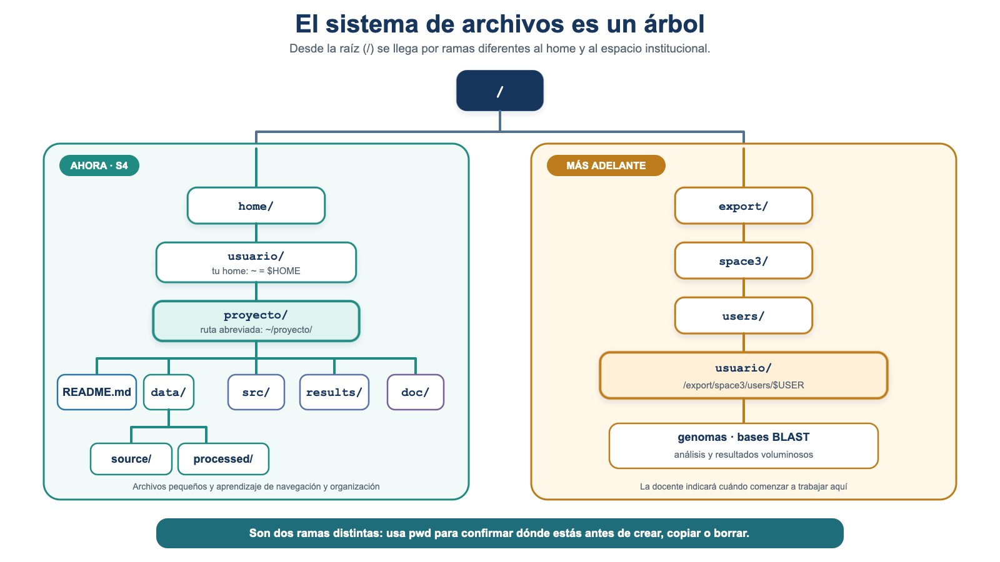
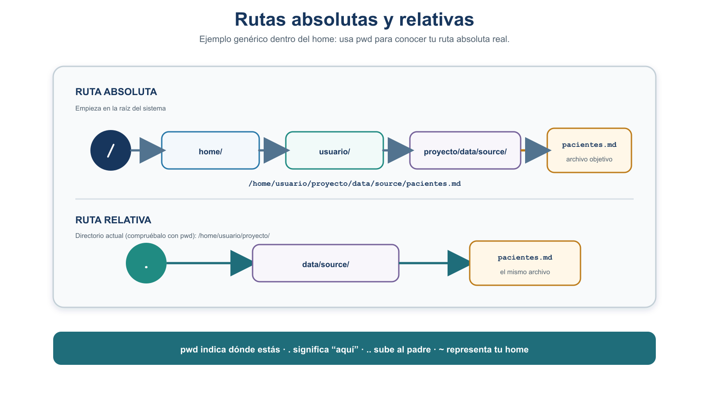
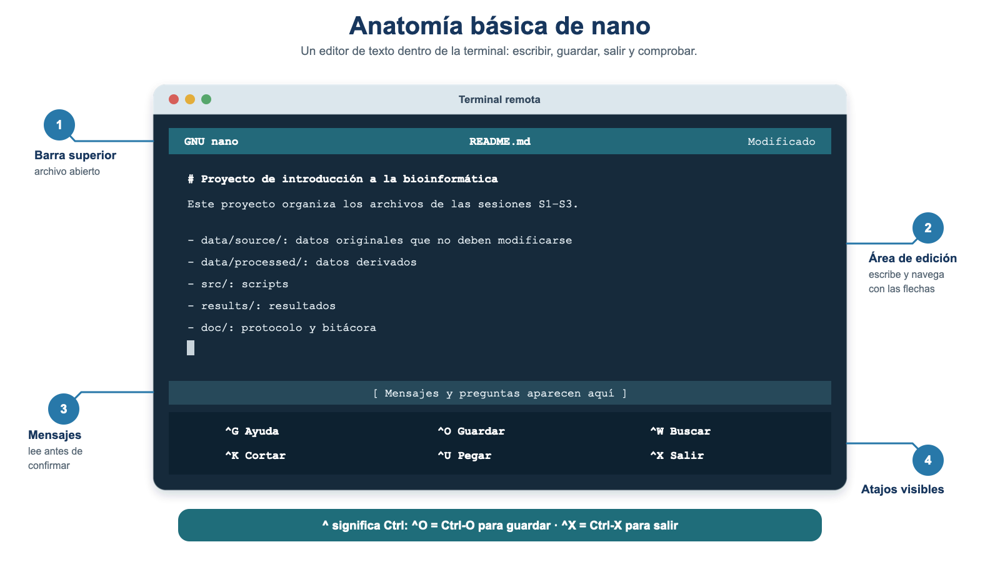

# S4 — Navegar: el sistema de archivos, su organización y su edición

::: {.callout-note}
Este documento se lee **antes de la sesión S4**. En el
taller construiremos en vivo la **estructura real del proyecto** sobre el servidor, con repetición
del estudiante. Trae tu **primer intento** y tus dudas. Al final hay una **práctica (Tarea 3)** con
tres momentos: antes de clase, durante el taller y entrega final.
:::

Segundo módulo de la [Unidad 2](u2-entorno-unix.md). En S3 aprendiste a conectarte por SSH y a
**transferir** tus archivos al servidor comprobando su integridad. Hoy aprenderás a **moverte por el
sistema de archivos** y a **crear y organizar** directorios y archivos para levantar, por primera vez,
la **estructura real del proyecto** en tu espacio del servidor y colocar dentro de ella los archivos
que ya transferiste.

## El problema que resolveremos hoy

::: {.callout-important}
Los archivos que transferiste en S3 (`pacientes.md`,
`pacientes-metadatos.md` y `protocolo.md`) quedaron **juntos en tu *home* (`~`)** del servidor. Tu
tarea de hoy es **crear la estructura que diseñaste en la Unidad 1
(Tarea 2, S2)**, **colocar cada archivo donde corresponde** y **comprobar que los datos originales
no cambiaron** en el proceso.
:::

En la Unidad 1 (S1–S2) hiciste un trabajo que hoy vas a materializar:

- En **S1** iniciaste `protocolo.md` y tu **reporte de lectura** (Tarea 1).
- En **S2** trabajaste `pacientes.md`, sus **metadatos** (`pacientes-metadatos.md`), tu
  `bitacora-ia.md` y el **diseño conceptual** de la organización del proyecto (Tarea 2). Ese diseño
  quedó **en papel**: todavía **no** construiste la estructura con Unix.
- En **S3** transferiste a tu *home* (`~`) del servidor `pacientes.md`, `pacientes-metadatos.md` y
  `protocolo.md`, y comprobaste su integridad con *checksums*.
- En **S4** (hoy) creas por **primera vez** la estructura real en el servidor y colocas dentro de ella
  los archivos ya transferidos.

La estructura final a la que queremos llegar es:

```text
proyecto/
├── README.md
├── data/
│   ├── source/
│   │   ├── pacientes.md
│   │   └── pacientes-metadatos.md
│   └── processed/
├── src/
├── results/
└── doc/
    ├── protocolo.md
    └── bitacora-ia.md
```

::: {.callout-warning}
En S3 solo transferiste tres archivos
(`pacientes.md`, `pacientes-metadatos.md` y `protocolo.md`). Tu `bitacora-ia.md` **todavía vive en tu
computadora**. Para completar la organización tendrás que **transferirlo** al servidor; lo haremos en
el taller como aplicación de `scp` (§9). No supongas que ya está disponible: primero
compruébalo con `ls`.
:::

## Ficha del módulo

| Elemento | Descripción |
| --- | --- |
| **Sesión** | S4 (2 h) |
| **Tema** | Sistema de archivos, navegación, organización del proyecto en el *home* y edición en el servidor |
| **Competencia** | B — Dominio del entorno Unix y del cómputo científico |
| **Resultado (plan)** | Navega el sistema de archivos y opera archivos y directorios; edita en el servidor |
| **Consulta previa (plan)** | Este módulo autocontenido; L3-shell, diapositivas 39–60, queda como consulta complementaria |
| **Lectura base** | Buffalo (2015), Cap. 3 (navegación y manipulación de archivos) |
| **Lectura de consulta** | Shotts (2019), caps. 2–4 (navegación y manipulación de archivos y directorios) |
| **Tarea del plan** | **Tarea 3** — estructura de directorios del proyecto en el servidor |
| **Evidencia** | Estructura reproducible del proyecto en `~/proyecto/`, con los archivos de S2–S3 en su lugar, verificada con `tree`/`ls -R` y con checksum, y `protocolo.md` actualizado |

## Relación con la Unidad 1 y con el proyecto integrador

En la Unidad 1 diseñaste la **organización de un proyecto reproducible** (Noble, 2009). Aquí la
**materializas** en el servidor: creas las carpetas reales donde vivirán tus datos, scripts y
resultados durante todo el curso, y colocas en ellas los archivos que ya produjiste y transferiste.
La estructura que construyas hoy es la que usarás en las Unidades 3 a 6.

## Resultados de aprendizaje

Al terminar S4, el estudiante es capaz de:

1. **Describir** la estructura en árbol del sistema de archivos y el papel de `/`, `~` y el directorio
   actual, y **distinguir** el *home* del **espacio institucional** `/export/space3/users/$USER`.
2. **Distinguir** rutas absolutas y relativas y **usar** `.`, `..` y `~`, entendiendo que una ruta
   relativa **parte del directorio actual**.
3. **Navegar** entre directorios con `pwd`, `ls` y `cd` usando ambos tipos de ruta, tras **comprobar el
   contexto** con `hostname`, `whoami` y `pwd`.
4. **Crear y organizar** archivos y directorios (`mkdir`, `mkdir -p`, `touch`, `cp -i`,
   `mv -i`) y **eliminar de forma segura** (`rm -i`, `rmdir`) dentro de una carpeta de prueba.
5. **Construir** directamente `~/proyecto/` con la estructura canónica y **colocar** en ella los
   archivos transferidos en S3.
6. **Verificar** la estructura con `tree` o `ls -R` y **comprobar la integridad** de `pacientes.md`
   comparando su *checksum* con el registrado en S3.
7. **Transferir** con `scp` un archivo faltante (`bitacora-ia.md`) desde el equipo local directamente
   a `~/proyecto/doc/`; **reconocer** `rsync` como herramienta de consulta para transferencias grandes.
8. **Editar** en el servidor con `nano` para completar `README.md` y **actualizar** `doc/protocolo.md`.

## Antes de la sesión

| Elemento | Detalle |
| --- | --- |
| **Lectura obligatoria** | Este módulo completo; contiene la preparación conceptual necesaria para llegar al taller. |
| **Consulta dirigida** | Buffalo (2015), Cap. 3 — apartados de navegación y manipulación de archivos (~20 min). |
| **Lectura de consulta** | L3-shell, diapositivas 39–60, y Shotts (2019), caps. 2–4 (opcionales para profundizar). |
| **Preparación técnica** | Conéctate al servidor (habilidad de S3). Ten a la vista el diseño de la estructura del proyecto de la Unidad 1 y tu `protocolo.md` (con el checksum de `pacientes.md` que registraste en S3). Localiza en tu computadora `bitacora-ia.md`. |
| **Primer intento** | Ver la Práctica S4 → *Antes de clase*. |
| **Producto para el taller** | Tu primer intento (comandos, errores y dudas) y la ubicación de `bitacora-ia.md` en tu equipo. |

::: {.callout-note}
Los tiempos son estimaciones: lectura del módulo ~60–75 min · consulta dirigida de Buffalo
Cap. 3 ~20 min · Shotts ~20 min opcional · primer intento ~25 min · taller presencial 120 min ·
corrección y entrega posterior ~30 min · actividad formativa de IA ~25 min.
:::

::: {.callout-note}
Igual que en S3, los bloques de las prácticas indican **desde dónde** se
ejecutan: `[LOCAL]` en tu computadora y `[REMOTO]` dentro del servidor. Los bloques conceptuales
muestran sintaxis general. Antes de cualquier operación,
comprueba el contexto con `hostname`, `whoami` y `pwd`. `scp` (§9) **se lanza desde tu computadora**
(`[LOCAL]`), aunque copie hacia el servidor.
:::

---

### Bitácora interactiva de S4

Durante esta sesión trabajarás con **tres espacios que se complementan**:

1. **Esta guía**, donde encontrarás los conceptos, instrucciones y retos.
2. **La terminal Unix**, donde ejecutarás y comprobarás los comandos reales.
3. **La bitácora interactiva**, donde podrás predecir resultados, comprobar
   tu razonamiento, corregir errores y registrar evidencias.

> **Importante:** no debes completar toda la bitácora ahora.
> La irás utilizando a medida que avances por las secciones de S4.

Mantén la bitácora abierta durante la sesión:

[Abrir Bitácora Interactiva S4 en ventana completa](html/u2-s4-sistema-archivos.html)

<iframe
  src="html/u2-s4-sistema-archivos.html"
  title="Bitácora interactiva — Sesión 4"
  style="width:100%;min-height:860px;border:1px solid #d7cdc7;border-radius:12px;background:#fff;"
  loading="lazy"></iframe>

---

## 1. La estructura en árbol, la raíz y tu espacio de trabajo

En Unix, archivos y directorios (carpetas) se organizan en una **jerarquía en forma de árbol** que
empieza en la **raíz**, representada por `/`. De la raíz cuelgan directorios que, a su vez, contienen
otros directorios y archivos.



**Figura 1.** El *home* y el espacio institucional son ramas distintas. En S4 trabajamos en
`~/proyecto/`; el espacio `/export/space3/users/$USER` se utilizará más adelante para descargas y
análisis de mayor tamaño. Elaboración propia.

Conceptos clave:

- **Directorio raíz `/`:** el origen de todo el árbol.
- **Directorio *home* (`~`):** tu carpeta personal, aquella donde el sistema te sitúa al iniciar sesión
  y donde puedes mantener documentos, scripts y ejercicios pequeños. El símbolo `~` es un atajo que
  representa esa carpeta.
- **Directorio actual:** el lugar donde "estás parado" en este momento (lo consultas con `pwd`).
- **Ruta (*path*):** la dirección de un archivo o directorio dentro del árbol.

::: {.callout-important}
El *home* (`~`) y el espacio institucional
`/export/space3/users/$USER` son **directorios distintos**. En esta sesión construiremos
`~/proyecto/` en el *home* porque trabajaremos con archivos pequeños y el objetivo es aprender rutas,
navegación y organización sin mezclar todavía los espacios. Más adelante, cuando descarguemos
genomas o ejecutemos análisis que producen archivos grandes —por ejemplo BLAST—, trabajaremos en el
espacio institucional, que está destinado a cargas de datos y cómputo mayores. No copies datos
grandes al *home*.
:::

::: {.callout-tip}
Ejecuta `echo $HOME` y luego `pwd` después de `cd ~` para conocer la ruta absoluta de tu
*home*. Después ejecuta `ls -ld /export/space3/users/$USER` para reconocer el espacio institucional.
Comprobarás que son ubicaciones diferentes.
:::

## 2. Rutas absolutas y relativas

Una **ruta** es la dirección que le das a un comando para que encuentre un archivo o directorio. Hay
dos formas de escribirla:

- **Ruta absoluta:** parte desde la raíz `/` y **siempre apunta al mismo lugar**, sin importar dónde
  estés. Ejemplo:
  `/home/usuario/proyecto/data/source/pacientes.md` en un sistema genérico. En el servidor del curso,
  descubre el prefijo real de tu *home* con `cd ~` y `pwd`.
- **Ruta relativa:** parte **desde tu directorio actual** (no desde `~`). Ejemplo: si estás en
  `.../proyecto`, la ruta relativa `data/source/pacientes.md` apunta al mismo archivo.

Símbolos útiles en las rutas:

- `.` : el directorio actual.
- `..` : el directorio padre (uno hacia arriba).
- `~` : tu directorio *home*.



**Figura 2.** El mismo archivo, dos rutas: la absoluta parte de `/`; la relativa parte del directorio
actual (aquí, `proyecto/`). Elaboración propia.

::: {.callout-important}
Una ruta **relativa** empieza en tu **directorio actual**, no necesariamente en tu
*home* (`~`). Si te confundes de punto de partida, terminarás creando o buscando carpetas donde no
querías. Ante la duda, ejecuta `pwd` para saber desde dónde parte tu ruta relativa.
:::

::: {.callout-tip title="¿Sabías que?"}
Una misma ubicación se puede alcanzar por **muchos caminos**. Desde
`.../proyecto/doc` puedes llegar a `pacientes.md` con la ruta relativa `../data/source/pacientes.md`
(subes con `..` y bajas por `data/source`). Comprobar que dos caminos distintos llevan al mismo sitio
es una forma sencilla de **robustez** (§11).
:::


### 🧩 Micropráctica 1 — Muévete por el árbol: construye rutas

Ahora que conoces la estructura en árbol y la diferencia entre rutas absolutas y
relativas, abre la pestaña **1. Árbol y Rutas** de la bitácora interactiva.

En esta micropráctica trabajarás con un árbol basado en la estructura de S4.
En cada reto tendrás que **ubicarte primero** y razonar cómo llegar a un destino.

Trabajarás progresivamente con:

- tu ubicación actual dentro del árbol;
- subir uno o varios niveles;
- cambiar de una rama a otra;
- rutas absolutas y relativas;
- rutas que pueden llevar al mismo destino;
- detección y corrección de una ruta equivocada.

> **Primero piensa, después comprueba.**
> En esta micropráctica todavía no necesitas ejecutar los recorridos en la
> terminal. El objetivo es construir mentalmente el camino antes de usar `cd`
> en Unix.

Realiza los **Retos A–F** en la pestaña **1. Árbol y Rutas**.

Cuando termines, continúa con la guía. En la siguiente etapa comprobarás algunas
de estas ideas en la terminal real.


## 3. Navegar: `pwd`, `ls`, `cd`

Antes de crear nada, hay que saber orientarse. Estos son los comandos **esenciales** de navegación:

```bash
pwd                 # muestra dónde estás (ruta absoluta actual)
ls                  # lista el contenido del directorio actual
ls -lah             # lista con detalle (l), incluye ocultos (a) y tamaños legibles (h)
cd carpeta          # entra a "carpeta" (ruta relativa)
cd /ruta/absoluta   # entra usando una ruta absoluta
cd ..               # sube al directorio padre
cd ~                # va a tu home
cd -                # regresa al directorio anterior
```

::: {.callout-tip}
Combina la tecla **Tab** para autocompletar nombres de rutas y evitar errores de tipeo;
`ls -lh` muestra los tamaños en formato legible (KB, MB, GB) y `cd -` te devuelve al directorio donde
estabas antes.
:::

### 💻 Micropráctica 2 — ¿Dónde estoy? Comprueba el contexto

Ya razonaste sobre el árbol y las rutas. Ahora vas a comprobar algunas de esas
ideas en el **servidor real**.

En esta micropráctica trabajarás principalmente en la terminal. Usa la pestaña
**2. Comprueba Unix** de la bitácora para registrar lo que observes.

#### 1. Confirma tu contexto

Ejecuta:

```bash
hostname
whoami
cd ~
pwd
ls -lah
```

Antes de continuar, asegúrate de poder responder:

- ¿en qué máquina estás?;
- ¿con qué usuario entraste?;
- ¿cuál es tu directorio *home*?;
- ¿qué archivos de S3 encuentras allí?

> 🧩 **En la bitácora:** registra la evidencia que te pide la pestaña
> **2. Comprueba Unix**. No necesitas copiar nuevamente todos los comandos.

#### 2. Compara tu *home* con el espacio institucional

Ahora observa:

```bash
ls -ld /export/space3/users/$USER
```

Compara esa ubicación con la salida que obtuviste mediante:

```bash
pwd
```

No asumas que dos rutas diferentes representan necesariamente lugares
diferentes. Observa la evidencia que te devuelve el sistema.

#### 3. Comprueba un cambio de ubicación

Ahora experimenta:

```bash
cd ..
pwd
cd -
pwd
```

Antes de cada `pwd`, intenta predecir dónde estarás.

Compara después tu predicción con la salida real.

> **Conecta con la Micropráctica 1:** allí razonaste visualmente qué significa
> cambiar de nivel en el árbol. Aquí Unix te muestra la ubicación real después
> del movimiento.

#### 4. Registra lo que descubriste

Vuelve a la pestaña **2. Comprueba Unix** de la bitácora.

Registra únicamente la evidencia solicitada y compara lo que esperabas con lo
que observaste.

Si algo no coincide, no lo borres simplemente: úsalo para identificar qué parte
de tu modelo mental necesitas corregir.

> **Idea clave:** `pwd` te permite comprobar dónde estás realmente. Una ruta
> relativa se interpretará a partir de esa ubicación.


## 4. Crear directorios y archivos

Estas son las operaciones **esenciales** para construir la estructura:

```bash
mkdir nueva            # crea el directorio "nueva"
mkdir -p a/b/c         # crea toda la ruta anidada de una vez
touch archivo.txt      # crea un archivo vacío (o actualiza su fecha)
```

- `mkdir` crea **un** directorio; falla si el directorio padre no existe.
- `mkdir -p` crea **directorios anidados** en un solo paso (útil para `data/source`).
- `touch` crea un archivo vacío; lo usaremos, por ejemplo, para dejar preparado `README.md` antes de
  editarlo.

## 5. Copiar, mover y renombrar de forma segura

Para **colocar** los archivos en su lugar usarás copia y movimiento. Presentamos **primero las
variantes seguras**, con confirmación:

```bash
cp -i origen destino     # copia; pregunta antes de sobrescribir el destino
cp -r carpeta destino    # consulta: copia una carpeta y su contenido
mv -i origen destino     # mueve o renombra; pregunta antes de sobrescribir
```

- `cp -i` **copia** y **pide confirmación** si el destino ya existe.
- `mv -i` **mueve** o **renombra**: si el destino es otra carpeta, mueve; si es un nombre nuevo en el
  mismo lugar, renombra. Con `-i` te avisa antes de sobrescribir.
- Las versiones **sin `-i`** (`cp`, `mv`) hacen lo mismo pero **sin preguntar**.

::: {.callout-warning}
`cp` y `mv` pueden sobrescribir. Si el destino ya existe, `cp` y `mv` **sin `-i`**
lo **reemplazan sin avisar** y el contenido anterior se pierde. Mientras te acostumbras, usa siempre
`cp -i` y `mv -i`. En este módulo **copiamos antes de mover**: conservamos una copia provisional
hasta terminar de verificar (§8).
:::

### Micropráctica 3 — Copiar, mover y renombrar con seguridad

Ahora practicarás operaciones sobre archivos en una carpeta creada exclusivamente para experimentar.

El objetivo no es memorizar comandos, sino **observar qué cambia** cuando copias un archivo, cambias su nombre o lo mueves a otra carpeta.

::: {.callout-note title="Trabaja en tu espacio de prueba"}
Realiza esta micropráctica únicamente dentro de `prueba-s4/`.

Antes de modificar archivos, usa `pwd` para comprobar dónde estás.
:::

#### 1. Prepara tu espacio de prueba

En la terminal real ejecuta:

```bash
mkdir -p prueba-s4
cd prueba-s4
pwd
touch a.txt
ls
```

Comprueba que:

- estás dentro de `prueba-s4/`;
- existe el archivo `a.txt`.

#### 2. Copia un archivo

Ejecuta:

```bash
cp -i a.txt b.txt
ls
```

Observa el resultado y pregúntate:

- ¿sigue existiendo `a.txt`?;
- ¿apareció `b.txt`?;
- ¿qué cambió después de ejecutar `cp`?

::: {.callout-tip title="Observa, no memorices"}
Fíjate en el estado de la carpeta **antes y después** del comando.

Al copiar, el archivo original permanece y aparece una copia en el destino.
:::

#### 3. Antes de usar `mv`, predice

Ahora trabajarás con `mv`.

Primero analiza estas dos operaciones:

```bash
mv -i b.txt c.txt
```

```bash
mv -i c.txt sub/
```

::: {.callout-note title="🧩 Antes de ejecutar `mv`"}
Abre la pestaña **3. Organiza con cuidado** de la bitácora interactiva.

Para cada operación, decide qué esperas que cambie:

- el nombre;
- la ubicación;
- o si necesitas revisar mejor el origen y el destino.

**No ejecutes todavía los comandos. Primero haz tu predicción.**
:::


#### 4. Comprueba la primera predicción

Regresa a la terminal y ejecuta:

```bash
mv -i b.txt c.txt
ls
```

Observa el resultado.

Compara lo ocurrido con tu predicción:

- ¿sigue existiendo `b.txt`?;
- ¿apareció `c.txt`?;
- ¿el archivo cambió de carpeta?

Si el resultado fue distinto de lo que esperabas, vuelve a la bitácora y corrige tu decisión a partir de la evidencia.

#### 5. Ahora cambia un archivo de ubicación

Primero crea una subcarpeta:

```bash
mkdir sub
ls
```

Ahora ejecuta:

```bash
mv -i c.txt sub/
ls -R
```

Observa dónde quedó `c.txt`.

Vuelve a la pestaña **3. Organiza con cuidado** y compara el resultado con tu segunda predicción.

::: {.callout-tip title="¿Qué hizo realmente `mv`?"}
Compara las dos operaciones:

```text
b.txt → c.txt
```

y:

```text
c.txt → sub/
```

En la primera, el archivo permaneció en la misma carpeta pero cambió de **nombre**.

En la segunda, conservó su nombre pero cambió de **ubicación**.

Para interpretar `mv`, observa siempre el **origen** y el **destino**.
:::

#### 6. Comprueba el estado final

Ejecuta:

```bash
pwd
ls -R
```

Tu espacio de prueba debe contener ahora una estructura equivalente a:

```text
prueba-s4/
├── a.txt
└── sub/
    └── c.txt
```

No necesitas copiar esta salida como evidencia si ya la observaste en la terminal.

Lo importante es que puedas explicar **qué operación produjo cada cambio**.

::: {.callout-note title="Antes de continuar"}
**No borres todavía `sub/` ni `c.txt`.**

Conserva `prueba-s4/` tal como quedó.

En la siguiente micropráctica utilizaremos esta misma estructura para investigar qué ocurre cuando intentas eliminar una carpeta que todavía contiene un archivo.
:::

## 6. Eliminar de forma segura

En Unix **no hay papelera**: `rm` borra de forma **permanente e inmediata**. Por eso, la eliminación se
practica con cuidado y **solo dentro de la carpeta de prueba**.

```bash
rm -i archivo          # borra un archivo, pidiendo confirmación
rmdir carpeta          # borra un directorio VACÍO (falla si tiene contenido)
```

::: {.callout-warning}
Antes de ejecutar cualquier `rm`, comprueba **dónde
estás** y **qué hay** con `pwd` y `ls`. Borra solo dentro de `prueba-s4/`. En la **Tarea 3
obligatoria no se borra ningún archivo del proyecto**: eliminar es una habilidad que se practica
aparte, en la carpeta de prueba.
:::

::: {.callout-note}
Existe la opción `rm -r`, que borra un directorio **y todo su contenido**.
Es potente y peligrosa: un error de ruta puede eliminar mucho más de lo que querías. En este módulo
**no** la usamos en la práctica obligatoria, y **no** conviene adoptar `rm -ri` como hábito rutinario:
la costumbre de confirmar "sí" a todo anula la protección. Para vaciar una carpeta de prueba, borra
primero sus archivos con `rm -i` y luego el directorio vacío con `rmdir`.
:::

### Micropráctica 4 — Eliminar con seguridad

En la micropráctica anterior dejaste un espacio de prueba como este:

```text
prueba-s4/
├── a.txt
└── sub/
    └── c.txt
```

Ahora lo utilizarás para aprender una rutina importante: **antes de borrar, comprueba dónde estás y qué existe allí**.

::: {.callout-note title="Trabaja únicamente en `prueba-s4/`"}
En esta micropráctica eliminarás archivos y carpetas reales, pero solo dentro del espacio creado para experimentar.

No borres archivos de `~/proyecto/`.
:::

#### 1. Antes de borrar, comprueba

Entra a tu espacio de prueba y ejecuta:

```bash
cd ~/prueba-s4
pwd
ls -R
```

Antes de continuar, observa las salidas.

Pregúntate:

- ¿estoy realmente dentro de `prueba-s4/`?;
- ¿qué archivos existen?;
- ¿qué contiene `sub/`?

::: {.callout-tip title="Una rutina antes de borrar"}
Antes de usar un comando de eliminación, acostúmbrate a comprobar:

**¿Dónde estoy? → ¿Qué existe aquí? → ¿Qué quiero borrar? → entonces ejecuto.**

`pwd` y `ls` te ayudan a responder las primeras preguntas.
:::

#### 2. Predice antes de usar `rmdir`

Observa nuevamente:

```text
prueba-s4/
├── a.txt
└── sub/
    └── c.txt
```

La carpeta `sub/` todavía contiene `c.txt`.

¿Qué crees que ocurrirá si intentas:

```bash
rmdir sub
```

::: {.callout-note title="🧩 Primero haz tu predicción"}
Antes de ejecutar el comando, abre la pestaña **3. Organiza con cuidado** de la bitácora interactiva.

Busca la actividad de eliminación segura y registra tu predicción.

**Todavía no ejecutes `rmdir sub`.**
:::

#### 3. Comprueba tu predicción en Unix

Ahora sí, vuelve a la terminal y ejecuta:

```bash
rmdir sub
```

Observa cuidadosamente el mensaje que devuelve Unix.

No te preocupes si el comando no hace lo que esperabas. En esta carpeta de prueba, ese resultado forma parte del experimento.

Comprueba nuevamente:

```bash
ls -R
```

¿Sigue existiendo `sub/`?

¿Sigue allí `c.txt`?

Vuelve a la bitácora y compara el resultado real con tu predicción.

Si no coincidieron, corrige tu respuesta usando la evidencia que acabas de obtener.

::: {.callout-tip title="¿Qué descubriste sobre `rmdir`?"}
No memorices únicamente “funcionó” o “falló”.

Relaciona el resultado con lo que observaste antes:

**¿la carpeta estaba vacía o todavía contenía algo?**
:::

#### 4. Elimina primero el archivo

Ahora elimina el archivo que está dentro de `sub/`:

```bash
rm -i sub/c.txt
```

Lee la pregunta que muestra `rm -i` antes de confirmar.

Después comprueba:

```bash
ls -R
```

Observa qué cambió.

La carpeta `sub/` debe seguir existiendo, pero ahora ya no contiene `c.txt`.

#### 5. Intenta nuevamente con `rmdir`

Ahora ejecuta:

```bash
rmdir sub
ls -R
```

Compara este resultado con el primer intento.

Pregúntate:

- ¿qué era diferente la primera vez?;
- ¿qué cambió antes del segundo intento?;
- ¿por qué ahora el resultado fue distinto?

::: {.callout-tip title="Relaciona los dos intentos"}
En el primer intento, `sub/` todavía contenía `c.txt`.

Después eliminaste el archivo y volviste a intentar la misma operación.

La comparación entre ambos resultados te permite entender qué condición necesita `rmdir` para eliminar una carpeta.
:::

#### 6. Termina la limpieza

Todavía queda `a.txt`.

Elimínalo de forma interactiva:

```bash
rm -i a.txt
```

Comprueba el resultado:

```bash
ls -la
```

Después sal de la carpeta:

```bash
cd ..
```

No necesitas eliminar `prueba-s4/` todavía si la guía la utilizará posteriormente.

::: {.callout-note title="🧩 Registra lo que observaste"}
Vuelve a la pestaña **3. Organiza con cuidado** de la bitácora.

Registra el resultado del experimento y, si tu predicción inicial fue incorrecta, conserva también la corrección.

No necesitamos registrar cada comando: interesa especialmente **qué esperabas, qué ocurrió y qué aprendiste al comparar ambos intentos**.
:::

#### 7. Antes de borrar en el proyecto real

Hasta ahora trabajaste en una carpeta creada para experimentar.

Cuando trabajes posteriormente con archivos de `~/proyecto/`, no debes asumir que una operación de eliminación es segura solo porque conoces el comando.

::: {.callout-tip title="Rutina de seguridad"}
Antes de borrar un archivo o una carpeta:

1. comprueba dónde estás con `pwd`;
2. observa qué existe con `ls`;
3. identifica exactamente qué quieres eliminar;
4. revisa nuevamente el nombre y la ruta;
5. solo entonces ejecuta el comando.

En esta etapa del curso, **no uses `rm -r` o `rm -ri` como rutina**.
:::

## 7. Ver el árbol: `tree` o `ls -R`

Para comprobar que tu estructura quedó como esperabas:

```bash
tree              # muestra el árbol de directorios (si está instalado)
ls -R             # lista recursivamente el contenido (alternativa siempre disponible)
```

Si `tree` no está disponible en el servidor, `ls -R` cumple la misma función de verificación.

::: {.callout-note}
`tree` puede no estar instalado. `ls -R`, disponible habitualmente en sistemas Unix,
presenta la información en otro formato pero permite comprobar los mismos directorios y archivos.
:::

## 8. La estructura canónica del proyecto

Usaremos **la misma** estructura de la Unidad 1 (Noble, 2009), sin variaciones:

```text
proyecto/
├── README.md          # descripción del proyecto
├── data/
│   ├── source/        # datos originales, inmutables
│   └── processed/     # datos derivados
├── src/               # scripts
├── results/           # resultados del análisis
└── doc/               # documentación (protocolo, bitácora)
```

::: {.callout-important}
Los datos originales se conservan en `data/source/`
**sin modificarse**: se leen y se copian, pero no se editan. Cualquier transformación produce
archivos nuevos que van a `data/processed/`, nunca encima del original. Conservar el original con su
nombre y su *checksum* preserva la **procedencia** y la trazabilidad de tu análisis (Noble, 2009;
Buffalo, 2015, Cap. 3).
:::

### En S4 la construiremos directamente

Para comprender qué contiene cada rama, en esta sesión crearás `~/proyecto/` **paso a paso**. No
partirás de una plantilla ni ejecutarás un comando que oculte la estructura completa: primero crearás
el directorio principal y después cada rama. Esta secuencia permite detectar dónde estás, qué ruta
estás construyendo y por qué cada archivo tiene un destino específico.

::: {.callout-note}
Cuando ya domines la estructura podrás conservar un esqueleto vacío como plantilla para
proyectos futuros. Esa automatización es una ampliación; no forma parte obligatoria de la Tarea 3.
:::

## 9. Transferir el archivo que falta con `scp`

Como viste en el problema conductor, `bitacora-ia.md` **no** se transfirió en S3: sigue en tu
computadora. En S3 usaste SFTP/FileZilla de forma interactiva; ahora aplicamos `scp`, una herramienta
de **línea de comandos** anunciada en S3. Se lanza desde tu computadora (`[LOCAL]`), no desde el
servidor.

```bash
# [LOCAL] Sustituye "usuario" por tu cuenta remota:
scp bitacora-ia.md usuario@servidor:/ruta/absoluta/de/tu/home/proyecto/doc/
```

- `scp origen usuario@servidor:destino` copia un archivo en **una sola orden**.
- El `:` separa la máquina remota de la **ruta de destino**; fíjate bien en los dos puntos.
- La ruta después de `:` debe ser la ruta absoluta que obtuviste con `pwd` dentro de tu *home*. No
  escribas `$USER` en un comando local: podría expandirse al usuario de tu computadora y no al remoto.

::: {.callout-important}
`scp` se ejecuta **desde tu computadora**, con el servidor como destino tras el `:`.
Comprueba con `hostname` que estás en `[LOCAL]` antes de lanzarlo.
No compartas tu contraseña, llaves ni la dirección real del servidor en registros o capturas.
:::

::: {.callout-note}
En S4, `scp` es una aplicación puntual para completar la organización. `rsync -avP` queda
como herramienta de consulta para sincronizar muchos archivos o reanudar transferencias parciales;
se retomará con datos mayores en unidades posteriores.
:::

## 10. Editar en el servidor con `nano`

En un servidor remoto normalmente editamos archivos de texto desde la terminal. Dos familias de
editores que encontrarás con frecuencia son `vi`/`vim` y `nano`:

| Editor | Forma de trabajo | Ventaja principal | Decisión en S4 |
| --- | --- | --- | --- |
| `vi` o `vim` | **Modal**: las teclas hacen cosas distintas en modo normal, inserción o comandos | Es potente, rápido y suele estar disponible en sistemas Unix | Solo reconocerlo y saber salir si se abre por accidente |
| `nano` | **Directa**: al abrirlo puedes comenzar a escribir; muestra atajos en pantalla | Tiene una curva de entrada corta y permite concentrarse en el contenido | Es el editor que usaremos para `README.md` y `protocolo.md` |

Elegimos `nano` por su simplicidad para esta primera edición remota, no porque `vi` sea inferior. Más
adelante podrás aprender otro editor; los archivos producidos siguen siendo texto plano y pueden
abrirse con cualquiera de ellos.

::: {.callout-important}
Edita documentación y scripts, pero no modifiques los datos originales de
`data/source/`. En S4 usarás `nano` con `README.md` y `doc/protocolo.md`.
:::

### Anatomía básica de `nano`



**Figura 3.** Partes esenciales de `nano`. Los textos exactos pueden cambiar según la versión y el idioma
del servidor, pero la lógica de los atajos es la misma. Elaboración propia.

La pantalla tiene cuatro zonas importantes:

1. **Barra superior:** muestra el programa y el nombre del archivo abierto.
2. **Área de edición:** aquí escribes y te desplazas con las flechas.
3. **Línea de mensajes:** muestra avisos y solicitudes, por ejemplo confirmar el nombre al guardar.
4. **Atajos inferiores:** recuerdan las acciones disponibles. El símbolo `^` significa `Ctrl`; por
   ejemplo, `^O` significa `Ctrl-O`, no escribir los caracteres `^` y `O`.

### Ciclo básico: abrir, editar, guardar, verificar

Antes de abrir un archivo, confirma el contexto y usa una ruta explícita:

```bash
hostname
cd ~/proyecto
pwd
nano README.md         # abre el archivo; si no existe, nano puede crearlo al guardar
```

Dentro de `nano`:

- **escribir y desplazarte:** escribe normalmente y usa las flechas;
- **buscar texto:** `Ctrl-W`, escribe el término y pulsa Enter;
- **cortar una línea:** `Ctrl-K`;
- **pegar lo cortado:** `Ctrl-U`;
- **guardar** (*Write Out*): `Ctrl-O`, revisa el nombre mostrado y pulsa Enter;
- **salir:** `Ctrl-X`. Si hay cambios sin guardar, `nano` preguntará si deseas conservarlos.

Ya en la terminal, verifica que el cambio realmente quedó guardado:

```bash
ls -l README.md
cat README.md
```

::: {.callout-warning}
`Ctrl-S` no es el atajo de guardado de `nano` y en algunas terminales puede pausar
la salida en pantalla. Si parece que la terminal quedó congelada después de pulsarlo, prueba
`Ctrl-Q`. Para guardar en `nano` usa `Ctrl-O`.
:::

### Micropráctica 5 — Editar y comprobar `README.md`

**[REMOTO] En el servidor:**

Ahora vas a editar un archivo que **sí forma parte de tu proyecto real**.

Trabajarás con:

```text
~/proyecto/README.md
```

El objetivo no es memorizar los atajos de `nano`, sino completar y comprobar este ciclo:

**ABRIR → EDITAR → GUARDAR → SALIR → COMPROBAR**

::: {.callout-note title="Trabaja en tu proyecto real"}
A diferencia de las prácticas de eliminación, aquí **sí trabajarás dentro de `~/proyecto/`**.

Editarás únicamente documentación: `README.md`.

Los archivos originales de `data/source/` **no se modifican**.
:::

#### 1. Confirma dónde estás

En el servidor ejecuta:

```bash
cd ~/proyecto
pwd
ls -l README.md
```

Antes de editar, comprueba que estás en `~/proyecto/` y que `README.md` existe.

#### 2. Edita `README.md`

Abre el archivo:

```bash
nano README.md
```

Escribe un contenido mínimo con un título, una descripción y el propósito de cada directorio:

```markdown
# Proyecto de introducción a la bioinformática

Este proyecto organiza los archivos iniciados en las sesiones S1–S3.

- data/source/: datos originales que no deben modificarse
- data/processed/: datos derivados
- src/: scripts
- results/: resultados
- doc/: protocolo y bitácora
```

Ahora busca la palabra `source` con:

```text
Ctrl-W
```

#### 3. Guarda y sal

Guarda con:

```text
Ctrl-O
```

Revisa que el nombre mostrado sea:

```text
README.md
```

Confirma con `Enter`.

Después sal con:

```text
Ctrl-X
```

::: {.callout-tip title="Guardar y salir no son lo mismo"}
Observa las dos acciones por separado.

Primero **guardas** los cambios en el archivo.

Después **sales** del editor.

Enseguida comprobarás desde Unix si el contenido realmente quedó guardado.
:::

#### 4. Comprueba fuera del editor

Ya en la terminal ejecuta:

```bash
ls -l README.md
cat README.md
```

No te limites a comprobar que el archivo existe.

Observa si `cat README.md` muestra realmente el contenido que acabas de escribir.

Después vuelve a abrirlo:

```bash
nano README.md
```

Comprueba que el contenido sigue allí y sal con `Ctrl-X` sin hacer cambios.

::: {.callout-note title="🧩 Registra tu comprobación"}
Vuelve a la bitácora interactiva y registra la evidencia solicitada sobre la edición.

No necesitas copiar todos los comandos.

Interesa especialmente distinguir:

**qué hiciste → cómo lo comprobaste → qué evidencia demuestra que el cambio permaneció.**
:::

#### 5. Explica lo que acabas de hacer

A partir de tu propia experiencia, responde en la bitácora:

1. ¿Qué diferencia observaste entre **guardar** y **salir**?
2. ¿Cómo comprobaste, fuera de `nano`, que `README.md` quedó guardado?
3. `pacientes.md` está en `data/source/`. ¿Por qué no deberías abrirlo con `nano` para modificar sus datos?

::: {.callout-tip title="Piensa en la evidencia"}
No basta con decir *“porque lo guardé”*.

Busca qué observación independiente te permite demostrar que el contenido permaneció después de cerrar el editor.
:::

#### 6. Conecta con la Tarea 3

Acabas de practicar el ciclo completo de edición y comprobación con el `README.md` real del proyecto.

En la **Tarea 3** usarás la misma forma de trabajo para actualizar:

```text
~/proyecto/doc/protocolo.md
```

Después de editarlo, también deberás comprobar desde la terminal que los cambios quedaron guardados.


## Clasificación de los comandos de S4

| Categoría | Comandos | Para qué |
| --- | --- | --- |
| **Esenciales** | `pwd`, `ls`, `cd`, `mkdir`, `mkdir -p`, `touch`, `cp -i`, `mv -i`, `tree`/`ls -R`, `nano` | Navegar, crear y organizar la estructura, editar en el servidor |
| **Seguridad** | `cp -i`, `mv -i`, `rm -i`, `rmdir`, `hostname`, `whoami`, `pwd` (antes de operar) | Evitar sobrescrituras y borrados accidentales; confirmar el contexto |
| **Aplicación** | `scp` | Transferir `bitacora-ia.md` desde el equipo local directamente a `~/proyecto/doc/` |
| **Consulta/ampliación** | `man`, `vi` (solo salir), `cp -r`, `rsync -avP` | Resolver dudas; reconocer herramientas que se retomarán después |

---

## Práctica S4 — Estructura de directorios del proyecto (Tarea 3)

::: {.callout-important}
Primero construyes y organizas la estructura **tú**, paso a
paso. Después la comparas con una propuesta de IA en la **Actividad formativa de IA** (§ siguiente).
Tu trabajo manual es la **línea base de comparación, no una verdad absoluta**: tanto tu solución como
la de la IA se contrastan con la lección, con `man` y con una prueba controlada.
:::

Conserva la numeración oficial: esta es la **Tarea 3** del plan.

### Antes de clase (primer intento) — *formativo*

Trabaja en tu espacio del servidor. Registra **todo** (comandos, errores y dudas) para llevarlo al
taller.

1. **Revisa** la estructura que diseñaste en S2 (Tarea 2) y tenla a la vista.
2. **Identifica** los archivos que produjiste o transferiste antes: `pacientes.md`,
   `pacientes-metadatos.md`, `protocolo.md` (ya en el servidor) y `bitacora-ia.md` (aún en tu
   computadora).
3. **Decide** en qué directorio debe vivir cada archivo (según la estructura canónica de §8).
4. **Intenta**, dentro de tu *home*, crear `proyecto-intento/` y al menos la rama
   `proyecto-intento/data/source/`. Usa ese nombre para que el primer intento no interfiera con el
   `proyecto/` definitivo que construirás durante el taller.
5. **Registra** los comandos que usaste, los errores que aparecieron y tus dudas.

::: {.callout-note}
El primer intento es **formativo**: da puntos por
**preparación**, no por acierto. Los errores razonables **no se penalizan**; su valor es llegar al
taller con preguntas concretas.
:::

### Durante el taller — *formativo (participación y corrección)*

Con repetición guiada y comprobando el contexto en cada paso. La teoría se estudió antes; el tiempo
presencial se dedica a **ejecutar, diagnosticar, comparar y corregir** el primer intento.

1. **Confirma** que estás en el servidor (`hostname`, `whoami`), entra a tu *home* con `cd ~` y registra
   su ruta absoluta con `pwd`. No trabajes en `/export/space3/users/$USER` durante esta sesión.
2. **Localiza** en el *home* los archivos transferidos en S3 (`pacientes.md`,
   `pacientes-metadatos.md` y `protocolo.md`) y confirma que `bitacora-ia.md` aún no está allí.
3. **Revisa y corrige** `proyecto-intento/`. Compara su árbol con la estructura esperada y anota qué
   faltó o quedó mal anidado.
4. **Crea directamente** el proyecto definitivo dentro del *home*. Antes, ejecuta `ls -ld proyecto`:
   si ya existe, detente, inspecciónalo con `ls -R proyecto` y corrige el intento con ayuda de la
   docente. No crees un proyecto dentro de otro. Si no existe, continúa:

   ```bash
   cd ~
   mkdir proyecto
   cd proyecto
   pwd
   mkdir -p data/source data/processed
   mkdir src results doc
   touch README.md
   ls -R
   ```

5. **Navega por tres caminos** y registra siempre el punto de partida. Los dos primeros deben llevarte
   al mismo `data/source/`; el tercero practica `..` desde `doc/` hasta el archivo `pacientes.md`:

   ```bash
   # [REMOTO] ruta absoluta: sustituye el prefijo por la salida real de pwd en tu home
   cd /ruta/absoluta/de/tu/home/proyecto/data/source
   pwd

   # [REMOTO] ruta relativa desde la raíz del proyecto
   cd ~/proyecto
   pwd
   cd data/source
   pwd

   # [REMOTO] ruta relativa desde doc/: subir y entrar en otra rama
   cd ~/proyecto/doc
   pwd
   ls -l ../data/source/pacientes.md
   ```

   Compara las dos salidas de `pwd` de `data/source/`: deben ser idénticas. Después explica por qué
   `../data/source/pacientes.md` sí funciona desde `doc/`, pero `data/source/pacientes.md` no.

   <details>
   <summary>Ver retroalimentación</summary>

   La ruta absoluta comienza en `/` y no depende del directorio actual. La ruta `data/source/` parte
   de `~/proyecto/`; por eso llega al mismo directorio y ambas salidas de `pwd` coinciden. Desde
   `~/proyecto/doc/`, primero hay que subir al directorio padre (`..`, que es `proyecto/`) y después
   bajar por `data/source/`. Sin `..`, el sistema buscaría `~/proyecto/doc/data/source/pacientes.md`.

   </details>

6. **Copia primero** desde el *home* los datos, metadatos y protocolo que transferiste en S3:

   ```bash
   cd ~/proyecto
   cp -i ~/pacientes.md data/source/
   cp -i ~/pacientes-metadatos.md data/source/
   cp -i ~/protocolo.md doc/
   ```

   Conservar la copia provisional permite volver al punto de partida si detectas un problema.
7. **Comprueba la integridad** del dato copiado y compara la cadena con la registrada en S3:

   ```bash
   sha256sum ~/proyecto/data/source/pacientes.md
   ```

   Si no coincide, detente y vuelve a copiar desde el original; no borres ninguna copia.

   > **App S4:** registra el checksum de `pacientes.md` después de copiarlo a `data/source/` y anota si coincide con el que guardaste en S3. Esta es la evidencia de integridad que irá a `protocolo.md`.

8. **Transfiere `bitacora-ia.md` directamente a `doc/`** con `scp` desde tu computadora. Usa la ruta
   absoluta del *home* que registraste con `pwd`; no uses `$USER` en el comando local.
9. **Verifica** desde el servidor que `bitacora-ia.md` está en `~/proyecto/doc/` y comprueba el árbol
   completo con `tree` o `ls -R`.
10. **Realiza la Micropráctica 5** con `README.md` y después **actualiza**
    `~/proyecto/doc/protocolo.md` con `nano` usando la plantilla de la entrega final. Verifica ambos
    archivos desde la terminal después de cerrar el editor.
11. **Practica `mv -i`, `rm -i` y `rmdir`** exclusivamente dentro de `prueba-s4/`, nunca con los
    archivos del proyecto.

::: {.callout-important}
En S4 no se elimina ninguna copia provisional de los archivos reales. Primero se
verifica la nueva organización; la limpieza de duplicados se decidirá después con la docente.
:::

### Después del taller (entrega final) — *Tarea 3 · calificación principal*

Entrega, en tu espacio del servidor y documentado en `doc/protocolo.md`:

- **(Obligatorio)** la **estructura completa** de `~/proyecto/`, construida directamente y con los
  archivos en su lugar;
- **(Obligatorio)** la **salida de `tree`** (o `ls -R`) que muestra el árbol;
- **(Obligatorio)** la **ubicación correcta** de los archivos reutilizados (`pacientes.md` y
  `pacientes-metadatos.md` en `data/source/`; `protocolo.md` y `bitacora-ia.md` en `doc/`;
  `README.md` en la raíz);
- **(Obligatorio)** el **checksum** de `pacientes.md` que demuestra que no cambió (comparado con S3);
- **(Obligatorio)** una **sección nueva** en `doc/protocolo.md` (ver plantilla abajo);
- **(Obligatorio)** el **registro de los comandos** utilizados;
- **(Obligatorio)** la comparación de una **ruta absoluta** y una **ruta relativa** que conducen a
  `data/source/`, más la ruta relativa desde `doc/` hasta `pacientes.md`;
- **(Obligatorio)** los **problemas encontrados** y cómo los resolviste (o indicar que no hubo);
- **(Obligatorio)** una **conclusión breve** sobre por qué esta organización favorece la
  reproducibilidad;
- **(Formativo)** el `README.md` **completado** con `nano` (descripción mínima del proyecto).

No retires las copias provisionales como parte de esta tarea.

Plantilla para la sección nueva de `doc/protocolo.md` (complétala con lo que **realmente** hiciste):

```markdown
## Organización del proyecto en el servidor (S4)

### Objetivo
Construir ~/proyecto/ dentro del home y colocar en él los archivos de S2–S3, comprobando que los datos
originales no cambiaron.

### Estructura creada (salida de tree / ls -R de proyecto/)

### Ubicación de cada archivo
| Archivo | Directorio destino |
| --- | --- |
| pacientes.md | data/source/ |
| pacientes-metadatos.md | data/source/ |
| protocolo.md | doc/ |
| bitacora-ia.md | doc/ |
| README.md | (raíz de proyecto/) |

### Verificación de integridad de pacientes.md
| Momento | Checksum (SHA-256) |
| --- | --- |
| En S3 (transferencia) | |
| En S4 (tras copiar a data/source/) | |
| ¿Coinciden? | |

### Práctica de rutas
| Punto de partida | Ruta utilizada | Tipo (absoluta/relativa) | Resultado |
| --- | --- | --- | --- |
| Cualquier directorio | /ruta/real/del/home/proyecto/data/source/ | Absoluta | |
| ~/proyecto/ | data/source/ | Relativa | |
| ~/proyecto/doc/ | ../data/source/pacientes.md | Relativa | |

### Registro de comandos

### Problemas encontrados y solución

### Conclusión
Por qué esta organización favorece la reproducibilidad.
```

## Actividad formativa de IA — revisar la estructura ya creada

::: {.callout-note}
Se llama **Actividad formativa de IA** (no "Tarea A") para no confundirla con las tareas
oficiales del plan. Es **formativa**: su valor está en la comparación, no en una calificación aparte.
La IA **revisa la misma estructura que ya creaste a mano**; **no** propone un proyecto nuevo ni opera
el servidor.
:::

Realízala **después** de construir la estructura tú. Trabaja sobre una **copia** de tu registro.

1. **Formula o adapta un prompt** con contexto, objetivo, formato esperado y criterios de verificación.
2. **Sustituye** cualquier dato institucional por marcadores: `[SERVIDOR]`, `[USUARIO]` y `[RUTA]`. No
   incluyas contraseñas, IP, huellas, llaves ni tokens.
3. **Pide** a la IA una propuesta para **crear y verificar la misma estructura**.
4. **Compara** su propuesta con la tuya **comando por comando**.
5. **Detecta** comandos eficientes (p. ej. `mkdir -p` para varias carpetas), riesgosos (p. ej. un
   `rm -r` innecesario), redundantes o incorrectos. Comprueba también si la IA confunde el *home* con
   el espacio institucional o propone usar `/export/space3` sin que la tarea lo requiera.
6. **Valida** con `man` y probando en `prueba-s4/`, nunca directamente sobre `proyecto/`.
7. **Registra** en `bitacora-ia.md`: fecha; actividad; herramienta y modelo (si se conoce); prompt;
   respuesta relevante; verificación independiente; errores o alucinaciones; correcciones;
   observaciones aceptadas o rechazadas; y decisión final.

<details>
<summary>Ver prompt sugerido</summary>

> Estoy aprendiendo el sistema de archivos de Unix en un curso de bioinformática. Ya creé a mano, en
> `[SERVIDOR]` bajo `[RUTA]`, esta estructura de proyecto: `proyecto/` con `README.md`, `data/source`,
> `data/processed`, `src`, `results` y `doc`. Propón los comandos para **crear y verificar** esa misma
> estructura **dentro de mi home**; no uses el espacio institucional `/export/space3`, que se reserva
> para datos y análisis grandes en sesiones posteriores. Explica cómo comprobar que quedó bien. No
> incluyas datos sensibles ni ejecutes nada; solo
> propón comandos. Señala si algún comando podría sobrescribir o borrar archivos. Presenta el resultado
> como una tabla con columnas "comando", "qué hace" y "riesgo".

</details>

::: {.callout-important}
No ejecutes un comando sugerido por la IA sobre tu `proyecto/` solo porque parezca
correcto. En esta actividad la IA funciona como **revisora**, no como operadora del servidor. Todo lo
que valides, pruébalo antes en `prueba-s4/`.
:::

## Los cuatro principios, hechos observables en S4

Estos cuatro principios (Unidad 1) se distinguen entre sí; **no** son sinónimos:

- **Reproducibilidad:** registra en `protocolo.md` las **rutas, comandos, decisiones y resultados**, de
  modo que otra persona pueda recrear la estructura.
- **Verificación:** comprueba que el árbol quedó como esperabas (`tree`/`ls -R`) y que el archivo no
  cambió (**checksum antes/después** de copiar `pacientes.md`).
- **Validación:** contrasta la **sintaxis y el comportamiento** de un comando con `man`, con la lección
  y con una **prueba controlada** en `prueba-s4/`.
- **Robustez:** llega **al mismo directorio por dos rutas** —una absoluta y otra relativa—, comprueba
  ambas con `pwd` y confirma que el resultado es el mismo.

## Errores frecuentes y cómo diagnosticarlos

| Síntoma | Causa probable | Cómo diagnosticar / corregir |
| --- | --- | --- |
| `No such file or directory` | Ruta mal escrita o punto de partida equivocado | Ejecuta `pwd` y `ls`; revisa si la ruta es relativa o absoluta |
| Las carpetas no quedan anidadas | `mkdir` sin `-p`, o `cd` en el lugar equivocado | Usa `mkdir -p a/b/c`; verifica con `tree`/`ls -R` |
| `mkdir: cannot create ... No such file or directory` | Falta el directorio padre | Crea el padre primero o usa `mkdir -p` |
| `cp: omitting directory` | Intentaste copiar una carpeta con `cp` sin `-r` | `cp -r` copia carpetas completas; es una opción de ampliación en S4 |
| `mv` "desapareció" un archivo | `mv` renombró o movió a otro sitio | Revisa el destino; recuerda que `mv` mueve **y** renombra |
| Sobrescribí un archivo sin querer | `cp`/`mv` sin `-i` | Usa siempre `cp -i` y `mv -i`; conserva la copia provisional hasta verificar |
| `rmdir: Directory not empty` | La carpeta tiene contenido | Borra su contenido con `rm -i` y luego `rmdir` (no adoptes `rm -ri` como rutina) |
| Los checksums no coinciden | El archivo cambió o la copia no corresponde al original de S3 | No borres nada; vuelve a copiar desde el original y verifica |
| Un archivo de S3 no aparece en `~` | La transferencia quedó incompleta o no estás en el home | Ejecuta `cd ~`, confirma con `pwd` y revisa la evidencia de S3 antes de continuar |
| `scp` crea una ruta con el usuario equivocado | `$USER` se expandió en la computadora local | Escribe explícitamente el usuario remoto y la ruta absoluta del home remoto |
| Quedé atrapado dentro de `vi` | Abriste `vi` por accidente | Pulsa `Esc`, escribe `:q!` y Enter para salir sin guardar |

## Evidencia de aprendizaje

**Estructura reproducible del proyecto** en el servidor (Tarea 3): **`~/proyecto/` construido
directamente**, con los archivos de S2–S3 en su lugar, la salida de
`tree`/`ls -R`, el **checksum** que confirma que `pacientes.md` no cambió, el registro de comandos y la
sección nueva de `doc/protocolo.md`. Como evidencia complementaria,
`bitacora-ia.md` registra la Actividad formativa de IA. Una captura de pantalla, por sí sola, **no**
sustituye ninguna de estas evidencias.

## Rúbricas

::: {.callout-note}
**Cómo se evalúa cada momento.** El **primer intento** y la **participación** son **formativos** (dan
puntos por preparación y por corrección argumentada). La **Tarea 3** (entrega posterior) lleva la
**calificación principal**. La **Actividad formativa de IA** es formativa. Tres niveles:
**Logrado**, **Parcialmente logrado**, **Aún no logrado**.
:::

### Primer intento (formativa · puntos por preparación)

| Criterio | Logrado | Parcialmente logrado | Aún no logrado |
| --- | --- | --- | --- |
| Revisión del diseño de S2 | Retoma la estructura diseñada y decide dónde va cada archivo | Retoma el diseño parcialmente | No lo retoma |
| Intento de creación | Intenta `proyecto-intento/` y al menos `data/source/` paso a paso | Intento incompleto | Sin intento |
| Registro de comandos y errores | Anota comandos, errores y ≥1 duda concreta | Registro parcial | Sin registro |

### Participación y corrección durante el taller (formativa)

| Criterio | Logrado | Parcialmente logrado | Aún no logrado |
| --- | --- | --- | --- |
| Comprobación de contexto | Usa `hostname`/`whoami`/`pwd` antes de operar | Lo hace a veces | No comprueba el contexto |
| Corrección argumentada | Detecta y corrige sus errores explicando por qué | Corrige sin justificar | No corrige |
| Práctica segura | Usa `-i` y practica borrado solo en `prueba-s4/` | Cumple en parte | Opera sin cuidado |

### Tarea 3 — estructura del proyecto en el servidor (entrega final)

| Criterio | Logrado | Parcialmente logrado | Aún no logrado |
| --- | --- | --- | --- |
| Estructura canónica | `proyecto/` con `README.md`, `data/source`, `data/processed`, `src`, `results`, `doc` correctamente anidados | Falta alguna carpeta o anidación incorrecta | Sin estructura o desordenada |
| Diferencia entre espacios | Construye el proyecto en el home y explica cuándo se usará el espacio institucional | Distingue los espacios pero confunde su uso | Trata home y espacio institucional como la misma ruta |
| Ubicación de los archivos de S2–S3 | Copia los datos a `data/source/` y coloca protocolo y bitácora en `doc/` | Algún archivo mal ubicado | Archivos sueltos o ausentes |
| Verificación de integridad | Incluye checksum de `pacientes.md` y lo compara con S3; coinciden | Calcula sin comparar | No verifica |
| Verificación del árbol | Incluye salida de `tree`/`ls -R` que confirma la estructura | Verifica parcialmente | No verifica |
| Registro y protocolo | `doc/protocolo.md` con comandos, problemas y conclusión de reproducibilidad | Registro incompleto | Sin registro |
| Navegación con rutas | Documenta acceso por ruta absoluta y relativa al mismo archivo | Usa solo un tipo | No documenta navegación |

### Actividad formativa de IA

| Criterio | Logrado | Parcialmente logrado | Aún no logrado |
| --- | --- | --- | --- |
| Prompt y anonimización | Prompt con contexto, objetivo, formato y criterios; datos sustituidos por `[SERVIDOR]`/`[USUARIO]`/`[RUTA]` | Prompt incompleto o anonimización parcial | Sin criterios o comparte datos sensibles |
| Comparación comando por comando | Compara y detecta eficientes/riesgosos/incorrectos | Compara sin analizar riesgos | Acepta la IA sin comparar |
| Validación independiente | Valida con `man` y en `prueba-s4/` | Valida parcialmente | No valida |
| Registro en `bitacora-ia.md` | Entrada completa (prompt, verificación, correcciones, decisión) | Entrada incompleta | Sin registro |

## Autoevaluación — semáforo de salida

- 🟢 **Verde:** distinguí el *home* del espacio institucional, construí `~/proyecto/`, copié cada archivo
  de S2–S3 a su lugar, transferí `bitacora-ia.md`, verifiqué el árbol y el checksum coincidió con S3.
- 🟡 **Amarillo:** creé la estructura, pero dudo de la ubicación de algún archivo, de la
  verificación de integridad o de distinguir rutas relativas y absolutas.
- 🔴 **Rojo:** confundí el *home* con el espacio institucional o no logré construir `~/proyecto/`;
  llevo mis comandos y el error al taller.

## Distribución orientativa de las dos horas (120 min)

::: {.tabla-agenda}
| Tiempo | Actividad |
| --- | --- |
| 0–8 min | Recuperación activa de la lectura y S2–S3: productos disponibles y problema conductor |
| 8–20 min | Micropráctica 1: construir rutas en el árbol y predecir destinos |
| 20–35 min | Micropráctica 2: comprobar contexto, home, espacio institucional y archivos de S3 |
| 35–50 min | Corregir el intento y construir directamente `~/proyecto/` paso a paso |
| 50–60 min | Micropráctica 3 en `prueba-s4/`: copiar, mover y renombrar con seguridad |
| 60–76 min | Copiar los archivos de S3 a `data/source/` y `doc/`; transferir `bitacora-ia.md` con `scp` |
| 76–88 min | Verificar el árbol y comparar el checksum de `pacientes.md` con S3 |
| 88–100 min | Micropráctica 5: abrir, editar, guardar, salir y comprobar `README.md` con `nano` |
| 100–112 min | Actualizar `doc/protocolo.md` con `nano`; verificar y documentar decisiones y problemas |
| 112–118 min | Micropráctica 4: diagnóstico y eliminación segura con `rm -i`/`rmdir` solo en `prueba-s4/` |
| 118–120 min | Semáforo de salida y registro de dudas |
:::

::: {.callout-note}
Son estimaciones; ajústalas al ritmo del grupo. La **Actividad
formativa de IA** y su registro en `bitacora-ia.md` se realizan **después** de la sesión.
:::

## Preparación para la siguiente sesión (S5)

Ya tienes tu proyecto organizado en el servidor. En **S5** trabajarás **dentro** de esos archivos: los
identificarás y visualizarás, ampliarás la edición con `nano`, los comprimirás, y aprenderás a leer y
cambiar **permisos** y a controlar **procesos**. Lee el módulo
[S5 — Archivos, permisos y procesos](u2-s5-archivos-permisos-procesos.md) e intenta un primer
acercamiento a un archivo con `file` y `head`.

## Anexo A. Correspondencia resultado–actividad–evidencia–criterio

**Nivel en S4:** *comprensión* (se entiende), *ejecución* (se realiza en esta sesión).

| Resultado de aprendizaje | Actividad | Evidencia | Criterio (rúbrica) | Momento | Nivel en S4 |
| --- | --- | --- | --- | --- | --- |
| RA1 Árbol, `/`, `~`, actual; home vs. espacio institucional | §1; Micropráctica 2 | Explicación en `protocolo.md`; proyecto creado en el home | Tarea 3 (estructura y espacios) | Taller | comprensión/ejecución |
| RA2 Rutas absolutas y relativas; `.`, `..`, `~` | §2; Micropráctica 1 | Construcción y comprobación de rutas | Tarea 3 (navegación) | Taller/entrega | comprensión/ejecución |
| RA3 Navegar con `pwd`/`ls`/`cd` tras comprobar contexto | Micropráctica 2; taller | Comandos con `hostname`/`whoami`/`pwd` | Participación | Taller | ejecución |
| RA4 Crear y organizar; eliminar de forma segura | §4–§6; Microprácticas 3–4 | Operaciones en `prueba-s4/` documentadas | Participación (práctica segura) | Taller | ejecución |
| RA5 Construir `~/proyecto/` y colocar los archivos de S3 | Práctica S4 (Tarea 3) | Estructura directa + archivos en su lugar | Tarea 3 (estructura y ubicación) | Entrega | ejecución |
| RA6 Verificar árbol e integridad | Práctica S4, pasos 9–10 | Salida de `tree`/`ls -R` + checksum comparado con S3 | Tarea 3 (verificación) | Entrega | ejecución |
| RA7 Transferir con `scp`; reconocer `rsync` | §9; Práctica S4 | `bitacora-ia.md` presente en `doc/` | Tarea 3 (ubicación) | Taller/entrega | ejecución/consulta |
| RA8 Editar con `nano` | §10; cierre de la práctica | `protocolo.md` actualizado | Tarea 3 (registro y protocolo) | Taller/después | ejecución |

## Anexo B. Alineación transversal

| Resultado de la sesión | Práctica | Evidencia | Reproducibilidad | Verificación | Validación | Robustez |
| --- | --- | --- | --- | --- | --- | --- |
| Construir y organizar la estructura (RA5) | Práctica S4 (Tarea 3) | `~/proyecto/` + archivos ubicados | Los comandos en `protocolo.md` permiten **recrear** la estructura | Confirmar el árbol con `tree`/`ls -R` | La estructura corresponde al diseño de S2 | Llegar al mismo directorio por ruta absoluta y relativa |
| Preservar el dato original (RA6) | Pasos 7–9 | Checksum de `pacientes.md` | Original intacto en `data/source/`, copias aparte | Comparar checksum antes/después | El dato conservado sigue siendo el de S3 | Copiar (no mover) hasta verificar |
| Operar con seguridad (RA4, RA7) | Microprácticas 3–4; §9 | Registro de operaciones seguras | Registro reproducible de cada operación | Probar en `prueba-s4/` | Contrastar sintaxis con `man` | Comprobar contexto con `hostname`/`whoami`/`pwd` |
| Usar IA de forma crítica (RA8) | Actividad formativa de IA | Entrada en `bitacora-ia.md` | Prompt y decisión registrados | Validar con `man` y prueba controlada | Confirmar que la propuesta resuelve la tarea | Comparar la solución manual con la de IA |

::: {.callout-note}
Cuando aún no sea posible una comprobación completa de robustez, basta una actividad
inicial: llegar a un mismo directorio por dos rutas distintas y comparar `pwd`, o copiar en lugar de
mover para conservar el original mientras verificas.
:::

## Glosario

| Español | Inglés | Definición breve |
| --- | --- | --- |
| Sistema de archivos | File system | Organización jerárquica de archivos y directorios. |
| Raíz | Root (`/`) | Directorio del que cuelga todo el árbol. |
| Directorio personal | Home directory (`~`) | Carpeta propia del usuario. |
| Directorio actual | Current/working directory | Lugar donde estás parado (lo da `pwd`). |
| Ruta absoluta | Absolute path | Ruta que parte de `/`. |
| Ruta relativa | Relative path | Ruta que parte del directorio actual. |
| Directorio padre | Parent directory (`..`) | El directorio inmediatamente superior. |
| Checksum / suma de verificación | Checksum | Huella del contenido de un archivo para comprobar integridad. |
| Editor de texto de terminal | Terminal text editor | Programa para editar archivos desde la línea de comandos (p. ej. `nano`, `vi`). |

## Referencias

- Buffalo, V. (2015). *Bioinformatics Data Skills*. O'Reilly Media. — Cap. 3 (navegación y manipulación
  de archivos y directorios). Lectura **base** de S4. Disponible en
  [`bioinformatics-data-skills.pdf`](referencias/bioinformatics-data-skills.pdf).
- Shotts, W. E. (2019). *The Linux Command Line: A Complete Introduction* (2ª ed.). No Starch Press.
  Caps. 2–4 (moverse por el sistema de archivos; explorar; manipular archivos y directorios). Lectura
  de **consulta**. Edición libre en línea: <https://linuxcommand.org/tlcl.php>
- Noble, W. S. (2009). A Quick Guide to Organizing Computational Biology Projects. *PLoS Computational
  Biology*, 5(7), e1000424. <https://doi.org/10.1371/journal.pcbi.1000424> — organización de proyectos
  y conservación de datos originales.

::: {.callout-note}
El plan operativo asigna a S4 la consulta previa "L3-shell,
diapositivas 39–60". Este módulo cubre esos contenidos como lectura previa autocontenida. Las
diapositivas y Shotts quedan como consulta; Buffalo Cap. 3 se utiliza como consulta dirigida. La
docente puede indicar un fragmento adicional cuando el grupo necesite refuerzo.
:::
