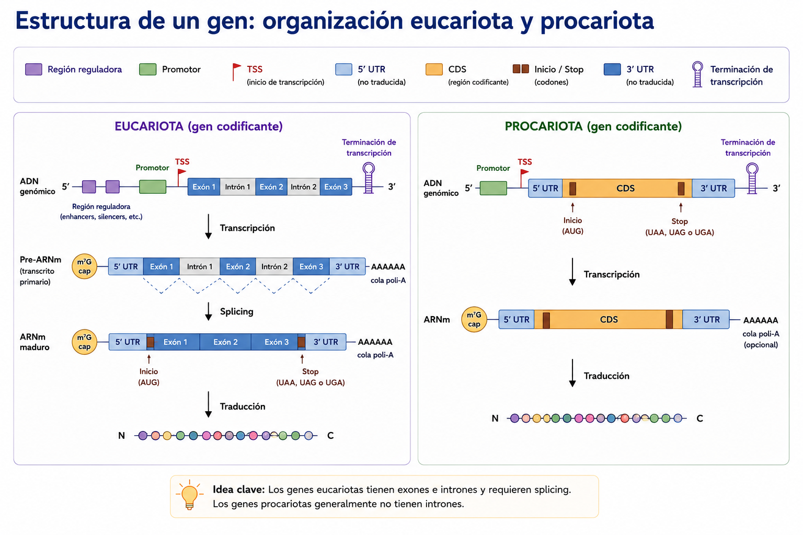

# S7 — Representar: de los objetos biológicos a FASTA, GFF3 y GenBank

::: {.callout-note title="Aula invertida:"}
Antes de clase lee las secciones marcadas como **indispensables** y
realiza el primer intento sin IA. Lleva tu matriz objeto–evidencia–formato y las dudas que no
pudiste resolver. Durante el taller trabajarás con fragmentos y registros reales, compararás tu
razonamiento y corregirás la matriz. Después integrarás la selección provisional de datos en
`doc/protocolo.md`. El primer intento es formativo: importa que muestre tu razonamiento inicial,
aunque contenga errores corregibles.
:::

## Ficha del módulo

| Elemento | Descripción |
| --- | --- |
| **Sesión** | S7, 2 horas |
| **Unidad** | U3. Datos y bases de datos biológicas |
| **Competencia principal** | C. Manejo de datos y bases de datos biológicas |
| **Competencias integradas** | A. Documentación reproducible; G. uso responsable de IA en el cierre posterior |
| **Propósito** | Comprender la base biológica que relaciona genomas, genes, transcritos y proteínas; distinguir estos objetos de sus representaciones computacionales e interpretar FASTA, GFF3 y GenBank |
| **Consulta previa del Plan** | Material clásico L4, diapositivas 1–31; este módulo lo sustituye como lectura autocontenida |
| **Lectura indispensable** | Secciones 1–6 y Práctica 1 de este módulo, 75–90 min |
| **Lectura de consulta** | Sección 7 y documentación oficial enlazada, 15–20 min |
| **Primer intento** | Test de repaso (procesos, elementos, alfabetos) + matriz objeto–pregunta–evidencia–formato, 35–45 min |
| **Evidencia** | Matriz corregida y selección provisional de un conjunto de datos |
| **Tarea numerada** | Ninguna; el Plan inicia la Tarea 4 en S8 |

## Relación con lo que ya sabes

En U1 partiste de una pregunta y aprendiste que los datos necesitan procedencia, metadatos y una
ubicación estable. En U2 construiste `data/source/`, aprendiste a reconocer archivos, conservar
originales y comprobar integridad. En esta sesión darás el siguiente paso: decidir **qué datos**
necesitas antes de decidir cómo descargarlos o qué comando utilizar.

El orden de razonamiento será siempre:

```text
pregunta → evidencia → datos → operación → herramienta
```

::: {.callout-warning}
Empezar con “¿qué comando uso?” puede producir una respuesta técnicamente válida
para el archivo equivocado. Primero determina qué representa el dato y si aporta la evidencia que
necesita tu pregunta.
:::

## Resultados de aprendizaje

Al finalizar la sesión podrás:

1. **Explicar y distinguir** genoma, ADN, gen, transcrito, ARN, proteína, secuencia y anotación.
2. **Diferenciar** objeto biológico, registro de base de datos y archivo descargable.
3. **Explicar** la función de un identificador, un *accession* y una versión.
4. **Interpretar** los componentes esenciales de FASTA, GFF3 y GenBank.
5. **Seleccionar** el formato apropiado para una evidencia concreta y justificar sus limitaciones.
6. **Registrar** una selección provisional de datos sin inventar metadatos ausentes.

## Preparación previa o *preflight*

Antes de comenzar confirma:

- [ ] Puedes abrir archivos de texto plano en tu computadora o en el servidor.
- [ ] Tienes a la vista tu pregunta y subpreguntas de `doc/protocolo.md`.
- [ ] Conservas la estructura `data/source/`, `data/processed/`, `src/`, `results/`, `doc/`.
- [ ] Puedes distinguir el contenido de un archivo de su nombre o extensión.
- [ ] No pegarás credenciales, rutas institucionales privadas ni datos sensibles en una IA.

No necesitas descargar un genoma antes del taller. En esta sesión primero aprenderás a interpretar
los registros y formatos; la descarga verificable se realizará en S8.

## Ruta de S7

| Momento | Actividad | Producto | Tiempo estimado |
| --- | --- | --- | ---: |
| Antes de clase | Leer secciones 1–7 | Notas y dudas | 75–90 min |
| Antes de clase | Práctica 1 y matriz inicial | Test de repaso + matriz | 35–45 min |
| Taller | Recuperación y comparación del primer intento | Matriz corregida | 15 min |
| Taller | Prácticas 2–5 con fragmentos y registro | Evidencias anotadas | 85 min |
| Taller | Selección provisional y semáforo | Acuerdo de datos | 20 min |
| Después | Actualizar `doc/protocolo.md` | Registro reproducible | 20–30 min |

## 1. Un objeto biológico no es lo mismo que un archivo [Indispensable]

Antes de hablar de archivos conviene recorrer, con calma, de dónde viene la información que esos
archivos representan. El recorrido de esta sección sigue un solo hilo: de un **ser vivo** a sus
**células**, de la célula a su **genoma**, del genoma a un **gen**, del gen a un **ARN**
(transcripción) y del ARN a una **proteína** (traducción). El **dogma central** resume ese hilo en un
mapa; después profundizamos en la estructura interna de un gen y cerramos con el tamaño de los
genomas y los alfabetos que usaremos para escribir todo esto como texto.

### 1.1 Un ser vivo, sus células y su genoma

Todo ser vivo —una bacteria, una levadura, una planta, un ser humano— está formado por una o más
células. La **célula** es la unidad estructural y funcional básica de los organismos: contiene la
maquinaria necesaria para mantenerse, obtener energía, responder a su entorno y reproducirse. En una
célula eucariota, buena parte del material genético se localiza dentro de un núcleo delimitado por
membrana; en una célula procariota (bacterias y arqueas) no hay núcleo y el material genético ocupa
una región del citoplasma llamada nucleoide. Los virus no son células —dependen de una célula
huésped para replicarse—, pero también tienen material genético que exige las mismas preguntas:
¿qué molécula es?, ¿de qué organismo o entidad proviene?, ¿qué versión se consultó?

El conjunto de material genético de una célula, un organismo, un organelo o un virus es su
**genoma**. En los organismos celulares, el genoma está compuesto principalmente por ADN. Algunos
virus poseen genomas de ARN; por eso siempre debemos consultar qué molécula y qué entidad biológica
describe un registro.


![Seis niveles encadenados que van del organismo al producto funcional: el ser vivo, formado por una o más células; la célula, procariota con el ADN en el nucleoide o eucariota con núcleo; el genoma, que es todo el material genético e incluye genes codificantes, genes de ARN funcional, regiones reguladoras, secuencias repetidas, regiones intergénicas y elementos aún desconocidos, repartido en cromosomas, plásmidos u organelos; el gen, con promotor, región reguladora, región codificante y terminador; el ARN producido por transcripción; y la proteína producida por traducción. Dos recuadros laterales fijan la idea que importa para el curso: un objeto biológico no es un archivo —el genoma existe en la naturaleza, el archivo es una representación digital—, y para identificar correctamente un genoma hacen falta seis datos: organismo, cepa, tipo de molécula, ensamblado, base de datos y versión.](images/figura-u3-s07-ser-vivo.png)

**Figura 1.** Jerarquía de la información biológica, desde el organismo hasta la expresión génica. El material genético se organiza de manera jerárquica: los seres vivos están formados por células, las células contienen un genoma, el genoma está compuesto por genes y estos se expresan mediante la transcripción a ARN y la traducción a proteínas. El genoma comprende todo el material genético del organismo, incluyendo regiones codificantes y no codificantes, y puede estar distribuido en cromosomas, plásmidos u organelos genéticos.


Un genoma puede incluir:

- genes que producen proteínas;
- genes que producen ARN funcional;
- regiones reguladoras;
- secuencias repetidas;
- regiones intergénicas;
- otros elementos cuya función puede ser conocida, provisional o todavía desconocida.

El ADN genómico puede organizarse en uno o más **cromosomas**. Además, pueden existir moléculas
genéticas adicionales, como plásmidos en bacterias o genomas de organelos —mitocondrias y
cloroplastos— en organismos eucariotas.

::: {.callout-important}
“El genoma” no identifica por sí solo un archivo reproducible. Debes precisar
organismo, cepa o individuo, tipo de molécula, ensamblado, colección y versión.
:::

Un **ensamblado genómico** es una representación computacional reconstruida a partir de datos de
secuenciación. No es la molécula física completa: es un modelo compuesto por secuencias llamadas
contigs, scaffolds o cromosomas, según su nivel de organización.


![Cómo el genoma biológico se convierte en archivos digitales, en cuatro pasos: el genoma existe como moléculas de ADN en la célula, con cromosoma y plásmido; la secuenciación fragmenta y lee millones de trozos; el ensamblado los reconstruye computacionalmente, y una nota advierte que el ensamblado es una representación del genoma, no la molécula física; y de él se generan archivos estandarizados —FASTA para secuencias de nucleótidos, GenBank para secuencias con anotaciones y metadatos, GFF para anotaciones de genes y otras características— que son lo que usan las herramientas de visualización, comparación, anotación, filogenia y estadística. Un recuadro subraya que el ADN no se analiza directamente en la computadora, y otro que decir «el genoma» no identifica un archivo reproducible: hacen falta organismo, cepa, tipo de molécula, ensamblado, colección y versión.](images/figura-u3-s07-archivos-digitales.png)

**Figura 2.** Del genoma biológico a los archivos utilizados en bioinformática. El ADN de un organismo se secuencia y se reconstruye mediante un ensamblado genómico. A partir de esta representación computacional se generan archivos estandarizados, como FASTA, GenBank y GFF, que sirven de entrada para las herramientas de análisis bioinformático.


### 1.2 ADN: la molécula que almacena y copia la información

En la mayoría de los seres vivos, el genoma que acabas de conocer está hecho de **ácido
desoxirribonucleico (ADN)**: un polímero formado por nucleótidos. Cada nucleótido contiene un grupo
fosfato, el azúcar desoxirribosa y una base nitrogenada. Las cuatro bases que utilizaremos
inicialmente son:

| Símbolo | Base |
| --- | --- |
| `A` | adenina |
| `C` | citosina |
| `G` | guanina |
| `T` | timina |


![El ADN como molécula que almacena y copia la información, en cinco bloques: el nucleótido y sus tres componentes (fosfato, desoxirribosa y base nitrogenada), del que solo varía la base; las cuatro bases A, C, G y T con un color asignado que se conserva en toda la figura; la doble hélice formada por dos cadenas antiparalelas unidas por apareamiento complementario, donde A siempre se aparea con T y C con G; la representación lineal, que explica por qué una estructura tridimensional y bicatenaria se escribe en el archivo como una sola cadena de caracteres en dirección 5' a 3', sin anotar la complementaria; y la replicación, en cuatro pasos, que produce dos moléculas idénticas cada una con una hebra original y una nueva.](images/figura-u3-s07-dna.png)

**Figura 3.** Estructura y representación del ADN. El ADN está formado por nucleótidos, cada uno compuesto por un grupo fosfato, una desoxirribosa y una base nitrogenada (A, C, G o T). Dos cadenas antiparalelas se unen mediante el apareamiento complementario de bases (A–T y C–G), formando la doble hélice. En bioinformática, esta estructura se representa habitualmente como una única secuencia de nucleótidos escrita en dirección 5′→3′. Durante la replicación, cada cadena sirve como molde para sintetizar una nueva cadena complementaria.


En una molécula de ADN de doble cadena, las cadenas son antiparalelas y las bases se aparean de
manera complementaria: A con T y C con G. Dado que una cadena determina la complementaria, una
secuencia computacional suele escribirse como **una sola cadena en dirección 5′ → 3′**. Esta
convención convierte una estructura tridimensional y bicatenaria en una cadena lineal de
caracteres.

```text
Molécula representada conceptualmente: doble cadena de ADN
Representación habitual en texto: 5′-ATGGCTCTGTGG-3′
Cadena complementaria:             3′-TACCGAGACACC-5′
```

La **replicación** produce nuevas moléculas de ADN a partir de ADN. La doble hélice se abre y cada
cadena sirve de molde para sintetizar una cadena complementaria. La ADN polimerasa participa en la
síntesis. Este proceso permite copiar la información genética antes de la división celular.

### 1.3 El gen: la unidad de información dentro del genoma

Dentro del genoma, no toda la secuencia cumple el mismo papel. Un **gen** es una región de material
genético que contribuye a producir un producto funcional: un ARN o una proteína. Esta definición es
más amplia que “una secuencia que codifica una proteína”: incluye genes de ARNr, ARNt y otros ARN
funcionales.


![El gen como región funcional del genoma, no como molécula independiente: un cromosoma se amplía hasta mostrar un tramo de ADN delimitado por un inicio y un fin, con sus regiones reguladoras, promotor, región transcrita, terminador y regiones no codificantes. Una tabla lista los atributos por los que se describe un gen en un archivo —molécula, inicio y fin en pares de bases, longitud, hebra, orientación, símbolo, identificador, tipo y producto—, y un esquema muestra que la hebra positiva se lee de izquierda a derecha y la negativa al revés, aunque ambas se transcriban de 5' a 3'. Un tercer bloque distingue lo que un gen puede producir: copia durante la replicación, transcripción a ARN ribosómico, de transferencia, regulador o mensajero, y traducción a proteína solo en el caso del mensajero. Una advertencia recuerda que un gen se identifica siempre por sus coordenadas dentro del ensamblado.](images/figura-u3-s07-gene.png)

**Figura 4.** El gen como unidad funcional y entidad anotada del genoma. Un gen es una región específica del ADN definida por su posición dentro de un cromosoma o molécula genómica. Además de su secuencia, un gen se caracteriza por atributos como sus coordenadas de inicio y fin, la hebra (strand), la orientación de la transcripción y su identificador. Durante la expresión génica, un gen puede transcribirse para producir diferentes tipos de ARN; cuando el transcrito corresponde a un ARN mensajero (ARNm), este puede traducirse para sintetizar una proteína. Estos atributos constituyen la base de las anotaciones genómicas empleadas en formatos como GFF, GTF y GenBank.


Cada gen puede copiarse, como parte de la replicación de todo el genoma, y también puede
**expresarse**: usarse como molde para producir un ARN y, en muchos casos, una proteína. Las dos
secciones siguientes recorren esos productos —ARN y proteína— y el proceso que los conecta con el
gen. Más adelante (sección 1.7) volverás sobre el gen para ver cómo se organiza internamente en
eucariotas y procariotas.

::: {.callout-important}
un gen es una **región** del genoma, no una molécula aparte. No existe “el gen”
como una entidad independiente del ADN o del cromosoma que lo contiene.
:::

### 1.4 ARN: el primer producto de la expresión génica

El **ácido ribonucleico (ARN)** también es un polímero de nucleótidos, pero contiene ribosa y suele
usar uracilo (`U`) en lugar de timina (`T`). Muchas moléculas de ARN son monocatenarias, aunque
pueden plegarse y formar regiones de doble cadena.

| Tipo de ARN | Función introductoria |
| --- | --- |
| ARN mensajero (ARNm) | Lleva una secuencia que puede servir como molde para sintetizar una proteína |
| ARN ribosómico (ARNr) | Forma parte estructural y catalítica del ribosoma |
| ARN de transferencia (ARNt) | Relaciona codones del ARNm con aminoácidos durante la traducción |
| ARN regulador | Participa en la regulación de genes y otros procesos celulares |

Un ARN se produce mediante la **transcripción**: una ARN polimerasa utiliza como molde la cadena de
ADN de un gen para sintetizar una cadena de ARN complementaria. El resultado es un **transcrito**.
No todo transcrito es un ARNm y no todo transcrito será traducido. En eucariotas, un transcrito
primario puede procesarse antes de convertirse en ARN maduro; en un ARNm pueden añadirse una
caperuza 5′ y una cola poli-A, y pueden eliminarse intrones mediante *splicing*.

### 1.5 Proteína: el producto de la traducción

Una **proteína** es una molécula formada por una o más cadenas de aminoácidos. Su secuencia primaria
se representa con un alfabeto de una letra. Por ejemplo:

```text
MALWMRLLPLL
```

Cuando el transcrito es un ARNm, puede **traducirse**: el ribosoma lo lee en grupos de tres
nucleótidos llamados **codones** y, con ayuda de los ARNt, construye una cadena de aminoácidos. El
**código genético** establece la correspondencia entre codones y aminoácidos; un codón de inicio
marca dónde comienza la traducción y un codón de terminación, dónde acaba.


![Los dos productos de la expresión génica, en paralelo. A la izquierda el ARN: su nucleótido usa ribosa y uracilo en lugar de timina, suele ser monocatenario aunque puede plegarse, y se presenta en cuatro tipos con función distinta —mensajero, ribosómico, de transferencia y regulador—, con el procesamiento eucariota que añade caperuza, elimina intrones y agrega cola poli-A. Una nota advierte que no todo transcrito es ARN mensajero ni será traducido. A la derecha la proteína: una cadena de aminoácidos que se escribe con un alfabeto de una sola letra, los cuatro pasos de la traducción en el ribosoma, la tabla del código genético con su carácter degenerado y no ambiguo, y las funciones que puede desempeñar. Un pie resume que la información fluye de ADN a ARN y de ARN a proteína.](images/figura-u3-s07-productos.png)

**Figura 5.** Expresión génica: del gen al ARN y a la proteína. Un gen puede transcribirse para producir diferentes tipos de ARN, cada uno con funciones específicas. Cuando el transcrito corresponde a un ARN mensajero (ARNm), este puede traducirse en una proteína mediante la acción del ribosoma y el código genético. La figura resume los principales tipos de ARN, el procesamiento del ARNm en eucariotas y la relación entre las secuencias de ADN, ARN y proteínas, las tres representaciones moleculares fundamentales utilizadas en bioinformática.


Las proteínas pueden participar en catálisis, transporte, estructura, señalización, movimiento y
regulación. La secuencia de aminoácidos condiciona el plegamiento, pero un archivo de secuencia no
describe por sí solo toda la estructura tridimensional, modificaciones químicas, interacciones o
funciones de la proteína.

### 1.6 El dogma central: el mapa completo del flujo de información

Ya recorriste, por separado, la replicación (ADN → ADN), la transcripción (ADN → ARN) y la
traducción (ARN → proteína). El **dogma central de la biología molecular** reúne los dos últimos
procesos en un solo mapa del flujo de información entre macromoléculas:


![El dogma central como flujo de información en tres cajas: el ADN almacena la información genética, la transcripción produce ARN que la transporta, y la traducción produce la proteína, que es el producto funcional. Debajo, dos precisiones que suelen confundirse: la replicación de ADN a ADN conserva y copia la información pero no forma parte de la cadena de expresión génica, y existen flujos adicionales reales —transcripción inversa de ARN a ADN— que no son la vía principal. Un recuadro final advierte que el dogma no implica que todos los genes produzcan proteínas ni que toda la información siga una sola ruta.](images/figura-u3-s07-dogma-central.png)

**Figura 6.** El dogma central de la biología molecular. El flujo principal de la información genética ocurre desde el ADN hacia el ARN mediante la transcripción y del ARN hacia la proteína mediante la traducción. La replicación (ADN → ADN) conserva la información genética, pero no forma parte de la expresión génica. Existen rutas adicionales, como la retrotranscripción (ARN → ADN), que no modifican el principio fundamental del dogma central.


La replicación `ADN → ADN` conserva y copia información genética, pero no es un paso adicional de
esta cadena. Es un proceso relacionado que debe distinguirse de la **expresión génica**, formada
aquí por transcripción y, para genes codificantes, traducción (Cooper, 2000, cap. 3).

::: {.callout-tip title="¿Sabías que?"}
Existen flujos adicionales, como ARN → ADN mediante transcriptasa reversa. El
dogma central no significa que toda información pase siempre por una sola ruta ni que todos los
genes produzcan proteínas. Su idea central es distinguir la transferencia de información entre
secuencias de ácidos nucleicos y proteínas.
:::

### 1.7 La estructura de un gen: organización eucariota y procariota

En 1.3 definiste un gen como una región del genoma que puede expresarse. Ahora que ya conoces la
transcripción y la traducción, puedes ver con más detalle cómo se organiza esa región:

| Elemento | Función introductoria |
| --- | --- |
| Región reguladora | Influye en cuándo, dónde o cuánto se expresa un gen |
| Promotor | Región donde se organiza el inicio de la transcripción |
| Sitio de inicio de transcripción (TSS) | Primera posición transcrita |
| Región 5′ no traducida (5′ UTR) | Parte del transcrito anterior a la región codificante |
| Región codificante (CDS) | Parte traducida en una secuencia de aminoácidos |
| Codón de inicio y de terminación | Delimitan la traducción dentro de la CDS |
| Región 3′ no traducida (3′ UTR) | Parte del transcrito posterior a la CDS |
| Terminación de transcripción | Proceso o señal asociado con el final de la transcripción |

::: {.callout-important}
Los límites de un gen, un transcrito y una CDS no son necesariamente iguales. Un
archivo de anotación debe distinguir los tipos de feature y sus relaciones.
:::




**Figura 7.** Estructura general de un gen y su anotación (elemento gráfico pendiente de confirmar
contra la fuente original; verificar si representa organización eucariota, procariota, o ambas
antes de publicar).

#### Organización eucariota

En un gen eucariota codificante, la región transcrita puede contener **exones** e **intrones**. El
transcrito primario o pre-ARNm contiene ambos; durante el *splicing*, los intrones se eliminan y los
exones se unen. Las UTR forman parte del ARN maduro, pero no de la secuencia traducida. Promotores,
enhancers y otros elementos reguladores influyen en la expresión (Shafee y Lowe, 2017).


El **splicing alternativo** permite que diferentes combinaciones de exones produzcan distintos
transcritos a partir de una región génica. Por ello, la relación gen → transcrito → proteína no
siempre es uno a uno.

#### Organización procariota

En procariotas, una región codificante suele relacionarse con un promotor, un TSS, regiones no
traducidas y señales de terminación. Muchos genes se organizan en **operones**: varias regiones
codificantes son transcritas juntas en un ARN policistrónico y después pueden producir proteínas
distintas. No todos los genes procariotas pertenecen a operones.


### 1.8 El tamaño del genoma no equivale al número de genes

Los genomas varían enormemente en tamaño y organización. Esta variación no forma una escala simple
de “complejidad”. Por ejemplo:

| Organismo | Tamaño aproximado | Observación útil |
| --- | ---: | --- |
| *Escherichia coli* K-12 MG1655 | 4.64 Mb | Un cromosoma circular de referencia; más de cuatro mil genes anotados, según la versión |
| Humano | 3 Gb por juego haploide | 23 cromosomas y alrededor de 20,000 genes; gran proporción no codificante |
| Ajolote mexicano | 32 Gb | Cerca de diez veces el tamaño humano, en gran parte por expansión de regiones repetidas e intrones |

Fuentes: registro [NC_000913.3](https://www.ncbi.nlm.nih.gov/nuccore/NC_000913.3), NHGRI (2020) y
Nowoshilow et al. (2018).

::: {.callout-tip}
“Número de genes”, “número de transcritos” y “número de proteínas” dependen de la
definición, la versión de anotación y el tipo de conteo. Por eso no deben copiarse como propiedades
eternas de una especie: se registra siempre la fuente y la versión.
:::

### 1.9 Alfabetos biológicos y símbolos especiales

Al convertir moléculas en texto usamos alfabetos convencionales:

| Tipo | Símbolos básicos | Símbolos que debes reconocer |
| --- | --- | --- |
| ADN | `A`, `C`, `G`, `T` | `N`: nucleótido no determinado; otros códigos IUPAC representan ambigüedad |
| ARN | `A`, `C`, `G`, `U` | `N`: nucleótido no determinado |
| Proteína | Código de una letra para aminoácidos | `X`: aminoácido no determinado; `*`: señal de terminación en algunas representaciones |

El guion `-` suele representar una **brecha** en un alineamiento, no un nucleótido o aminoácido. No
debe añadirse a una secuencia sin alineamiento para “rellenar” una región desconocida. Más adelante
estudiarás los alineamientos y el significado de las brechas.

::: {.callout-warning}
Una letra ambigua es información, no suciedad. Eliminar `N` o `X` cambia el dato y
puede alterar posiciones, longitudes e interpretaciones. El original permanece en `data/source/`.
:::

### Práctica 1 — Test de repaso: procesos, elementos y alfabetos

#### Antes de clase — primer intento individual

Responde sin IA y sin volver a mirar las secciones anteriores mientras contestas. Es un test
formativo: importa tu razonamiento, no un puntaje perfecto. Despliega cada retroalimentación solo
después de responder.

**Parte A. Verdadero o falso — procesos**

1. La replicación usa ADN como molde para producir ARN.
2. La traducción usa un ARNm como molde para producir una proteína.
3. Todos los genes producen una proteína.
4. Un mismo gen puede producir más de un transcrito.
5. La transcripción ocurre después de la traducción.
6. Un operón procariota puede producir varias proteínas a partir de un solo ARN policistrónico.

<details>
<summary>Ver retroalimentación — Parte A</summary>

1. Falso. La replicación usa ADN como molde para producir ADN; la transcripción es la que produce
   ARN a partir de ADN.
2. Verdadero.
3. Falso. Algunos genes producen ARN funcional (ARNr, ARNt, ARN regulador) y nunca se traducen.
4. Verdadero, por splicing alternativo: distintas combinaciones de exones generan transcritos
   distintos a partir del mismo gen.
5. Falso. La transcripción ocurre antes: primero se produce el ARN y, si corresponde, ese ARN se
   traduce.
6. Verdadero. Varias regiones codificantes de un operón se transcriben juntas en un solo ARN
   policistrónico y después pueden traducirse por separado.

</details>

**Parte B. De la definición al elemento**

Elige el término que corresponde a cada definición. Bolsa de términos: promotor, TSS, 5′ UTR, CDS,
3′ UTR, exón, intrón, operón, gen.

1. Región donde se organiza el inicio de la transcripción.
2. Primera posición transcrita de un gen.
3. Parte del transcrito, anterior a la región codificante, que no se traduce.
4. Parte de un transcrito que se traduce en una secuencia de aminoácidos.
5. Segmento que se elimina del transcrito primario durante el splicing.
6. Segmento que permanece en el ARN maduro después del splicing.
7. Conjunto de regiones codificantes procariotas transcritas juntas en un solo ARN.
8. Región de material genético que contribuye a producir un ARN o una proteína funcional.

<details>
<summary>Ver retroalimentación — Parte B</summary>

1. Promotor
2. TSS (sitio de inicio de transcripción)
3. 5′ UTR
4. CDS (región codificante)
5. Intrón
6. Exón
7. Operón
8. Gen

</details>

**Parte C. ¿Qué tipo de secuencia es?**

Para cada fragmento escribe ADN, ARN, proteína o “no se puede determinar sin más contexto”, y en una
frase justifica con la letra o letras que te dieron la pista.

1. `ACAATGTT`
2. `ACAAUGUU`
3. `PAFFNK`
4. `ACGT`
5. `MSTAC`
6. `LWTKQ`
7. `NNNNN`

<details>
<summary>Ver retroalimentación — Parte C</summary>

1. ADN. Solo contiene `A`, `C`, `G`, `T`; la `T` descarta el ARN.
2. ARN. Contiene `U` en vez de `T`.
3. Proteína. `P` y `F` no son símbolos válidos de nucleótido, ni siquiera como código de ambigüedad
   IUPAC.
4. No se puede determinar sin más contexto. `A`, `C`, `G` y `T` son válidas como nucleótidos, pero
   también son los códigos de una letra de alanina, cisteína, glicina y treonina: podría ser ADN o
   una proteína de cuatro aminoácidos.
5. No se puede determinar sin más contexto. Cada letra (`M`, `S`, `T`, `A`, `C`) es válida a la vez
   como código de ambigüedad de nucleótido y como aminoácido.
6. Proteína. `Q` no existe como símbolo de nucleótido ni como código de ambigüedad IUPAC; solo tiene
   sentido como aminoácido.
7. No se puede afirmar con certeza sin el archivo o el registro de origen. `N` es un uso frecuente
   para una región no determinada en ADN o ARN (por ejemplo, en ensamblados con huecos), pero
   también es el código de un aminoácido (asparagina).

</details>

#### Durante el taller — comparación y corrección

1. Intercambia tu test con otra persona antes de ver la retroalimentación colapsable.
2. Revisen juntos los desacuerdos de las tres partes; despliega la retroalimentación solo después de
   discutir cada caso.
3. Para la Parte C, ubiquen los fragmentos de ARN y de proteína en el mapa del dogma central: ¿qué
   proceso los produjo y a partir de qué molde?
4. Para los fragmentos marcados como “no se puede determinar sin más contexto”, discutan qué
   información adicional (extensión típica, encabezado del archivo, base de datos de origen)
   permitiría resolver la ambigüedad.
5. Corrige tus respuestas con una marca visible; no borres el primer intento.

#### Después del taller — evidencia final

Conserva el test con el primer intento y la corrección visibles. En `doc/protocolo.md` escribe tres
oraciones: qué relación gen → transcrito → proteína no es uno a uno y por qué, qué elemento genético
de la Parte B te costó más distinguir, y qué pista de alfabeto usarías para reconocer una proteína a
primera vista.

**Criterio de logro:** distingue correctamente los procesos que conectan ADN, ARN y proteína;
relaciona cada elemento genético con su función; clasifica los fragmentos inequívocos y reconoce, sin
inventar certeza, los casos ambiguos.

### 1.10 De la biología a la representación computacional

Una pregunta biológica se refiere a entidades o procesos del mundo: un organismo, un gen, un
transcrito, una proteína o una región reguladora. La computadora no manipula directamente esas
entidades; manipula **representaciones** construidas a partir de observaciones, ensamblajes,
predicciones y anotaciones.

Todavía no conoces la sintaxis completa de FASTA, GFF3 o GenBank —eso llega en las secciones 4 a
6—, pero conviene anticipar, aunque sea de forma general, cómo se ve cada objeto biológico
convertido en texto.

| Concepto | Qué representa | Ejemplo de evidencia computacional |
| --- | --- | --- |
| Organismo | Ser vivo o sistema biológico | Nombre científico, identificador taxonómico, muestra |
| Genoma | Material genético de un organismo o muestra | Ensamblado con secuencias y versión |
| Gen | Unidad anotada asociada con un producto o función | Feature con coordenadas y atributos |
| Transcrito | Molécula de ARN producida por transcripción | Secuencia de ARN y relación con un gen |
| Proteína | Cadena de aminoácidos o producto funcional | Secuencia proteica y anotación |
| Anotación | Afirmación sobre ubicación, estructura o función | Feature en GFF3 o tabla `FEATURES` de GenBank |

Una **secuencia** es un orden de símbolos que representa nucleótidos o aminoácidos. Una
**anotación** agrega afirmaciones sobre esa secuencia: dónde se encuentra un gen, en qué cadena,
qué producto se propone o qué evidencia respalda la afirmación.

![Cuatro objetos biológicos en fila —ADN, gen, transcrito y proteína— y, debajo de cada uno, una flecha que apunta al archivo de texto que lo representa. La doble hélice completa se convierte en secuencia; el gen aparece como un tramo delimitado por coordenadas de inicio y fin (1000 y 2500) dentro de esa hélice; el transcrito es una cadena sencilla con uracilo; y la proteína, una cadena de aminoácidos plegada. La idea es que cada nivel biológico distinto se representa en un archivo distinto, y que lo que se manipula en bioinformática son esos archivos, no los objetos.](images/figura-u3-s07-objetos-biologicos-texto.png)

**Figura 8.** De los objetos biológicos a sus representaciones digitales. El ADN puede representarse
como una secuencia; un gen, como una región anotada mediante coordenadas; un transcrito, como una
secuencia de nucleótidos; y una proteína, como una secuencia de aminoácidos. Elaboración propia.

La figura separa dos niveles:

- **nivel biológico:** moléculas, regiones y productos que estudiamos;
- **nivel computacional:** caracteres y campos almacenados en archivos de texto.

La computadora no “ve” una doble hélice ni una proteína plegada. Procesa símbolos, líneas, campos y
relaciones. El significado biológico aparece cuando conocemos el formato, el registro de origen y
los metadatos.

#### Ejemplo integrado: del objeto biológico al texto

Los siguientes fragmentos son **ejemplos didácticos mínimos**, no registros reales. Comparten una
misma secuencia ficticia y simplificada, formada únicamente por una región codificante, para mostrar
qué información se conserva al representar cada objeto como texto.

##### ADN: una secuencia de nucleótidos

```text
>secuencia_genomica_ejemplo
ATGGCTCTGTGGATGCGTCTGCTGCCGCTGCTGTAA
```

El alfabeto `A`, `C`, `G` y `T` representa nucleótidos de ADN. El archivo conserva el orden de la
secuencia, pero no señala por sí solo dónde comienza o termina un gen.

##### Gen: una región anotada sobre el ADN

El siguiente fragmento anticipa la sintaxis de GFF3, que estudiarás formalmente en la sección 5. Por
ahora fíjate solo en la idea general, no en cada símbolo:

```text
##gff-version 3
chr_demo	curso	gene	101	136	.	+	.	ID=gene1;Name=gen_ejemplo
```

Aquí el gen no se representa copiando nuevamente toda la molécula. Se describe como una anotación
—lo que estos formatos llaman un *feature*— de tipo `gene`, localizada entre las coordenadas 101 y
136 de `chr_demo`, en la cadena `+`, con atributos como su identificador y nombre. Esas coordenadas
solo tienen sentido respecto de la secuencia y versión correctas.

##### Transcrito: una secuencia de ARN

```text
>transcrito1 gen_ejemplo ARN
AUGGCUCUGUGGAUGCGUCUGCUGCCGCUGCUGUAA
```

En este ejemplo didáctico se usa `U` para hacer visible que se trata de ARN. Algunos repositorios y
flujos de análisis exportan secuencias de transcritos como ADN complementario y usan `T`; por eso el
alfabeto no basta para determinar la procedencia ni el tipo exacto de molécula.

##### Proteína: una secuencia de aminoácidos

```text
>proteina1 producto_gen_ejemplo
MALWMRLLPLL
```

Cada letra representa un aminoácido mediante el código de una letra. La secuencia lineal no muestra
por sí sola el plegamiento tridimensional, la función, las modificaciones posteriores a la
traducción ni la evidencia que respalda una anotación funcional.

::: {.callout-important}
El esquema es una ruta introductoria, no una equivalencia uno a uno. Un gen puede
producir varios transcritos; no todos los genes codifican proteínas; los transcritos pueden
procesarse; y la región completa de un gen no se traduce necesariamente. Para obtener una proteína
se traduce la región codificante del transcrito con el código genético apropiado.
:::

::: {.callout-important}
Una anotación no es la molécula y tampoco es necesariamente una observación
directa. Puede integrar evidencia experimental, inferencias computacionales y decisiones de una
versión concreta del proceso de anotación.
:::

El flujo ADN–ARN–proteína funciona aquí como mapa conceptual, no como una lista exhaustiva de
excepciones biológicas. Para esta unidad interesa que distingas qué tipo de objeto describe cada
registro o archivo y qué representación computacional conserva la evidencia necesaria.

Con esta vista previa ya puedes avanzar. La sección 2 usa estas ideas para descomponer una pregunta
biológica en evidencia y datos, sin ejecutar todavía ningún comando ni exigir que domines la
sintaxis completa de un formato. Las secciones 3 a 6 retoman, una por una y con su sintaxis
completa, los identificadores y versiones (3), FASTA (4), GFF3 (5) y GenBank (6).

### Micropráctica 1 — ¿Secuencia o anotación?

Clasifica cada necesidad antes de mirar formatos:

1. Conocer el orden de nucleótidos de un cromosoma.
2. Localizar el inicio y fin de los genes anotados.
3. Consultar en un solo registro la secuencia, su fuente y sus features.
4. Comparar la secuencia de una proteína con otra.

Para cada caso escribe “secuencia”, “anotación” o “ambas” y justifica en una oración.

<details>
<summary>Ver retroalimentación</summary>

1. Secuencia genómica.
2. Anotación relacionada con una secuencia de referencia.
3. Ambas, integradas en un registro estructurado.
4. Secuencias proteicas; la interpretación posterior puede necesitar anotaciones adicionales.

</details>

## 2. Pregunta, evidencia y datos [Indispensable]

Considera la pregunta: **¿cuántos genes están anotados en un ensamblado de referencia de una
bacteria?**

Antes de elegir una herramienta, descompón el razonamiento:

| Paso | Decisión provisional |
| --- | --- |
| Pregunta | ¿Cuántos genes están anotados? |
| Evidencia | Anotaciones que declaren explícitamente cada gen, no solo la secuencia del genoma |
| Datos | Anotación correspondiente a un ensamblado y versión determinados |
| Operación | Localizar esas anotaciones marcadas como genes y contarlas |
| Herramienta | Se decidirá en U4 después de estudiar filtros y conteos |
| Verificación | Comparar con el resumen del mismo ensamblado y revisar qué definición usa |
| Limitación | “Genes anotados” depende de la versión y del criterio de anotación |

::: {.callout-note}
Estas anotaciones son lo que en 1.10 adelantamos como un *feature*. Su sintaxis formal
—columnas, tipos y atributos— corresponde a GFF3 y la estudiarás en la sección 5. Aquí interesa
solo distinguir que la evidencia no es la secuencia del genoma, sino una afirmación explícita
sobre dónde están los genes.
:::

En S7 llegaremos hasta la selección y comprensión de los datos. No necesitas ejecutar todavía el
conteo: filtros, tuberías y conteos sistemáticos corresponden a U4.

### Práctica 2 — Primer intento: matriz objeto–evidencia–formato

#### Antes de clase — primer intento individual

1. Elige una subpregunta de tu proyecto o una de estas opciones:
   - ¿cuál es la secuencia completa del genoma seleccionado?;
   - ¿qué genes están anotados y dónde se localizan?;
   - ¿cuál es la secuencia de una proteína concreta?;
   - ¿qué publicación respalda un registro?
2. Completa sin IA:

| Pregunta | Evidencia necesaria | Objeto biológico | Datos esperados | Formato provisional | Qué falta confirmar |
| --- | --- | --- | --- | --- | --- |
| | | | | | |

3. Escribe una duda auténtica. No consultes una solución antes del taller.

#### Durante el taller — comparación y corrección

1. Intercambia la matriz con otra persona.
2. Subraya cualquier salto directo de pregunta a herramienta.
3. Revisa si la evidencia realmente permitiría responder la pregunta.
4. Corrige el formato provisional después de estudiar las secciones siguientes.
5. Conserva el primer intento: la corrección debe quedar visible.

#### Después del taller — integración

1. Incorpora la matriz corregida a `doc/protocolo.md`.
2. Añade una limitación y un dato todavía pendiente de confirmar.
3. No descargues un archivo distinto solo porque parezca más fácil de procesar.

**Criterio de logro:** la cadena pregunta → evidencia → datos es coherente y el formato elegido se
justifica por lo que contiene, no por su extensión o por un comando conocido.

## 3. Registro, campo, identificador, accession y versión [Indispensable]

Una **base de datos** es una colección organizada de datos y relaciones que permite almacenar,
consultar y actualizar información. Un **registro** reúne campos que describen una entidad concreta,
por ejemplo una secuencia o un ensamblado.

Un **identificador** permite distinguir una entidad dentro de un sistema. Un ***accession*** es un
identificador estable asignado por un repositorio a un registro. Una **versión** permite distinguir
cambios del contenido asociado con ese *accession*.

Ejemplos:

- `NC_000913.3`: registro de secuencia; `.3` es parte de la versión.
- `GCF_000005845.2`: ensamblado RefSeq; `.2` identifica su versión.
- `GCA_...`: ensamblado enviado a GenBank.
- `GCF_...`: ensamblado de la colección RefSeq.


NCBI actualiza el número de versión de un ensamblado cuando cambian sus secuencias subyacentes. Las
versiones de un ensamblado GenBank y su ensamblado RefSeq emparejado pueden ser diferentes porque se
actualizan por separado (NCBI, 2026).


![Los cinco conceptos que hay que distinguir para citar un dato de forma reproducible, encadenados: base de datos, registro con sus campos, identificador (concepto general), accession (identificador estable asignado por el repositorio) y versión (que cambia cuando cambia el contenido). Un registro de ejemplo muestra sus campos: accession con versión NC_000913.3, descripción, organismo, tipo de molécula, longitud y fecha. Una tabla explica los prefijos NC_, GCF_ y GCA_. Un panel advierte que registrar sin la versión no identifica la entidad: NC_000913 es incompleto, NC_000913.3 es reproducible. Otro muestra un mismo accession con tres versiones sucesivas en 2021, 2023 y 2025, con contenido distinto. Un tercero avisa de que un nombre de gen como araC sirve para buscar pero no sustituye a un identificador versionado, porque el mismo nombre aparece en distintos organismos y bases.](images/figura-u3-s07-db-registro.png)

**Figura 9.** Organización e identificación de registros en bases de datos biológicas. Las bases de datos organizan la información en registros compuestos por múltiples campos que describen entidades biológicas, como secuencias, genes o ensamblados. Un identificador permite distinguir una entidad dentro de un sistema; un accession es un identificador estable asignado por el repositorio y el número de versión indica el estado específico del contenido asociado con ese accession. Dado que las versiones cambian cuando el registro se actualiza, la reproducibilidad de un análisis depende de conservar el identificador completo, incluyendo su versión.


::: {.callout-important}
Registrar `NC_000913` sin `.3`, o `GCF_000005845` sin `.2`, no identifica de manera
completa la versión utilizada. Para reproducibilidad conserva el identificador tal como aparece en
la fuente.
:::

Un nombre de gen, como `araC`, es útil para buscar e interpretar, pero no sustituye automáticamente
un identificador versionado. Un mismo nombre puede aparecer en diferentes organismos, ensamblados o
bases.

### Micropráctica 2 — ¿Qué identifica cada cadena?

Para cada elemento escribe “secuencia”, “ensamblado”, “nombre biológico” o “no se puede determinar sin
contexto”:

```text
NC_000913.3
GCF_000005845.2
araC
gene-araC
```

Después indica cuál conservarías en una ficha de procedencia y por qué. Puede ser necesario guardar
más de uno, pero con su función claramente etiquetada.

## 4. FASTA: una representación sencilla de secuencias [Indispensable]

FASTA es un formato de texto para representar una o más secuencias. Cada entrada comienza con una
línea de definición cuyo primer carácter es `>`, seguida por un identificador y, con frecuencia, una
descripción. Las líneas posteriores contienen la secuencia hasta encontrar otra línea que comience
con `>` o hasta terminar el archivo.

```text
>NC_000913.3 Escherichia coli K-12 MG1655, complete genome
AGCTTTTCATTCTGACTGCAACGGGCAATATGTCTCTGTGTGGATTAAAAAAAG
```

NCBI recomienda usar símbolos IUPAC y líneas de secuencia no mayores de 80 caracteres para archivos
de envío. Sin embargo, al analizar un archivo descargado debes interpretar la convención concreta de
la fuente y no asumir que toda descripción libre es un metadato estructurado (NCBI, 2025).

::: {.callout-tip}
Puedes ver el registro completo del que proviene este fragmento: la vista FASTA de
[NC_000913.3 en NCBI Nucleotide](https://www.ncbi.nlm.nih.gov/nuccore/NC_000913.3?report=fasta).
Más adelante, en la sección 6, verás el mismo registro en formato GenBank.
:::

### Anatomía mínima

| Elemento | Función | Precaución |
| --- | --- | --- |
| `>` | Marca el inicio de una entrada | Debe ser el primer carácter de la línea |
| Identificador | Distingue la entrada | Su sintaxis y estabilidad dependen de la fuente |
| Descripción | Aporta contexto legible | No siempre sigue una estructura uniforme |
| Secuencia | Nucleótidos o aminoácidos | Debe interpretarse con el alfabeto correspondiente |

Un archivo puede contener una sola entrada o muchas. Por eso “un archivo FASTA” no equivale
necesariamente a “una secuencia”. Tampoco indica por sí solo si contiene ADN, ARN o proteína: debes
revisar el registro, el nombre del producto y los símbolos presentes.

### Qué permite y qué no permite FASTA

FASTA permite:

- **intercambiar** secuencias con una estructura sencilla;
- conservar un identificador y una descripción por entrada;
- representar conjuntos de secuencias en un mismo archivo.

FASTA, por sí solo, no representa de manera normalizada:

- las coordenadas y jerarquías completas de genes, transcritos y exones;
- la procedencia completa, licencia o historia de versiones;
- la evidencia detrás de cada anotación;
- relaciones complejas entre features.

### Práctica 3 — Interpretar la estructura de un archivo FASTA

#### Objetivo

Aprender a identificar la estructura de un archivo FASTA, distinguir entre identificadores y descripciones, e interpretar correctamente la información que puede obtenerse del archivo sin consultar la base de datos.

---

#### Archivo FASTA

```text
>NC_000001.11 Homo sapiens chromosome 1, GRCh38.p14 Primary Assembly
NNNNNNNNNNNNNNNNNNNNNNNNNNNNNNNNNNNNNNNNNNNNNNNNNNNN...

>NC_000002.12 Homo sapiens chromosome 2, GRCh38.p14 Primary Assembly
NNNNNNNNNNNNNNNNNNNNNNNNNNNNNNNNNNNNNNNNNNNNNNNNNNNN...

>NC_000003.12 Homo sapiens chromosome 3, GRCh38.p14 Primary Assembly
NNNNNNNNNNNNNNNNNNNNNNNNNNNNNNNNNNNNNNNNNNNNNNNNNNNN...
```

> **Nota:** Las secuencias se muestran truncadas para simplificar la actividad.


##### Actividad 1. Observación

Responde únicamente con base en el contenido del archivo.

1. ¿Cuántos registros contiene el archivo?
2. ¿Cuántas secuencias contiene?
3. ¿Cómo identificaste el inicio de cada registro?
4. ¿Qué símbolo indica el encabezado de un registro FASTA?

<details>
<summary><strong>Ver respuesta</strong></summary>

1. El archivo contiene **tres registros**.
2. Contiene **tres secuencias**, una por cada registro.
3. Cada registro comienza con una línea que inicia con el carácter `>`.
4. El símbolo `>` identifica el encabezado de un registro FASTA.

</details>


##### Actividad 2. Analizando el encabezado

Observa el primer registro.

```text
>NC_000001.11 Homo sapiens chromosome 1, GRCh38.p14 Primary Assembly
```

Completa la tabla.

| Elemento | Valor |
|----------|-------|
| Accession (con versión) | |
| Accession (sin versión) | |
| Número de versión | |
| Descripción | |

**Pregunta**

¿Todo el encabezado corresponde al identificador?

- ☐ Sí
- ☐ No

Justifica tu respuesta.

<details>
<summary><strong>Ver respuesta</strong></summary>

| Elemento | Valor |
|----------|-------|
| Accession (con versión) | **NC_000001.11** |
| Accession (sin versión) | **NC_000001** |
| Número de versión | **11** |
| Descripción | **Homo sapiens chromosome 1, GRCh38.p14 Primary Assembly** |

La respuesta correcta es **No**.

El identificador es únicamente **NC_000001.11**.

Todo lo demás corresponde a la descripción del registro.

</details>


##### Actividad 3. ¿Qué puedes afirmar únicamente con el archivo?

Marca la opción correcta.

| Afirmación | Sí | No | Requiere consultar el registro |
|------------|:--:|:--:|:-----------------------------:|
| El archivo contiene tres registros. | ☐ | ☐ | ☐ |
| El primer accession es **NC_000001.11**. | ☐ | ☐ | ☐ |
| El primer registro corresponde al cromosoma 1 humano. | ☐ | ☐ | ☐ |
| El ensamblado es **GRCh38.p14**. | ☐ | ☐ | ☐ |
| El cromosoma tiene exactamente 248,956,422 nucleótidos. | ☐ | ☐ | ☐ |
| Este es el ensamblado más reciente disponible en NCBI. | ☐ | ☐ | ☐ |

<details>
<summary><strong>Ver respuesta</strong></summary>

| Afirmación | Respuesta |
|------------|-----------|
| El archivo contiene tres registros. | ✅ Sí |
| El primer accession es **NC_000001.11**. | ✅ Sí |
| El primer registro corresponde al cromosoma 1 humano. | ✅ Sí |
| El ensamblado es **GRCh38.p14**. | ✅ Sí |
| El cromosoma tiene exactamente 248,956,422 nucleótidos. | ⚠️ Requiere consultar el registro. |
| Este es el ensamblado más reciente disponible en NCBI. | ⚠️ Requiere consultar la base de datos. |

</details>


##### Actividad 4. Identificando la versión

Completa la tabla.

| Parte | Significado |
|--------|-------------|
| **NC_** | |
| **000001** | |
| **.11** | |

Después responde:

1. ¿Qué información aporta el número de versión?
2. ¿Qué problema podría surgir si registraras únicamente **NC_000001**?

<details>
<summary><strong>Ver respuesta</strong></summary>

| Parte | Significado |
|--------|-------------|
| **NC_** | Prefijo RefSeq para una secuencia cromosómica. |
| **000001** | Identificador estable del registro. |
| **.11** | Número de versión del registro. |

El número de versión identifica el estado específico del registro.

Si se omite, otra persona podría recuperar una versión distinta y obtener resultados diferentes.

</details>


##### Actividad 5. Reflexión

Responde brevemente.

1. ¿Qué información puedes obtener directamente del archivo FASTA?
2. ¿Qué información requiere consultar el registro de la base de datos?
3. ¿Por qué es importante conservar el accession junto con su versión?

<details>
<summary><strong>Ver respuesta sugerida</strong></summary>

El archivo FASTA proporciona el accession, la versión, la descripción y la secuencia.

Información como longitud oficial, anotaciones, referencias, taxonomía completa e historial de cambios debe consultarse en el registro de la base de datos.

Registrar el accession junto con su versión garantiza la reproducibilidad del análisis.

</details>


#### Criterio de logro

Al finalizar esta práctica serás capaz de:

- Identificar múltiples registros en un archivo FASTA.
- Diferenciar encabezado y secuencia.
- Reconocer la diferencia entre **accession**, **versión** y **descripción**.
- Distinguir qué información proviene del archivo y cuál requiere consultar el registro original.
- Comprender la importancia de utilizar identificadores versionados para garantizar la reproducibilidad.


## 5. GFF3: anotaciones relacionadas con una secuencia [Indispensable]

GFF3 (*Generic Feature Format version 3*) es un formato de texto tabular para representar features
localizados sobre una secuencia. Las líneas de features contienen nueve columnas separadas por
tabuladores. El archivo puede incluir directivas que comienzan con `##` y comentarios que comienzan
con `#`.

```text
##gff-version 3
NC_000913.3	RefSeq	gene	65855	66550	.	+	.	ID=gene-araC;Name=araC
```

### Las nueve columnas

| # | Campo | Pregunta que ayuda a responder | Ejemplo (línea anterior) |
| ---: | --- | --- | --- |
| 1 | `seqid` | ¿Sobre qué secuencia se localiza el feature? | `NC_000913.3` |
| 2 | `source` | ¿Qué fuente o proceso produjo la anotación? | `RefSeq` |
| 3 | `type` | ¿Qué tipo de feature es: `gene`, `CDS`, `exon`, etc.? | `gene` |
| 4 | `start` | ¿En qué coordenada comienza? | `65855` |
| 5 | `end` | ¿En qué coordenada termina? | `66550` |
| 6 | `score` | ¿Existe una puntuación asociada? | `.` (sin valor) |
| 7 | `strand` | ¿Está en la cadena `+`, `-` u otra condición permitida? | `+` |
| 8 | `phase` | Para un CDS, ¿cómo continúa el marco de traducción? | `.` (no aplica; el feature es `gene`, no `CDS`) |
| 9 | `attributes` | ¿Qué identificadores, nombres y relaciones lo describen? | `ID=gene-araC;Name=araC` |

Las coordenadas GFF3 comienzan en 1 y son inclusivas. Un punto `.` significa que el campo no tiene
un valor aplicable o disponible dentro de esa línea; no debe interpretarse como cero.

En la columna 9, `ID` identifica un feature dentro del archivo y `Parent` relaciona un feature hijo
con su padre. En archivos de NCBI, los `ID` generados para features pueden cambiar entre versiones
de anotación y no deben tratarse automáticamente como identificadores estables fuera del archivo
(NCBI, 2026).

::: {.callout-warning}
La columna 8 se llama **phase**, no “frame” en la especificación GFF3. Su
interpretación corresponde a features CDS; no es una columna general para guardar cualquier marco
de lectura.
:::

### Qué aporta GFF3

- coordenadas sobre una secuencia identificada;
- tipo, cadena y fuente de cada feature;
- atributos y relaciones jerárquicas;
- una base para responder preguntas sobre estructura y anotación.

Un GFF3 no sustituye automáticamente el FASTA del ensamblado. Ambos deben corresponder a la misma
secuencia y versión para que las coordenadas tengan sentido.

::: {.callout-tip}
Puedes consultar la [documentación oficial del formato GFF3 de NCBI](https://www.ncbi.nlm.nih.gov/datasets/docs/v2/reference-docs/file-formats/annotation-files/about-ncbi-gff3/)
(NCBI, 2026). Desde la página de [NCBI Datasets para el ensamblado GCF_000005845.2](https://www.ncbi.nlm.nih.gov/datasets/genome/GCF_000005845.2/)
—el mismo ensamblado de *E. coli* K-12 MG1655 usado en los ejemplos— puedes descargar su archivo
GFF3 completo; el mismo procedimiento aplica a cualquier registro RefSeq.
:::

### Práctica 4 — Interpretar una anotación GFF3

#### Objetivo

Aprender a interpretar la estructura de una línea GFF3, identificar sus nueve campos y distinguir la información explícita de aquella que requiere consultar otras anotaciones o el registro original.

---

#### Fragmento GFF3

```text
NC_000913.3	RefSeq	gene	190	255	.	+	.	ID=gene-b0001;Name=thrL;locus_tag=b0001
```

> **Nota:** Los campos están separados por tabuladores (`TAB`), aunque aquí puedan verse como espacios dependiendo del visor.

---

##### Actividad 1. Observando la estructura

Responde únicamente con base en la línea anterior.

1. ¿Cuántos campos contiene?
2. ¿Qué carácter separa los campos?
3. ¿Representa un gen completo o una anotación (*feature*)?
4. ¿Qué tipo de feature se está describiendo?

<details>
<summary><strong>Ver respuesta</strong></summary>

1. Contiene **9 campos**.
2. Los campos están separados por **tabuladores**.
3. La línea representa **una feature** del archivo GFF3.
4. El tipo de feature es **gene**.

</details>

---

##### Actividad 2. Identificando los campos

Completa la siguiente tabla.

| Campo | Valor |
|--------|-------|
| seqid | |
| source | |
| type | |
| start | |
| end | |
| score | |
| strand | |
| phase | |
| attributes | |

<details>
<summary><strong>Ver respuesta</strong></summary>

| Campo | Valor |
|--------|-------|
| seqid | NC_000913.3 |
| source | RefSeq |
| type | gene |
| start | 190 |
| end | 255 |
| score | . |
| strand | + |
| phase | . |
| attributes | ID=gene-b0001;Name=thrL;locus_tag=b0001 |

</details>

---

##### Actividad 3. Interpretando la información

Completa.

| Pregunta | Respuesta |
|----------|-----------|
| ¿En qué secuencia se encuentra la anotación? | |
| ¿Entre qué coordenadas está localizada? | |
| ¿En qué hebra (*strand*) se encuentra? | |
| ¿Cuál es el nombre del gen? | |
| ¿Cuál es el identificador interno (ID)? | |

<details>
<summary><strong>Ver respuesta</strong></summary>

| Pregunta | Respuesta |
|----------|-----------|
| ¿En qué secuencia se encuentra la anotación? | NC_000913.3 |
| ¿Entre qué coordenadas está localizada? | 190–255 |
| ¿En qué hebra se encuentra? | + |
| ¿Cuál es el nombre del gen? | thrL |
| ¿Cuál es el ID interno? | gene-b0001 |

</details>

---

##### Actividad 4. ¿Qué puedes afirmar?

Marca la opción correcta.

| Afirmación | Sí | No | Requiere más información |
|------------|:--:|:--:|:-----------------------:|
| La anotación pertenece a la secuencia NC_000913.3. | ☐ | ☐ | ☐ |
| El gen se llama **thrL**. | ☐ | ☐ | ☐ |
| El gen codifica una proteína. | ☐ | ☐ | ☐ |
| El gen mide 66 nucleótidos. | ☐ | ☐ | ☐ |
| El identificador estable es **gene-b0001**. | ☐ | ☐ | ☐ |

<details>
<summary><strong>Ver respuesta</strong></summary>

| Afirmación | Respuesta |
|------------|-----------|
| La anotación pertenece a NC_000913.3. | ✅ Sí |
| El gen se llama **thrL**. | ✅ Sí |
| El gen codifica una proteína. | ⚠️ Requiere consultar otras anotaciones. |
| El gen mide 66 nucleótidos. | ✅ Sí (255 − 190 + 1 = 66). |
| El identificador estable es **gene-b0001**. | ❌ No. Es un ID interno de la anotación; debe verificarse si existe un identificador estable asociado. |

</details>

---

##### Actividad 5. Reflexión

Responde brevemente.

1. ¿Por qué las coordenadas no tienen significado si desconoces el ensamblado?
2. ¿Por qué no debe asumirse que el campo **ID** corresponde a un identificador estable?
3. ¿Qué información adicional necesitarías para reconstruir completamente un gen eucariota?

<details>
<summary><strong>Ver respuesta sugerida</strong></summary>

Las coordenadas solo tienen sentido respecto a una secuencia específica (seqid) y una versión del ensamblado.

El atributo **ID** identifica una feature dentro del archivo GFF3, pero no necesariamente corresponde a un identificador estable en una base de datos.

Para reconstruir un gen eucariota sería necesario consultar otras líneas del archivo (mRNA, exon, CDS, UTR, etc.) y las relaciones establecidas mediante los atributos **ID** y **Parent**.

</details>

---

#### Criterio de logro

Al finalizar esta práctica serás capaz de:

- Interpretar correctamente los nueve campos de una línea GFF3.
- Identificar coordenadas, hebra y atributos principales.
- Distinguir entre el nombre de una feature, un ID interno y un identificador estable.
- Comprender que las coordenadas solo son interpretables respecto a una secuencia y un ensamblado concretos.
- Reconocer que una sola línea GFF3 no describe necesariamente toda la estructura de un gen.


## 6. GenBank: un registro estructurado que integra contexto [Indispensable]

“GenBank” puede referirse a la base de datos de secuencias del INSDC y también al formato de texto
plano usado para mostrar o descargar un registro. En esta sesión usaremos **registro GenBank** para
la entidad consultada y **formato GenBank** para su representación textual.

Un registro típico incluye campos como:

```text
LOCUS       NC_000913            4641652 bp    DNA     circular BCT
DEFINITION  Escherichia coli str. K-12 substr. MG1655, complete genome.
ACCESSION   NC_000913
VERSION     NC_000913.3
SOURCE      Escherichia coli str. K-12 substr. MG1655
FEATURES             Location/Qualifiers
     gene            65855..66550
                     /gene="araC"
ORIGIN
        1 agcttttcat tctgactgca ...
//
```

El fragmento es didáctico y está abreviado; no sustituye el registro completo.

| Campo | Función principal |
| --- | --- |
| `LOCUS` | Resumen técnico del registro |
| `DEFINITION` | Descripción concisa de la secuencia |
| `ACCESSION` | Identificador primario estable del registro |
| `VERSION` | Accession más versión de la secuencia actual |
| `SOURCE` / `ORGANISM` | Fuente biológica y clasificación |
| `REFERENCE` | Publicaciones asociadas al registro |
| `FEATURES` | Anotaciones y calificadores sobre intervalos |
| `ORIGIN` | Secuencia representada |
| `//` | Fin del registro |

En el formato GenBank, `ACCESSION` conserva el identificador primario, mientras `VERSION` combina
ese identificador con el número de versión asociado con la secuencia actual (NCBI, 2019).

![Un registro GenBank real de Saccharomyces cerevisiae con sus campos resaltados: LOCUS con el nombre, la longitud en pares de bases, el tipo de molécula y la fecha; DEFINITION con la descripción biológica; ACCESSION (U49845) recuadrado en rojo frente a VERSION (U49845.1) subrayado, para mostrar que son campos distintos; SOURCE y ORGANISM con la jerarquía taxonómica; las REFERENCE con su enlace a PubMed; y el bloque FEATURES, donde cada anotación —source, mRNA, CDS— lleva sus coordenadas y sus cualificadores, incluidos organism, mol_type, chromosome, product, protein_id y la traducción a aminoácidos.](images/figura-u3-s07-registro-genbank.png)

**Figura 10.** Regiones principales de un registro GenBank. Captura anotada del material clásico del
curso, basada en el registro [U49845.1 de NCBI](https://www.ncbi.nlm.nih.gov/nuccore/U49845.1).

::: {.callout-tip}
También puedes ver el registro GenBank completo de *E. coli* K-12 MG1655, el mismo
ensamblado usado en los ejemplos de FASTA y GFF3:
[NC_000913.3 en NCBI Nucleotide](https://www.ncbi.nlm.nih.gov/nuccore/NC_000913.3?report=genbank).
:::

### FASTA, GFF3 y GenBank no compiten por el mismo propósito

| Necesidad | FASTA | GFF3 | GenBank |
| --- | --- | --- | --- |
| Secuencia para herramientas | Muy apropiado | No es su propósito principal | La contiene, pero integra más estructura |
| Coordenadas y relaciones de features | Muy limitado | Muy apropiado | Representadas en `FEATURES` |
| Registro legible con referencias y fuente | Limitado | Parcial | Muy apropiado |
| Procesamiento tabular de anotaciones | No | Sí | Requiere interpretar su estructura |
| Metadatos completos de procedencia | No por sí solo | No por sí solo | Más contexto, pero aún debe registrarse la consulta y descarga |

### Práctica 5 — ¿Es suficiente la información para reproducir un análisis?

#### Objetivo

Integrar los conceptos estudiados en este capítulo para evaluar si un conjunto de datos genómicos está documentado de manera suficiente para que otra persona pueda reproducir un análisis.


#### Caso de estudio

Lee el siguiente fragmento de un artículo científico ficticio.

> *"El análisis se realizó utilizando el genoma de **Escherichia coli**. Las secuencias fueron descargadas en formato FASTA y las anotaciones en formato GFF3."*


##### Actividad 1. Como revisor de una revista científica

Imagina que eres revisor de una revista científica.

**¿Aceptarías esta descripción para permitir que otro investigador reproduzca el análisis?**

- ☐ Sí
- ☐ No

Justifica tu respuesta.

<details>
<summary><strong>Ver respuesta sugerida</strong></summary>

**No.**

La información no identifica de manera única el conjunto de datos utilizado.

Existen múltiples cepas, ensamblados y versiones de *E. coli*. Además, no se especifican los archivos utilizados ni sus identificadores.

</details>


##### Actividad 2. ¿Qué información hace falta?

Escribe al menos **cinco datos** que solicitarías a los autores antes de aceptar el manuscrito.

| Información faltante | ¿Por qué es importante? |
|-----------------------|-------------------------|
| | |
| | |
| | |
| | |
| | |

<details>
<summary><strong>Posible respuesta</strong></summary>

Algunos ejemplos son:

- Organismo completo.
- Cepa o aislamiento.
- Accession del ensamblado.
- Número de versión.
- Colección (RefSeq o GenBank).
- Archivos utilizados (FASTA y GFF3).
- Fecha de consulta o descarga.
- Correspondencia entre el FASTA y el GFF3.

No es necesario escribir exactamente estos ejemplos; cualquier respuesta correctamente justificada es válida.

</details>


##### Actividad 3. Evaluando los formatos

Completa la siguiente tabla.

| Necesito... | FASTA | GFF3 | GenBank |
|-------------|:----:|:----:|:-------:|
| Obtener la secuencia | ☐ | ☐ | ☐ |
| Localizar un gen | ☐ | ☐ | ☐ |
| Consultar coordenadas | ☐ | ☐ | ☐ |
| Ver referencias bibliográficas | ☐ | ☐ | ☐ |
| Identificar accession y versión | ☐ | ☐ | ☐ |

<details>
<summary><strong>Ver respuesta</strong></summary>

| Necesito... | FASTA | GFF3 | GenBank |
|-------------|:----:|:----:|:-------:|
| Obtener la secuencia | ✅ | ❌ | ✅ |
| Localizar un gen | ❌ | ✅ | ✅ |
| Consultar coordenadas | ❌ | ✅ | ✅ |
| Ver referencias bibliográficas | ❌ | ❌ | ✅ |
| Identificar accession y versión | ✅ | ✅ | ✅ |

</details>


##### Actividad 4. Analizando un protocolo

Un estudiante documentó su práctica de la siguiente manera.

```text
Organismo:
E. coli

Archivo:
genome.fasta
```

¿Qué información falta para que otra persona pueda repetir exactamente el análisis?

<details>
<summary><strong>Ver respuesta sugerida</strong></summary>

Falta, entre otra información:

- cepa o aislamiento;
- accession;
- versión;
- ensamblado;
- colección (RefSeq o GenBank);
- nombre completo del archivo;
- archivo de anotación correspondiente (por ejemplo, GFF3);
- fecha de descarga o consulta.

</details>


##### Actividad 5. Desafío (opcional). Escribe un protocolo reproducible

Reescribe el siguiente fragmento de un artículo científico para que cualquier investigador pueda reproducir exactamente el análisis realizado.

**Texto original**

> *"El análisis se realizó utilizando el genoma de **Escherichia coli**. Las secuencias fueron descargadas en formato FASTA y las anotaciones en formato GFF3."*

Redacta una versión mejorada incluyendo toda la información que consideres necesaria.

<details>
<summary><strong>Ejemplo de respuesta</strong></summary>

> El análisis se realizó utilizando el ensamblado **RefSeq GCF_000005845.2** de *Escherichia coli* str. K-12 substr. MG1655. Se emplearon los archivos **FASTA** correspondientes a la secuencia del genoma y el archivo **GFF3** de anotaciones asociados al mismo ensamblado y versión. Los datos fueron obtenidos de la colección **RefSeq** y se registraron el accession, la versión y la fecha de consulta para garantizar la reproducibilidad del análisis.

**Observación:** No es necesario utilizar exactamente esta redacción. Lo importante es que el protocolo permita identificar de forma inequívoca el conjunto de datos empleado y que otra persona pueda recuperar los mismos archivos.

</details>


##### Actividad 6. Reflexión

Completa la frase.

> La reproducibilidad en bioinformática depende de _____________________________.

<details>
<summary><strong>Respuesta sugerida</strong></summary>

La reproducibilidad en bioinformática depende de documentar de manera precisa los datos utilizados, incluyendo el organismo, el ensamblado, el accession con su versión y los archivos empleados durante el análisis.

</details>


#### Criterio de logro

Al finalizar esta práctica serás capaz de:

- Evaluar si un conjunto de datos está suficientemente documentado para reproducir un análisis.
- Identificar la información indispensable que debe registrarse al trabajar con secuencias biológicas.
- Seleccionar el formato más adecuado según la información que se desea obtener.
- Justificar la importancia del accession, la versión y el ensamblado en un protocolo bioinformático.


## 7. Consulta: códigos de secuencia y casos que requieren cautela

Los alfabetos IUPAC permiten representar bases determinadas y ambiguas. Por ejemplo, `N` indica una
base no determinada entre A, C, G o T. En proteínas, `X` representa un aminoácido no determinado.

No memorices todos los símbolos en esta sesión. Aprende a reconocer que:

- los símbolos dependen del tipo de secuencia;
- una letra ambigua no debe reemplazarse arbitrariamente;
- `-` suele representar una brecha en un alineamiento, pero no corresponde a una secuencia sin
  alinear en las reglas de envío FASTA de NCBI;
- limpiar o transformar símbolos generará datos derivados y no debe hacerse en `data/source/`.

## Evidencia de la sesión

Entrega o conserva, según indique el docente:

1. test de repaso inicial y corregido (procesos, elementos y alfabetos);
2. matriz inicial y matriz corregida;
3. interpretación de un archivo FASTA (Práctica 3);
4. interpretación de una anotación GFF3 (Práctica 4);
5. evaluación de reproducibilidad y comparación de FASTA, GFF3 y GenBank (Práctica 5);
6. selección provisional registrada en `doc/protocolo.md`.

No se solicita descargar archivos como evidencia de S7. Esa operación se prepara y verifica en S8.

## Errores frecuentes y estrategias de diagnóstico

| Error | Por qué ocurre | Estrategia de diagnóstico |
| --- | --- | --- |
| Presentar un gen como una molécula separada del ADN | El diagrama se interpreta literalmente | Ubicar el gen como región de una molécula o ensamblado |
| Afirmar que todos los genes producen proteínas | Se usa una definición demasiado estrecha | Buscar ejemplos de genes de ARNr, ARNt u otros ARN funcionales |
| Confundir replicación con transcripción | Ambos procesos usan una cadena molde | Identificar producto: ADN en replicación, ARN en transcripción |
| Tratar gen, transcrito y CDS como el mismo intervalo | Se omiten UTR, intrones y procesamiento | Comparar features y relaciones de una anotación eucariota |
| Suponer una relación uno-a-uno gen–proteína | Se omiten splicing alternativo y operones | Dibujar explícitamente relaciones uno-a-varios |
| Llamar “genoma” a cualquier FASTA | Se confunde formato con contenido | Revisar línea de definición, registro y fuente |
| Usar el nombre del gen como identificador único | El nombre parece familiar | Buscar organismo, base, accession y versión |
| Omitir la versión | Se copia solo la parte anterior al punto | Registrar el identificador completo desde `VERSION` |
| Suponer que GFF3 contiene la secuencia | Se confunde anotación con genoma | Identificar columnas y buscar el FASTA correspondiente |
| Contar todas las líneas de GFF3 como genes | Se ignoran directivas y tipos de feature | Posponer el conteo y definir primero qué líneas representan `gene` |
| Interpretar `.` como cero | Se fuerza un valor numérico | Consultar la definición de la columna |
| Tratar un `ID` de columna 9 como estable | El texto parece un accession | Revisar documentación de la fuente y otros identificadores |
| Inventar metadatos faltantes | Se quiere completar la ficha | Escribir “no documentado” o “pendiente de confirmar” |

## Rúbricas

| Criterio | Logrado | Parcialmente logrado | Aún no logrado |
| --- | --- | --- | --- |
| Primer intento | Presenta el test y la matriz completos, con razonamiento propio antes del taller | Presenta evidencia incompleta pero permite discutir decisiones | No presenta evidencia previa o fue generada sin razonamiento explicable |
| Fundamento biológico | Distingue genoma, ADN, gen, transcrito, ARN y proteína; relaciona correctamente replicación, transcripción y traducción | Reconoce los objetos, con una o dos relaciones por corregir | Confunde moléculas, regiones, productos o procesos fundamentales |
| Pregunta–evidencia–datos | Los tres elementos son coherentes y distingue lo pendiente | Hay una relación general, con uno o dos saltos por corregir | Empieza por herramienta o elige datos que no responden la pregunta |
| FASTA | Distingue encabezado, accession, versión y descripción; identifica qué información requiere consultar el registro original | Reconoce la estructura, pero atribuye metadatos no confirmados | Confunde encabezado, secuencia o tipo de contenido |
| GFF3 | Interpreta nueve campos, coordenadas, `.` y atributos sin inventar | Interpreta campos centrales con errores menores | Confunde columnas, separadores o función del formato |
| GenBank | Reconoce sus campos principales y distingue qué aporta frente a FASTA y GFF3 | Reconoce algunos campos, pero confunde accession y versión | No puede relacionar campos con su función |
| Documentación | Registra en el protocolo la pregunta, la evidencia, los formatos candidatos y lo pendiente de confirmar | Registro incompleto o difícil de reproducir | No documenta o completa datos por inferencia |

La rúbrica es formativa. S7 prepara la Tarea 4, pero no crea una tarea numerada adicional.

## Autoevaluación

### Comprobación rápida — formativa, al final del taller

1. ¿Qué diferencia existe entre genoma, gen y transcrito?
2. ¿Qué productos generan replicación, transcripción y traducción?
3. ¿Por qué un gen, un transcrito y una CDS pueden tener límites diferentes?
4. ¿Qué formato elegirías para una secuencia destinada a una herramienta y por qué?
5. ¿Qué formato elegirías para coordenadas de genes y por qué?
6. ¿Dónde buscarías la versión de una secuencia en un registro GenBank?
7. ¿Por qué el GFF3 debe corresponder al mismo ensamblado que el FASTA?
8. ¿Qué escribirías en tu selección provisional si todavía no puedes confirmar un dato?

### Semáforo

- 🟢 **Verde:** explico la relación genoma–gen–transcrito–proteína, distingo secuencia, anotación y
  registro, interpreto los tres formatos y conservo accession y versión.
- 🟡 **Amarillo:** reconozco objetos y formatos, pero aún confundo algún proceso, identificador,
  versión o evidencia.
- 🔴 **Rojo:** confundo las entidades biológicas o sigo eligiendo archivos por la extensión o una
  herramienta conocida sin justificar su relación con la pregunta.

Si estás en amarillo o rojo, conserva tu evidencia y lleva una pregunta concreta a S8. No descargues
un conjunto definitivo hasta confirmar organismo, ensamblado, versión y formatos.

## Cierre de S7 y puente hacia S8

Antes de terminar, registra tu selección provisional en `doc/protocolo.md`:

```markdown
## Selección provisional de datos

- Pregunta:
- Evidencia necesaria:
- Formatos candidatos:
- Qué aporta cada formato:
- Información pendiente de confirmar:
```

::: {.callout-important}
Esta selección es provisional: identifica qué necesitas y qué formato lo
contendría, no todavía el registro exacto. En S8 buscarás el registro, anotarás su accession,
versión, licencia y fecha de consulta, y lo descargarás con verificación de integridad.
:::

Con el mapa biológico del dogma central, la interpretación de FASTA, GFF3 y GenBank, y esta
selección provisional, ya tienes lo necesario para avanzar:

**S8 — Bases de datos, descarga y verificación de integridad.** Compararás recursos de NCBI,
recuperarás archivos de un ensamblado seleccionado y documentarás su procedencia e integridad. Esta
sesión desarrolla la **Tarea 4**.

## Distribución orientativa de los 120 minutos

| Tiempo | Actividad |
| ---: | --- |
| 0–15 min | Recuperación activa: genoma, gen, transcrito, proteína y procesos |
| 15–30 min | Comparación y corrección del test y la matriz iniciales |
| 30–45 min | Del objeto biológico a secuencia, coordenadas y atributos |
| 45–62 min | Práctica 3: anatomía y límites de FASTA |
| 62–82 min | Práctica 4: campos y relaciones GFF3 |
| 82–104 min | Práctica 5: ¿es suficiente la información para reproducir un análisis? |
| 104–115 min | Selección provisional de datos y pendiente para S8 |
| 115–120 min | Autoevaluación y semáforo de salida |

## Anexo A. Correspondencia resultado–actividad–evidencia–criterio

| Resultado | Actividad | Evidencia | Criterio | Momento | Nivel en U3 |
| --- | --- | --- | --- | --- | --- |
| RA1 Explicar y distinguir objetos | Sección 1 y Práctica 1 | Test de repaso corregido | Moléculas, regiones, productos y procesos no se confunden | Antes/taller | Comprensión |
| RA2 Diferenciar registro y archivo | Secciones 1–3 y Práctica 2 | Matriz corregida | Cadena pregunta–evidencia–datos coherente | Antes/taller | Comprensión |
| RA3 Interpretar identificadores | Micropráctica 2 | Accession y versión registrados | Identificador completo y función correcta | Taller/después | Aplicación guiada |
| RA4 Interpretar formatos | Prácticas 3–5 | Fragmentos anotados y evaluación de reproducibilidad | Estructura y limitaciones correctas | Taller | Aplicación guiada |
| RA5 Seleccionar formato | Práctica 2 corregida | Matriz final | Selección justificada por la evidencia | Taller/después | Diseño inicial |
| RA6 Documentar selección | Actualización del protocolo | Sección de datos provisional | Registro honesto y reproducible | Después | Aplicación inicial |

## Anexo B. Alineación transversal

| Actividad | Reproducibilidad | Verificación | Validación | Robustez |
| --- | --- | --- | --- | --- |
| Test de repaso | Define los objetos antes de seleccionar datos | Contrasta respuestas, justificaciones y flechas del dogma central | Compara con fuentes de biología molecular | Incluye fragmentos ambiguos, genes de ARN, splicing y operones como pruebas de límite |
| Matriz | Explicita la cadena de decisiones | Revisa que el formato contenga la evidencia | Contrasta con la definición oficial del formato | Compara más de un formato para la misma pregunta |
| FASTA | Conserva identificador y contexto | Distingue encabezado y secuencia | Consulta el registro de origen | No infiere tipo o procedencia solo por extensión |
| GFF3 | Registra ensamblado y versión | Revisa nueve columnas y tabuladores | Contrasta campos con la documentación | Comprueba correspondencia con el FASTA |
| GenBank | Conserva accession, versión y fecha | Reconoce los campos principales del registro | Contrasta registro, FASTA y GFF3 | Distingue identificadores de secuencia y ensamblado |
| Protocolo | Deja decisiones y pendientes visibles | Otra persona puede localizar el registro | No completa información no documentada | Conserva alternativas y limitaciones |

## Glosario

| Español | Inglés | Definición breve |
| --- | --- | --- |
| Genoma | Genome | Conjunto de material genético de una entidad biológica |
| ADN | DNA | Ácido desoxirribonucleico; almacena información mediante una secuencia de nucleótidos |
| ARN | RNA | Ácido ribonucleico; puede ser transcrito, intermediario o producto funcional |
| Gen | Gene | Región genética que contribuye a producir un ARN o una proteína funcional |
| Transcrito | Transcript | ARN sintetizado a partir de una plantilla de ADN |
| Proteína | Protein | Polímero de aminoácidos que puede plegarse y realizar funciones biológicas |
| Replicación | Replication | Síntesis de ADN utilizando ADN como molde |
| Transcripción | Transcription | Síntesis de ARN utilizando ADN como molde |
| Traducción | Translation | Síntesis de una cadena de aminoácidos utilizando un ARNm como molde |
| Codón | Codon | Triplete de nucleótidos del ARNm interpretado durante la traducción |
| Exón | Exon | Segmento conservado en el ARN maduro después del splicing |
| Intrón | Intron | Segmento eliminado del transcrito primario durante el splicing |
| Región codificante | Coding sequence / CDS | Parte de un transcrito que se traduce en aminoácidos |
| Región no traducida | Untranslated region / UTR | Segmento transcrito que no forma parte de la CDS |
| Promotor | Promoter | Región asociada con el inicio y regulación de la transcripción |
| Operón | Operon | Conjunto procariota de genes regulados y transcritos de manera coordinada |
| Anotación | Annotation | Afirmación estructurada sobre ubicación, estructura o función asociada con datos biológicos |
| Ensamblado | Assembly | Conjunto versionado de secuencias que representa un genoma reconstruido |
| Registro | Record | Conjunto de campos sobre una entidad dentro de una base de datos |
| Campo | Field | Componente definido de un registro o formato |
| Identificador | Identifier | Cadena utilizada para distinguir una entidad en un sistema |
| Número de acceso | Accession | Identificador estable asignado por un repositorio a un registro |
| Versión | Version | Indicador de una revisión concreta del contenido asociado |
| Secuencia | Sequence | Orden de símbolos que representa nucleótidos o aminoácidos |
| Feature | Feature | Elemento anotado sobre una secuencia, como gen, CDS o exón |
| Línea de definición | Definition line / defline | Línea de una entrada FASTA que comienza con `>` |
| Identificador de secuencia | Sequence ID / SeqID | Identificador de una secuencia dentro de un archivo o sistema |
| Coordenada inclusiva | Inclusive coordinate | Convención en la que las posiciones inicial y final forman parte del intervalo |
| Cadena | Strand | Orientación de un feature respecto de la secuencia de referencia |
| Fase | Phase | En GFF3, desplazamiento necesario para alcanzar el siguiente codón completo de un CDS |
| Atributo | Attribute | Par etiqueta–valor de la columna 9 de GFF3 |
| Metadatos | Metadata | Información necesaria para interpretar, localizar y reutilizar datos |

## Referencias

- Buffalo, V. (2015). *Bioinformatics Data Skills*. O’Reilly Media.
- Cooper, G. M. (2000). Expression of genetic information. En *The Cell: A Molecular Approach*,
  2.ª ed., cap. 3. NCBI Bookshelf. <https://www.ncbi.nlm.nih.gov/books/NBK9842/>
- National Human Genome Research Institute (NHGRI). (2020). *Deoxyribonucleic Acid (DNA) Fact
  Sheet*. <https://www.genome.gov/about-genomics/fact-sheets/Deoxyribonucleic-Acid-Fact-Sheet>
- Nowoshilow, S., et al. (2018). The axolotl genome and the evolution of key tissue formation
  regulators. *Nature*, 554, 50–55. <https://doi.org/10.1038/nature25458>
- Shafee, T., & Lowe, R. (2017). Eukaryotic and prokaryotic gene structure. *WikiJournal of
  Medicine*, 4(1), 2. <https://doi.org/10.15347/wjm/2017.002>
- National Center for Biotechnology Information (NCBI). (2025). *FASTA Format for Nucleotide
  Sequences*. <https://www.ncbi.nlm.nih.gov/genbank/fastaformat/>
- National Center for Biotechnology Information (NCBI). (2026). *GFF3 format*. NCBI Datasets
  documentation. <https://www.ncbi.nlm.nih.gov/datasets/docs/v2/reference-docs/file-formats/annotation-files/about-ncbi-gff3/>
- National Center for Biotechnology Information (NCBI). (2026). *Genome assembly versioning and
  status*. <https://www.ncbi.nlm.nih.gov/datasets/docs/v2/policies-annotation/genome-processing/version-status/>
- National Center for Biotechnology Information (NCBI). (2019). *GenBank release notes: flat-file
  format—ACCESSION and VERSION*. <https://www.ncbi.nlm.nih.gov/genbank/release/230/>
- Sequence Ontology. (2020). *GFF3 specification*. <https://github.com/The-Sequence-Ontology/Specifications/blob/master/gff3.md>
