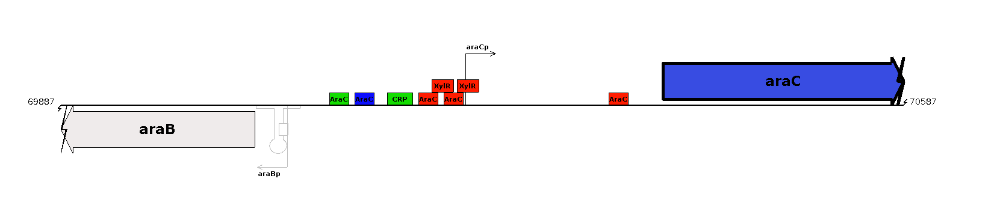
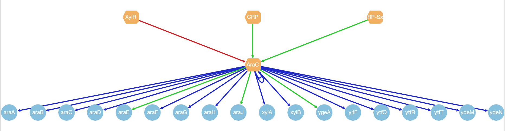

# Introducción a la Bioinformática

### Examen 1b

#### Objetivo
El objetivo de éste examen es evaluar si el alumno entendio los conceptos básicos de unix, de las bases de datos biológicas y sus formatos. También, se revisa que el alumno haya desarrollado las habilidades computacionales básicas para el manejo de datos biológicos.

#### Entregables
El examen incluye el uso de comandos para el manejo de archivos y directorios, conteos y búsqueda de patrones, asi como el concepto de bases de datos biológicas y sus formatos.

Los entregables del examen son:

> a. Este documento, subido en la plataforma dentro de la actividad examen1b. 
> b. En el servidor, un directorio llamado examen1 tendrá todo los resultados. Se tomará lo que tengas en
el protocolo para REPLICAR la estructura que tienes en el servidor.

#### Instrucciones

- Para cada pregunta, agrega una breve descripción.
- La respuesta agregala en un bloque de código [El bloque de código solo debe traer código y comentarios, si trae otra cosa no será evaluado.]
- Dentro del bloque no olvides poner comentarios que indiquen el algoritmo o lo que estas haciendo.

#### Criterio de Evaluación

__Buenas prácticas__

- Archivos y directorios.

  - Nombrado. Se evaluará que los archivos y directorios sean nombrados de acuerdo al contenido.
  - Nombres aceptables. Los nombres NO deben tener espacios ni caracteres especiales. Solo caracteres alfanumericos y - o _
  
- Organización. La estructura de directorios que se ha usado durante las clases deberá implementarse
para éste exámen. Cada archivo deberá estar en su carpeta correspondiente.
- Código legible y reproducible.

**IMPORTANTE**. Puedes hacer uso de internet, checar tus apuntes. Pero, no puedes preguntar o copiar. Nuestro interés es conocer tus habilidades y lo que necesitamos reforzar durante el curso. Si detectamos respuestas idénticas ( algoritmo + comandos + explicación de respuesta) entre dos o más alumnos se cancela el examen de los involucrados (quien paso la respuesta y quien copio).


## SECCION TEORICA  [20%]

1. ¿Cuál es la estructura recomendada para un proyecto, de acuerdo a las buenas prácticas ? [Clase 1]
2. Para que un experimento o un análisis computacional sea confiable, ¿qué tiene que cumplir?
3. ¿Qué es un patrón? puedes dar dos ejemplos.
4. ¿Menciona 2 formatos usados para manejar las secuencias de DNA o proteínas y sus features o propiedades?
5. Menciona que es una base de datos y dá algunos ejemplos.


## SECCION PRACTICA [80%]

Protocolo para el análisis de la red de regulación de _E. coli_.

#### INTRODUCCIÒN 

Escherichia coli es el organismo gram negativo modelo, y es la especie más ampliamente estudiada en microbiología, consecuentemente, es en el que más avances se han conseguido para comprender sus mecanismos de regulación de la expresión génica (Santos-Zavaleta et al., 2018; Tang 2020).

Además, este microorganismo es comúnmente empleado como plataforma para la obtención de diversos compuestos de manera industrial (Huang et al., 2012; Koppolu and Vasigala 2016), por ello el conocimiento de los mecanismos regulatorios que controlan la expresión génica y por lo tanto su metabolismo son de gran relevancia. En los seres vivos la información necesaria para realizar cualquier proceso biológico está contenida en los genes dentro del genoma. El genoma es la secuencia total de ADN que posee un organismo en
particular, es decir, toda la información necesaria para formar a un organismo y heredar estas características a través de las generaciones.

El genoma de un organismo vivo se encuentra en cada una de sus células. Escherichia coli es un organismo unicelular y se ha determinado completamente su genoma, su tamaño es de un total aproximado de 4.639.221 pares de bases de ADN y se ha identificado experimental y computacionalmente alrededor de 4,600 genes. Se desconoce la función de un tercio de estos genes. En el genoma, aparte de los genes, están codificados otros elementos genéticos, sea que sirvan como un sitio de reconocimiento para moléculas que están dentro de la
célula o bien para formar estructuras que cumplen alguna función. Todos éstos elementos genéticos, son identificados en el genoma a través de su posición en la secuencia de ADN. Todos estos elementos participan en los distintos procesos de la célula.

La transcripción es el proceso en el cual la información contenida en los genes es copiada para sintetizar una macromolécula llamada ARN (ácido ribonucleico) y posteriormente dicho RNA puede ser traducido para sintetizar proteínas. En la transcripción uan de las moléculas encargadas de regular la expresión genética son los reguladores transcripcionales (TFs por su nombre en inglés), que en E. coli existen alrededor de unos 300. Éstos reguladoras controlar la expresión de los aproximadamente 4,600 genes. Algunos de éstos reguladores se dice que son globales porque regulan a muchos genes, mientras que otros se dice que son locales porque regulan a genes muy específicos. La regulación de èstos TFs puede ser como activador o represor, activador(+) cuando ayuda a que el proceso de transcipción inicie y se induzca el gene, la represeión (-) cuando el TFs
bloquea que la polimerasa, encargada de leer la cadena de ADN, inicie el proceso de transcripción.




Fig1. Representación de la regulación transcripcional del gene araC (azul). Los reguladores CRP, AraC, XylR se unen a regiones en el DNA, upstream al gene, para controlar su expresión (cajas verdes -el regulador es un activador de la regulación, cajas rojas -el regulador es un represor de la regulación, azul indica que el regulador tiene ambas funciones). Un regulador puede regular a varios genes en el genoma.

<br>

Para visualizar las interacciones entre regulador y gene regulado se usa la representación de red, donde los nodos suelen ser genes o reguladores, unidos por una linea en color que representa el efecto o función. Al conjunto de genes que regula un regulador se le conoce como regulon.



Fig 2. Regulon AraC. Los genes regulados( nodos en azul) regulados por AraC (nodo amarillo). También, los reguladores de AraC se muestran. Los colores de las líneas indican el efecto: activación (verde), represión (rojo), y dual (azul). La relación del Regulador con su gene regulado es una interacción reguladora.

De manera textual esta información se suele reportar en formato tabular, indicando primero el nombre del regulador, despues el gene regulado y finalmente el efecto del regulador sobre el gene, donde el + suele ser activación, - repressión. Por ejemplo:

```
AraC araC +
AraC araB +
```

#### PLANTEAMIENTO DEL PROBLEMA 


RegulonDB es una base de datos que almacena información sobre la regulación transcripcional de Escherichia coli. Y provee archivos de datos para descarga de la red de regulación, es decir todas aquellas interacciones de regulación de los TFs sobre los genes.

El archivo network_tf_gene.txt las 2 primeras columnas son datos del Regulador transcripcional, las siguientes dos columnas son datos del gene regulado. Después se indica el efecto que tiene la proteina sobre el gene, + indica si lo activa, - si lo reprime, +- si su efecto es dual, es decir tiene ambas funciones. La última columna, es el nivel de Confianza basado en los métodos para determinar dicha interacción (C: confirmed, S: strong, W: weak )
Al parecer, cada linea es una interaccion entre el TF, el gene regulado y su efecto. Si el TF regula el mismo gene con efectos distintos, es decir que lo regula y lo reprime pero en distintas condiciones, serán 2 renglones.

```
1)regulatorId	 2)regulatorName	3)RegulatorGeneName 4)regulatedId	 5)regulatedName	6)function	7) confidenceLevel
RDBECOLIPDC03411	McaS	mcaS	RDBECOLIGNC00313	flhC	+	S 
RDBECOLIPDC03411	McaS	mcaS	RDBECOLIGNC00314	flhD	+	S 
RDBECOLIPDC03411	McaS	mcaS	RDBECOLIGNC03408	csgG	-	S 
RDBECOLIPDC03411	McaS	mcaS	RDBECOLIGNC03409	csgF	-	S 
RDBECOLIPDC03411	McaS	mcaS	RDBECOLIGNC03410	csgE	-	S 
RDBECOLIPDC03411	McaS	mcaS	RDBECOLIGNC03411	csgD	-	S 
RDBECOLIPDC03413	GadY	gadY	RDBECOLIGNC02120	gadW	+	W 
```

Se desea conocer que tanto de la regulación de los genes se conoce en _Escherichia coli_, para eso se necesita un análisis de la información disponible. En la metodología se presentan una serie de preguntas que se desean
conocer.


### METODOLOGÍA

1. Conectate al servidor y en tu cuenta, crea una carpeta llamada examen1b, y crea la estructura para un proyecto de análisis. [ 1% ]
2. Descarga la información del genoma de Escherichia coli K12, su secuencia del genoma, el archivo de features gff, y las secuencias de proteínas si esta disponible, desde NCBI. [ 2% ]
3. Copia el archivo `network-regulator-gene.txt` que esta en /home/compu2/WelcomeBioinfo/datos/examen1b  [2%]
4. SUMMARY. Saquemos un Summary global del archivo de la red de regulación. Explora el archivo y revisa los comentarios para entender las columnas y los datos. Responde las siguientes preguntas [ 10% ]
• Nombre del archivo
• Tamaño del archivo en bytes
• No de líneas del archivo
• No de líneas que son comentarios

5. SOBRE LOS REGULADORES TRANSCRIPCIONALES (TFs) 

a. ¿Cuantos Reguladores transcripcionales se conocen actualmente en E. coli ? [ Tip. Puedes usar columna 1 o 2 y no olvides quitar las lineas de comentarios.]

b. Guarda en un archivo llamado TFs_ecoli.txt la lista de los nombres únicos de los reguladores de E. coli. [ Recuerda guardar el archivo en la carpeta correspondiente ]

c. ¿Cuántos reguladores son activadores (function = "-") ? es decir que regula a sus genes como activador. [ Nota: un TF puede tener más de una función, y podemos contarlo como activador]

d. ¿Cuantos reguladores son represores? es decir que regula a sus genes como represor (function = "-")

e. Reporta en un archivo llamado Total_regulated_genes_by_TF.txt, el número de genes regulados por cada TF, ordenado por el total de genes regulados de mayor a menor.

```
546 CRP
303 FNR
239 Fis
233 IHF
200 H-NS
180 ArcA
132 Fur
125 NarL
106 Lrp
```

### SECCION PARA TENER PUNTOS EXTRA EN EL EXAMEN ---------

f. ¿Cuántos TFs regulan 2 genes ? [ No los cuentes a mano ]

Deberá salir algo como el siguiente ejemplo: 


```
26 2
```

[26 TFs regulan a 2 genes]

g. Obten la distribución de frecuencias de genes regulados por TF y guardalo en un archivo llamado dist_frecuencias_TF.txt Donde se muestre el Total de TFs que regulan a ## número de genes. [ 5% EXTRA]

Debe verse algo como:

```
1 546 # 1 TF regula a 546 genes
1 303
.....
11 10
12 9
10 8
11 7
14 6
16 5
12 4 # 12 TFs regulan a 4 genes
23 3
26 2
9 1 # 9 Tfs regulan a 1 gene
```

6. SOBRE LOS GENES REGULADOS

a. ¿Cuál es el total de genes únicos regulados? [ columna 3 o 4 es lo que puedes usar]

b. Guarda en un archivo el total de genes únicos regulados, y llama ese archivo regulated_genes.txt

c. ¿Cuántos TFs únicos regulan a cada gene ? Muestra en el reporte los 10 más regulados.

Deberia verse algo como esto

```
16 csgG # 16 TFs regulan al gene csgG
16 csgF
16 csgE
16 csgD
14 gadX
13 flhD
13 flhC
11 gadA
10 yhiD
10 hdeB
```

d. Selecciona un Regulador [ FNR, CRP, AraC, LexA .. columna 2 del archivo de la red de regulación], y obten la información del archivo GFF de cada gene regulado por ese Regulador y guardalo en un archivo llamado NombreRegulador_regulated_gene.gff [ por ejemplo si escogiste LexA, seria LexA_regulated_gene.gff ]

e. Saca la distrbución de frecuencias de genes regulados por TFs. [ 5% EXTRA ] 

debería verse algo como lo siguiente:

```
774 1 # 771 genes son regulados por 1 TF
425 2 # 425 genes son regulados por 2 TFs
290 3
160 4
114 5
40 6
27 7
14 8
5 9
14 10
1 11
2 13
1 14
4 16 # 4 genes son regulados por 16 TFs
```

### RESULTADOS 

- Muestra los resultados y puedes dar detalles si es necesario.
- Agrega la estructura del proyecto en el reporte.
- El archivo README, que es el reporte, debe estar también en el servidor dentro de la carpeta del proyecto.

### CONCLUSIONES

Te pedimos 2 tipos de conclusiones

a) Interpretación biológica según los resultados obtenidos. ¿Qué puedes decir de la red de E. coli ? Tomando en cuenta el no de genes ~4600.

b) Conclusiones del curso/comandos. Puedes ayudarte de las siguientes preguntas ¿Que aprendiste durante la realización de la práctica? ¿qué piensas de unix y sus comandos? Cómo viviste el proceso de manejo de datos biológicos?

### BIBLIOGRAFÍA 
Sólo en caso de haber utilizado alguna otra fuente.
