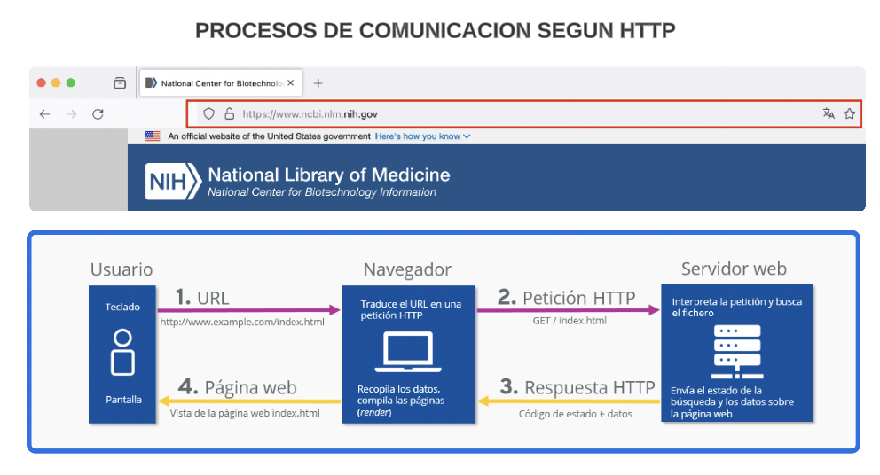
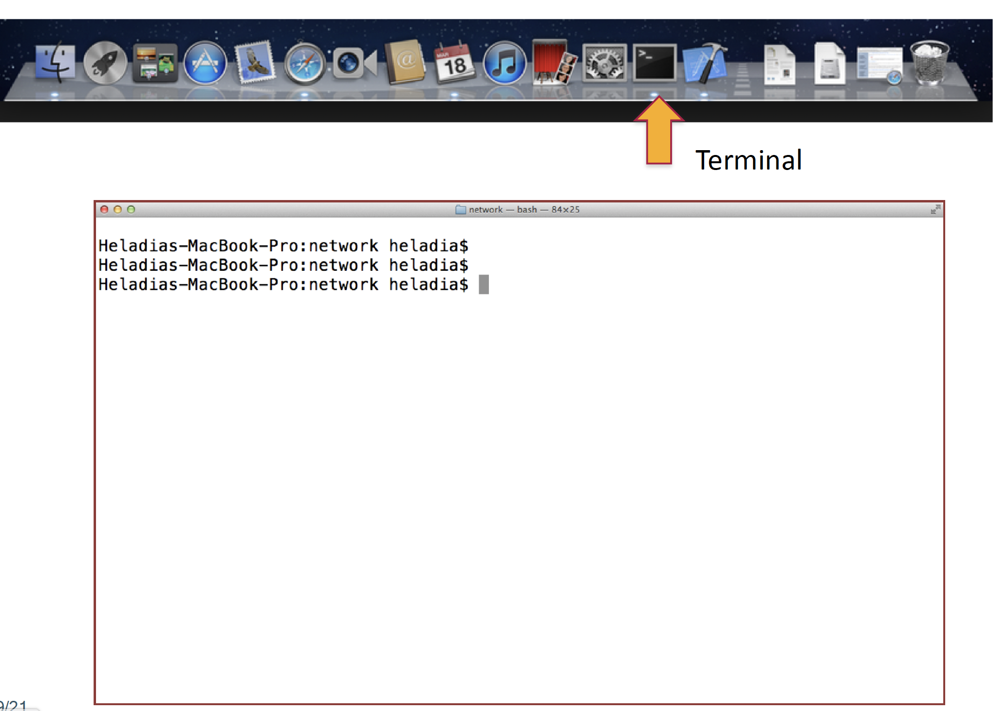
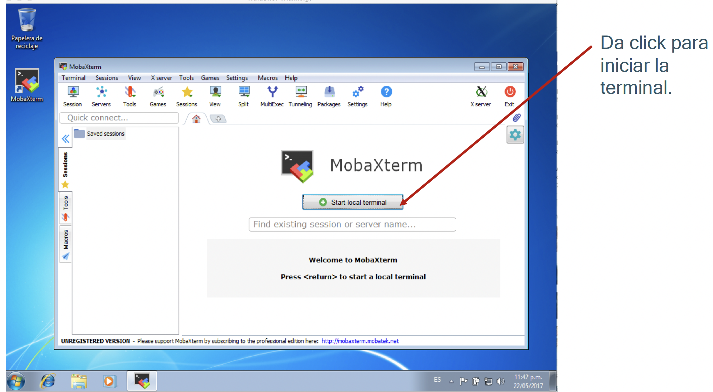
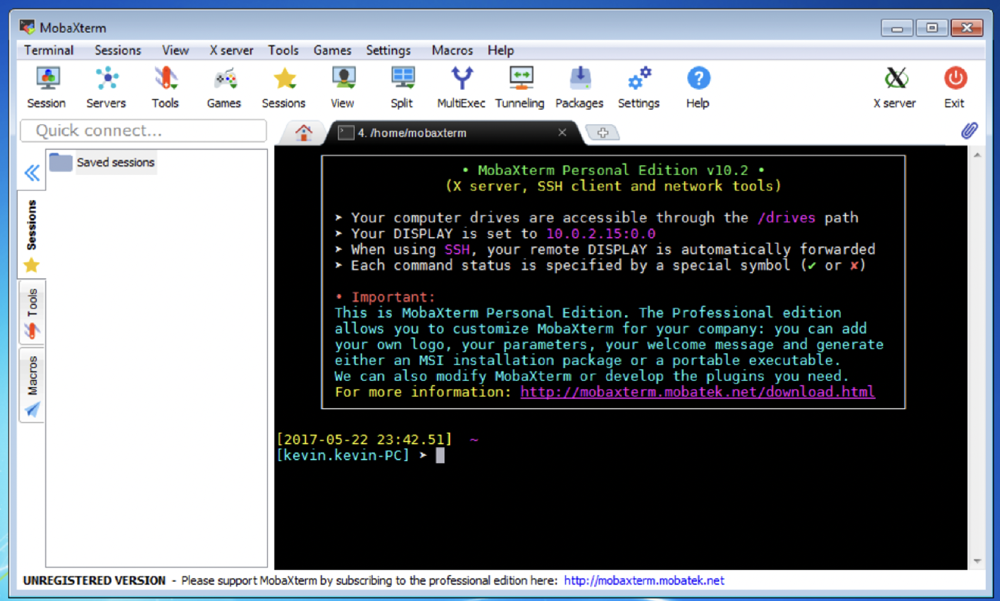
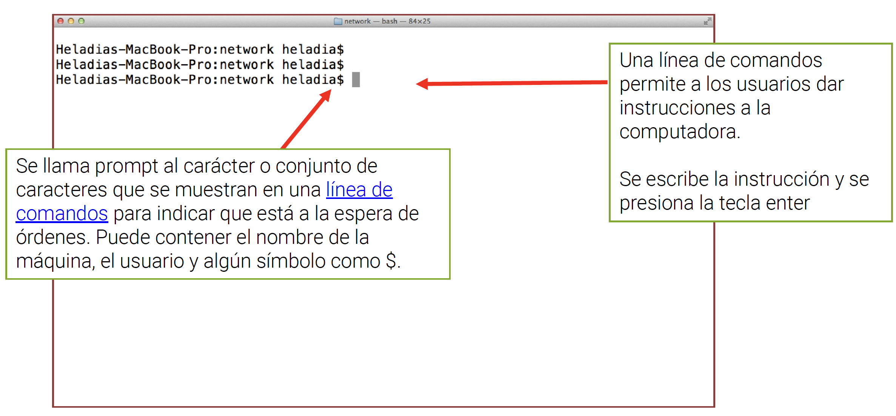

```{r setup, include=FALSE}
knitr::opts_chunk$set(echo = FALSE)
```


```{css, echo = FALSE}
/* From https://github.com/yihui/xaringan/issues/147  */
.scroll-output {
  height: 80%;
  overflow-y: scroll;
}
/* https://stackoverflow.com/questions/50919104/horizontally-scrollable-output-on-xaringan-slides */
pre {
  max-width: 100%;
  overflow-x: scroll;
}
```


## Objetivo

Lxs alumnxs serán capaces de comprender qué es el shell, acceder de manera remota a un servidor Unix y comprender la organización de directorios en unix.

---

class: center, middle

# Antes, unos conceptos básicos


---
## Recursos que usaremos

- computadora personal
- computadora remota (servidor)
- acceso a internet

```{r, out.width = "500px",fig.align='center', fig.cap=''}
knitr::include_graphics("https://aprendelibvrefiles.blob.core.windows.net/aprendelibvre-container/course/creacion_de_sitios_web/image/servinternet_xl.png")
```

---

## Cuando conectas tu computadora a internet...

1. Se conecta a la red por un protocolo llamado *Internet Protocol* (IP).

2. Se asigna una dirección IP tipo 189.183.114.100,  PERO si te conectas via Wi-fi esta dirección no es fija.

--

La familia de protocolos de internet es un conjunto de protocolos de red en los que se basa internet y que permiten **la transmisión de datos entre computadoras**.

```{r, out.width = "350px",fig.align='center', fig.cap=''}
knitr::include_graphics("https://upload.wikimedia.org/wikipedia/commons/7/73/Suite_de_Protocolos_TCPIP.png")
```

---
## Protocolo HTTP

El protocolo de transferencia de hipertexto (en inglés: Hypertext Transfer Protocol, abreviado HTTP) es el protocolo de comunicación que permite las transferencias de información a través de archivos (XML, HTML…) en la World Wide Web. 

```{r, out.width = "700px",fig.align='center', fig.cap=''}

```


---
## Protocolo FTP

El Protocolo de transferencia de archivos (en inglés File Transfer Protocol o FTP) es un protocolo de red para la transferencia de archivos entre sistemas conectados a una red TCP (Transmission Control Protocol), basado en la arquitectura cliente-servidor.

```{r, out.width = "700px",fig.align='center', fig.cap=''}
knitr::include_graphics("https://www.cloudcenterandalucia.es/wp-content/uploads/2021/08/CCA_Protocolo-FTP-1.png")
```

.tiny[Source: https://www.cloudcenterandalucia.es/wp-content/uploads/2021/08/CCA_Protocolo-FTP-1.png]
---
## Protocolo SSH: secure shell

SSH (o Secure SHell) es el nombre de un protocolo y del programa que lo implementa cuya principal función es el acceso remoto a un servidor por medio de un canal seguro en el que toda la información está cifrada. 

```{r, out.width = "700px",fig.align='center', fig.cap=''}
knitr::include_graphics("https://i0.wp.com/lab.wallarm.com/wp-content/uploads/2024/05/160.2.jpg?w=770&ssl=1")
```


---
**¿Qué tienen en común estos dispositivos?**

```{r, out.width = "400px",fig.align='center', fig.cap=''}
knitr::include_graphics("http://1.bp.blogspot.com/-ZGAVLgs4Aas/UT1arCZsL-I/AAAAAAAAGus/L3-M6-jHm7Q/s280/productos+fragmentados.png")
```

--
Sistema Operativo

Un sistema operativo (SO) es el **conjunto de programas** de un sistema informático que **gestiona los recursos de hardware** (memoria, disco duro...) y provee servicios a los programas de aplicación de software. 


---
## Tipos de sistemas operativos

```{r, out.width = "400px",fig.align='center', fig.cap=''}
knitr::include_graphics("https://www.areatecnologia.com/informatica/imagenes/so.jpg")
```

¿Cuál es tu sistema operativo?

---
## Algunas características

```{r, out.width = "600px",fig.align='center', fig.cap=''}
knitr::include_graphics("https://qph.cf2.quoracdn.net/main-qimg-ddd75f97d8583d092d3c8b9a0f553cf9")
```


.tiny[ Te recomiendo este artículo : https://www.freecodecamp.org/news/an-introduction-to-operating-systems/ ]

---
## En Resúmen

- Toda computadora tiene un sistema operativo que la hace funcionar.

- Toda computadora conectada a internet tiene una dirección IP.

- Para comunicar las computadoras se usan los protocolos de internet.

- Los protocolos nos permiten acceder a  páginas html, acceder a archivos de datos, trabajar en un servidor remoto, etc.

---

class: center, middle

# Sistema Operativo Unix


---
## Qué se requiere en Bioinformática ?

Muchos concuerdan en que alguien que piense dedicarse a la bioinformática debe manejar :

1. Un sistema operativo tipo **Unix**.
2. Un lenguaje de programación compilado, preferiblemente C que es el que mejor se integra con Linux
3. Un lenguaje de programación interpretado como Perl o Python, que permite escribir rápidamente scripts
4. Un lenguaje de análisis y graficación de datos como R.

En Bioinformática algunas veces se requiere procesamiento en paralelo por la complejidad y cantidad de operaciones y cálculos (se usan clusters).

---
# Si hay varios SO, ¿Porqué Unix?

El sistema operativo más usado para el desarrollo de la bioinformática es Linux; por el excelente rendimiento en el **procesamiento de datos** nativos, por el **aprovechamiento óptimo de los recursos de hardware** y sobre todo, por ser distribuido en forma **gratuita** bajo la filosofía de código abierto.

Esto ha permitido que se puedan desarrollar muchos programas por individuos, universidades, centros de investigación y empresas.

Es difícil pensar que un solo fabricante pueda desarrollar todo el software necesario en todas las áreas.

Linux mismo evoluciona según las mejoras y correcciones que hace una comunidad y no una empresa.

---
## Características

**Unix** es un sistema operativo que nace a principios de los años 70, creado principalmente por Dennis Ritchie y Ken Thompson.

Sus características técnicas principales son su **portabilidad**, su capacidad **multiusuario** y **multitarea**, su **eficiencia**, su **alta seguridad** y su buen **desempeño** en tareas de red.

Pero Unix, más que una marca, también es una filosofía, que tiene por principios el **minimalismo** y la **modularidad**: hacer programas que hagan una sola cosa bien hecha, y que al comunicarse entre sí, ejecuten tareas más complejas.


---
## Un sistema tipo Unix

```{r, out.width = "400px",fig.align='center', fig.cap=''}
knitr::include_graphics("https://www.brunoribas.com.br/aed1/2013-1/praticas/1/teoria-img1.png")
```


---
## ¿Qué es el shell?

* Es un programa que ejecuta los comandos o programas de unix.

* Es la interfaz para comunicarnos con el sistema Unix.

* Es un lenguaje de programación.


.content-box-blue[

"Unix was not designed to stop its users from doing stupid things, as that would
also stop them from doing clever things".

.pull-right[ .tiny[-- Doug Gwyn (ficcticio o real..)]]

]

.tiny[
Páginas web de interés:

- [Filosofía de Unix.](https://opensource.com/business/14/12/linux-philosophy)
- [Shell Style Guides.](https://google.github.io/styleguide/shellguide.html)
]

---
## ¿Cómo accedemos al shell?

.bold[Unix/Linux]

- Tiene un programa integrado: **Terminal**.


.bold[Mac]

- Tiene un programa integrado: **Terminal**.

- La encuentras en el directorio Aplicaciones/Utilidades.


.bold[Windows]

- Se necesita descargar un programa emulador del ambiente Linux.

- Windows incluye un emulador a partir de Windows 10.  
Una opción amigable: [MobaXTerm](https://mobaxterm.mobatek.net/).

---

## ¿Cómo accedemos al shell? Mac


```{r, out.width = "600px",fig.align='center', fig.cap=''}

```

---
## ¿Cómo accedemos al shell? Windows

.pull-left[
```{r, out.width = "400px",fig.align='center', fig.cap=''}

```
]

.pull-right[
```{r, out.width = "400px",fig.align='center', fig.cap=''}

```
]

---
# La terminal

```{r, out.width = "700px",fig.align='center', fig.cap=''}

```

Desde aqui podemos acceder a todos los recursos de la computadora a través de comandos.

Teclea `ls` es un comando para listar los archivos/carpetas que se encuentran donde estamos.

---
## Sintáxis de los comandos

```{r, out.width = "800px",fig.align='center', fig.cap=''}
knitr::include_graphics(rep("img/sintaxis-comando.png"))
```

---
# Práctica

Prueba los siguientes comandos en la terminal

`whoami` :

`hostname` :

`pwd` : 

---
## ¿Qué es un servidor?

.content-box-blue[
"Un servidor es un sistema que proporciona recursos, datos, servicios o programas
a otros ordenadores, conocidos como clientes, a través de una red. En teoría, se
consideran servidores aquellos ordenadores que comparten recursos con máquinas
cliente".

.pull-right[ .tiny[-- Paessler, the monitoring experts]]
]
---

```{r, out.width = "800px",fig.align='center', fig.cap=''}
knitr::include_graphics(rep("img/diagrama-cliente-servidor.jpeg.webp"))
```

.tiny[Source: https://blog.infranetworking.com/modelo-cliente-servidor/]

---

## ¿Por qué conectarnos a un servidor?

- Mayor cantidad de procesadores y memoria RAM que nuestra computadora personal.

--

- Muchxs usuarixs se pueden conectar y trabajar al mismo tiempo. Agiliza el trabajo colaborativo.

--

- Acceso a los datos e infraestructura desde cualquier parte del mundo.

---
## ¿Cómo conectarnos a un servidor?

Necesitamos:

- Credenciales de acceso del usuario:

    - Nombre.

    - Contraseña.

- Identidad del servidor

    - Nombre o IP del servidor:

      `132.248.220.14`

      `tepeu.lcg.unam.mx`


---

## Mac/Linux Conectándose a un servidor por protocolo ssh

Usando la `Terminal`

**Comando**: `ssh`

**Argumentos**: `user@SERVER`  

Información de identificación necesaria para la conexión


.content-box[
.remark-inline-code[
$ ssh user@SERVER
]
]

Ejemplo

.content-box[
.remark-inline-code[
$ ssh mateom@132.248.220.14
]
]

Nota: Después de un comando va **espacio**. 

---

## Práctica: Tu primera conexión

- Conéctate al servidor `tepeu`, usa tu usuario y tu password.

.content-box[
.remark-inline-code[
$ ssh user@SERVER
]
]

- Te mostrará un mensaje de bienvenida al servidor, y quizás te haga una pregunta.

- Prueba los mismos comandos de la práctica 1, `pwd`, `hostname`, `whoami`

- Desconectate del servidor con el comando `exit`

- Conectate al servidor otra vez para practicar.

---
## Aprendiendo más sobre un comando

.content-box[
.remark-inline-code[
$ man ssh
]]

<br>

**Opciones**

.remark-inline-code[
- -p : Para especificar el puerto de acceso
- -X : Para conectarse abriendo un puerto gráfico (X11)
]

<br>
<br>

Las opciones modifican el funcionamiento de un comando

.content-box[
.remark-inline-code[
$ ssh -p 8080 -X mateom@132.248.220.14
]
]

---
## Nuestros primeros comandos

Siempre es bueno saber dónde estamos conectadxs.
.content-box[
.remark-inline-code[
$ hostname
]]

--
Con qué usuario estamos conectadxs.
.content-box[
.remark-inline-code[
$ whoami
]]

--
La ruta absoluta del directorio donde estamos paradxs.  
<code> ssh</code> ingresaria por default al directorio <i>home</i> del usuario
.content-box[
.remark-inline-code[
$ pwd
]]

--
La estructura de archivos del directorio donde estamos.
.content-box[
.remark-inline-code[
$ tree
]]

---

class: center, middle

# El sistema de archivos en Unix


---

## Sistema de archivos

• Para administrar los dispositivos de almacenamiento masivo (cintas, discos), es necesario que el SO implante el concepto abstracto de fichero.

• Los ficheros almacenan datos y programas y para facilitar su uso se organizan en estructuras denominadas **directorios**.

• Es necesario controlar “quien y como” puede acceder a un fichero.

• Para esto se utilizan ciertas técnicas de protección y seguridad.

.content-box-blue[
un sistema de ficheros vendrá dado por:

- un conjunto de ficheros.

- estructura de directorios.
]

---
## ¿Que es un fichero/archivo ?

• Ente que sirve para el almacenamiento de información.

• Conjunto de información relacionada definida por su creador.

• En general es una secuencia de bits, bytes, líneas o registros definidos por su creador y el usuario.

---
## ¿Qué es un directorio?

Directorio como tipo especial de fichero

• Es un mecanismo o estructura para organizar los ficheros.

• En general un directorio es una estructura de datos que
contiene un **conjunto de entradas o registros** que hacen
referencia a un fichero u otro directorio.

• En UNIX los directorios se implementan como ficheros.

---
# Propiedades de fichero/directorio

|Propiedad        | Descripción     |
|:--              |:--               |
|Nombre de fichero| Nombre simbólico dado por el usuario.|
|Tipo de fichero  | para sistemas que permiten varios tipos.|
|Tamaño           | tamaño del fichero en bits,bytes, bloques.. etc.|
|Protección       |información sobre el control de acceso.|
|Propietario      |usuario que creo el fichero.|
|Hora, fecha…     |información referente a hora y fecha de creación, ultima modificación, último acceso|

---
## Operaciones sobre archivos/directorios

- búsqueda
- creación
- eliminación
- listado del directorio
- copiado
- renombrar

---
## Sistema de archivos en unix


```{r, out.width='100%', fig.align='center', fig.cap=''}
knitr::include_graphics(rep("img/sistema-archivos.png"))
```


---
## Algunos comandos básicos de navegación


|Comando|Función|
|----    |----  |
|ls      |Lista los contenidos de un directorio.|
|mkdir   |Crea un directorio.|
|cd      |Cambia de directorio.|
|cp      |Copia un archivo o directorio.|
|mv      |Mueve un archivo o directorio /<br />Cambiar el nombre de un archivo o directorio.|
|rm      |Elimina un archivo o directorio.|

---
## Algunos tips básicos

|Comando|Función|
|----    |----  |
|TAB     |Autocompletar comandos y nombres de archivos.|
|Flechas arriba y abajo |Navegar en la historia de comandos.|
|Botón derecho del ratón |Copiar y pegar texto.|


---
## Rutas absolutas y relativas

**Ruta absoluta**: Inician desde la raíz.

**Ruta relativa**: Inician desde el directorio actual.

|Comando|Función|
|----    |----  |
|.       |El directorio donde estás parado.|
|..      |Un directorio arriba en la estructura de directorios.|
|../../  |Dos directorios arriba en la estructura de directorios.|
|~/      |Directorio HOME.|

---
## Hagamos algunos ejercicios

- En tu home crea un directorio llamado `practica1`.

- Muévete al directorio `practica1`.

- Crea un directorio llamado `animales`.

- Crea un directorio llamado `plantas`.

- Entra al directorio animales y crea el directorio `osos`.

- Entra al directorio `osos`.

- Regresa a tu directorio `home`.

- Imprime la estructura de directorios que has creado.


```{r echo=FALSE, eval=FALSE}
###En tu home crea un directorio llamado practica1
mkdir practica1
###Mu evete al directorio practica1
cd practica1
###Crea un directorio llamado animales
mkdir animales
###Crea un directorio llamado plantas
mkdir plantas
###Entra al directorio animales
###Y crea el directorio osos
cd animales
mkdir osos
###Entra al directorio osos
cd osos

### Regresa a tu directorio home
cd ~
### Imprime la estructura de directorios que has creado
tree
```

---
## ... unos más

- Regresa al directorio `osos`

- Copia el archivo `panda.txt` (ubicado en
`/home/compu2/WelcomeBioinfo/datos/practica1/` ) utilizando rutas absolutas.

- Mueve el archivo `panda.txt` al directorio `animales` utilizando rutas relativas.

- Entra a la carpeta `plantas` utilizando rutas absolutas

- Copia el archivo `geranio.txt` (ubicado en
`/home/compu2/WelcomeBioinfo/datos/practica1/`) utilizando rutas
relativas.

- Lista los archivos que se encuentran en el directorio `animales`.

```{r echo=FALSE, eval=FALSE}
### Regresa al directorio osos
cd animales/osos/
###Copia el archivo panda.txt
###utilizando rutas absolutas
cp /home/compu2/WelcomeBioinfo/datos/practica1/panda.txt \
/home/$USER/practica1/animales/osos
###Mueve el archivo panda.txt al directorio animales
###utilizando rutas relativas
mv panda.txt ../
###Entra a la carpeta plantas (rutas absolutas)
cd /home/$USER/practica1/plantas/
###Copia el archivo geranio.txt utilizando rutas relativas
cp ../../../compu2/WelcomeBioinfo/\
datos/practica1/geranio.txt .
###Lista los archivos del directorio animales
ls ../animales

```

---
## ... ya casi

- Colócate en tu directorio `practica1` e imprime la estructura de directorios desde ahí. 

- Elimina el archivo `geranio.txt`.

- Elimina la carpeta `osos`.

- Vuelve a imprimir la estructura de directorios desde tu directorio
`practica1`.

```{r echo=FALSE, eval=FALSE}
###Colocate en tu directorio practica1
### imprime la estructura de directorios desde ahi
cd ~/practica1/
tree .
###Elimina el archivo geranio.txt
rm plantas/geranio.txt
###Elimina la carpeta osos
rm -r animales/osos
###Vuelve a imprimir la estructura de directorios
### desde tu directorio practica1
tree .
```

---
## Atajos de teclado en Unix

<br>

|Atajo|Función|
|----    |----  |
|Ctrl + E |Ir al final de la línea.|
|Ctrl + A |Ir al principio de la línea.|
|Ctrl + N |Ir a la línea siguiente.|
|Ctrl + P |Ir a la línea anterior.|
|Ctrl + K |Borrar hasta el final de la línea.|


---
## ¿Cuáles tipos de archivos conoces?

- Archivos de música.

- Archivos de video.

- Archivos binarios  
  - Archivos de Word  
  - Archivos de Excel  
  - Archivos de PowerPoint.
  
- Archivos de texto plano.

- Archivos comprimidos. 

<br>

En bioinformática la mayoría de los archivos con los que se trabaja son
archivos de texto plano.


---
## Conociendo el tipo de archivo

Utilizaremos el comando `file` para conocer el tipo de un archivo.

Muevete a la carpeta  
`/home/compu2/WelcomeBioinfo/datos/practica2/`

--
.content-box[
.remark-inline-code[
$ cd /home/compu2/WelcomeBioinfo/datos/practica2/]]

--
Lista los archivos existentes

--
.content-box[
.remark-inline-code[
$ ls]]

--
Imprime el tipo de un archivo
--
.content-box[
.remark-inline-code[
$ file excel.xlsx]]
--

Imprime el tipo de todos los archivos

--
.content-box[
.remark-inline-code[
$ file *]]

---
## Visualizando distintos tipos de archivos

¿Cómo creen que se vean los distintos tipos de archivos en la terminal si
los abrimos con las herramientas diseñadas para abrir archivos de texto?

<br>

--
Para visualizar el contenido de un archivo utilizaremos el comando `less`

--
<br>

.content-box[
.remark-inline-code[
`### Visualiza cada archivo`  
less word.docx]]

--

<br>

- Los archivos de texto plano son los únicos que pueden ser visualizados
correctamente.

- La extensión de los archivos no es relevante.


---
## Archivos comprimidos

Los archivos de texto comprimidos pueden ser descomprimidos utilizando
alguno de los siguientes comandos:

- `gunzip`

- `unzip`


---
## Práctica: descomprimir y visualizar

- Copia el archivo `texto-plano3.txt.gz` a tu `home`.

- Regresa a tu `home`.

- Descomprímelo y visualízalo.

- Elimina este archivo de tu `home`.

```{r echo=FALSE, eval=FALSE}
### Copia el archivo texto-plano3.txt.gz a tu home
cp texto-plano3.txt.gz ~
### Regresa a tu home
cd ~
### Descomprime el archivo
gunzip texto-plano3.txt.gz
### Visualiza el archivo descomprimido
less texto-plano3.txt
### Eliminalo
rm texto-plano3.txt
```

---
## Referencias

Búalo, V. (2015).
Bioinformatics data skills: Reproducible and robust research with open
source tools.
" O'Reilly Media, Inc.".

<!-- https://rsg-ecuador.github.io/unix.bioinfo.rsgecuador/content/Curso_basico/03_Manejo_terminal/4_directorios.html -->


---


---
## Sobre tamaño de los archivos

```{r, out.width='100%', fig.align='center', fig.cap=''}
knitr::include_graphics("https://cdn.goconqr.com/uploads/node/image/102751001/desktop_72629b71-21e6-4640-b2aa-d83db4448892.PNG")
```


