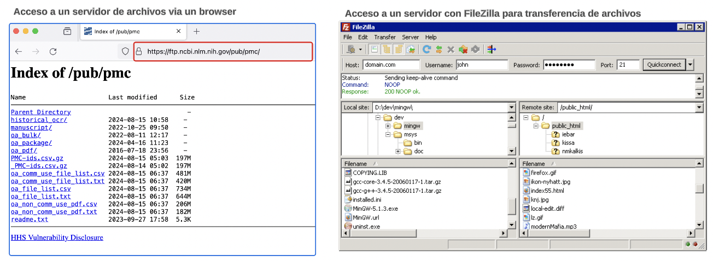

```{r setup, include=FALSE}
knitr::opts_chunk$set(echo = FALSE)
```


```{css, echo = FALSE}
/* From https://github.com/yihui/xaringan/issues/147  */
.scroll-output {
  height: 80%;
  overflow-y: scroll;
}
/* https://stackoverflow.com/questions/50919104/horizontally-scrollable-output-on-xaringan-slides */
pre {
  max-width: 100%;
  overflow-x: scroll;
}
```


## Objetivo

Lxs alumnxs serán capaces de comprender qué es el shell, acceder de manera remota a un servidor Unix y comprender el sistema de archivos en unix.

---

class: center, middle

# Antes, unos conceptos básicos


---
## Recursos que usaremos

- computadora personal
- computadora remota (servidor)
- acceso a internet

```{r, out.width = "500px",fig.align='center', fig.cap=''}
knitr::include_graphics("https://aprendelibvrefiles.blob.core.windows.net/aprendelibvre-container/course/creacion_de_sitios_web/image/servinternet_xl.png")
```

---

## Cuando conectas tu computadora a internet...

1. Se conecta a la red por un protocolo llamado *Internet Protocol* (IP).

2. Se asigna una dirección IP tipo 189.183.114.100,  PERO si te conectas via Wi-fi esta dirección no es fija.

--

La familia de protocolos de internet es un conjunto de protocolos de red en los que se basa internet y que permiten **la transmisión de datos entre computadoras**.

```{r, out.width = "350px",fig.align='center', fig.cap=''}
knitr::include_graphics("https://upload.wikimedia.org/wikipedia/commons/7/73/Suite_de_Protocolos_TCPIP.png")
```

---
## Protocolo HTTP

El protocolo de transferencia de hipertexto (en inglés: Hypertext Transfer Protocol, abreviado HTTP) es el protocolo de comunicación que permite las transferencias de información a través de archivos (XML, HTML…) en la World Wide Web. 

```{r, out.width = "700px",fig.align='center', fig.cap=''}
knitr::include_graphics("img/protocolo-http.png")
```


---
## Protocolo FTP

El Protocolo de transferencia de archivos (en inglés File Transfer Protocol o FTP) es un protocolo de red para la transferencia de archivos entre sistemas conectados a una red TCP (Transmission Control Protocol), basado en la arquitectura cliente-servidor.

```{r, out.width = "700px",fig.align='center', fig.cap=''}
knitr::include_graphics("https://www.cloudcenterandalucia.es/wp-content/uploads/2021/08/CCA_Protocolo-FTP-1.png")
```

.tiny[Source: https://www.cloudcenterandalucia.es/wp-content/uploads/2021/08/CCA_Protocolo-FTP-1.png]
---
# Transferencia de Archivos

```{r, out.width = "700px",fig.align='center', fig.cap=''}

```

---
## Protocolo SSH: secure shell

SSH (o Secure SHell) es el nombre de un protocolo y del programa que lo implementa cuya principal función es el **acceso remoto a un servidor** por medio de un canal seguro en el que toda la información está cifrada. 

```{r, out.width = "700px",fig.align='center', fig.cap=''}
knitr::include_graphics("https://i0.wp.com/lab.wallarm.com/wp-content/uploads/2024/05/160.2.jpg?w=770&ssl=1")
```

---

---
**¿Qué tienen en común estos dispositivos?**

```{r, out.width = "400px",fig.align='center', fig.cap=''}
knitr::include_graphics("http://1.bp.blogspot.com/-ZGAVLgs4Aas/UT1arCZsL-I/AAAAAAAAGus/L3-M6-jHm7Q/s280/productos+fragmentados.png")
```

--
Sistema Operativo

Un sistema operativo (SO) es el **conjunto de programas** de un sistema informático que **gestiona los recursos de hardware** (memoria, disco duro...) y provee servicios a los programas de aplicación de software. 


---
## Tipos de sistemas operativos

```{r, out.width = "400px",fig.align='center', fig.cap=''}
knitr::include_graphics("https://www.areatecnologia.com/informatica/imagenes/so.jpg")
```

¿Cuál es tu sistema operativo?

---
## Algunas características

```{r, out.width = "600px",fig.align='center', fig.cap=''}
knitr::include_graphics("https://qph.cf2.quoracdn.net/main-qimg-ddd75f97d8583d092d3c8b9a0f553cf9")
```


.tiny[ Te recomiendo este artículo : https://www.freecodecamp.org/news/an-introduction-to-operating-systems/ ]

---

# GUI vs CLI

Para interactuar con el sistema operativo podemos hacerlo usando una **interfaz gráfica (GUI)** o a través de **linea de comandos (CLI)**.

.content-box-blue[
En una **interfaz gráfica**, se usa el **mouse** u otro dispositivo **apuntador** con el que se hace "click" en cada elemento de la pantalla. Por otra parte la **interfaz de línea de comando** muestra un "prompt" o inductor donde **escribimos comandos** y argumentos que ejecutarán las tareas que le asignemos.
]

```{r, out.width = "400px",fig.align='center', fig.cap=''}
knitr::include_graphics("https://miro.medium.com/v2/resize:fit:1400/format:webp/0*9cp4T0Hz-Gmcpku3.png")
```


---

# GUI vs CLI

Si los entornos gráficos son fáciles de usar y bonitos, porqué usar un CLI ?

.content-box-yellow[
**Escenario 1**. Imagina que tienes muchos **archivos de texto** en tu escritorio y quieres **eliminar** solo aquellos archivos que **inician con a y terminan con n**. Cómo lo harias usando la interfaz gráfica?
]

--

.content-box-green[
**Escenario 2**. Imagina que tienes muchos **archivos de texto**, y quieres **buscar** todos aquellos archivos que **contengan cierta palabra o una frase específica**. Cómo lo harias usando la interfaz gráfica?
]

---
## En Resúmen

- Toda computadora conectada a internet tiene una dirección IP.

- Para comunicar las computadoras se usan los protocolos de internet.

- Los protocolos nos permiten acceder a  páginas html, acceder a archivos de datos, trabajar en un servidor remoto, etc.

- Toda computadora tiene un sistema operativo que la hace funcionar.

- Para comunicarnos con el SO de una computadora puede ser a través de una interfaz GUI o CLI.

---

class: center, middle

# Sistema Operativo Unix


---

## Qué se requiere en Bioinformática ?

Muchos concuerdan en que alguien que piense dedicarse a la bioinformática debe manejar :

1. Un sistema operativo tipo **Unix**.
2. Un lenguaje de programación compilado, preferiblemente C que es el que mejor se integra con Linux
3. Un lenguaje de programación interpretado como Perl o Python, que permite escribir rápidamente scripts
4. Un lenguaje de análisis y graficación de datos como R.

En Bioinformática algunas veces se requiere procesamiento en paralelo por la complejidad y cantidad de operaciones y cálculos (se usan clusters).

---
## Sistema Operativo Unix

El sistema operativo más usado para el desarrollo de la bioinformática es **Unix**; por el excelente rendimiento en el **procesamiento de datos** nativos, por el **aprovechamiento óptimo de los recursos de hardware** y sobre todo, por ser distribuido en forma **gratuita** bajo la filosofía de código abierto.

Esto ha permitido que se puedan desarrollar muchos programas por individuos, universidades, centros de investigación y empresas.

Es difícil pensar que un solo fabricante pueda desarrollar todo el software necesario en todas las áreas.

Linux mismo evoluciona según las mejoras y correcciones que hace una comunidad y no una empresa.

---
## Características

**Unix** es un sistema operativo que nace a principios de los años 70, creado principalmente por Dennis Ritchie y Ken Thompson.

Sus características técnicas principales son su **portabilidad**, su capacidad **multiusuario** y **multitarea**, su **eficiencia**, su **alta seguridad** y su buen **desempeño** en tareas de red.

Pero Unix, más que una marca, también es una filosofía, que tiene por principios el **minimalismo** y la **modularidad**: hacer ***programas que hagan una sola cosa bien hecha***, y que al comunicarse entre sí, ejecuten tareas más complejas.

```{r, out.width = "300px",fig.align='center', fig.cap=''}
knitr::include_graphics("https://blogger.googleusercontent.com/img/b/R29vZ2xl/AVvXsEjz7d2lx7ovSFF94vR0YZznml3rjilqeGQTRlt6xeNKj73PnVCh2KPtkdRBx8pt-CviDOolybncQLC9lS4gCIvitDw8v6ycFMWVzNssv679E9__thk2OGt_HX_Ec8DT6JfUKfBwDz5PVEQ/s320/list_640px.jpg")
```

---
## Un sistema tipo Unix

.pull-left[
```{r, out.width = "400px",fig.align='center', fig.cap=''}
knitr::include_graphics("https://www.brunoribas.com.br/aed1/2013-1/praticas/1/teoria-img1.png")
```
]

.pull-right[
```{r, out.width = "400px",fig.align='center', fig.cap=''}
knitr::include_graphics("https://ejerciciosdocencia.wordpress.com/wp-content/uploads/2020/01/135-recursos-gestion-so.jpg?w=768")
```

]

---
## ¿Qué es el shell?

* Es un programa que ejecuta los comandos o programas de unix.

* Es la interfaz para comunicarnos con el sistema Unix.

* Es un lenguaje de programación.


.content-box-blue[

"Unix was not designed to stop its users from doing stupid things, as that would
also stop them from doing clever things".

.pull-right[ .tiny[-- Doug Gwyn (ficcticio o real..)]]

]

.tiny[
Páginas web de interés:

- [Filosofía de Unix.](https://opensource.com/business/14/12/linux-philosophy)
- [Shell Style Guides.](https://google.github.io/styleguide/shellguide.html)
]

---
## ¿Cómo accedemos al shell?

.bold[Unix/Linux]

- Tiene un programa integrado: **Terminal**.


.bold[Mac]

- Tiene un programa integrado: **Terminal**.

- La encuentras en el directorio Aplicaciones/Utilidades.


.bold[Windows]

- Se necesita descargar un programa emulador del ambiente Linux.

- Windows incluye un emulador a partir de Windows 10.  
Una opción amigable: [MobaXTerm](https://mobaxterm.mobatek.net/).

---

## ¿Cómo accedemos al shell? Mac


```{r, out.width = "600px",fig.align='center', fig.cap=''}
knitr::include_graphics("img/terminal-mac.png")
```

---
## ¿Cómo accedemos al shell? Windows

.pull-left[
```{r, out.width = "400px",fig.align='center', fig.cap=''}
knitr::include_graphics("img/mobaXTerm.png")
```
]

.pull-right[
```{r, out.width = "400px",fig.align='center', fig.cap=''}
knitr::include_graphics("img/moba-terminal.png")
```
]

---
# La terminal

```{r, out.width = "700px",fig.align='center', fig.cap=''}
knitr::include_graphics("img/componentes-terminal.png")
```

Desde aqui podemos acceder a todos los recursos de la computadora a través de comandos.

Teclea `ls` es un comando para listar los archivos/carpetas que se encuentran donde estamos.

---
## Sintáxis de los comandos

```{r, out.width = "800px",fig.align='center', fig.cap=''}
knitr::include_graphics(rep("img/sintaxis-comando.png"))
```

---
# Práctica

1. Abre una `Terminal` en tu computadora. MacOS y Unix busca la `Terminal`, y para Windows abre MobaXTerm y busca la opción de `Terminal`.

2. Prueba los siguientes comandos en la terminal y brevemente indica lo que obtienes.

`whoami` 

`hostname` 

`pwd` 

---
## ¿Qué es un servidor?

.content-box-blue[
"Un servidor es un sistema que proporciona recursos, datos, servicios o programas
a otros ordenadores, conocidos como clientes, a través de una red. En teoría, se
consideran servidores aquellos ordenadores que comparten recursos con máquinas
cliente".

.pull-right[ .tiny[-- Paessler, the monitoring experts]]
]
---

```{r, out.width = "800px",fig.align='center', fig.cap=''}
knitr::include_graphics(rep("img/diagrama-cliente-servidor.jpeg.webp"))
```

.tiny[Source: https://blog.infranetworking.com/modelo-cliente-servidor/]

---

## ¿Por qué conectarnos a un servidor?

- Mayor cantidad de procesadores y memoria RAM que nuestra computadora personal.

--

- Muchxs usuarixs se pueden conectar y trabajar al mismo tiempo. Agiliza el trabajo colaborativo.

--

- Acceso a los datos e infraestructura desde cualquier parte del mundo.

---
## ¿Cómo conectarnos a un servidor?

Necesitamos:

- Credenciales de acceso del usuario:

    - Nombre.

    - Contraseña.

- Identidad del servidor

    - Nombre o IP del servidor:

      `132.248.220.14`

      `tepeu.lcg.unam.mx`


---

## Conectándose a un servidor por protocolo ssh

Usando la `Terminal` de MobaXTerm o la de MacOS

**Comando**: `ssh`

**Argumentos**: `user@SERVER`  

Información de identificación necesaria para la conexión


.content-box[
.remark-inline-code[
$ ssh user@SERVER
]
]

Ejemplo

.content-box[
.remark-inline-code[
$ ssh mateom@132.248.220.14
]
]

Nota: Después de un comando va **espacio**. 

---

## Práctica: Tu primera conexión

- Conéctate al servidor `tepeu`, usa tu usuario y tu password.

.content-box[
.remark-inline-code[
$ ssh user@SERVER
]
]

- Te mostrará un mensaje de bienvenida al servidor, y quizás te haga una pregunta.

- Prueba los mismos comandos de la práctica 1, `pwd`, `hostname`, `whoami`

- Desconectate del servidor con el comando `exit`

- Conectate al servidor una y otra vez para practicar ( `ssh y exit`).

.tiny[
Nota: Aunque hay formas de guardar los datos de conexión para no volver a teclearlos, te recomiendo no hacerlo, para que los memorices (nunca sabes cuando se te olvide la compu y tengas que recordarlos.)
]

---
## Aprendiendo más sobre un comando

.content-box[
.remark-inline-code[
$ man ssh
]]

<br>

**Opciones**

.remark-inline-code[
- -p : Para especificar el puerto de acceso
- -X : Para conectarse abriendo un puerto gráfico (X11)
]

<br>
<br>

Las opciones modifican el funcionamiento de un comando

.content-box[
.remark-inline-code[
$ ssh -p 8080 -X mateom@132.248.220.14
]
]


---
## Aprendiendo más sobre un comando

Veamos la ayuda de los siguiente comandos

- hostname

- pwd 

---
## Aprendiendo más sobre un comando

Donde más buscar ayuda ?

- **Web - Google**

Estratégias de búsqueda

```
comando pwd en unix
qué hace el comando pwd en unix
```

- Chat-gpt


---
## Nuestros primeros comandos

Siempre es bueno saber dónde estamos conectadxs.
.content-box[
.remark-inline-code[
$ hostname
]]

--
Con qué usuario estamos conectadxs.
.content-box[
.remark-inline-code[
$ whoami
]]

--
La ruta absoluta del directorio donde estamos paradxs.  
<code> ssh</code> ingresaria por default al directorio <i>home</i> del usuario
.content-box[
.remark-inline-code[
$ pwd
]]

--
La estructura de archivos del directorio donde estamos.
.content-box[
.remark-inline-code[
$ tree
]]

---

class: center, middle

# El sistema de archivos en Unix


---

## Sistema de archivos

.content-box-blue[ 
Un sistema de archivos en Unix es una **estructura organizada** que el sistema operativo utiliza para **almacenar, organizar, y gestionar archivos y directorios** en un disco o en otros dispositivos de almacenamiento. 
]

### Características Principales de un Sistema de Archivos en Unix

1. **Jerarquía de Directorios**:
   - Los sistemas de archivos en Unix están organizados en una **estructura jerárquica** de directorios, también conocida como **árbol de directorios**. El **directorio raíz ("/")** es el punto de partida de esta jerarquía.

---
## Sistema de archivos

2. **Archivos y Directorios**:
   - **Archivos**: Son las unidades básicas de almacenamiento de datos. Pueden contener texto, datos binarios, programas ejecutables, etc.
   - **Directorios**: Son contenedores que pueden almacenar archivos y otros directorios (subdirectorios).

3. **Permisos y Propiedades**:
   - Cada archivo y directorio tiene permisos asociados que controlan quién puede leer, escribir o ejecutar el archivo. Estos permisos se dividen en tres categorías: propietario, grupo y otros.
   - Además, cada archivo y directorio tiene propiedades como el propietario, el grupo, el tamaño, las marcas de tiempo (creación, modificación, acceso), entre otras.
   

[Tree File system](https://www.ibm.com/docs/es/aix/7.3?topic=tree-root-file-system)


---
## ¿Que es un fichero/archivo ?

• Ente que sirve para el almacenamiento de información.

• Conjunto de información relacionada definida por su creador.

• En general es una secuencia de bits, bytes, líneas o registros definidos por su creador y el usuario.


```{r, out.width='35%', fig.align='center', fig.cap=''}
knitr::include_graphics(rep("img/archivo.png"))
```

---

# Propiedades de archivo

|Propiedad        | Descripción     |
|:--              |:--               |
|Nombre de archivo| Nombre simbólico dado por el usuario. Generalmente tiene nombre.extension*|
|Tipo de archivo  | para sistemas que permiten varios tipos.|
|Tamaño           | tamaño del archivo en bits,bytes, bloques.. etc.|
|Protección       |información sobre el control de acceso.|
|Propietario      |usuario que creo el archivo.|
|Hora, fecha…     |información referente a hora y fecha de creación, ultima modificación, último acceso|

* La extensión de un archivo nos indica generalmente el tipo o aplicación que lo generó, por ejemplo una extensión .xlsx viene de excel, .ppt de power point, .txt es un archivo de texto plano.

---
## Operaciones sobre archivos

- búsqueda
- creación
- eliminación
- listado ( en caso de directorios)
- copiado
- renombrar

---
## ¿Qué es un directorio?

Directorio como tipo especial de archivo

• Es un mecanismo o estructura para organizar los archivos.

• En general un directorio es una estructura de datos que
contiene un **conjunto de entradas o registros** que hacen
referencia a un archivo u otro directorio.

• Un directorio es una Estructura arborescente

• con un número Nº arbitrario de entradas (archivos)

• Pero tiene 2 entradas predeterminadas `"."` y `".."`

---
## Estructura de la Organización de los archivos (tipo árbol)

.pull-left[
```{r, out.width='100%', fig.align='center', fig.cap=''}
knitr::include_graphics(rep("img/sistema-archivos.png"))
```
]

.pull-right[

- El árbol tiene una **raíz** "/"

- Se puede llegar a un archivo usando rutas absolutas o relativas.

- Podemos desplazarnos a cualquier parte del árbol.

- Podemos Borrar directorios (ramas)

- Podemos Crear directorios (ramas)

]

---
## Estructura de la Organización de los archivos


| elemento   | descripción |
|----   |-----|
| /     | root, raíz |
| /dev  | Contiene nodos de dispositivos para archivos especiales de dispositivos locales. El directorio /dev contiene archivos especiales para unidades de cintas, impresoras, particiones de disco y terminales. |
| /etc  | Contiene archivos de configuración  |
| /export | Contiene los directorios y archivos de un servidor destinados a clientes remotos.  |
| /home  | /home contiene archivos y directorios organizados por usuario.  |

---
## Cómo nos movemos en el sistema de archivos?

#### Rutas Absolutas
Una ruta absoluta es una ruta que especifica la **ubicación completa** de un archivo o directorio desde el directorio raíz (`/`). No depende del directorio de trabajo actual.

```
/home/compu2
/var/mail
/export/home
```

#### Ventajas:
- No importa en qué directorio te encuentres, una ruta absoluta siempre te llevará al mismo archivo o directorio.

- Es útil para scripts y configuraciones donde necesitas especificar ubicaciones exactas.

---
## Cómo nos movemos en el sistema de archivos?

**Ruta relativa**: Una ruta relativa es una ruta que especifica la **ubicación de un archivo o directorio** en relación con el **directorio de trabajo actual**.

#### Características:
- No comienza con `/`.
- Depende del directorio en el que te encuentres actualmente.

#### Ventajas:
- Más cortas y fáciles de escribir.
- Útiles para scripts y comandos que se ejecutan en diferentes contextos de directorios.


Ejemplos

```
# Si estoy en /home/compu2 y quiero moverme al directorio WelcomeBioInfo
cd WelcomeBioInfo
```

---

## Rutas Relativas

`.` y `..` son entradas especiales que se encuentran en cada directorio y tienen significados específicos. Estan ocultos pero los puedes visualzar con `ls -la`

|        |Descripción|
|----    |----  |
|.       |El directorio donde estás parado.|
|..      |Un directorio arriba en la estructura de directorios.|
|../../  |Dos directorios arriba en la estructura de directorios.|
|../otro_directorio/| Se refiere a `otro_directorio` en el directorio padre.|
|~/      |Directorio HOME.|

---
## como movernos

```{r, out.width='100%', fig.align='center', fig.cap=''}
knitr::include_graphics(rep("img/papas-hijos.png"))
```

---
## Ejercicio: 

.pull-left[
```{r, out.width='100%', fig.align='center', fig.cap=''}
knitr::include_graphics(rep("img/sistema-archivos.png"))
```
]


.pull-right[

**Rutas absolutas** 

De `bin` es:   
De `compu2` es:  
De `practica2` es:  
De `panda.txt`es:   

** Rutas relativas, partiendo de compu2**

De `WelcomeBioInfo` es  
De `practica2` es :  
De `home` es:  
De `/`es :   

]
---
## Algunos comandos básicos relacionados con el sistema de archivos

- `ls`: Lista el contenido de un directorio.
- `cd`: Cambia el directorio actual.
- `pwd`: Muestra el directorio de trabajo actual.
- `mkdir`: Crea un nuevo directorio.
- `rmdir`: Elimina un directorio vacío.
- `rm`: Elimina archivos o directorios.
- `chmod`: Cambia los permisos de un archivo o directorio.
- `chown`: Cambia el propietario de un archivo o directorio.
- `df`: Muestra el uso del espacio en disco.
- `du`: Muestra el uso del espacio en disco por archivos y directorios.

---
## Algunos tips básicos

|Comando|Función|
|----    |----  |
|TAB     |Autocompletar comandos y nombres de archivos.|
|Flechas arriba y abajo |Navegar en la historia de comandos.|
|Botón derecho del ratón |Copiar y pegar texto.|


---

## Hagamos algunos ejercicios

- Vamos a conectarnos al servidor `tepeu`

- Vamos a ver donde estamos parados dentro del sistema de archivos (el árbol)

- listemos lo que hay en esa parte del árbol

- Movámonos a la raíz del árbol y chequemos donde estamos parados

- listemos lo que hay en raíz

- Nos movemos dentro del directorio home usando rutas absolutas.

- Voy a moverme al directorio `datos` usando rutas absolutas

- Voy a moverme al directorio `compu2` usando rutas absolutas

```{r echo=FALSE, eval=FALSE}
pwd
ls
cd /
pwd
ls
cd /home
pwd
cd /home/compu2/WelcomeBioInfo/datos
pwd
cd /home/compu2/
# incluir algunos errores de paths o escribir mal el comando 
# para que vean los errores y explicar como resolverlos.
```

---
## rutas relativas

- Estoy en compu2, voy a entrar a WelcomeBioInfo

- Estando en WelcomeBioInfo, voy a entrar a `datos`

- Estando en `datos`, entrar al directorio `practica1` y listar.

- Listemos TODO lo que hay en el directori de `practica1` incluyendo lo oculto (ver directorio . y ..)

- Estando en `practica1` y vamos a subir un nivel, es decir a `datos`

- Estamos en `datos` subimos otro nivel.

- Estamos en `WelcomeBioInfo` vamos a subir 2 niveles. Dónde estamos?

- Si estamos en `home` queremos ir a practica1 usando rutas relativas

- Estando en `practica1` nos movemos dentro del `practica3`

```{r echo=FALSE, eval=FALSE}
cd WelcomeBioInfo
pwd
cd datos
cd practica1
pwd
ls -la
cd ..
cd ..
cd ../../
cd compu2/WelcomeBioInfo/datos/practica1
cd ../practica3
```

---
# Creando directorios

```
man mkdir
```

---
## Hagamos algo más complejo


- En tu home crea un directorio llamado intro-bioinfo

- Vamos a movernos dentro de esa rama o directorio

- Creamos un directorio llamado `practica1`.

- Muévete dentro del directorio `practica1`.

- Crea un directorio llamado `animales`.

- Crea un directorio llamado `plantas`.

- Entra al directorio animales y crea el directorio `osos`.

- Entra al directorio `osos`.

- Regresa a tu directorio `home`.

- Imprime la estructura de directorios que has creado.


```{r echo=FALSE, eval=FALSE}
mkdir intro-bioinfo
cd intro-bioinfo

###En tu home crea un directorio llamado practica1
mkdir practica1
###Mu evete al directorio practica1
cd practica1
###Crea un directorio llamado animales
mkdir animales
###Crea un directorio llamado plantas
mkdir plantas
###Entra al directorio animales
###Y crea el directorio osos
cd animales
mkdir osos
###Entra al directorio osos
cd osos

### Regresa a tu directorio home
cd ~
### Imprime la estructura de directorios que has creado
tree

# el profesor generar una  carpeta con varios directorios y hace un tree
# le pide a los alumnos que la repliquen como ejercicio.

# Surgen varios errores: alumno se equivoca y al poner el nombre de la carpeta
# quiere renombrar el archivo -- se replica error y se muestra como corregirlo
# otro error cuando se crean multiples directorios, 
# mkdir animales/perros gatos osos
# solo se le puso el path correcto a perros y gatos y osos no son hijos de animales
# sino hermanos de animales. Explicar el error y corregirlo moviendo los directorios
```

---
## ... unos más

- Regresa al directorio `osos`

- Copia el archivo `panda.txt` (ubicado en
`/home/compu2/WelcomeBioinfo/datos/practica1/` ) utilizando rutas absolutas.

- Mueve el archivo `panda.txt` al directorio `animales` utilizando rutas relativas.

- Entra a la carpeta `plantas` utilizando rutas absolutas

- Copia el archivo `geranio.txt` (ubicado en
`/home/compu2/WelcomeBioinfo/datos/practica1/`) utilizando rutas
relativas.

- Lista los archivos que se encuentran en el directorio `animales`.

```{r echo=FALSE, eval=FALSE}
### Regresa al directorio osos
cd animales/osos/
###Copia el archivo panda.txt
###utilizando rutas absolutas
cp /home/compu2/WelcomeBioinfo/datos/practica1/panda.txt \
/home/$USER/practica1/animales/osos
###Mueve el archivo panda.txt al directorio animales
###utilizando rutas relativas
mv panda.txt ../
###Entra a la carpeta plantas (rutas absolutas)
cd /home/$USER/practica1/plantas/
###Copia el archivo geranio.txt utilizando rutas relativas
cp ../../../compu2/WelcomeBioinfo/\
datos/practica1/geranio.txt .
###Lista los archivos del directorio animales
ls ../animales

```

---
## ... ya casi

- Colócate en tu directorio `practica1` e imprime la estructura de directorios desde ahí. 

- Elimina el archivo `geranio.txt`.

- Elimina la carpeta `osos`.

- Vuelve a imprimir la estructura de directorios desde tu directorio
`practica1`.

```{r echo=FALSE, eval=FALSE}
###Colocate en tu directorio practica1
### imprime la estructura de directorios desde ahi
cd ~/practica1/
tree .
###Elimina el archivo geranio.txt
rm plantas/geranio.txt
###Elimina la carpeta osos
rm -r animales/osos
###Vuelve a imprimir la estructura de directorios
### desde tu directorio practica1
tree .
```

---
## Atajos de teclado en Unix

<br>

|Atajo|Función|
|----    |----  |
|Ctrl + E |Ir al final de la línea.|
|Ctrl + A |Ir al principio de la línea.|
|Ctrl + N |Ir a la línea siguiente.|
|Ctrl + P |Ir a la línea anterior.|
|Ctrl + K |Borrar hasta el final de la línea.|


---

class: center, middle

# Archivos


---
## ¿Cuáles tipos de archivos conoces?

- Archivos de música.

- Archivos de video.

- Archivos binarios  
  - Archivos de Word  (.doc, .docx)
  - Archivos de Excel  (.xls)
  - Archivos de PowerPoint. (.pptx)
  
- Archivos de texto plano. (.txt)

- Archivos comprimidos. 

<br>

En bioinformática la mayoría de los archivos con los que se trabaja son
archivos de texto plano.


---
## Conociendo el tipo de archivo

Utilizaremos el comando `file` para conocer el tipo de un archivo.

Muevete a la carpeta  
`/home/compu2/WelcomeBioinfo/datos/practica2/`

--
.content-box[
.remark-inline-code[
$ cd /home/compu2/WelcomeBioinfo/datos/practica2/]]

--
Lista los archivos existentes

--
.content-box[
.remark-inline-code[
$ ls]]

--
Imprime el tipo de un archivo
--
.content-box[
.remark-inline-code[
$ file excel.xlsx]]
--

Imprime el tipo de todos los archivos

--
.content-box[
.remark-inline-code[
$ file *]]

---
## Visualizando distintos tipos de archivos

¿Cómo creen que se vean los distintos tipos de archivos en la terminal si
los abrimos con las herramientas diseñadas para abrir archivos de texto?

<br>

--
Para visualizar el contenido de un archivo utilizaremos el comando `less`

--
<br>

.content-box[
.remark-inline-code[
`### Visualiza cada archivo`  
less word.docx]]

--

<br>

- Los archivos de texto plano son los únicos que pueden ser visualizados
correctamente en una CLI.

- No es suficiente con cambiar el nombre del archivo o su extensión para visualizarlos.


---
## Archivos comprimidos

.content-box-blue[
Un archivo comprimido prácticamente es idéntico al original, pero reduciendo su tamaño, mediante algoritmos de comprensión de datos. 
]

Las herramientas de compresión permiten reducir el espacio de disco de uno o varios archivos basándose en diferentes algoritmos de compresión. Algunos de ellos permiten al mismo tiempo **empaquetar** varios archivos o carpetas dentro de un mismo archivador. 

Tipos: Zip, Gzip, Bzip2, TAR, Rar, 7z


Comandos:

- `gzip` - `gunzip`

- `zip` - `unzip`

- hay más...

---
## Descomprimir y visualizar

- Estando en `/home/compu2/WelcomeBioinfo/datos/practica2/`

- Copia el archivo `texto-plano3.txt.gz` a tu `home`.

- Regresa a tu `home`.

- Visualiza el archivo `texto-plano3.txt.gz`. Cómo se ve?

- Descomprímelo, lista el directorio, ¿qué pasó?

- Ahora visualiza el archivo

```{r echo=FALSE, eval=FALSE}
### Copia el archivo texto-plano3.txt.gz a tu home
cp texto-plano3.txt.gz ~
### Regresa a tu home
cd ~
less texto-plano3.txt.gz

### Descomprime el archivo
gunzip texto-plano3.txt.gz
### Visualiza el archivo descomprimido
ls
less texto-plano3.txt

```

---
## Comprimir UN archivo

- lista el directorio

- Vamos a comprimir el archivo `texto-plano3.txt.gz`

- lista el directorio, ¿qué pasó?

```{r echo=FALSE, eval=FALSE}
ls
gzip texto-plano3.txt.gz
ls
```

---
# Comprimir y empaquetar un directorio o varios archivos

Empaquetar. Es agrupar en un solo fichero varios ficheros y/o directorios. 

```
zip [options] zipfile files_list
```

- options: opciones que modifican el comportamiento del comando
- zipfile: es el nombre del archivo que empaqueta y comprime todos los archivos
- files_list: es la lista de archivos a empaquetar y comprimir

---

# Ejercicio

- Descomprime el archivo `texto-plano3.txt`
- Genera 2 copias del archivo `texto-plano3.txt`, con el nombre `texto-plano4.txt` y `texto-plano5.txt`
- Empaquetar y comprimir los 3 archivos.


```{r echo=FALSE, eval=FALSE}
ls
gunzip texto-plano3.txt.gz
ls
cp texto-plano3.txt texto-plano4.txt
cp texto-plano3.txt texto-plano5.txt
zip texto-plano_archivos.zip texto-plano3.txt texto-plano4.txt texto-plano5.txt
```

---
## Trabajando con archivos comprimidos

No es necesario descomprimir un archivo de texto para usarlo.

---
## Los permisos

.content-box-blue[
Los permisos de archivos y directorios son fundamentales para la seguridad y la gestión de recursos. Los permisos determinan quién puede leer, escribir o ejecutar un archivo o directorio.
]

Cada archivo y directorio en Unix tiene tres tipos de permisos:

1. **Lectura (r)**: Permite ver el contenido del archivo o listar el contenido del directorio.
2. **Escritura (w)**: Permite modificar el contenido del archivo o hacer cambios en el contenido del directorio (crear, eliminar, renombrar archivos).
3. **Ejecución (x)**: Permite ejecutar el archivo (si es un programa o script) o acceder al directorio (entrar en él con `cd`).

---

### Categorías de Usuarios

Los permisos se aplican a tres categorías de usuarios:

1. **Propietario (u)**: El usuario que posee el archivo o directorio.
2. **Grupo (g)**: Un grupo de usuarios que tienen permisos específicos sobre el archivo o directorio.
3. **Otros (o)**: Todos los demás usuarios que no son el propietario ni pertenecen al grupo.

---
## Representación de Permisos

Los permisos se representan en una cadena de 10 caracteres, por ejemplo: 

`-rwxr-xr--`.

- El primer carácter indica el tipo de archivo:
  - `-` para un archivo regular.
  - `d` para un directorio.
  - `l` para un enlace simbólico.
  - Otros caracteres pueden indicar otros tipos de archivos especiales.

- Los siguientes nueve caracteres se dividen en tres grupos de tres:
  - **Propietario**: Los primeros tres caracteres (`rwx` en el ejemplo) indican los permisos del propietario.
  - **Grupo**: Los siguientes tres caracteres (`r-x` en el ejemplo) indican los permisos del grupo.
  - **Otros**: Los últimos tres caracteres (`r--` en el ejemplo) indican los permisos de otros usuarios.


---
## Ejemplo

### Ejemplo de Permisos

- `-rwxr-xr--`:
  - `-`: Archivo regular.
  - `rwx`: El propietario tiene permisos de lectura, escritura y ejecución.
  - `r-x`: El grupo tiene permisos de lectura y ejecución.
  - `r--`: Otros usuarios tienen permisos de lectura.
  
---
## Ejercicio

a. Qué permisos describe la siguiente representación ?

`drwxr-xr-x`:   
`-r--r--r--`:  
`-rwx------`:  
`-r--r--rwx`:    


--

b. Chequemos los permisos de algunos directorios y archivos en tu usuario  
  - Tu directorio (usuario) en home.  
  - Tu directorio intro-bioinfo.  

c. Pídele a tu compañero su usuario de unix y revisa los permisos de lo siguiente:
  - El directorio home de tu compañero
  - El directorio `intro-bioinfo`
  - intro-bioinfo/variacion_genetica/mutaciones/mutacion3.txt

---
## Comandos para Gestionar Permisos

#### `ls -l`

El comando `ls -l` muestra una lista detallada de archivos y directorios, incluyendo sus permisos.

```sh
ls -l
```

#### `chmod`

El comando `chmod` se utiliza para cambiar los permisos de un archivo o directorios. El símbolo `+` otorga y `-` quita los permisos.

- **Modo simbólico**:

  ```sh
  chmod u+rwx,g+rx,o+r archivo.txt
  ```
  
Esto otorga permisos de lectura, escritura y ejecución al propietario, permisos de lectura y ejecución al grupo, y permisos de lectura a otros.

---

- **Modo numérico**:
  Los permisos también se pueden representar con números:
  - `r` = 4
  - `w` = 2
  - `x` = 1

  Por ejemplo, `chmod 755 archivo.txt` otorga:
  - `7` (rwx) al propietario.
  - `5` (r-x) al grupo.
  - `5` (r-x) a otros.

---

## Ejercicio

a. Establece los permisos usando ambos formatos simbólico y numérico:

`drwxr-xr-x`:   `chmod grwx,gorx file`  --    `chmod 755 file`   
`-r--r--r--`:  
`-rwx------`:  
`-r--r--rwx`:   
`-rwx--x--x`:  
`----------`:

--

b. Realiza lo siguiente:

- Cambia los permisos de tu directorio `intro-bioinfo` para que solo tú tengas todos los permisos.
- Quita los permisos de ejecución del directorio `tmp` para el grupo y otros.
- Dale permisos al grupo y a otros de rw sobre el archivo `texto-plano3.txt` en tu home
- Trata de entrar al directorio `intro-bioinfo` de tu compañero. ¿Qué pasa?
- Trata de entrar al directorio `tmp` de tu compañero. ¿Qué pasa?
- Borra el archivo `texto-plano3.txt` de tu compañero. Lista el directorio de tu compañero. ¿Qué paso?

---
## Referencias

Búalo, V. (2015).
Bioinformatics data skills: Reproducible and robust research with open
source tools.
" O'Reilly Media, Inc.".

<!-- https://rsg-ecuador.github.io/unix.bioinfo.rsgecuador/content/Curso_basico/03_Manejo_terminal/4_directorios.html -->


---


---
## Sobre tamaño de los archivos

```{r, out.width='100%', fig.align='center', fig.cap=''}
knitr::include_graphics("https://cdn.goconqr.com/uploads/node/image/102751001/desktop_72629b71-21e6-4640-b2aa-d83db4448892.PNG")
```


