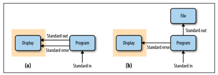

```{r setup, include=FALSE}
knitr::opts_chunk$set(echo = FALSE)
```


```{css, echo = FALSE}
/* From https://github.com/yihui/xaringan/issues/147  */
.scroll-output {
  height: 80%;
  overflow-y: scroll;
}

.noinverse {
  background-color: #272822;
  color: #d6d6d6;
  text-shadow: 0 0 20px #333;
}

/* https://stackoverflow.com/questions/50919104/horizontally-scrollable-output-on-xaringan-slides */
pre {
  max-width: 100%;
  overflow-x: scroll;
}
```


## Objetivo

Lxs alumnxs deberán ser capaces de comprender los redireccionamientos y las tuberías.

---

## Contenido de la unidad

1. Redireccionamientos.

2. Tuberías.


---

class: inverse, center, middle

# Redireccionamientos / Flujos

---
## Resumen de comandos


---
## Procesos

Un proceso es la instancia de un programa. Y como instancia, podemos crear la n cantidad que deseemos. 

Por ejemplo, cuando ejecutamos el comando ls, para listar todo el contenido de un directorio , estaremos creando un nuevo proceso, ya que estaremos ejecutando un programa. 

todos los procesos poseen 4 atributos que nos permitirán gestionarlos: PID, PPID, TTY, UID

Veamos los procesos para los siguientes ejemplos:

```
less  GCF_000005845.2_ASM584v2_feature_table.txt
nano  hola.txt
```
---
## Streams o flujos de datos

.content-box-yellow[

Todos los programas informáticos siguen el mismo principio general: los **datos recibidos** de alguna fuente **se transforman** para generar **un resultado**. A ésto se le llama **flujo de datos**.

]

- Fuente de datos: un archivo local, un archivo remoto, un dispositivo (como un teclado).

- La salida del programa generalmente se representa en una pantalla, pero también es común almacenar los datos de salida en un archivo local, enviarlo a un dispositivo remoto, etc.

---
## Streams o flujos de datos

.content-box-gray[
```
cat   mi_archivo.txt
```
]

- Entrada o fuente de datos: `mi_archivo.txt`
- Salida: Imprime en pantalla el contenido de `mi_archivo.txt` 

--

```{r, out.width = "250px",fig.align='center', fig.cap=''}
knitr::include_graphics("https://bioinf.comav.upv.es/courses/unix/_images/cli_program.png")
```
.pull-right[ .tiny[Fuente: https://bioinf.comav.upv.es/courses/unix/pipes.html]]

--

Otros ejemplos:  `mkdir`, `less`. 

---
## Streams o flujos de datos

Los sistemas operativos inspirados en Unix, como Linux, ofrecen una gran variedad de métodos de **entrada/salida para los procesos**.

¿Qué es un proceso?

.content-box-blue[
- Un proceso no es más que un **entorno especial** creado para la **ejecución de un programa**.

- Una vez el programa finaliza, el proceso lo hará de igual manera.

- Un proceso es la instancia de un programa. Y como instancia, podemos crear la cantidad que deseemos.

]

Por ejemplo, cuando **ejecutamos el comando `ls`**, para listar todo el contenido de un directorio, estaremos **creando un nuevo proceso**, ya que estaremos ejecutando un programa. 

---
## Streams o flujos de datos

Los **procesos estándar de Linux** tienen **tres canales de comunicación** abiertos de forma predeterminada:

- Standard input | `stdin` : Es el flujo a través del cual un programa *lee* sus
datos de entrada.
- Standard output | `stdout`: Es el flujo a través del cual un programa *escribe* su
salida.
- Standard error | `stederr`: Es el flujo a través del cual un programa *escribe* los
mensajes de error.


```{r, out.width = "600px",fig.align='center', fig.cap=''}
knitr::include_graphics("https://3.bp.blogspot.com/-ymegYlOErB8/W_Zj8O-YM8I/AAAAAAAAD9g/jN4gkmtgdYsLG_GATONPejb5tVsn0aAhACLcBGAs/s1600/std-out.jpg")
```

.tiny[[Image source: Linux Standard input, output, and error explained](https://techinfoeasy.blogspot.com/2018/11/linux-standard-input-output-and-error.html)]

---
## Streams o flujos de datos

A cada **archivo asociado con un proceso** se le asigna un número único para identificarlo. Esto se llama **descriptor de archivo**. Siempre que sea necesario realizar una acción en un archivo, el descriptor de archivo se utiliza para identificar el archivo.

|Number |Channel Name |Description | Default Connection | Usage |
|---    |---          |---         |---                 |---    |
|0 	    |stdin 	      |Standard input  |Keyboard 	|Read only.   |
|1 	    |stdout 	    |Standard output |Terminal 	|Write only.  |  
|2 	    |stderr 	    |Standard error  |Terminal 	|Write only.  |
|3+ 	 |filename 	    |Other files 	   |none 	    |Read and/or write.|

.tiny[Se construye una estructura de proceso con canales numerados (descriptores de archivo) para administrar archivos abiertos. Los **procesos se conectan a los archivos para llegar al contenido de los datos** o a los dispositivos que estos archivos representan. Los procesos se crean con **conexiones predeterminadas para los canales 0, 1 y 2, conocidas como entrada estándar, salida estándar y error estándar**. Los procesos usan los canales 3 y superiores para conectarse a otros archivos.]

---
## Streams en Unix


```{r, out.width = "700px",fig.align='center', fig.cap=''}

```

.pull-right[ .tiny[Fuente: Imagen tomada de Bioinformatics Data Skills]]


El **standard output** y el **standard error** generalmente se imprimen a
pantalla, a menos que sean redirigidos.


.pull-left[ .tiny[[Definiciòn y Ejemplos de  Streams](https://ubuntinux.blogspot.com/2019/10/definicion-y-ejemplos-de-entrada.html)]]


---
## Stream stdout y stderr

¿Cuál es el standard input, output y error en este ejemplo?

.content-box-blue[

En el directorio actual existen los archivos `personal_info.txt` y `hola.txt`, pero el archivo `NA.txt` no.

]

```bash
## cat despliega el contenido de un arhivo sin pausar, todo de jalón.
## El canal de entrada (stdin) del comando cat recibe el archivo personal_info.txt
cat personal_info.txt

## Cat puede recibir N archivos por su canal stdin
cat personal_info.txt  hola.txt
```

---
## Stream stdout y stderr

¿Cuál es el standard input, output y error en este ejemplo?

En el directorio actual existen los archivos `personal_info.txt` y `hola.txt`, pero el archivo `NA.txt` no.


```bash
## Concatenemos el archivo personal_info.txt y NA.txt:
## El canal de entrada recibe 2 archivos: uno de ellos existe, el otro no.
## El estándar output y el estándar error se imprimen en pantalla por default.
cat personal_info.txt NA.txt
```

---
## Redireccionando el std output y el std error

Podemos redireccionar la respuesta de un comando para que no se imprima en pantalla. 

Usando `>` podemos redireccionar el std output y el std error a un archivo.


```bash
## Concatenar el archivo personal_info.txt y NA.txt
## Redireccionar solo el std output  > output.txt o 1> output.txt
## Pero el error se imprime en pantalla
cat personal_info.txt NA.txt > output.txt   

## Redireccionar solo el std error. El comando marca un eror porque NA.txt no existe
## En la salida del comando cat, el std output se manda a pantalla
cat personal_info.txt NA.txt 2> error.txt   

## Redireccionar el std output y el std error
cat personal_info.txt NA.txt > output.txt 2> error.txt
```

Si el archivo que guarda la salida existe, se sobrescibe; si no existe, se crea.


---
## Otro tipo de redireccionamiento

```bash
## Concatenar archivo personal_info.txt y NA.txt
## Redireccionar solo el std output, utilizando >>
cat personal_info.txt NA.txt >> output.txt
```

---
## Otro tipo de redireccionamiento


```bash
## Concatenar archivo personal_info.txt y NA.txt
## Redireccionar solo el std output, utilizando >>
cat personal_info.txt NA.txt >> output.txt
```

**¿Qué cambió?**

---
## Otro tipo de redireccionamiento

```bash
## Concatenar archivo personal_info.txt y NA.txt
## Redireccionar solo el std output, utilizando >>
cat personal_info.txt NA.txt >> output.txt
```

**¿Qué cambió?**

|Comando | Función   |
|---- |---      |
|>  |Crea el archivo si no existe y lo sobrescribe si existe. |
|>> |Crea el archivo si no existe y agrega el nuevo contenido al final si existe.|

---
## Redireccionando std input

Este tipo de redireccionamiento no es tan común. 

```bash
## El input  file es redireccionado para ser el std input del programa
## El std output del programa es redireccionado hacia el archivo outputfile
programa < inputfile > outpufile
```

---

## Ejercicio

Queremos tener en un archivo, los 3 primeros nombres de archivos o directorios,  y los 3 últimos del directorio raíz `/`. En total el archivo de salida debe tener 6 nombres de archivos o directorios.

0. Crea un directorio llamado `practica3b`en intro-bioinfo. Y copia el archivo `personal_info` a esta carpeta.

1. Lista el contenido del directorio `/` y mándalo a un archivo llamado `archivos_raiz.txt`. Recuerda que para guardar el archivo debe ser en tu home, donde tienes permisos de escritura.

2. Obtén los 3 primeros archivos del directorio raíz usando el archivo `archivos_raiz.txt` y manda la salida a `archivos_raiz_top_last.txt`.

3. Obtén los 3 últimos archivos del directorio raíz usando el archivo `archivos_raiz.txt` y manda la salida a `archivos_raiz_top_last.txt`. Recuerda no sobreescribir el resultado.


---
## Redireccionamientos

.content-box-blue[

"Esta es la filosofía de Unix: escribir programas que hagan una cosa y la hagan bien.
Escribir programas para trabajar juntos. Escribir programas para manejar flujos de texto,
porque esa es una interfaz universal".

.pull-right[ .tiny[-- Doug McIlory, Computer Scientist]]

]

--

Unix fue diseñado como un sistema altamente modular. La existencia
de distintos flujos (*streams*), cada uno con un propósito único, facilita la
comunicación entre los módulos.

---

class: inverse, center, middle

# Tuberías

---
## Tuberías


```{r, out.width = "700px",fig.align='center', fig.cap=''}
knitr::include_graphics(rep("img/tuberia.png"))
```

**¿Cuáles son las principales diferencias?**

---
## Tuberías

Para que el direccionamiento del canal stdout de un comando lo recoja el canal stdin del siguiente comando escribiremos los dos comandos separados por este signo:  "**|**".

Podemos ir enlazando comandos hasta conseguir una cadena verdaderamente larga, de ahí el nombre de **tubería**.

.content-box-gray[
```
comando1 | comando2 | ... | comandoN
```
]

---
## Tuberías


```{r, out.width = "700px",fig.align='center', fig.cap=''}
knitr::include_graphics(rep("img/tuberia.png"))
```


- El std output de un programa se vuelve std input de otro programa.

- Se evita la lectura/escritura de archivos.

- Los análisis se ejecutan en RAM.

---
## Nuestra primera tubería de datos

- Lista los contenidos de tu directorio raíz.

- Utilizando `less` busca si existe un folder llamado home.


---
## Nuestra primera tubería de datos


```bash
## Lista los contenidos de tu directorio raíz
ls /
## Utilizando less
## busca si existe un folder llamado home
ls / | less

## Una vez dentro de less: 
/home
```

El símbolo "|" (**pipe**) nos permite crear tuberías de procesamiento de datos. 

---
## Nuestras primeras tuberías de datos

- Lista únicamente los primeros 10 archivos o directorios del directorio raíz.

- Lista únicamente los últimos 5 archivos o directorios del directorio raíz.

---
## Nuestra primera tubería de datos


```bash
## Lista los primeros 10 archivos o directorios
## del directorio raíz
ls / | head

## Lista los ´ultimos 5 archivos o directorios
## del directorio raíz
ls / | tail -n 5
```

Los comandos utilizados dentro de una tubería de datos tienen a su disposición
todas las opciones propias de cada comando independiente. 

---
## Tuberías

La salida de una tuberia se puede redireccionar


```bash
ls / | tail -n 5  > salida.txt

```

---

## Referencias

Para más detalle de los redireccionamientos pueden consultar los siguientes manuales:

https://denovatoanovato.net/redireccionamientos/
https://www.linuxtotal.com.mx/index.php?cont=redireccionamiento-en-linux
https://rm-rf.es/stdin-stdout-y-stderr-redirigir-en-unixlinux/

Libro: https://www.ediciones-eni.com/open/mediabook.aspx?idR=57d9b7519e2839bb557468f07a17b165
https://www.amazon.com.mx/Programaci%C3%B3n-shell-ejercicios-corregidos-edici%C3%B3n/dp/240900802X
