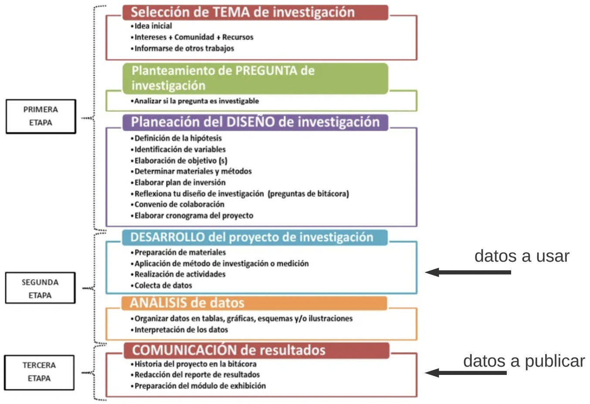

```{r setup, include=FALSE}
knitr::opts_chunk$set(echo = FALSE)
```


```{css, echo = FALSE}
/* From https://github.com/yihui/xaringan/issues/147  */
.scroll-output {
  height: 80%;
  overflow-y: scroll;
}
/* https://stackoverflow.com/questions/50919104/horizontally-scrollable-output-on-xaringan-slides */
pre {
  max-width: 100%;
  overflow-x: scroll;
}
```


## Objetivo

Lxs alumnxs serán capaces de comprender 

---

class: center, middle

# Un proyecto de investigación


---
## Esfuerzos por poner orden en la investigación

https://elixir-europe.org/
ELIXIR: ELIXIR is an intergovernmental organisation that brings together life science resources from across Europe. These resources include databases, software tools, training materials, cloud storage and supercomputers.

https://www.rd-alliance.org/
The Research Data Alliance (RDA) is a global forum to enable open sharing of scientific data across disciplines, technologies and countries.  The RDA provides a neutral space where its members can come together to develop and adopt infrastructure that promotes data-sharing and data-driven research

https://fairsharing.org/
FAIRSharing : A curated, informative and educational resource on data and metadata standards, inter-related to databases and data policies. 

---
## Principios FAIR

FAIRsoft - A practical implementation of FAIR principles for research software
Eva Martin del Pico, Josep Lluis Gelpi and Salvador Capella-Gutiérrez


---
## Etapas en un proyecto de investigación

```{r, out.width = "700px",fig.align='center', fig.cap=''}

```

---
## Buenas prácticas para un proyecto de investigación

1. **Carpeta del Proyecto**. Crear una estructura de directorios para el proyecto (data, bin, results, doc). O si es muy grande y complejo, dividelo por fases del proyecto.

2. **Bitácora**. Es recomendable llevar una bitácora digital donde anotes todo lo que hagas en el proyecto. Puedes poner las etapas y lo que vas haciendo en cada una, funcione o no. 

En la realidad, a través del tiempo se generan varios documentos como el Plan de Trabajo, Cronograma, Estado del Arte, etc... Pero para simplificar podemos usar un solo archivo bitácora.

---
## Buenas prácticas para un proyecto de investigación

3. **Metadatos de los datos**. En la fase de *Desarrollo* en la *colecta de datos*, si tu proyecto usará datos de terceros, descárgalos, pero adjunta un archivo de metadatos que los describa, incluye la fecha de descarga, el título, URL, DOI o un ID, los creadores, versión, formato, etc. 

Si la fuente donde los descargas no viene el metadato, tienes que generarlo tú. Puedes generar un archivo de metadatos por cada dataset, sugerimos poner el mismo nombre agregando metadata. Por ejemplo si tu archivo se llama ecoli_network.txt, el metadato seria ecoli_network_metadata.md o .txt.

Si es un archivo de metadatos para todos los datasets que vas a usar, puedes llamarlo simplemente metadata.md o README dentro de la carpeta de data. 

Puedes usar el este [formato](https://github.com/UtrechtUniversity/FAIR-Cheatsheets/blob/main/cheatsheets/FAIR_data_publishing/README_FAIR_data_publishing.md) donde hay mas detalles.

---
## Buenas prácticas para un proyecto de investigación

4. **Publicación de datos**. La última fase es la divulgación de resultados.

si eso incluye datasets tienes que documentarlos. Usa el [formato](https://github.com/UtrechtUniversity/FAIR-Cheatsheets/blob/main/cheatsheets/FAIR_data_publishing/README_FAIR_data_publishing.md) recomendado para datasets.

Esto también incluye la licencia de uso de los datos, puedes usar las [Creative Commons](https://creativecommons.org/share-your-work/cclicenses/), selecciona la que sea adecuada.

En esta etapa hay una selección de aquellos productos de trabajo que quieres compartir. Porque no todo lo que has generado durante todo el proyecto, es necesario compartirlo. Puedes generar una carpeta de divulgación y copiar todo lo que vas a compartir.

Puedes generar un documento tipo protocolo de investigación (que ya generamos) que resuma lo que se hizo en el proyecto. Recuerda que servirá para que cualquier pueda entender como reproducir los resultados que estas reportando. PAra generar este archivo, puedes usar el archivo de Bitácora.

Para publicar tus datasets puedes usar repositorios que te asignan un DOI (identificador único persistente) y subir n versiones de tus datasets, como Zenodo, FAIRSharing, etc.

---
## Buenas prácticas para un proyecto de investigación

5. Los nombres de archivos y directorios deben ser significativos. 

No usar espacios y no caracteres NO ALFANUMERICOS.


