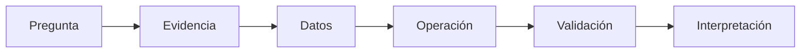

# Prompt completo para Gemini Canvas — S1 · Práctica 2: “Protocol Builder”

Actúa como **diseñador instruccional y desarrollador front-end especializado en educación científica, bioinformática, Markdown, Mermaid, escritura científica y aprendizaje activo**.

Construye una **app web educativa interactiva en un único archivo HTML** para integrarla al sitio web del curso:

**Introducción a la Bioinformática — LCG, UNAM — 2026**

La app corresponde a la **Sesión 1 (S1)** y debe implementar:

# Práctica 2 — Mi primer protocolo científico

La práctica ocurre **después** de que el estudiante:
1. trabajó una primera estrategia de análisis;
2. conoció la sección **4.1 El protocolo y la escritura científica**;
3. comprendió que el protocolo se construirá progresivamente durante el curso.

## Restricción fundamental

**NO enseñes Unix ni ningún comando de terminal.**

En este punto del curso los estudiantes todavía no han visto Unix.

La práctica debe enfocarse exclusivamente en:

- comprender para qué sirve `protocolo.md`;
- aprender Markdown básico;
- relacionar las partes del protocolo con la escritura científica;
- representar una estrategia mediante Mermaid;
- comenzar a documentar razonamiento científico.

---

# 1. Marco pedagógico que debes respetar

La S1 establece esta correspondencia:

```text
Pregunta y contexto
→ Introducción

Datos y exploración
→ Metodología

Estrategia y procedimientos analíticos
→ Metodología

Evidencias obtenidas
→ Resultados

Significado biológico y limitaciones
→ Discusión

Respuesta integrada
→ Conclusiones

Documentación y metadatos
→ atraviesan todo el proceso
```

Debe quedar especialmente clara esta distinción:

> **Los procedimientos analíticos —cómo obtuviste la evidencia— pertenecen a Metodología.**

> **La evidencia obtenida pertenece a Resultados.**

> **La interpretación de esa evidencia pertenece a Discusión.**

Además, en la Unidad 1 el estudiante solo comenzará:

- Introducción;
- Pregunta central;
- Subpreguntas;
- Datos;
- Estrategia.

Las secciones:

- Comandos;
- Resultados;
- Validación;
- Discusión;
- Conclusiones;

se completarán en unidades posteriores.

Deben aparecer en la estructura del protocolo, pero pueden quedar marcadas como:

> **Se completará más adelante en el curso.**

---

# 2. Propósito de la app

NO quiero un “curso de sintaxis Markdown”.

Quiero una experiencia en la que el estudiante descubra que:

```text
pensar
→ organizar
→ representar
→ documentar
```

son partes del trabajo científico.

Markdown debe aparecer porque **necesita documentar**.

Mermaid debe aparecer porque **necesita representar visualmente una estrategia**.

La app debe enseñar solo la sintaxis necesaria para lograr esos objetivos.

---

# 3. Nombre de la experiencia

Título:

# Protocol Builder

Subtítulo:

> **De una estrategia científica a un documento reproducible**

Texto introductorio:

> Ya tienes una pregunta y una estrategia. Ahora necesitas convertir ese razonamiento en un documento que otra persona pueda leer, comprender y continuar. En esta práctica aprenderás el Markdown mínimo necesario para comenzar `protocolo.md` y usarás Mermaid para representar visualmente tu estrategia.

---

# 4. Arquitectura general

Organiza la app en **cuatro misiones** y una **pestaña final obligatoria de Resumen**:

```text
MISIÓN 1
Dale estructura al documento
        ↓
MISIÓN 2
¿Dónde va cada cosa?
        ↓
MISIÓN 3
Representa una estrategia con Mermaid
        ↓
MISIÓN 4
Construye tu primer protocolo
        ↓
RESUMEN
```

Navegación:

```text
1 Markdown
2 Protocolo
3 Mermaid
4 Mi protocolo
Resumen
```

La pestaña **Resumen debe existir SIEMPRE como última pestaña**.

No usar:

- puntos;
- ranking;
- vidas;
- medallas;
- competencia;
- calificación numérica.

---

# 5. Misión 1 — Dale estructura al documento

Presenta este texto plano:

```text
Protocolo de análisis
Introducción
Pregunta central
¿Los datos de pacientes.md son suficientes para evaluar si el IMC está relacionado con el diagnóstico?
Subpreguntas
¿Puedo calcular el IMC?
¿Qué significa dx?
Datos
pacientes.md
Estrategia
Primero revisar los datos.
Después determinar qué información falta.
Finalmente decidir qué análisis sería apropiado.
```

Pregunta:

> **¿Cómo convertirías este texto en un documento que tenga una estructura clara?**

La misión debe enseñar progresivamente solo:

```markdown
# Título principal

## Sección

### Subsección

- Elemento de lista

**texto importante**

`nombre_de_archivo.md`
```

No enseñar todavía:

- tablas Markdown;
- imágenes;
- HTML;
- notas al pie;
- sintaxis avanzada.

---

# 6. Editor Markdown interactivo

Implementa un pequeño editor con dos paneles:

```text
MARKDOWN                  VISTA PREVIA
[editor]                  [render aproximado]
```

IMPORTANTE:

La app debe funcionar completamente offline.

No dependas de una librería externa para renderizar Markdown.

Implementa un **renderizador mínimo propio** que soporte únicamente:

- `#`
- `##`
- `###`
- listas con `-`
- `**negrita**`
- `` `código inline` ``

No es necesario implementar todo Markdown.

Debe quedar claro que este editor es para practicar la sintaxis; en clase el estudiante utilizará **StackEdit**.

Incluye una nota:

> **En clase practicarás esta sintaxis directamente en StackEdit. Aquí estamos aprendiendo a reconocer y construir la estructura.**

---

# 7. Microretos de Markdown

Incluye pequeños retos.

### Reto A

> Convierte “Protocolo de análisis” en título principal.

Esperado:

```markdown
# Protocolo de análisis
```

### Reto B

> Convierte “Introducción” en una sección.

Esperado:

```markdown
## Introducción
```

### Reto C

> Convierte las tres subpreguntas en una lista.

### Reto D

> Marca `pacientes.md` como nombre de archivo/código.

Esperado:

```markdown
`pacientes.md`
```

### Reto E

> Resalta una idea importante usando negritas.

No exigir una frase exacta; comprobar que use `**...**`.

---

# 8. Retroalimentación

Para ejercicios con respuesta comprobable:

```text
primer intento
→ feedback
→ pista
→ segundo intento
→ explicación
```

Correcto:

- ✓
- verde
- `Estructura correcta`

Incorrecto:

- ✗
- rojo
- `Revisa la sintaxis`

El color no debe ser la única señal.

Registrar:

- primer intento;
- corrección;
- uso de pista;
- respuesta final.

---

# 9. Misión 2 — ¿Dónde va cada cosa?

Título:

# Anatomía de un protocolo científico

Presentar dos representaciones conectadas.

### Protocolo de trabajo

```text
Pregunta y contexto
Datos
Estrategia
Evidencia
Interpretación
Respuesta integrada
```

### Escritura científica

```text
Introducción
Metodología
Resultados
Discusión
Conclusiones
```

El estudiante debe asociarlas.

---

# 10. Asociaciones correctas

Usar:

```text
Pregunta y contexto
→ Introducción

Datos y exploración
→ Metodología

Estrategia y procedimientos
→ Metodología

Evidencia obtenida
→ Resultados

Significado biológico y limitaciones
→ Discusión

Respuesta integrada
→ Conclusiones
```

Añadir una tarjeta transversal:

```text
Documentación y metadatos
→ todo el proceso
```

Esta última no debe asociarse con una sola sección.

---

# 11. Actividad “Metodología, Resultado o Discusión”

Presentar situaciones breves.

## Caso A

> “Calculé una variable derivada a partir de los datos.”

Respuesta:

**Metodología**

Explicación:

> Describe qué hiciste para obtener evidencia.

## Caso B

> “Obtuvimos tres valores diferentes.”

Respuesta:

**Resultados**

Explicación:

> Describe la evidencia obtenida.

## Caso C

> “Las diferencias observadas no son suficientes para establecer una asociación.”

Respuesta:

**Discusión**

Explicación:

> Interpreta el significado y las limitaciones de la evidencia.

## Caso D

> “Se utilizó el archivo `pacientes.md`.”

Respuesta:

**Metodología / Datos**

No forzar una taxonomía artificial si el contexto permite ambas formulaciones; explicar que documenta los datos utilizados dentro de la metodología.

---

# 12. Actividad “Todavía no toca”

Mostrar las secciones:

```text
Introducción
Pregunta central
Subpreguntas
Datos
Estrategia
Comandos
Resultados
Validación
Discusión
Conclusiones
```

Pedir:

> **¿Cuáles debes comenzar en esta unidad?**

Esperadas:

- Introducción
- Pregunta central
- Subpreguntas
- Datos
- Estrategia

Las demás deben quedar visualmente como:

```text
Se completará más adelante
```

Mensaje:

> **Un protocolo científico se construye progresivamente. No necesitas tener resultados antes de realizar el análisis.**

---

# 13. Misión 3 — Representa una estrategia con Mermaid

Título:

# Del texto al diagrama

Texto:

> Markdown organiza el documento. Mermaid nos permite representar visualmente relaciones y procesos dentro del mismo tipo de documentación.

En clase el estudiante utilizará una **página web de Mermaid** para construir y visualizar los diagramas.

La app debe enseñar solamente Mermaid mínimo.

---

# 14. Mermaid mínimo

Enseñar:

```text
flowchart LR
```

y:

```text
A[Pregunta] --> B[Evidencia]
```

Explicar:

- `flowchart` indica un diagrama de flujo;
- `LR` significa izquierda → derecha;
- `A` y `B` son identificadores;
- `[texto]` es el contenido visible;
- `-->` crea una conexión.

No enseñar:

- estilos avanzados;
- clases;
- subgraphs;
- temas;
- configuraciones;
- JavaScript;
- sintaxis Mermaid compleja.

---

# 15. Constructor Mermaid

Implementa un editor de texto donde el estudiante pueda modificar:

```text
flowchart LR
    A[Pregunta] --> B[Evidencia]
    B --> C[Datos]
```

Como la app debe funcionar offline y no debe depender de Mermaid.js externo, NO es obligatorio renderizar Mermaid real.

En su lugar:

1. mostrar el código;
2. analizar la sintaxis mínima;
3. generar una **vista conceptual propia con HTML/CSS/SVG**;
4. dejar claro que el código se probará/renderizará realmente en la página web de Mermaid durante la clase.

La vista conceptual debe representar:

```text
[Pregunta] → [Evidencia] → [Datos]
```

---

# 16. Reto Mermaid — Ordena el razonamiento

Dar estas piezas desordenadas:

- Pregunta
- Evidencia necesaria
- Datos
- Operación
- Validación
- Interpretación

Pedir al estudiante ordenarlas.

Orden conceptual esperado:

```text
Pregunta
→ Evidencia necesaria
→ Datos
→ Operación
→ Validación
→ Interpretación
```

Después pedir:

> **Construye el código Mermaid correspondiente.**

Una respuesta válida sería:

```text
flowchart LR
    A[Pregunta] --> B[Evidencia necesaria]
    B --> C[Datos]
    C --> D[Operación]
    D --> E[Validación]
    E --> F[Interpretación]
```

---

# 17. Reto Mermaid — Detecta el problema

Mostrar:

```text
flowchart LR
    A[Pregunta] --> B[Herramienta]
    B --> C[Resultado]
```

Preguntar:

> **¿Qué problema conceptual tiene este flujo?**

Opciones:

- Mermaid no permite tres nodos.
- Falta construir la cadena de evidencia antes de elegir una herramienta.
- La flecha debería apuntar hacia la izquierda.
- Todo análisis debe comenzar con Python.

Esperada:

> **Falta construir la cadena de evidencia antes de elegir una herramienta.**

Después:

> **Corrige el diagrama.**

Permitir que el alumno construya su propia versión.

No exigir una única sintaxis si conserva la lógica:

```text
Pregunta
→ Evidencia
→ Datos
→ Operación
→ Validación
→ Interpretación
```

---

# 18. Misión 4 — Construye tu primer protocolo

Título:

# Mi primer `protocolo.md`

Ahora integrar Markdown + estructura científica + Mermaid.

No dar el documento completamente resuelto.

Proporcionar una plantilla editable:

```markdown
# Protocolo de análisis

## Introducción

### Pregunta central


### Subpreguntas


## Datos


## Estrategia


## Comandos

> Se completará más adelante.

## Resultados

> Se completará más adelante.

## Validación

> Se completará más adelante.

## Discusión

> Se completará más adelante.

## Conclusiones

> Se completará más adelante.
```

---

# 19. Contenido que el estudiante debe agregar

Pedir que complete al menos:

### Introducción

Una frase breve de contexto.

### Pregunta central

Puede usar como caso:

> ¿Los datos de `pacientes.md` son suficientes para evaluar si el índice de masa corporal está relacionado con el diagnóstico registrado en `dx`?

### Subpreguntas

Debe escribir al menos dos.

Puede apoyarse en ideas como:

- ¿Puedo calcular un IMC interpretable?
- ¿Qué significa `dx`?
- ¿Los datos permiten evaluar una relación?

No completar automáticamente.

### Datos

Debe documentar:

```text
pacientes.md
```

y escribir qué sabe y qué necesita confirmar.

### Estrategia

Debe escribir una explicación breve y añadir su código Mermaid.

---

# 20. Inserción del Mermaid en Markdown

Enseñar que puede documentarse mediante un bloque:

````markdown

````

Explicar:

> La compatibilidad para renderizar Mermaid depende de la plataforma donde se visualice Markdown. Conserva el código como parte de tu documentación aunque la plataforma concreta no lo renderice automáticamente.

No hacer afirmaciones falsas sobre compatibilidad universal.

---

# 21. Comprobación del protocolo

Antes de finalizar mostrar:

# Revisión de estructura

Comprobar descriptivamente:

```text
Título principal                     ✓ / pendiente
Introducción                         ✓ / pendiente
Pregunta central                     ✓ / pendiente
Al menos dos subpreguntas            ✓ / pendiente
Datos                                ✓ / pendiente
Estrategia                           ✓ / pendiente
Diagrama Mermaid                     ✓ / pendiente
Secciones futuras conservadas        ✓ / pendiente
```

No llamarlo “calificación”.

No exigir que las secciones futuras tengan contenido.

---

# 22. Reflexión breve

Preguntar:

> **¿Qué aporta Markdown al protocolo que no aporta simplemente escribir texto sin estructura?**

Campo abierto.

Después:

> **¿Qué aporta el diagrama Mermaid que sería más difícil ver en un párrafo?**

Campo abierto.

Y:

> **¿Por qué crees que el protocolo se construye durante todo el curso y no al final?**

Campo abierto.

Estas respuestas deben guardarse para el Resumen.

---

# 23. Pestaña final obligatoria — RESUMEN

La última pestaña debe llamarse exactamente:

# Resumen

Debe reunir el trabajo REAL del estudiante.

No debe ser una pantalla de “felicidades”.

---

# 24. Resumen — Markdown que aprendí

Mostrar:

```text
#       Título
##      Sección
###     Subsección
-       Lista
** **   Negritas
` `     Código / nombre de archivo
```

Y marcar cuáles utilizó realmente.

---

# 25. Resumen — Anatomía del protocolo

Mostrar:

```text
Introducción
└── pregunta + contexto

Metodología
├── datos
└── estrategia/procedimientos

Resultados
└── evidencia

Discusión
└── significado + limitaciones

Conclusiones
└── respuesta integrada

Metadatos
└── atraviesan todo el proceso
```

Indicar:

> En U1 estás comenzando principalmente Introducción, Pregunta central, Subpreguntas, Datos y Estrategia.

---

# 26. Resumen — Mi Mermaid

Mostrar:

1. código Mermaid final del estudiante;
2. representación conceptual;
3. si corrigió el flujo inicial, mostrar:

```text
Primer intento:
[...]

Versión final:
[...]
```

---

# 27. Resumen — Mi `protocolo.md`

Mostrar el documento completo construido por el estudiante dentro de un bloque copiable.

IMPORTANTE:

Usar exactamente el contenido que escribió.

No reemplazarlo por un ejemplo modelo.

---

# 28. Resumen — Mis reflexiones

Mostrar:

```text
¿Qué aporta Markdown?
[...]

¿Qué aporta Mermaid?
[...]

¿Por qué construir el protocolo progresivamente?
[...]
```

---

# 29. Botón obligatorio — Descargar resultados

Dentro de **Resumen**, incluir DOS botones:

## ⬇ Descargar mi protocolo

Debe generar:

```text
protocolo.md
```

con el contenido REAL construido por el estudiante.

## ⬇ Descargar mis resultados

Debe generar:

```text
protocol-builder-resultados.md
```

con el registro de la experiencia.

Ambos deben funcionar localmente mediante JavaScript nativo:

- `Blob`;
- `URL.createObjectURL`;
- `<a download>`;
- o equivalente.

Sin servidor ni APIs.

---

# 30. Contenido de `protocol-builder-resultados.md`

Generar algo semejante a:

```markdown
# Protocol Builder — Resultados

Introducción a la Bioinformática
S1 — Práctica 2: Mi primer protocolo científico

Fecha: [automática]

## Markdown

Elementos utilizados:
- ...
- ...

Retos corregidos:
- ...

Pistas utilizadas:
- ...

## El protocolo y la escritura científica

Asociaciones realizadas:
- Pregunta y contexto → ...
- Datos → ...
- Estrategia → ...
- Evidencia → ...
- Interpretación → ...
- Respuesta integrada → ...

## Mermaid

### Primer intento

```text
...
```

### Versión final

```text
...
```

## Mi protocolo

```markdown
[contenido real del estudiante]
```

## Reflexión

### ¿Qué aporta Markdown?
[...]

### ¿Qué aporta Mermaid?
[...]

### ¿Por qué el protocolo se construye progresivamente?
[...]

## Resumen descriptivo

Markdown básico practicado: Sí / No
Estructura del protocolo revisada: Sí / No
Diagrama Mermaid construido: Sí / No
Protocolo inicial construido: Sí / No
Pistas utilizadas: [n]
Decisiones revisadas: [n]
```

No incluir:

- nota;
- porcentaje;
- aprobado/reprobado;
- ranking.

---

# 31. Diseño visual

La interfaz debe comunicar:

```text
IDEA
→ ESTRUCTURA
→ DIAGRAMA
→ DOCUMENTO
```

Usar visualmente:

- editor;
- preview;
- tarjetas;
- estructura jerárquica;
- diagrama de flujo;
- documento final.

Estética:

- científica;
- universitaria;
- limpia;
- contemporánea;
- fondo claro;
- responsive;
- sin aspecto infantil.

Markdown debe verse en fuente monoespaciada en los editores.

La vista del protocolo debe parecer un documento científico limpio.

---

# 32. No usar Unix

Validación crítica:

NO incluir:

```text
mkdir
cd
ls
cat
grep
touch
pwd
bash
terminal
shell
```

ni ningún otro comando Unix.

El estudiante todavía no ha aprendido Unix.

Tampoco presentar una terminal simulada.

---

# 33. StackEdit y Mermaid

La app es una preparación guiada.

Durante la clase el docente utilizará:

- **StackEdit** para practicar Markdown;
- una **página web de Mermaid** para construir/renderizar Mermaid.

Por tanto, la app debe enseñar los conceptos y proporcionar código que pueda copiarse fácilmente.

Agregar botones:

```text
Copiar Markdown
Copiar Mermaid
```

Usar Clipboard API cuando esté disponible y fallback local si es necesario.

NO incluir enlaces externos obligatorios para completar la actividad.

---

# 34. Accesibilidad

Implementar:

- HTML semántico;
- navegación completa por teclado;
- foco visible;
- botones reales;
- `fieldset` y `legend`;
- labels;
- `aria-live`;
- contraste suficiente;
- no depender del color;
- targets táctiles cómodos;
- responsive.

Las pestañas:

- `role="tablist"`
- `role="tab"`
- `role="tabpanel"`
- `aria-selected`
- navegación por teclado.

---

# 35. Restricciones técnicas

Generar:

- un único archivo HTML;
- CSS embebido;
- JavaScript embebido;
- sin frameworks;
- sin React;
- sin Node;
- sin backend;
- sin login;
- sin tracking;
- sin APIs;
- sin dependencias externas obligatorias;
- funcional offline;
- listo para Git;
- fácil de integrar en sitio estático.

---

# 36. Nombre sugerido

```text
interactive/u1/s1-practica2-protocol-builder.html
```

---

# 37. Integración con S1

La práctica debe ubicarse **después de la sección 4.1 “El protocolo y la escritura científica”**.

Secuencia pedagógica esperada:

```text
Práctica 1
Diseñar una estrategia
        ↓
4.1 El protocolo y la escritura científica
        ↓
Práctica 2
Markdown + Mermaid + protocolo
        ↓
protocolo.md inicial
```

No modificar automáticamente S1.

Al final de la respuesta indica:

1. dónde insertar la práctica;
2. qué texto de transición añadir antes;
3. qué texto añadir después;
4. cómo referenciar el HTML desde el Markdown.

---

# 38. Validación final obligatoria

Antes de entregar verifica:

1. ¿No hay ningún comando Unix?
2. ¿Markdown aparece como herramienta de documentación y no como fin en sí mismo?
3. ¿Solo se enseña Markdown básico?
4. ¿Existe editor + preview?
5. ¿La app funciona offline?
6. ¿La correspondencia protocolo ↔ artículo científico es correcta?
7. ¿Metodología se distingue de Resultados?
8. ¿Resultados se distingue de Discusión?
9. ¿Se indica qué secciones se comienzan en U1?
10. ¿Las secciones futuras se conservan?
11. ¿Mermaid se introduce después de comprender la estrategia?
12. ¿Solo se enseña Mermaid mínimo?
13. ¿Existe el reto del flujo incorrecto `Pregunta → Herramienta → Resultado`?
14. ¿El alumno construye su propio Mermaid?
15. ¿El alumno construye su propio `protocolo.md`?
16. ¿No se rellenan automáticamente sus respuestas?
17. ¿Existe reflexión sobre Markdown, Mermaid y protocolo?
18. ¿Existe SIEMPRE la pestaña final `Resumen`?
19. ¿Resumen contiene respuestas reales?
20. ¿Existe `Descargar mi protocolo`?
21. ¿Existe `Descargar mis resultados`?
22. ¿`Descargar mi protocolo` genera `protocolo.md`?
23. ¿Los resultados generan `protocol-builder-resultados.md`?
24. ¿No hay calificación automática?
25. ¿Se registran pistas y correcciones?
26. ¿Hay botones para copiar Markdown y Mermaid?
27. ¿Es accesible por teclado?
28. ¿Tiene estética científica y universitaria?
29. ¿Se entiende que el protocolo se construirá durante todo el curso?
30. ¿La práctica conecta pensar → organizar → representar → documentar?

---

# 39. Entregables

Entrega directamente:

1. **HTML completo y funcional**, no fragmentos;
2. explicación breve de la arquitectura;
3. descripción de las cuatro misiones;
4. explicación de la pestaña final **Resumen**;
5. instrucciones para probarlo localmente;
6. fragmento Markdown recomendado para integrarlo después de 4.1;
7. nota de accesibilidad;
8. decisiones técnicas importantes.

No pidas confirmación.

El objetivo final es que el estudiante termine pensando:

> **“Markdown me permite estructurar y conservar mi razonamiento; Mermaid me permite visualizarlo; `protocolo.md` será la memoria reproducible de mi análisis durante todo el curso.”**
