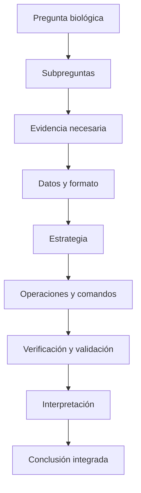

# Unidad 1. Trabajo reproducible y comunicación técnica

> **NOTA — Cómo se estudia esta unidad (aula invertida):** Esta unidad funciona en tres momentos.
> **(1) Antes de clase** lees este material y haces un **primer intento** de las prácticas. No se
> espera que tu intento esté completo ni perfecto: los errores, los resultados inesperados y las
> dudas son justamente el **insumo del taller**. **(2) En clase** trabajamos en formato **taller**:
> revisamos intentos, comparamos estrategias, corregimos errores y resolvemos dudas. **(3) Después
> del taller** entregas una **versión corregida**.
>
> **Al taller debes llevar:** tu primer intento, al menos **una duda concreta**, una nota sobre la
> parte que te resultó **más difícil**, y los **errores o resultados inesperados** que encontraste.
>
> **Cómo se evalúa cada momento:** el **primer intento** se valora por la preparación, el esfuerzo y
> la identificación de dificultades —**no** por estar completamente correcto—; la **participación en
> el taller** por la revisión y corrección argumentada; y la **entrega final** por su calidad. Al
> final de la unidad encontrarás las rúbricas de cada momento.

## Ficha de la unidad

| Elemento | Descripción |
| --- | --- |
| **Sesiones** | S1–S2 |
| **Competencias** | A (Trabajo reproducible y comunicación científica) · G (Uso responsable de IA) |
| **Propósito** | Establecer desde el arranque una cultura de trabajo reproducible y la capacidad de resolver y comunicar un problema bioinformático de forma documentada, verificable y científicamente válida. |
| **Contribución al objetivo del curso** | Sienta las bases para *resolver problemas bioinformáticos reales mediante un trabajo computacional documentado, reproducible, verificado y suficientemente robusto*. |
| **Ajustes integrados** | Introducción al prompting científico y uso responsable de IA |
| **Lectura base** | Buffalo (2015), Cap. 1 y Cap. 2 |

### Resultados de aprendizaje (demostrables)

Al terminar la unidad, el estudiante es capaz de:

1. **Explicar** la importancia de la reproducibilidad en la investigación.
2. **Distinguir** reproducibilidad, replicabilidad, verificación, validación y robustez, y aplicarlas como acciones.
3. **Reconocer** las fases del manejo y análisis de datos.
4. **Resolver** de forma sistemática un problema bioinformático sencillo.
5. **Descomponer** una pregunta biológica en subpreguntas abordables.
6. **Relacionar** cada subpregunta con datos, operaciones, evidencia y validación.
7. **Documentar** un protocolo bioinformático en Markdown.
8. **Organizar** datos, procedimientos, resultados y documentación de forma reproducible.
9. **Aplicar** los principios FAIR y **crear** metadatos.
10. **Utilizar** asistentes de IA de forma crítica, ética y verificable.
11. **Formular** conclusiones que respondan la pregunta biológica central.

---

## Ruta de aprendizaje de la unidad

| Aspecto | Detalle |
| --- | --- |
| **Tiempo estimado de lectura** | 60–90 minutos |
| **Tiempo estimado del primer intento** | 60–90 minutos |
| **Secciones indispensables (comprender)** | 1, 2, 3, 4, 6, 7 y 8 |
| **Secciones de consulta o ampliación** | 5.3 (Mermaid) y el Glosario |
| **Productos mínimos que debes llevar al taller (intentar)** | Borrador de `protocolo.md`; tabla de descomposición de la Práctica 3; primera entrada de `bitacora-ia.md`; tus dudas y dificultades |
| **Productos que se entregan después del taller (entregar)** | Tarea 1 y Tarea 2 corregidas (ver sección de Prácticas) |

> **TIP:** Cuatro verbos guían esta ruta. **Comprender** las secciones conceptuales; **consultar**
> las de ampliación cuando las necesites; **intentar** las prácticas aunque no las termines; y
> **entregar** solo después del taller. Si algo no te sale, anótalo: esa nota vale para el taller.

---

## 1. ¿Por qué la reproducibilidad?

Imagina que dentro de un año un revisor te pide rehacer el análisis de tu tesis, o que un compañero
quiere partir de tu trabajo. Si no puedes **regenerar los mismos resultados** a partir de los mismos
datos y procedimientos, tu trabajo no es verificable. En ciencia, un resultado que no puede
regenerarse tiene poco valor.

### 1.1 Cuatro conceptos que usaremos con precisión

La terminología varía entre disciplinas; estas son las definiciones que **este curso** utilizará de
forma consistente. Evitamos la palabra ambigua "repetir".

- **Reproducibilidad.** Otra persona puede **regenerar los resultados** usando los **mismos datos,
  procedimientos, comandos y herramientas** documentados.
  *Ejemplo:* entregas tu genoma, tu protocolo y tus comandos, y tu compañera obtiene el mismo conteo.
- **Replicabilidad.** Se obtiene **evidencia compatible** mediante un **estudio o conjunto de datos
  independiente**.
  *Ejemplo:* otro grupo analiza una cepa distinta de *E. coli* y llega a una conclusión similar.
- **Verificación.** Se comprueba que **archivos, comandos, operaciones y resultados intermedios**
  funcionan como se esperaba.
  *Ejemplo:* confirmas que un archivo se descargó completo comparando su checksum.
- **Validación.** Se demuestra que el procedimiento y la evidencia **realmente permiten responder**
  la pregunta biológica.
  *Ejemplo:* verificas que contar líneas de tipo "gene" en el GFF sí corresponde a "número de genes".
- **Robustez.** Se comprueba que la conclusión **no depende de decisiones frágiles**, errores
  silenciosos ni de una única comprobación insuficiente.
  *Ejemplo:* obtienes el mismo conteo por dos caminos distintos.

> **IMPORTANTE — La Regla de Oro de la Bioinformática** (Buffalo, 2015, Cap. 1): *nunca confíes
> ciegamente en tus herramientas ni en tus datos*. Verifica todo —supuestos, formatos, resultados
> intermedios—, porque los conjuntos de datos son enormes y un error silencioso puede propagarse sin
> que lo notes. Verificación, validación y robustez son la Regla de Oro convertida en acciones.

> **COMENTARIO:** Estos cuatro principios no son solo teoría: aparecerán como **acciones observables**
> dentro de cada práctica, y se retomarán progresivamente en las siguientes unidades y en el
> proyecto integrador.

---

## 2. Dos procesos complementarios

Trabajar con datos implica **dos procesos que se relacionan pero no son equivalentes**. Distinguirlos
evita confundir "mover datos de un lado a otro" con "responder una pregunta".

### A. Fases del manejo y análisis de datos

Describen el **ciclo de vida de los datos**:

1. **Obtención.** Descargar los datos de una fuente confiable.
2. **Registro de procedencia.** Anotar de dónde vienen, su versión y su integridad (metadatos).
3. **Exploración.** Revisar formato, tamaño, campos y posibles problemas.
4. **Limpieza o transformación.** Preparar los datos generando **archivos nuevos** (no sobre el original).
5. **Análisis.** Filtrar, contar, comparar para producir evidencia.
6. **Conservación.** Resguardar los datos originales intactos y los derivados por separado.
7. **Documentación y comunicación.** Registrar y reportar todo de forma reproducible.

### B. Fases de resolución de un problema bioinformático

Describen **cómo se razona** para responder una pregunta:

1. **Delimitar** la pregunta biológica.
2. **Descomponerla** en subpreguntas.
3. **Definir la evidencia** necesaria para cada subpregunta.
4. **Identificar los datos** requeridos.
5. **Examinar el formato** y los campos disponibles.
6. **Diseñar la estrategia** *antes* de elegir comandos.
7. **Traducir la estrategia** en operaciones computacionales.
8. **Seleccionar y ejecutar** comandos.
9. **Probar primero con un caso pequeño.**
10. **Verificar** los resultados.
11. **Interpretar** cada respuesta.
12. **Integrar** una conclusión.

> **NOTA:** El proceso **A** cuida los *datos*; el proceso **B** organiza el *razonamiento*. Un
> mismo proyecto usa ambos: manejas bien los datos **y** razonas bien el problema. No son lo mismo.

---

## 3. De la pregunta biológica a una solución computacional

Aquí está el corazón de la unidad: **no se empieza eligiendo comandos**. Se empieza por la pregunta,
luego se define qué evidencia la responde, qué datos la contienen y, **al final**, qué herramienta la
obtiene.

> **IMPORTANTE:** El orden correcto es **pregunta → evidencia → datos → operación → herramienta**.
> Empezar por el comando es la causa más común de análisis que "corren" pero no responden nada.

### Ejemplo continuo: el genoma de *Escherichia coli* K-12

Trabajaremos con el genoma de la bacteria *E. coli* K-12 y su archivo de anotación en formato **GFF**
(una tabla donde cada renglón es un elemento del genoma —un *feature*— como un gen o una región).

**Pregunta biológica central:** ¿Cuántos genes tiene el genoma de *E. coli* K-12 y cómo se
distribuyen en el cromosoma?

Para responderla la dividimos en **subpreguntas** manejables. Para cada una definimos qué evidencia
necesitamos, en qué datos está, qué operación conceptual la obtiene, con qué herramienta podría
hacerse (la aprenderás en unidades posteriores), cómo la validamos y cómo la interpretamos:

| Subpregunta | Evidencia necesaria | Datos | Operación (conceptual) | Herramienta posible | Validación | Interpretación |
| --- | --- | --- | --- | --- | --- | --- |
| ¿De qué tamaño es el genoma? | Longitud total en pares de bases | Encabezado del GFF / FASTA | Leer la región declarada | Visualización de texto | Contrastar el valor del GFF con el del registro en NCBI | Tamaño típico de una bacteria (~4.6 Mb) |
| ¿Cuántos genes hay? | Número de renglones de tipo "gene" | Columna 3 del GFF | Filtrar por "gene" y contar | Filtro + conteo | Comparar con el número reportado por NCBI | Densidad génica del genoma |
| ¿Cómo se distribuyen por cadena? | Conteo de genes en cadena `+` y `-` | Columna 7 del GFF | Agrupar por cadena y contar | Filtro + conteo | La suma `+` y `-` debe igualar el total de genes | Organización del genoma en ambas hebras |

Con las respuestas de las subpreguntas se **integra una conclusión** que responde la pregunta
central: por ejemplo, *"El genoma de* E. coli *K-12 mide ~4.6 Mb, contiene N genes distribuidos en
ambas cadenas, lo que indica una alta densidad génica característica de las bacterias"*.

> **¿SABÍAS QUE?:** Casi cualquier análisis bioinformático, por complejo que parezca, se resuelve así:
> una pregunta grande se parte en subpreguntas pequeñas y verificables. Dominar esta descomposición
> es más importante que memorizar comandos.

El siguiente diagrama resume el proceso de resolución (contenido de ampliación):



---

## 4. El protocolo de resolución de un problema bioinformático

En este curso, el **protocolo** no es una simple propuesta previa ni una lista de comandos: es un
**documento vivo** donde se registra y organiza toda la resolución del problema.

Características del protocolo:

- Es un **documento vivo**: se completa progresivamente durante varias unidades.
- **Organiza el razonamiento**, no solo los comandos.
- **Relaciona cada comando con una subpregunta.**
- Registra **entradas, operaciones, salidas y validaciones**.
- Incluye **resultados e interpretación**.
- Termina con una **conclusión** que responde la pregunta central.
- Permite **reproducir y evaluar** el análisis.

Sus secciones y la función de cada una:

| Sección | Función |
| --- | --- |
| Introducción | Presentar contexto y problema |
| Pregunta central | Delimitar qué se quiere responder |
| Subpreguntas | Dividir el problema |
| Datos | Registrar origen, versión, formato e integridad |
| Estrategia | Explicar cómo se resolverá cada subpregunta |
| Comandos | Documentar la ejecución |
| Resultados | Presentar la evidencia obtenida |
| Validación | Comprobar los resultados |
| Discusión | Interpretar su significado biológico |
| Conclusiones | Integrar las respuestas |

> **NOTA:** En la Unidad 1 iniciarás las secciones **Introducción, Pregunta central, Subpreguntas,
> Datos y Estrategia**. Las secciones **Comandos, Resultados, Validación, Discusión y Conclusiones**
> se completarán en las unidades posteriores, conforme aprendas a ejecutar y verificar los análisis.
> Consérvalas en tu plantilla aunque todavía estén vacías.

### 4.1 El protocolo y la escritura científica

Cuando el protocolo se comunica como reporte, sus partes corresponden a las de un artículo
científico. Usa esta correspondencia:

- **Pregunta y contexto → Introducción.**
- **Datos y exploración → Metodología.**
- **Estrategia y procedimientos analíticos → Metodología.**
- **Evidencias obtenidas → Resultados.**
- **Significado biológico y limitaciones → Discusión.**
- **Respuesta integrada → Conclusiones.**
- **Documentación y metadatos → atraviesan todo el proceso.**

> **IMPORTANTE:** Los **procedimientos analíticos** (cómo obtuviste la evidencia) pertenecen a la
> **Metodología**, no a Resultados. En Resultados va la **evidencia**; en Discusión, su
> **interpretación**.

Puedes consultar la plantilla en blanco `ejemplos/formato_protocolo_v1.0.md` y un ejemplo ya
trabajado en `ejemplos/ReporteGenomeEcoli_Formato_v2.md`.

---

## 5. Comunicar con Markdown

Comunicar con claridad es parte del método científico. **Markdown** es un lenguaje de marcado
ligero: se escribe texto plano con marcas simples (`#`, `*`, `-`) que luego se convierte a HTML, PDF
u otros formatos. Fue creado por John Gruber para que el texto fuente sea **legible tal cual**
(Buffalo, 2015, Cap. 2). Es el formato de los README de GitHub, de la documentación técnica y de gran
parte del material científico en línea.

Página oficial: <https://daringfireball.net/projects/markdown/>. Guía de referencia:
<https://www.markdownguide.org/>.

### 5.1 La herramienta que usaremos: StackEdit

Practicaremos con **StackEdit**, un editor de Markdown **gratuito que funciona en el navegador**, sin
instalar nada (<https://stackedit.io>). Muestra, lado a lado, **lo que escribes** (panel izquierdo) y
**cómo se verá** (panel derecho, vista previa sincronizada). Tiene, además, una barra de herramientas
que inserta las marcas por ti, un explorador de documentos y opciones para **exportar** a `.md`, HTML
o PDF.

> **ADVERTENCIA:** StackEdit guarda tus documentos en el **navegador**. Para conservar tu trabajo,
> **exporta el archivo `.md`** (menú ☰ → Export) y guárdalo en tu carpeta de proyecto. El `.md`
> exportado es lo que entregas.

> **TIP — Sin conexión:** Como Markdown es texto plano, si no tienes internet puedes escribir tu
> `.md` en **cualquier editor de texto** (por ejemplo, el Bloc de notas, TextEdit en modo texto o
> VS Code) y ver la vista previa más tarde. No dependes de una herramienta específica.

### 5.2 Elementos de Markdown

Cada elemento cumple una **función comunicativa**; úsalo cuando aporte claridad, no por obligación.

```markdown
# Título de nivel 1
## Título de nivel 2

Un párrafo normal, con **negrita** para lo importante, *cursiva* para matizar
y `código en línea` para nombres de archivos o comandos, como `genoma.gff`.

- Lista con viñetas (para enumerar sin orden)
1. Lista numerada (para pasos con orden)

[Texto de un enlace](https://www.ncbi.nlm.nih.gov)
```

- **Encabezados** (`#`): estructuran el documento en secciones.
- **Párrafos y énfasis** (`**`, `*`): resaltan ideas clave sin abusar.
- **Listas**: enumeran pasos u opciones.
- **Enlaces**: citan fuentes y datos.
- **Código en línea y bloques** (` ``` `): distinguen comandos y datos del texto.

Las **tablas** y los **bloques de código** son útiles cuando hay datos tabulares o comandos que
mostrar. El siguiente bloque muestra una tabla:

```markdown
| Archivo        | Formato | Descripción           |
| -------------- | ------- | --------------------- |
| genoma.fasta   | FASTA   | Secuencia del genoma  |
| anotacion.gff3 | GFF3    | Anotación de features |
```

> **TIP — Ejemplos correcto e incorrecto.** Un buen documento usa cada elemento con propósito.
> *Incorrecto:* poner todo en negrita (nada resalta) o meter una tabla de una sola celda.
> *Correcto:* un título por sección, listas para pasos y una tabla solo cuando hay varias columnas
> de datos que comparar.

### 5.3 Diagramas con Mermaid (ampliación, opcional)

**Mermaid** permite crear diagramas escribiéndolos como texto (<https://mermaid.js.org>). En esta
unidad es **opcional**; resulta útil sobre todo para representar las **fases de solución** de un
problema, como en el diagrama de la sección 3. El tipo más frecuente es el diagrama de flujo
(`flowchart`).

---

## 6. Organización reproducible del proyecto y datos fuente

Un proyecto ordenado separa lo que **entra** (datos originales) de lo que **se produce** (datos
transformados y resultados, siempre regenerables). Sigue esta estructura (Buffalo, 2015, Cap. 2):

```text
proyecto/
├── README.md          # cuaderno del proyecto: qué es y cómo reproducirlo
├── data_source/       # datos ORIGINALES + sus metadatos
├── data_processed/    # datos derivados (limpios o transformados)
├── src/               # scripts y comandos
├── results/           # resultados y evidencia (regenerables)
└── doc/               # documentación y reportes (p. ej. protocolo.md)
```

Reglas para los **datos fuente** (`data_source/`), enunciadas con precisión:

- Los archivos originales **pueden leerse y copiarse**.
- **No** deben editarse, sobrescribirse ni reemplazarse.
- Deben **conservar su nombre original y su checksum**.
- Cualquier transformación debe **producir archivos nuevos**.
- Los datos derivados se guardan **fuera** de `data_source/` (en `data_processed/`).
- Los resultados deben poder **regenerarse** a partir de los datos fuente.

> **IMPORTANTE:** La idea no es "no tocar los datos" en abstracto, sino que **el punto de partida
> siempre permanezca recuperable**. Si transformas un archivo, la salida es un archivo nuevo; el
> original queda idéntico, con su nombre y checksum.

> **NOTA:** En esta unidad **no** necesitas crear esta estructura con comandos de Unix. Eso se
> trabaja formalmente en la **Unidad 2**. Para tu primer intento puedes **dibujar** el árbol,
> **escribirlo** como bloque de texto o usar la **carpeta modelo** que proporcione la docente.

---

## 7. Datos y software FAIR; metadatos

Los **principios FAIR** (Wilkinson et al., 2016) describen cómo gestionar datos para que sean útiles
más allá de quien los generó. FAIR es un acrónimo:

- **F**indable (localizable): tiene identificadores y metadatos que permiten encontrarlo.
- **A**ccessible (accesible): se recupera mediante un protocolo claro.
- **I**nteroperable (interoperable): usa formatos y vocabularios estándar.
- **R**eusable (reutilizable): está bien documentado y con licencia clara.

> **NOTA:** FAIR **no** significa necesariamente "abierto/gratis": significa que, con los permisos
> que correspondan, el dato es localizable, accesible, interoperable y reutilizable.

Existe una versión de estos principios **para software**, los **FAIR4RS** (*FAIR for Research
Software*; Barker et al., 2022): tu código y tus comandos también deben ser localizables,
accesibles, interoperables y reutilizables (documentados, con versiones y licencia). El control de
versiones (Git) se aborda en *Programación Aplicada a la Bioinformática I*.

### 7.1 Metadatos: los datos sobre los datos

Un **metadato** describe un dato para poder interpretarlo correctamente. El siguiente bloque es una
plantilla de metadatos; los campos marcados **(mínimo U1)** son los que debes llenar en esta unidad,
el resto se completa cuando descargues datos reales en unidades posteriores:

```markdown
# Metadatos — <nombre_del_archivo>

- Nombre original del archivo:        (mínimo U1)
- Descripción del contenido:          (mínimo U1)
- Organismo:                          (mínimo U1)
- Base de datos de origen:            (mínimo U1)
- URL:                                (mínimo U1)
- Identificador o accesión:           (mínimo U1)
- Versión o release:
- Fecha de acceso:                    (mínimo U1)
- Formato:                            (mínimo U1)
- Tamaño:
- Checksum (integridad):
- Licencia o condiciones de uso:
- Responsable (quién lo obtuvo):      (mínimo U1)
- Procedimiento de obtención:
- Notas de procedencia:
- Transformaciones realizadas:        (si aplica)
```

> **TIP:** El **checksum** es una "huella digital" del archivo (un código que cambia si el archivo se
> altera). Sirve para verificar que una descarga llegó íntegra. Aprenderás a calcularlo en la
> Unidad 3; por ahora basta con que sepas para qué sirve y reserves el campo.

---

## 8. Uso responsable de la Inteligencia Artificial

> **NOTA:** Esta sección es el **inicio del eje de IA en espiral** del curso: aquí sentamos las
> bases; se refuerza con tareas reales y se cierra con una discusión crítica al final del semestre.

Los asistentes de IA generativa ya son parte del trabajo cotidiano. En este curso los usamos **como
apoyo**, con criterios claros para que fortalezcan tu razonamiento en lugar de sustituirlo.

### 8.1 Qué es un modelo de lenguaje y qué son las alucinaciones

Un **modelo de lenguaje grande** (LLM) predice la **continuación más probable** de lo que escribes;
**no comprende ni verifica**, genera texto plausible. Por eso puede **sonar seguro y estar
equivocado**: a esas respuestas falsas pero verosímiles —un comando que no existe, una opción
inventada, una cita inexistente— se les llama **alucinaciones**.

### 8.2 Estructura de un prompt científico

Un buen *prompt* (instrucción) mejora la respuesta. Un prompt científico incluye:

1. **Contexto** (qué estás haciendo).
2. **Pregunta u objetivo** (qué quieres lograr).
3. **Tipo y formato de los datos** (p. ej. un GFF tabular).
4. **Ambiente de ejecución** (Linux, línea de comandos).
5. **Restricciones** (herramientas permitidas, sin instalar nada).
6. **Resultado esperado** (qué forma tendría la respuesta correcta).
7. **Supuestos** que estás haciendo.
8. **Solicitud de explicación** (que te explique cada paso).
9. **Fuentes o documentación** que deberían consultarse.
10. **Plan de verificación** (cómo comprobarás la respuesta).

> **IMPORTANTE:** Un mejor prompt **no sustituye** la validación independiente. Aunque la respuesta
> parezca perfecta, debes comprobarla tú.

### 8.3 Validación independiente

Tras recibir una respuesta de IA: **(1)** entiéndela —si no puedes explicar qué hace, no la uses—;
**(2)** pruébala en datos pequeños de resultado conocido; **(3)** contrástala con la documentación
oficial o el material del curso.

### 8.4 Actividad: detectar una respuesta de IA defectuosa

Un estudiante preguntó a una IA cómo contar los genes de un archivo GFF y recibió esta respuesta
(que contiene errores deliberados):

> "Usa el comando `countgenes archivo.gff`, que devuelve el número exacto de genes. Está descrito en
> Smith et al. (2019), *Journal of Genome Counting*."

Esta respuesta es sospechosa: menciona un comando que **no existe** (`countgenes`) y una **referencia
probablemente inventada**. Tu tarea (se detalla en la Práctica 4) será identificar el error,
explicar por qué es sospechoso, contrastarlo con una fuente confiable, y concluir si la respuesta era
**totalmente, parcialmente o nada** confiable.

### 8.5 Política de uso de IA del curso

- **Usos permitidos:** entender conceptos, explicar comandos, sugerir estrategias, revisar redacción.
- **Usos no permitidos:** entregar como propio texto o código generado sin comprender ni validar;
  usar IA donde el examen o la actividad lo prohíban explícitamente.
- **En tareas:** permitida con **declaración** y bitácora.
- **En el proyecto:** permitida como apoyo; el razonamiento y las conclusiones deben ser tuyos.
- **En exámenes prácticos:** solo si se autoriza expresamente.
- **Datos sensibles:** no compartas datos privados o no públicos en un asistente.
- **Responsabilidad:** el resultado es **tuyo**; respondes por él.
- **Declaración obligatoria:** todo uso de IA se declara en la bitácora.

### 8.6 Bitácora de IA

Registra, por cada uso: **fecha**, **actividad**, **herramienta y modelo** (si se conoce), **consulta
o prompt**, **respuesta relevante**, **error o limitación detectada**, **fuente usada para validar**,
**prueba realizada**, **corrección efectuada** y **conclusión sobre la confiabilidad**.

```markdown
## 2026-08-22 — Tarea 2
- Actividad: entender un campo del formato GFF.
- Herramienta/modelo: (nombre y versión, si se conoce).
- Prompt: "¿Qué representa la columna 3 de un archivo GFF? ..."
- Respuesta relevante: "la columna 3 es el tipo de feature".
- Error/limitación: ninguno detectado.
- Fuente de validación: documentación del formato GFF3.
- Prueba: revisé 3 renglones del archivo y coincidió.
- Corrección: no requerida.
- Conclusión de confiabilidad: respuesta confiable.
```

---

## 9. Prácticas

> Cada práctica tiene tres apartados: **Antes de clase (primer intento)**, **Durante el taller** y
> **Después del taller (entrega final)**. Recuerda: lo que se **entrega y evalúa** ocurre **después**
> del taller; el primer intento se valora por preparación y esfuerzo.

### Práctica 1 — Protocolo y reporte de lectura en Markdown (Tarea 1)

**Antes de clase (primer intento).** Crea un borrador de `protocolo.md` con la estructura de la
sección 4 (Introducción, Pregunta central, Subpreguntas, Datos, Estrategia; deja Comandos,
Resultados, Validación, Discusión y Conclusiones como secciones vacías rotuladas). Crea también un
borrador de `reporte-lectura.md` (plantilla: Referencia, Resumen, Aportación principal, Crítica o
duda). Anota al menos una duda y la parte más difícil.

**Durante el taller.** Revisaremos tu estructura, compararemos cómo distintos estudiantes plantearon
la pregunta central y las subpreguntas, y corregiremos el uso de Markdown según su función
comunicativa.

**Después del taller (entrega final).** Entrega `protocolo.md` y `reporte-lectura.md` corregidos.
Ambos deben usar los elementos de Markdown que aporten claridad (al menos títulos, una lista y un
enlace; tabla y bloque de código solo donde tengan función). Verifica que se ven bien en StackEdit.

### Práctica 2 — Organización del proyecto y metadatos (parte de la Tarea 2)

**Antes de clase (primer intento).** **Dibuja o escribe como texto** la estructura de directorios de
la sección 6 para tu proyecto (no necesitas comandos de Unix). Redacta un borrador de metadatos con
los campos **(mínimo U1)** de la sección 7.1, usando un conjunto de datos de ejemplo del curso.

**Durante el taller.** Compararemos estructuras, discutiremos qué va en `data_source/` vs.
`data_processed/` y completaremos los metadatos faltantes.

**Después del taller (entrega final).** Entrega el árbol del proyecto (dibujado o en texto) y el
archivo de metadatos con los campos mínimos completos.

### Práctica 3 — De la pregunta biológica a la estrategia (parte de la Tarea 1)

**Antes de clase (primer intento).** Recibirás un problema bioinformático sencillo. **Antes de pensar
en comandos**, completa esta tabla:

| Elemento | Tu respuesta |
| --- | --- |
| Pregunta central | |
| Subpreguntas | |
| Evidencia esperada | |
| Datos necesarios | |
| Operaciones requeridas | |
| Posible herramienta | |
| Método de validación | |
| Posible interpretación | |

**Durante el taller.** Compararemos estrategias entre compañeros y discutiremos **por qué puede haber
varias soluciones correctas** para la misma pregunta.

**Después del taller (entrega final).** Integra la tabla corregida en la sección *Estrategia* de tu
`protocolo.md`.

### Práctica 4 — Validación de una respuesta de IA (parte de la Tarea 2)

**Antes de clase (primer intento).** Toma la respuesta defectuosa de la sección 8.4 y, en tu
`bitacora-ia.md`: **(1)** identifica el posible error; **(2)** explica por qué es sospechoso;
**(3)** consulta una fuente confiable; **(4)** describe cómo lo probarías con datos pequeños;
**(5)** propón una corrección; **(6)** registra el procedimiento; **(7)** concluye si la respuesta
era total, parcial o nada confiable.

**Durante el taller.** Compararemos qué errores detectó cada quien y qué fuentes usó para validar.

**Después del taller (entrega final).** Entrega la entrada de `bitacora-ia.md` corregida.

---

## 10. Rúbricas

### Primer intento (antes de clase)

| Criterio | Sí / Parcial / No |
| --- | --- |
| Evidencia de lectura del material | |
| Esfuerzo auténtico en el intento | |
| Identificación de al menos una duda concreta | |
| Registro de la dificultad principal y de errores | |

> Los **errores razonables no se penalizan**: el primer intento se evalúa por preparación y esfuerzo.

### Participación en el taller

| Criterio | Sí / Parcial / No |
| --- | --- |
| Revisión de su propio intento | |
| Formulación de preguntas | |
| Corrección argumentada | |
| Comparación de estrategias con compañeros | |
| Registro de aprendizajes | |

### Entrega final

| Criterio | Sí / Parcial / No |
| --- | --- |
| Claridad de la pregunta central | |
| Coherencia de las subpreguntas | |
| Relación entre preguntas, datos y operaciones | |
| Reproducibilidad (otra persona podría seguir el trabajo) | |
| Metadatos completos (campos mínimos) | |
| Validación presente | |
| Interpretación biológica | |
| Conclusión sustentada | |
| Claridad del Markdown | |
| Declaración de uso de IA | |

---

## 11. Glosario (español–inglés)

| Español | Inglés | Definición breve |
| --- | --- | --- |
| Reproducibilidad | Reproducibility | Regenerar resultados con los mismos datos y procedimientos |
| Replicabilidad | Replicability | Evidencia compatible con datos o estudios independientes |
| Verificación | Verification | Comprobar que archivos, comandos y resultados funcionan como se espera |
| Validación | Validation | Demostrar que el procedimiento responde la pregunta |
| Robustez | Robustness | Que la conclusión no dependa de decisiones frágiles |
| Metadatos | Metadata | Datos que describen un dato |
| Checksum / suma de verificación | Checksum | Huella digital para comprobar integridad de un archivo |
| Procedencia | Provenance | Origen e historia de un dato |
| Feature (elemento) | Feature | Elemento anotado del genoma (gen, región, etc.) |
| Cadena / hebra | Strand | Hebra del ADN donde se ubica un feature (`+` o `-`) |

---

## 12. Cierre de la unidad

### Checklist de habilidades (¿lo puedo demostrar?)

- [ ] Explico por qué importa la reproducibilidad y distingo reproducibilidad, replicabilidad, verificación, validación y robustez.
- [ ] Diferencio las fases del manejo de datos de las fases de resolución de un problema.
- [ ] Parto de una pregunta biológica, la descompongo en subpreguntas y la relaciono con datos, operaciones, evidencia y validación **antes** de elegir comandos.
- [ ] Documento un protocolo en Markdown y organizo el proyecto con datos fuente resguardados.
- [ ] Aplico FAIR, redacto metadatos y uso la IA de forma crítica, verificable y declarada.

### Tareas a entregar (después del taller)

- **Tarea 1** — `protocolo.md` (con la Estrategia de la Práctica 3) y `reporte-lectura.md`.
- **Tarea 2** — reporte de lectura del Cap. 1 de Buffalo (2015), estructura del proyecto con
  metadatos (campos mínimos) y `bitacora-ia.md` con las entradas de las Prácticas 2 y 4.

### Lecturas / consulta previa para la Unidad 2

- Buffalo (2015), Cap. 3 ("Remedial Unix Shell"): filosofía de Unix y por qué se usa en bioinformática.
- Instalar un cliente de transferencia de archivos (FileZilla) si aún no lo tienes.

> **NOTA:** Los cuatro principios —reproducibilidad, verificación, validación y robustez— se retoman
> progresivamente en las siguientes unidades y culminan en el **proyecto integrador**.

---

## Anexo A. Correspondencia resultados–actividades–evidencias

| Resultado de aprendizaje | Actividad | Evidencia | Momento de evaluación |
| --- | --- | --- | --- |
| RA1 Importancia de la reproducibilidad | Lectura + discusión en taller | Participación | Taller |
| RA2 Distinguir los cuatro conceptos | Protocolo (validación) + bitácora | `protocolo.md`, `bitacora-ia.md` | Entrega final |
| RA3 Fases del manejo de datos | Práctica 2 | Estructura + metadatos | Entrega final |
| RA4–RA6 Resolver y descomponer un problema | Práctica 3 | Tabla de estrategia en `protocolo.md` | Entrega final |
| RA7 Documentar en Markdown | Prácticas 1–2 | `protocolo.md`, `reporte-lectura.md` | Entrega final |
| RA8 Organización reproducible | Práctica 2 | Árbol del proyecto | Entrega final |
| RA9 FAIR y metadatos | Práctica 2 | Archivo de metadatos | Entrega final |
| RA10 IA crítica y verificable | Práctica 4 | `bitacora-ia.md` | Entrega final |
| RA11 Conclusiones sustentadas | Práctica 3 (integración) | Conclusión del `protocolo.md` | Entrega final |

## Anexo B. Alineación transversal

| Objetivo del curso | Resultado de la unidad | Práctica | Evidencia | Reproducibilidad | Verificación | Validación | Robustez |
| --- | --- | --- | --- | --- | --- | --- | --- |
| Resolver problemas bioinformáticos documentados y reproducibles | RA4–RA6, RA11 | Práctica 3 | Estrategia y conclusión en `protocolo.md` | Protocolo permite regenerar el análisis | Probar con caso pequeño conocido | La estrategia responde la pregunta | Obtener el conteo por dos caminos |
| Trabajo verificado y válido | RA2, RA10 | Práctica 4 | Bitácora de validación de IA | Registro reproducible del proceso | Contrastar con fuente confiable | Confirmar que la respuesta resuelve la duda | Concluir grado de confiabilidad |
| Datos gestionados con buenas prácticas | RA3, RA8, RA9 | Práctica 2 | Metadatos + estructura | Datos fuente recuperables | Checksum (reservado) | Metadatos suficientes para reusar | Original intacto + derivados aparte |

> **NOTA:** Cuando aún no sea posible una comprobación completa de robustez, basta una actividad
> inicial: comparar dos formas de obtener un mismo conteo, probar con un archivo pequeño de resultado
> conocido, examinar a mano una muestra de registros, cambiar un parámetro y ver si cambia la
> conclusión, o contrastar con una fuente independiente.

---

## Referencias

- Buffalo, V. (2015). *Bioinformatics Data Skills: Reproducible and Robust Research with Open Source
  Tools*. O'Reilly Media. — Cap. 1 (reproducibilidad, robustez, Regla de Oro) y Cap. 2 (organización
  de proyectos, documentación, Markdown). Disponible en `referencias/bioinformatics-data-skills.pdf`.
- Wilkinson, M. D., et al. (2016). The FAIR Guiding Principles for scientific data management and
  stewardship. *Scientific Data*, 3, 160018. doi:10.1038/sdata.2016.18.
- Barker, M., Chue Hong, N. P., Katz, D. S., et al. (2022). Introducing the FAIR Principles for
  research software (FAIR4RS). *Scientific Data*, 9, 622. doi:10.1038/s41597-022-01710-x.
- GO-FAIR. FAIR Principles. <https://www.go-fair.org/fair-principles/>
- Markdown — página oficial (John Gruber). <https://daringfireball.net/projects/markdown/>
- Markdown Guide. <https://www.markdownguide.org/>
- StackEdit — editor de Markdown en línea. <https://stackedit.io>
- Mermaid — documentación oficial. <https://mermaid.js.org/>
