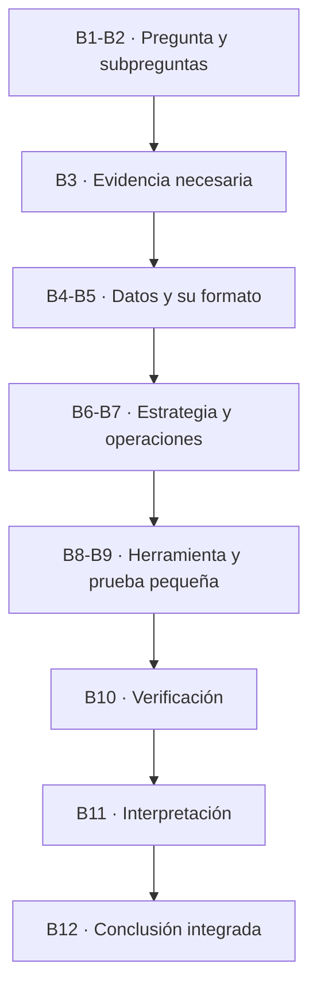

# Unidad 1. Trabajo reproducible y comunicación técnica

> **NOTA — Cómo se estudia esta unidad (aula invertida):** Esta unidad funciona en tres momentos.
> **(1) Antes de clase** lees este material y haces un **primer intento** de las prácticas. No se
> espera que tu intento esté completo ni perfecto: los errores, los resultados inesperados y las
> dudas son justamente el **insumo del taller**. **(2) En clase** trabajamos en formato **taller**:
> revisamos intentos, comparamos estrategias, corregimos errores y resolvemos dudas. **(3) Después
> del taller** entregas una **versión corregida**.
>
> **Al taller debes llevar:** tu primer intento, al menos **una duda concreta**, una nota sobre la
> parte que te resultó **más difícil**, y los **errores o resultados inesperados** que encontraste.
>
> **Cómo se evalúa cada momento:** el **primer intento** se valora por la preparación, el esfuerzo y
> la identificación de dificultades —**no** por estar completamente correcto—; la **participación en
> el taller** por la revisión y corrección argumentada; y la **entrega final** por su calidad. Al
> final de la unidad encontrarás las rúbricas de cada momento.

## Ficha de la unidad

| Elemento | Descripción |
| --- | --- |
| **Sesiones** | S1–S2 |
| **Competencias** | A (Trabajo reproducible y comunicación científica) · G (Uso responsable de IA) |
| **Propósito** | Establecer desde el arranque una cultura de trabajo reproducible y la capacidad de resolver y comunicar un problema bioinformático de forma documentada, verificable y científicamente válida. |
| **Contribución al objetivo del curso** | Sienta las bases para *resolver problemas bioinformáticos reales mediante un trabajo computacional documentado, reproducible, verificado y suficientemente robusto*. |
| **Ajustes integrados** | Introducción al prompting científico y uso responsable de IA |
| **Lectura base** | Buffalo (2015), Cap. 1 y Cap. 2 |

### Resultados de aprendizaje (demostrables)

Al terminar la unidad, el estudiante es capaz de:

1. **Explicar** la importancia de la reproducibilidad en la investigación.
2. **Distinguir** reproducibilidad, replicabilidad, verificación, validación y robustez, y aplicarlas como acciones.
3. **Reconocer** las fases del manejo y análisis de datos.
4. **Resolver** de forma sistemática un problema bioinformático sencillo.
5. **Descomponer** una pregunta biológica en subpreguntas abordables.
6. **Relacionar** cada subpregunta con datos, operaciones, evidencia y validación.
7. **Documentar** un protocolo bioinformático en Markdown.
8. **Organizar** datos, procedimientos, resultados y documentación de forma reproducible.
9. **Aplicar** los principios FAIR y **crear** metadatos.
10. **Utilizar** asistentes de IA de forma crítica, ética y verificable.
11. **Formular** conclusiones que respondan la pregunta biológica central.

---

## Ruta de aprendizaje de la unidad

| Aspecto | Detalle |
| --- | --- |
| **Tiempo estimado de lectura** | 60–90 minutos |
| **Tiempo estimado del primer intento** | 60–90 minutos |
| **Secciones indispensables (comprender)** | 1, 2, 3, 4, 6 y 7 |
| **Secciones de consulta o ampliación** | 5.3 (Mermaid) y el Glosario |
| **Productos mínimos que debes llevar al taller (intentar)** | Borrador de `protocolo.md`; tabla de descomposición de la Práctica 3; primera entrada de `bitacora-ia.md`; tus dudas y dificultades |
| **Productos que se entregan después del taller (entregar)** | Tarea 1 y Tarea 2 corregidas (ver sección de Prácticas) |

> **TIP:** Cuatro verbos guían esta ruta. **Comprender** las secciones conceptuales; **consultar**
> las de ampliación cuando las necesites; **intentar** las prácticas aunque no las termines; y
> **entregar** solo después del taller. Si algo no te sale, anótalo: esa nota vale para el taller.

---

## 1. La bioinformática, las habilidades con datos y la reproducibilidad

### 1.1 ¿Qué es la bioinformática y por qué necesitas habilidades con datos?

Hace algunas décadas, determinar los elementos genéticos de un genoma requería miles de experimentos
a lo largo de muchos años. Por ejemplo, la información sobre la regulación de la expresión de genes
en *Escherichia coli* —recopilada en la base de datos **RegulonDB**— proviene de varios miles de
publicaciones experimentales. Hoy las tecnologías de secuenciación han cambiado el panorama: la
cantidad de datos biológicos generados cada día es **masiva** y crece de forma acelerada (Buffalo,
2015). El repositorio de secuencias **SRA** del NCBI, por citar un caso, ha crecido de manera
exponencial en la última década.

La **bioinformática** es la disciplina que aplica herramientas computacionales para **almacenar,
acceder y analizar** esa avalancha de datos biológicos. La única forma práctica de trabajar con
tantos datos es a través de la computadora, automatizando tareas para ahorrar tiempo y reducir
errores.


*Figura 1. Qué hace la bioinformática: transforma una pregunta y datos biológicos en evidencia interpretable mediante herramientas computacionales. Las habilidades con datos y el trabajo confiable atraviesan todo el proceso.*

> **NOTA:** Aprender bioinformática no es memorizar programas, sino desarrollar **habilidades con
> datos**: *"la capacidad de improvisar rápidamente una forma de ver conjuntos de datos complejos,
> usando un conjunto conocido de herramientas"* (Buffalo, 2015). Se aprende como lo hace un
> bioinformático: **probando cosas con datos en la computadora y comprendiendo sus resultados.**

### 1.2 Cuando descuidamos el trabajo: dos casos reales

Tener habilidades técnicas **no basta**: hay que trabajar con cuidado, de forma verificable y
reproducible. Dos casos famosos muestran qué ocurre cuando esto falla.

- **Un problema de descuido.** El caso de las células **STAP** (2014): un resultado presentado como
  un descubrimiento histórico resultó **no reproducible**, en medio de descuido y falta de rigor. El
  episodio terminó en retractaciones y en un enorme costo humano y científico
  ([The Guardian, 2015](https://www.theguardian.com/science/2015/feb/18/haruko-obokata-stap-cells-controversy-scientists-lie);
  [Japan Times, 2024](https://www.japantimes.co.jp/news/2024/04/09/japan/science-health/10-years-since-stap/)).

- **Un problema de software.** Un grupo tuvo que **retractar cinco artículos** cuando se descubrió
  que un **error en su programa** invertía el signo de dos columnas de datos, produciendo estructuras
  de proteínas equivocadas. No hubo mala fe: fue un **error de software no detectado** (Miller, 2006,
  *Science*).

> **IMPORTANTE:** *"Non-reproducible single occurrences are of no significance to science"* (Karl
> Popper, *The Logic of Scientific Discovery*, 1959). Un resultado que ocurre una sola vez y no puede
> regenerarse no aporta a la ciencia. Por eso el trabajo reproducible y verificado es parte del
> método, no un trámite.

### 1.3 Cómo se ve el trabajo bien hecho

Frente a esos ejemplos de lo que **no** hay que hacer, conviene ver uno de lo que **sí**. Un buen
proyecto bioinformático se reconoce porque:

- Registra el **origen, versión e integridad** de cada dato (metadatos).
- Conserva los **datos originales intactos** y genera los derivados aparte.
- Documenta **cada comando** y lo asocia a la subpregunta que responde.
- **Verifica** los resultados intermedios y **valida** que respondan la pregunta.
- **Interpreta** biológicamente los resultados y cierra con una **conclusión** sustentada.
- Permite que **otra persona regenere** todo el análisis.

Un ejemplo **publicado** de estas buenas prácticas es el trabajo *Reproducible RNA-seq analysis
using recount2* (Collado-Torres et al., 2017, *Nature Biotechnology*). Sus autores no se limitaron a
publicar resultados: pusieron a disposición de la comunidad los **datos ya procesados** de más de
70 000 muestras de RNA-seq provenientes del repositorio público **SRA**, junto con un **paquete de
software documentado** (`recount`) para consultarlos, descargarlos y analizarlos, y **material
reproducible** que permite rehacer los análisis paso a paso. En otras palabras, cualquier persona
puede **regenerar y reutilizar** su trabajo: justo lo contrario de los dos casos anteriores.

> **¿SABÍAS QUE?:** Leonardo Collado-Torres, uno de los autores de recount2, imparte el módulo de
> transcriptómica en *Bioinformática y Estadística II*, más adelante en tu formación. El estilo de
> trabajo reproducible que empiezas a aprender aquí es el mismo que verás en la investigación real.

> **TIP — Un modelo para construir en el curso:** A menor escala, el reporte
> `ejemplos/ReporteGenomeEcoli_Formato_v2.md` muestra ese mismo cuidado aplicado al genoma de
> *E. coli*: plantea preguntas, registra la procedencia de los datos, documenta los comandos, muestra
> los resultados y los interpreta. Tenlo como referencia de la calidad que construiremos durante el
> semestre.

### 1.4 ¿Por qué la reproducibilidad?

Imagina que dentro de un año un revisor te pide rehacer el análisis de tu tesis, o que un compañero
quiere partir de tu trabajo. Si no puedes **regenerar los mismos resultados** a partir de los mismos
datos y procedimientos, tu trabajo no es verificable. En ciencia, un resultado que no puede
regenerarse tiene poco valor.

### 1.5 Cuatro conceptos que usaremos con precisión

La terminología varía entre disciplinas; estas son las definiciones que **este curso** utilizará de
forma consistente. Evitamos la palabra ambigua "repetir".

- **Reproducibilidad.** Otra persona puede **regenerar los resultados** usando los **mismos datos,
  procedimientos, comandos y herramientas** documentados.
  *Ejemplo:* entregas tu genoma, tu protocolo y tus comandos, y tu compañera obtiene el mismo conteo.
- **Replicabilidad.** Se obtiene **evidencia compatible** mediante un **estudio o conjunto de datos
  independiente**.
  *Ejemplo:* otro grupo analiza una cepa distinta de *E. coli* y llega a una conclusión similar.
- **Verificación.** Se comprueba que **archivos, comandos, operaciones y resultados intermedios**
  funcionan como se esperaba.
  *Ejemplo:* confirmas que un archivo se descargó completo comparando su checksum (una "huella
  digital" del archivo: un código que cambia si el archivo se altera).
- **Validación.** Se demuestra que el procedimiento y la evidencia **realmente permiten responder**
  la pregunta biológica.
  *Ejemplo:* verificas que contar líneas de tipo "gene" en el GFF sí corresponde a "número de genes".
- **Robustez.** Se comprueba que la conclusión **no depende de decisiones frágiles**, errores
  silenciosos ni de una única comprobación insuficiente.
  *Ejemplo:* obtienes el mismo conteo por dos caminos distintos.


*Figura 2. Reproducible no es lo mismo que robusto: un análisis puede regenerarse exactamente y aun así estar equivocado. La investigación confiable es a la vez reproducible y robusta.*

> **IMPORTANTE — La Regla de Oro de la Bioinformática** (Buffalo, 2015, Cap. 1): *nunca confíes
> ciegamente en tus herramientas ni en tus datos*. Verifica todo —supuestos, formatos, resultados
> intermedios—, porque los conjuntos de datos son enormes y un error silencioso puede propagarse sin
> que lo notes. Verificación, validación y robustez son la Regla de Oro convertida en acciones.

> **COMENTARIO:** Estos cuatro principios no son solo teoría: aparecerán como **acciones observables**
> dentro de cada práctica, y se retomarán progresivamente en las siguientes unidades y en el
> proyecto integrador.

---

## 2. Dos procesos complementarios

Trabajar con datos implica **dos procesos que se relacionan pero no son equivalentes**. Distinguirlos
evita confundir "mover datos de un lado a otro" con "responder una pregunta".


*Figura 3. El ciclo del análisis de datos. Cada fase responde una pregunta distinta, pero la documentación y los metadatos acompañan a todas.*

### A. Fases del manejo y análisis de datos

Describen el **ciclo de vida de los datos**:

1. **Obtención.** Descargar los datos de una fuente confiable.
2. **Registro de procedencia.** Anotar de dónde vienen, su versión y su integridad (metadatos).
3. **Exploración.** Revisar formato, tamaño, campos y posibles problemas.
4. **Limpieza o transformación.** Preparar los datos generando **archivos nuevos** (no sobre el original).
5. **Análisis.** Filtrar, contar, comparar para producir evidencia.
6. **Conservación.** Resguardar los datos originales intactos y los derivados por separado.
7. **Documentación y comunicación.** Registrar y reportar todo de forma reproducible.

> **NOTA:** El **cómo** hacer bien estas fases se reparte en el resto de la unidad: el **estándar**
> que las rige (FAIR) se ve enseguida; la **ficha de metadatos** de cada dato, en la sección 4; y la
> **organización del proyecto**, en la sección 6.

### El estándar del manejo de datos: FAIR

Todo ese manejo de datos (proceso A) se rige por un **estándar de calidad**: los **principios FAIR**
(Wilkinson et al., 2016), que describen cómo gestionar los datos para que conserven su valor y puedan
reutilizarse. FAIR es un acrónimo:

- **F**indable (localizable): tiene identificadores y metadatos que permiten encontrarlo.
- **A**ccessible (accesible): se recupera mediante un protocolo claro.
- **I**nteroperable (interoperable): usa formatos y vocabularios estándar.
- **R**eusable (reutilizable): está bien documentado y con licencia clara.


*Figura 4. Los principios FAIR para datos y software. Son cuatro condiciones complementarias para que un recurso científico conserve su valor y pueda reutilizarse; FAIR no significa necesariamente "abierto" o "gratuito".*

> **IMPORTANTE:** FAIR **no se añade al final**, al publicar: **nace en la obtención**. Si no
> registras la procedencia y los metadatos cuando obtienes el dato (fase A2), esa información se
> pierde y ya no podrás hacerlo FAIR después. Se **siembra al inicio**, se **sostiene** durante todo
> el proyecto y se **cosecha** al compartir o reutilizar.

> **NOTA:** FAIR **no** significa necesariamente "abierto/gratis": significa que, con los permisos que
> correspondan, el dato es localizable, accesible, interoperable y reutilizable.

Existe una versión de estos principios **para software**, los **FAIR4RS** (*FAIR for Research
Software*; Barker et al., 2022): tu código y tus comandos también deben ser localizables, accesibles,
interoperables y reutilizables (documentados, con versiones y licencia). El control de versiones (Git)
se aborda en *Programación Aplicada a la Bioinformática I*.

La siguiente tabla muestra **en qué fase del proceso A aplicas cada principio** y dónde se refleja en
tu proyecto:

| Principio FAIR | Fase del proceso A donde lo aplicas | En tu proyecto |
| --- | --- | --- |
| Findable | A1 Obtención · A2 Registro de procedencia | Identificador y metadatos del archivo en `data/source/` |
| Accessible | A2 Registro de procedencia | URL y procedimiento de obtención en los metadatos |
| Interoperable | A3 Exploración · A7 Documentación | Formatos estándar (FASTA, GFF, CSV) documentados |
| Reusable | A6 Conservación · A7 Documentación | Original intacto con checksum, licencia y diccionario de variables |

> **COMENTARIO:** FAIR es la **calidad con la que ejecutas** las fases de registro de procedencia,
> conservación y documentación del proceso A; no es un paso extra. La **ficha de metadatos** que
> aplica este estándar la construyes en la sección 4, y la estructura de carpetas donde vive, en la
> sección 6.


*Figura 5. Dónde encajan el manejo de datos y FAIR en un proyecto: cada fase del proceso A produce algo, se guarda en una carpeta y aplica los principios FAIR que le corresponden. Los metadatos viven junto a los datos en `data/source/`.*

### B. Fases de resolución de un problema bioinformático

Describen **cómo se razona** para responder una pregunta:

1. **Delimitar** la pregunta biológica.
2. **Descomponerla** en subpreguntas.
3. **Definir la evidencia** necesaria para cada subpregunta.
4. **Identificar los datos** requeridos.
5. **Examinar el formato** y los campos disponibles.
6. **Diseñar la estrategia** *antes* de elegir comandos.
7. **Traducir la estrategia** en operaciones computacionales.
8. **Seleccionar y ejecutar** comandos.
9. **Probar primero con un caso pequeño.**
10. **Verificar** los resultados.
11. **Interpretar** cada respuesta.
12. **Integrar** una conclusión.

### Cómo se complementan

El proceso **B** es el **mapa del razonamiento**: decide *qué* preguntar, *qué* evidencia buscar y
*cómo* interpretarla. El proceso **A** es el **manejo cuidadoso de los datos**: ocurre **dentro** de
B, sobre todo cuando B llega a la parte de conseguir y trabajar los datos. Dicho de otro modo, B te
dice *qué* datos necesitas y *para qué*; A te dice *cómo* obtenerlos, resguardarlos y transformarlos
de forma confiable.

La siguiente tabla muestra **dónde cae cada fase del manejo de datos (A) dentro de la resolución del
problema (B)**:

| Fase del manejo de datos (A) | ¿Dónde ocurre dentro de la resolución (B)? |
| --- | --- |
| Obtención | Paso B4 (identificar los datos) → se descargan los datos elegidos |
| Registro de procedencia | Pasos B4–B5 (al identificar y examinar los datos) |
| Exploración | Paso B5 (examinar el formato y los campos disponibles) |
| Limpieza o transformación | Pasos B6–B7 (diseñar la estrategia y traducirla en operaciones) |
| Análisis | Pasos B8–B10 (ejecutar, probar en pequeño y verificar) |
| Conservación | Atraviesa B: resguardar el original y guardar los derivados aparte |
| Documentación y comunicación | Atraviesa todo B: se registra en cada paso y culmina en B12 (conclusión) |

> **NOTA:** El proceso **B** organiza el *razonamiento* y el proceso **A** cuida los *datos*: A no es
> un proceso paralelo, sino el **manejo de datos que se ejecuta dentro de B**. Primero razonas qué
> necesitas (B); en el momento de tocar los datos, lo haces con cuidado (A). No son lo mismo, pero se
> encajan uno dentro del otro.

Estas dos secciones que siguen **desarrollan lo que acabamos de ver**: la **sección 3** pone en
práctica el proceso B con un ejemplo concreto, y la **sección 4** muestra cómo todo ese razonamiento
se registra en un documento —el **protocolo**—. Son las dos caras de una misma moneda: *razonar* el
problema (sección 3) y *documentarlo* de forma reproducible (sección 4).

---

## 3. De la pregunta biológica a una solución computacional

Esta sección **aplica el proceso B** de la sección 2 (cómo se razona un problema), recorriendo sus
pasos sobre un ejemplo. La idea central es la misma: **no se empieza eligiendo comandos**. Se empieza
por la pregunta, luego se define qué evidencia la responde, qué datos la contienen y, **al final**,
qué herramienta la obtiene.

> **IMPORTANTE:** El orden correcto es **pregunta → evidencia → datos → operación → herramienta**.
> Empezar por el comando es la causa más común de análisis que "corren" pero no responden nada.

> **NOTA:** A lo largo del curso trabajarás con **varios conjuntos de datos** —el genoma de
> *E. coli*, sRNAs, datos de ratón y una red de regulación, entre otros—. Aquí ilustramos el proceso
> con **uno** de ellos, pero **el mismo razonamiento (pasos B1–B12 de la sección 2) se aplica a todos**.

El siguiente diagrama resume los pasos que recorreremos:



### El proceso B aplicado a un ejemplo

Para ilustrarlo usamos el genoma de la bacteria *E. coli* K-12 y su archivo de anotación en formato
**GFF** (una tabla donde cada renglón es un elemento del genoma —un *feature*—, como un gen o una
región).

**B1–B2. Delimitar y descomponer la pregunta.**
*Pregunta central:* ¿cuántos genes tiene el genoma de *E. coli* K-12 y cómo se distribuyen en el
cromosoma? La dividimos en tres **subpreguntas** manejables: (a) ¿de qué tamaño es el genoma?,
(b) ¿cuántos genes hay?, (c) ¿cómo se distribuyen por cadena?

**B3–B5. Definir la evidencia, identificar los datos y examinar su formato.**
Cada subpregunta se responde con una **evidencia** concreta que vive en un **dato** concreto. Antes
de operar hay que **examinar el formato**: el GFF es tabular; su **columna 3** indica el tipo de
feature (p. ej. `gene`) y su **columna 7** la cadena (`+` o `-`); el tamaño del genoma aparece en el
encabezado del archivo. Conocer las columnas es lo que permite diseñar la estrategia.

**B6–B7. Diseñar la estrategia, antes de elegir comandos.**
Con lo anterior se arma la **tabla de estrategia**: para cada subpregunta, qué evidencia se necesita,
en qué dato está, qué operación conceptual la obtiene, con qué herramienta podría hacerse, cómo se
valida y cómo se interpreta.

| Subpregunta | Evidencia necesaria | Datos | Operación (conceptual) | Herramienta posible | Validación | Interpretación |
| --- | --- | --- | --- | --- | --- | --- |
| ¿De qué tamaño es el genoma? | Longitud total en pares de bases | Encabezado del GFF / FASTA | Leer la región declarada | Visualización de texto | Contrastar el valor del GFF con el del registro en NCBI | Tamaño típico de una bacteria (~4.6 Mb) |
| ¿Cuántos genes hay? | Número de renglones de tipo "gene" | Columna 3 del GFF | Filtrar por "gene" y contar | Filtro + conteo | Comparar con el número reportado por NCBI | Densidad génica del genoma |
| ¿Cómo se distribuyen por cadena? | Conteo de genes en cadena `+` y `-` | Columna 7 del GFF | Agrupar por cadena y contar | Filtro + conteo | La suma `+` y `-` debe igualar el total de genes | Organización del genoma en ambas hebras |

> **NOTA:** Esta tabla es el **artefacto central** de la sección: es lo que construirás en la
> Práctica 3 y lo que registrarás en el protocolo (sección 4).

**B8–B9. Elegir la herramienta y probar en pequeño.**
Las herramientas de la tabla son "posibles": las aprenderás a ejecutar en las unidades siguientes.
Cuando llegue el momento, **pruébalas primero con un caso pequeño** (unos pocos renglones del GFF, de
resultado conocido) antes de aplicarlas al genoma completo.

**B10–B11. Verificar e interpretar.**
Cada resultado se **verifica** —por ejemplo, la suma de genes en `+` y `-` debe igualar el total— y
se **interpreta** biológicamente: un genoma de ~4.6 Mb con alta densidad génica es típico de una
bacteria.

**B12. Integrar la conclusión.**
Con las respuestas validadas se **integra una conclusión** que responde la pregunta central:
*"El genoma de* E. coli *K-12 mide ~4.6 Mb y contiene N genes distribuidos en ambas cadenas, lo que
indica una alta densidad génica característica de las bacterias."*

> **¿SABÍAS QUE?:** Casi cualquier análisis bioinformático, por complejo que parezca, se resuelve
> así: una pregunta grande se parte en subpreguntas pequeñas y verificables. Dominar esta
> descomposición es más importante que memorizar comandos.

---

## 4. El protocolo de resolución de un problema bioinformático

El razonamiento que acabas de ver en la sección 3 —la pregunta, las subpreguntas, la evidencia, los
datos y la estrategia— **no vive en tu cabeza ni en notas sueltas: se registra en el protocolo**. La
tabla que armaste en la sección 3 es, de hecho, el punto de partida de este documento.

En este curso, el **protocolo** no es una simple propuesta previa ni una lista de comandos: es un
**documento vivo** donde se registra y organiza toda la resolución del problema.

Características del protocolo:

- Es un **documento vivo**: se completa progresivamente durante varias unidades.
- **Organiza el razonamiento**, no solo los comandos.
- **Relaciona cada comando con una subpregunta.**
- Registra **entradas, operaciones, salidas y validaciones**.
- Incluye **resultados e interpretación**.
- Termina con una **conclusión** que responde la pregunta central.
- Permite **reproducir y evaluar** el análisis.

Sus secciones y la función de cada una:

| Sección | Función |
| --- | --- |
| Introducción | Presentar contexto y problema |
| Pregunta central | Delimitar qué se quiere responder |
| Subpreguntas | Dividir el problema |
| Datos | Registrar origen, versión, formato e integridad |
| Estrategia | Explicar cómo se resolverá cada subpregunta |
| Comandos | Documentar la ejecución |
| Resultados | Presentar la evidencia obtenida |
| Validación | Comprobar los resultados |
| Discusión | Interpretar su significado biológico |
| Conclusiones | Integrar las respuestas |

> **NOTA:** En la Unidad 1 iniciarás las secciones **Introducción, Pregunta central, Subpreguntas,
> Datos y Estrategia**. Las secciones **Comandos, Resultados, Validación, Discusión y Conclusiones**
> se completarán en las unidades posteriores, conforme aprendas a ejecutar y verificar los análisis.
> Consérvalas en tu plantilla aunque todavía estén vacías.

### 4.1 El protocolo y la escritura científica

Cuando el protocolo se comunica como reporte, sus partes corresponden a las de un artículo
científico. Usa esta correspondencia:

- **Pregunta y contexto → Introducción.**
- **Datos y exploración → Metodología.**
- **Estrategia y procedimientos analíticos → Metodología.**
- **Evidencias obtenidas → Resultados.**
- **Significado biológico y limitaciones → Discusión.**
- **Respuesta integrada → Conclusiones.**
- **Documentación y metadatos → atraviesan todo el proceso.**

> **IMPORTANTE:** Los **procedimientos analíticos** (cómo obtuviste la evidencia) pertenecen a la
> **Metodología**, no a Resultados. En Resultados va la **evidencia**; en Discusión, su
> **interpretación**.

Puedes consultar la plantilla en blanco `ejemplos/formato_protocolo_v1.0.md` y un ejemplo ya
trabajado en `ejemplos/ReporteGenomeEcoli_Formato_v2.md`.

### 4.2 La ficha de cada dato: los metadatos

El protocolo documenta el *análisis*. Cada **dato**, además, lleva su propia **ficha**: un archivo de
**metadatos** que lo describe para poder interpretarlo y reutilizarlo (es la aplicación concreta del
estándar FAIR visto en la sección 2). Esta ficha **alimenta la sección _Datos_ del protocolo** y se
guarda junto al dato original en `data/source/` (sección 6).

Un **metadato** describe un dato para poder interpretarlo correctamente. El siguiente bloque es una
plantilla; los campos marcados **(mínimo U1)** son los que llenas en esta unidad, el resto se completa
cuando descargues datos reales en unidades posteriores:

```markdown
# Metadatos — <nombre_del_archivo>

- Nombre original del archivo:        (mínimo U1)
- Descripción del contenido:          (mínimo U1)
- Organismo:                          (mínimo U1)
- Base de datos de origen:            (mínimo U1)
- URL:                                (mínimo U1)
- Identificador o accesión:           (mínimo U1)
- Versión o release:
- Fecha de acceso:                    (mínimo U1)
- Formato:                            (mínimo U1)
- Tamaño:
- Checksum (integridad):
- Licencia o condiciones de uso:
- Responsable (quién lo obtuvo):      (mínimo U1)
- Procedimiento de obtención:
- Notas de procedencia:
- Transformaciones realizadas:        (si aplica)
```

Cuando los datos vienen en forma de tabla (columnas), los metadatos deben incluir un **diccionario de
variables**: qué significa cada columna, su tipo y sus unidades. Puedes ver un ejemplo completo en
`ejemplos/metadatos_pacientes.md`, que documenta un archivo de datos clínicos anónimos.

> **TIP:** El **checksum** es una "huella digital" del archivo (un código que cambia si el archivo se
> altera). Sirve para verificar que una descarga llegó íntegra. Aprenderás a calcularlo en la
> Unidad 3; por ahora basta con que sepas para qué sirve y reserves el campo.

---

## 5. Comunicar con Markdown

Comunicar con claridad es parte del método científico. **Markdown** es un lenguaje de marcado
ligero: se escribe texto plano con marcas simples (`#`, `*`, `-`) que luego se convierte a HTML, PDF
u otros formatos. Fue creado por John Gruber para que el texto fuente sea **legible tal cual**
(Buffalo, 2015, Cap. 2). Es el formato de los README de GitHub, de la documentación técnica y de gran
parte del material científico en línea.

Página oficial: <https://daringfireball.net/projects/markdown/>. Guía de referencia:
<https://www.markdownguide.org/>.

### 5.1 La herramienta que usaremos: StackEdit

Practicaremos con **StackEdit**, un editor de Markdown **gratuito que funciona en el navegador**, sin
instalar nada (<https://stackedit.io>). Muestra, lado a lado, **lo que escribes** (panel izquierdo) y
**cómo se verá** (panel derecho, vista previa sincronizada). Tiene, además, una barra de herramientas
que inserta las marcas por ti, un explorador de documentos y opciones para **exportar** a `.md`, HTML
o PDF.


*Figura 6. Componentes principales de StackEdit: (1) panel de edición, (2) vista previa, (3) barra de herramientas, (4) menú lateral y (5) explorador de documentos. Captura propia de StackEdit (stackedit.io).*

> **ADVERTENCIA:** StackEdit guarda tus documentos en el **navegador**. Para conservar tu trabajo,
> **exporta el archivo `.md`** (menú ☰ → Export) y guárdalo en tu carpeta de proyecto. El `.md`
> exportado es lo que entregas.

> **TIP — Sin conexión:** Como Markdown es texto plano, si no tienes internet puedes escribir tu
> `.md` en **cualquier editor de texto** (por ejemplo, el Bloc de notas, TextEdit en modo texto o
> VS Code) y ver la vista previa más tarde. No dependes de una herramienta específica.

### 5.2 Elementos de Markdown

Cada elemento cumple una **función comunicativa**; úsalo cuando aporte claridad, no por obligación.

```markdown
# Título de nivel 1
## Título de nivel 2

Un párrafo normal, con **negrita** para lo importante, *cursiva* para matizar
y `código en línea` para nombres de archivos o comandos, como `genoma.gff`.

- Lista con viñetas (para enumerar sin orden)
1. Lista numerada (para pasos con orden)

[Texto de un enlace](https://www.ncbi.nlm.nih.gov)
```

- **Encabezados** (`#`): estructuran el documento en secciones.
- **Párrafos y énfasis** (`**`, `*`): resaltan ideas clave sin abusar.
- **Listas**: enumeran pasos u opciones.
- **Enlaces**: citan fuentes y datos.
- **Código en línea y bloques** (` ``` `): distinguen comandos y datos del texto.

Las **tablas** y los **bloques de código** son útiles cuando hay datos tabulares o comandos que
mostrar. El siguiente bloque muestra una tabla:

```markdown
| Archivo        | Formato | Descripción           |
| -------------- | ------- | --------------------- |
| genoma.fasta   | FASTA   | Secuencia del genoma  |
| anotacion.gff3 | GFF3    | Anotación de features |
```

> **TIP — Ejemplos correcto e incorrecto.** Un buen documento usa cada elemento con propósito.
> *Incorrecto:* poner todo en negrita (nada resalta) o meter una tabla de una sola celda.
> *Correcto:* un título por sección, listas para pasos y una tabla solo cuando hay varias columnas
> de datos que comparar.

### 5.3 Diagramas con Mermaid (ampliación, opcional)

**Mermaid** permite crear diagramas escribiéndolos como texto (<https://mermaid.js.org>). En esta
unidad es **opcional**; resulta útil sobre todo para representar las **fases de solución** de un
problema, como en el diagrama de la sección 3. El tipo más frecuente es el diagrama de flujo
(`flowchart`).

---

## 6. Organización reproducible del proyecto y datos fuente

Un proyecto ordenado separa lo que **entra** (datos originales) de lo que **se produce** (datos
transformados y resultados, siempre regenerables). Sigue esta estructura (Buffalo, 2015, Cap. 2):

```text
proyecto/
├── README.md          # cuaderno del proyecto: qué es y cómo reproducirlo
├── data/              # todos los datos van aquí, separados del código
│   ├── source/        # datos ORIGINALES, inmutables + sus metadatos
│   └── processed/     # datos derivados (limpios o transformados)
├── src/               # scripts y comandos
├── results/           # resultados y evidencia (regenerables)
└── doc/               # documentación y reportes (p. ej. protocolo.md)
```

> **NOTA:** Se agrupan todos los datos bajo `data/` y se separan los **originales**
> (`data/source/`) de los **derivados** (`data/processed/`). Esta es la convención recomendada para
> proyectos de biología computacional (Noble, 2009): mantiene los datos juntos, los separa del código
> y los resultados, y escala bien cuando aparecen datos externos o intermedios.


*Figura 7. Organización de un proyecto reproducible: separa los datos (originales en `data/source/` y derivados en `data/processed/`) del código, los resultados y la documentación (Noble, 2009).*

Reglas para los **datos fuente** (`data/source/`), enunciadas con precisión:

- Los archivos originales **pueden leerse y copiarse**.
- **No** deben editarse, sobrescribirse ni reemplazarse.
- Deben **conservar su nombre original y su checksum**.
- Cualquier transformación debe **producir archivos nuevos**.
- Los datos derivados se guardan **fuera** de `data/source/` (en `data/processed/`).
- Los resultados deben poder **regenerarse** a partir de los datos fuente.

> **IMPORTANTE:** La idea no es "no tocar los datos" en abstracto, sino que **el punto de partida
> siempre permanezca recuperable**. Si transformas un archivo, la salida es un archivo nuevo; el
> original queda idéntico, con su nombre y checksum.

> **NOTA:** En esta unidad **no** necesitas crear esta estructura con comandos de Unix. Eso se
> trabaja formalmente en la **Unidad 2**. Para tu primer intento puedes **dibujar** el árbol,
> **escribirlo** como bloque de texto o usar la **carpeta modelo** que proporcione la docente.

---

## 7. Uso responsable de la Inteligencia Artificial

> **NOTA:** Esta sección es el **inicio del eje de IA en espiral** del curso: aquí sentamos las
> bases; se refuerza con tareas reales y se cierra con una discusión crítica al final del semestre.

Los asistentes de IA generativa ya son parte del trabajo cotidiano. En este curso los usamos **como
apoyo**, con criterios claros para que fortalezcan tu razonamiento en lugar de sustituirlo.

### 7.1 Qué es un modelo de lenguaje y qué son las alucinaciones

Un **modelo de lenguaje grande** (LLM) predice la **continuación más probable** de lo que escribes;
**no comprende ni verifica**, genera texto plausible. Por eso puede **sonar seguro y estar
equivocado**: a esas respuestas falsas pero verosímiles —un comando que no existe, una opción
inventada, una cita inexistente— se les llama **alucinaciones**.

### 7.2 Estructura de un prompt científico

Un buen *prompt* (instrucción) mejora la respuesta. Un prompt científico incluye:

1. **Contexto** (qué estás haciendo).
2. **Pregunta u objetivo** (qué quieres lograr).
3. **Tipo y formato de los datos** (p. ej. un GFF tabular).
4. **Ambiente de ejecución** (Linux, línea de comandos).
5. **Restricciones** (herramientas permitidas, sin instalar nada).
6. **Resultado esperado** (qué forma tendría la respuesta correcta).
7. **Supuestos** que estás haciendo.
8. **Solicitud de explicación** (que te explique cada paso).
9. **Fuentes o documentación** que deberían consultarse.
10. **Plan de verificación** (cómo comprobarás la respuesta).


*Figura 8. Los cuatro bloques esenciales de un prompt científico —contexto, objetivo, formato y verificación— con un ejemplo integrado. La lista de arriba los desarrolla en detalle.*

> **IMPORTANTE:** Un mejor prompt **no sustituye** la validación independiente. Aunque la respuesta
> parezca perfecta, debes comprobarla tú.

### 7.3 Validación independiente

Tras recibir una respuesta de IA: **(1)** entiéndela —si no puedes explicar qué hace, no la uses—;
**(2)** pruébala en datos pequeños de resultado conocido; **(3)** contrástala con la documentación
oficial o el material del curso.


*Figura 9. Antes de usar una respuesta de IA hay que entenderla, probarla y contrastarla. Si no es confiable, se corrige y se vuelve a validar; la responsabilidad del resultado es siempre de quien realiza el análisis.*

### 7.4 Actividad: detectar una respuesta de IA defectuosa

Un estudiante preguntó a una IA cómo contar los genes de un archivo GFF y recibió esta respuesta
(que contiene errores deliberados):

> "Usa el comando `countgenes archivo.gff`, que devuelve el número exacto de genes. Está descrito en
> Smith et al. (2019), *Journal of Genome Counting*."

Esta respuesta es sospechosa: menciona un comando que **no existe** (`countgenes`) y una **referencia
probablemente inventada**. Tu tarea (se detalla en la Práctica 4) será identificar el error,
explicar por qué es sospechoso, contrastarlo con una fuente confiable, y concluir si la respuesta era
**totalmente, parcialmente o nada** confiable.

### 7.5 Política de uso de IA del curso

- **Usos permitidos:** entender conceptos, explicar comandos, sugerir estrategias, revisar redacción.
- **Usos no permitidos:** entregar como propio texto o código generado sin comprender ni validar;
  usar IA donde el examen o la actividad lo prohíban explícitamente.
- **En tareas:** permitida con **declaración** y bitácora.
- **En el proyecto:** permitida como apoyo; el razonamiento y las conclusiones deben ser tuyos.
- **En exámenes prácticos:** solo si se autoriza expresamente.
- **Datos sensibles:** no compartas datos privados o no públicos en un asistente.
- **Responsabilidad:** el resultado es **tuyo**; respondes por él.
- **Declaración obligatoria:** todo uso de IA se declara en la bitácora.

### 7.6 Bitácora de IA

Registra, por cada uso: **fecha**, **actividad**, **herramienta y modelo** (si se conoce), **consulta
o prompt**, **respuesta relevante**, **error o limitación detectada**, **fuente usada para validar**,
**prueba realizada**, **corrección efectuada** y **conclusión sobre la confiabilidad**.

```markdown
## 2026-08-22 — Tarea 2
- Actividad: entender un campo del formato GFF.
- Herramienta/modelo: (nombre y versión, si se conoce).
- Prompt: "¿Qué representa la columna 3 de un archivo GFF? ..."
- Respuesta relevante: "la columna 3 es el tipo de feature".
- Error/limitación: ninguno detectado.
- Fuente de validación: documentación del formato GFF3.
- Prueba: revisé 3 renglones del archivo y coincidió.
- Corrección: no requerida.
- Conclusión de confiabilidad: respuesta confiable.
```

---

## 8. Prácticas

> Cada práctica tiene tres apartados:  
> - **Antes de clase (primer intento)**,   
> - **Durante el taller** y  
> - **Después del taller (entrega final)**.   
> Recuerda: lo que se **entrega y evalúa** ocurre **después**
> del taller; el primer intento se valora por preparación y esfuerzo.

### Práctica 1 — Protocolo y reporte de lectura en Markdown (Tarea 1)

**Antes de clase (primer intento).** Crea un borrador de `protocolo.md` con la estructura de la
sección 4 (Introducción, Pregunta central, Subpreguntas, Datos, Estrategia; deja Comandos,
Resultados, Validación, Discusión y Conclusiones como secciones vacías rotuladas). Crea también un
`reporte-lectura.md` del **Cap. 1 de Buffalo (2015)** —la lectura base de la unidad— con las
secciones: Referencia, Resumen, Aportación principal, Crítica o duda. Anota al menos una duda y la
parte más difícil.

**Durante el taller.** Revisaremos tu estructura, compararemos cómo distintos estudiantes plantearon
la pregunta central y las subpreguntas, y corregiremos el uso de Markdown según su función
comunicativa.

**Después del taller (entrega final).** Entrega `protocolo.md` y `reporte-lectura.md` corregidos.
Ambos deben usar los elementos de Markdown que aporten claridad (al menos títulos, una lista y un
enlace; tabla y bloque de código solo donde tengan función). Verifica que se ven bien en StackEdit.

### Práctica 2 — Organización del proyecto y metadatos (parte de la Tarea 2)

**Antes de clase (primer intento).** Trabajarás con el conjunto de datos pequeño del curso
`ejemplos/pacientes.md`, que contiene datos biométricos ficticios y anónimos de tres pacientes con
fines exclusivamente educativos.

1. **Dibuja con Mermaid o escribe en un bloque de código Markdown** la estructura de directorios de
   la sección 6 para un proyecto que utilice estos datos. No necesitas comandos de Unix. Incluye al
   menos `README.md`, `data/source/`, `data/processed/`, `src/`, `results/` y `doc/`, y ubica
   `pacientes.md` dentro de esa estructura.

2. Redacta un borrador de metadatos llamado `pacientes-metadatos.md` y colócalo junto al archivo de
   datos. Incluye los campos **mínimo U1** de la sección 4.2 y un diccionario para
   las variables `id`, `peso`, `altura`, `sexo`, `edad` y `dx`.

3. Examina el contenido del archivo y distingue entre lo que realmente puedes comprobar y lo que
   falta por documentar. En particular, revisa:

   - Si la extensión `.md` coincide con el formato interno del archivo.
   - En qué unidades están expresados `peso` y `altura`.
   - Qué valores acepta la variable `sexo`.
   - Qué significan los códigos de la variable `dx`.
   - Cuál es el origen, fecha, responsable y licencia de los datos.

   No inventes la información faltante: regístrala explícitamente como **“no documentada”** o
   **“pendiente de confirmar”**.

**Durante el taller.** Compararemos las estructuras propuestas, discutiremos dónde deben guardarse
los datos originales, los archivos derivados y los metadatos, y revisaremos los diccionarios de
variables. Analizaremos por qué una extensión de archivo no siempre permite conocer su formato real
y cómo los metadatos incompletos limitan las preguntas que pueden responderse.

**Después del taller (entrega final).** Entrega el árbol corregido del proyecto y
`pacientes-metadatos.md` con los campos mínimos y el diccionario de variables. Conserva
`pacientes.md` sin modificaciones dentro de `data/source/` y señala claramente cualquier
información que continúe pendiente de confirmar.

### Práctica 3 — De la pregunta biológica a la estrategia (parte de la Tarea 1)

**Antes de clase (primer intento).** Retomarás el archivo `pacientes.md` y los metadatos elaborados
en la práctica anterior.

Un integrante del equipo propone utilizar estos datos para investigar la siguiente pregunta:

> **¿Los datos de `pacientes.md` son suficientes para evaluar si el índice de masa corporal está
> relacionado con el diagnóstico registrado en `dx`?**

**Antes de pensar en comandos**, completa la siguiente tabla:

| Elemento | Tu respuesta |
| --- | --- |
| Pregunta central | |
| Subpreguntas | |
| Evidencia esperada | |
| Datos necesarios | |
| Operaciones requeridas | |
| Posible herramienta | |
| Método de validación | |
| Posible interpretación | |

Para construir tu estrategia, considera:

- ¿Están documentadas las unidades de `peso` y `altura`?
- ¿Qué operación permitiría calcular el índice de masa corporal?
- ¿Qué significa cada código de `dx`?
- ¿Cuántos pacientes hay para cada diagnóstico?
- ¿Es posible distinguir una asociación de una diferencia individual?
- ¿Qué datos o metadatos adicionales serían necesarios?
- ¿Qué conclusión sería válida si la evidencia disponible resulta insuficiente?

No es obligatorio concluir que existe una relación. Determinar que los datos son insuficientes, y
explicar por qué, también constituye un resultado científico válido.

**Durante el taller.** Compararemos las estrategias y discutiremos por qué puede haber varias
descomposiciones correctas de la misma pregunta. Distinguiremos entre calcular una variable,
observar diferencias y demostrar una asociación. Revisaremos qué limitaciones provienen del tamaño
del conjunto de datos y cuáles se deben a metadatos incompletos.

**Después del taller (entrega final).** Integra la tabla corregida en la sección *Estrategia* de
`protocolo.md`. La estrategia debe relacionar claramente pregunta, subpreguntas, evidencia, datos,
operaciones, validación e interpretación. Incluye un apartado breve de **limitaciones de los datos**.
Las secciones *Comandos* y *Resultados* pueden permanecer vacías, porque en esta práctica se evalúa
el razonamiento previo al análisis.

### Práctica 4 — Formular y validar el uso de IA (parte de la Tarea 2)

> **Regla — primero a mano, después con IA.** En las Prácticas 2 y 3 elaboraste los metadatos y la
> estrategia sin ayuda de un asistente. Ahora utilizarás IA para generar propuestas alternativas y
> compararlas con tu trabajo manual. Tu trabajo previo es la **verdad de referencia**: la IA no lo
> sustituye, sino que debes contrastarla, corregirla y validarla.

**Herramientas.** Puedes utilizar ChatGPT, Claude o los asistentes del curso. Formula tus prompts
siguiendo la estructura de la sección 7.2 y declara todo uso de IA en `bitacora-ia.md`. Recuerda que
el asistente no conoce la procedencia, las unidades ni el significado de las variables a menos que
se los proporciones. No aceptes como hechos las suposiciones que genere.

**Antes de clase (primer intento).** Realiza las siguientes dos actividades y regístralas en
`bitacora-ia.md`.

#### a) Metadatos con IA

En la Práctica 2 redactaste manualmente los metadatos y el diccionario de variables de
`pacientes.md`. Ahora formula un prompt para que un asistente genere su propia propuesta.

Puedes utilizar y adaptar el siguiente prompt:

> Tengo un archivo llamado `pacientes.md` cuyo contenido está separado por comas. Sus columnas son
> `id`, `peso`, `altura`, `sexo`, `edad` y `dx`. Necesito una ficha de metadatos en Markdown con
> origen, formato, fecha de acceso, responsable, licencia y un diccionario de variables que incluya
> descripción, tipo de dato, unidades y valores permitidos. No inventes información. Marca como
> “no documentado” o “pendiente de confirmar” todo lo que no pueda determinarse a partir de la
> información proporcionada. Explica qué información adicional sería necesario conseguir.

Compara la respuesta con `pacientes-metadatos.md` y revisa si la IA:

1. Identificó correctamente el formato interno del archivo y distinguió el formato de la extensión
   `.md`.
2. Supuso o inventó las unidades de `peso` y `altura`.
3. Inventó el significado de los códigos de la variable `dx`.
4. Supuso una fuente, fecha, responsable o licencia.
5. Identificó correctamente los posibles tipos de datos.
6. Distinguió entre información conocida, inferida y faltante.
7. Indicó qué datos adicionales sería necesario documentar.

Registra en `bitacora-ia.md`:

- El prompt completo.
- La respuesta del asistente.
- Las coincidencias con tu ficha manual.
- Las omisiones, suposiciones o invenciones detectadas.
- Las correcciones que realizaste.
- Tu conclusión sobre la confiabilidad de la respuesta.

#### b) Estrategia con IA

En la Práctica 3 construiste manualmente una estrategia para responder la pregunta:

> **¿Los datos de `pacientes.md` son suficientes para evaluar si el índice de masa corporal está
> relacionado con el diagnóstico registrado en `dx`?**

Ahora formula un segundo prompt para que el asistente descomponga la pregunta. Puedes utilizar y
adaptar el siguiente:

> Quiero evaluar si los datos de `pacientes.md` son suficientes para investigar una posible relación
> entre el índice de masa corporal y el diagnóstico registrado en `dx`. Ayúdame a descomponer la
> pregunta en subpreguntas y, para cada una, indica qué evidencia necesitaría, en qué variables
> estaría, qué operación conceptual realizaría y cómo validaría el resultado. No me des comandos.
> No supongas las unidades de `peso` y `altura` ni el significado de `dx`. Considera que el archivo
> contiene únicamente tres pacientes y que cada código de diagnóstico aparece una sola vez. Señala
> las limitaciones y los datos adicionales necesarios.

Compara la respuesta con tu tabla manual y revisa si la IA:

1. Comenzó por la pregunta y no por una herramienta o comando.
2. Propuso subpreguntas relevantes.
3. Relacionó cada subpregunta con evidencia, datos, operaciones y validación.
4. Diferenció una operación conceptual de un comando.
5. Reconoció que las unidades deben confirmarse antes de calcular el IMC.
6. Evitó inventar el significado de `dx`.
7. Reconoció que solo existe un paciente por diagnóstico.
8. Evitó afirmar una asociación que los datos no permiten demostrar.
9. Distinguió entre resultados descriptivos e interpretaciones médicas.
10. Indicó qué datos, controles o metadatos adicionales serían necesarios.

Registra en `bitacora-ia.md`:

- El prompt completo.
- La respuesta del asistente.
- Las coincidencias con tu estrategia manual.
- Las subpreguntas útiles que no habías considerado.
- Las propuestas irrelevantes, incorrectas o no sustentadas.
- Las correcciones que realizaste.
- Tu conclusión sobre la confiabilidad de la respuesta.

#### Reflexión para el taller

Después de completar las dos actividades, responde en `bitacora-ia.md`:

- ¿En qué mejoró la IA tu ficha de metadatos o tu estrategia?
- ¿Qué información omitió, supuso o inventó?
- ¿Qué error habrías aceptado si no hubieras realizado primero el trabajo manual?
- ¿Qué partes del análisis no conviene delegar?
- ¿Qué concepto comprendiste mejor al comparar ambos enfoques?
- ¿La IA fue más útil para generar, revisar, explicar o detectar alternativas? Justifica tu respuesta.

**Durante el taller.** Compararemos los prompts, las respuestas y los criterios utilizados para
validarlas. Identificaremos las suposiciones e invenciones más frecuentes y discutiremos por qué una
respuesta clara y bien redactada puede ser científicamente incorrecta. También compararemos qué
partes del trabajo mejoraron con la IA y cuáles requirieron necesariamente el conocimiento y juicio
del estudiante.

**Después del taller (entrega final).** Entrega las dos entradas corregidas de `bitacora-ia.md`.
Cada entrada debe incluir:

1. El objetivo de la consulta.
2. El prompt completo.
3. La respuesta obtenida.
4. La comparación con el trabajo manual.
5. Los errores, omisiones, suposiciones o limitaciones detectados.
6. El procedimiento utilizado para validar la respuesta.
7. Las correcciones realizadas.
8. Una conclusión que clasifique la respuesta como **confiable, parcialmente confiable o no
   confiable**, con una justificación.
9. La reflexión final sobre qué aportó la IA y qué no debe delegarse.


---

## 9. Rúbricas

### Primer intento (antes de clase)

| Criterio | Sí / Parcial / No |
| --- | --- |
| Evidencia de lectura del material | |
| Esfuerzo auténtico en el intento | |
| Identificación de al menos una duda concreta | |
| Registro de la dificultad principal y de errores | |

> Los **errores razonables no se penalizan**: el primer intento se evalúa por preparación y esfuerzo.

### Participación en clase

| Criterio | Sí / Parcial / No |
| --- | --- |
| Revisión de su propio intento | |
| Formulación de preguntas | |
| Corrección argumentada | |
| Comparación de estrategias con compañeros | |
| Registro de aprendizajes | |

### Entrega final

> En la Unidad 1 el protocolo se construye **hasta la estrategia**; la ejecución de comandos, los
> resultados, la validación ejecutada y la conclusión final se completan en unidades posteriores. Por
> eso los tres últimos criterios se evalúan aquí **a nivel de anticipación** (lo que el estudiante
> planea en su estrategia), no de ejecución.

| Criterio | Sí / Parcial / No |
| --- | --- |
| Claridad de la pregunta central | |
| Coherencia de las subpreguntas | |
| Relación entre preguntas, datos y operaciones | |
| Reproducibilidad (otra persona podría seguir el trabajo) | |
| Metadatos completos (campos mínimos) | |
| Claridad del Markdown | |
| Declaración de uso de IA | |
| Validación *anticipada* en la estrategia | |
| Interpretación biológica *anticipada* | |
| Conclusión *planteada* (a completar en unidades posteriores) | |

---

## 10. Glosario (español–inglés)

| Español | Inglés | Definición breve |
| --- | --- | --- |
| Reproducibilidad | Reproducibility | Regenerar resultados con los mismos datos y procedimientos |
| Replicabilidad | Replicability | Evidencia compatible con datos o estudios independientes |
| Verificación | Verification | Comprobar que archivos, comandos y resultados funcionan como se espera |
| Validación | Validation | Demostrar que el procedimiento responde la pregunta |
| Robustez | Robustness | Que la conclusión no dependa de decisiones frágiles |
| Metadatos | Metadata | Datos que describen un dato |
| Checksum / suma de verificación | Checksum | Huella digital para comprobar integridad de un archivo |
| Procedencia | Provenance | Origen e historia de un dato |
| Feature (elemento) | Feature | Elemento anotado del genoma (gen, región, etc.) |
| Cadena / hebra | Strand | Hebra del ADN donde se ubica un feature (`+` o `-`) |

---

## 11. Cierre de la unidad

Este cierre te permitirá comprobar no solo si reconoces los conceptos, sino si puedes **aplicarlos y
mostrar evidencia** de tu trabajo.

Realiza primero las actividades sin consultar las respuestas. Después abre la retroalimentación y
corrige lo necesario.

---

### 11.1 Evidencias de mis habilidades

Marca una habilidad solamente si puedes señalar una evidencia concreta. En la última columna escribe
el nombre del archivo, sección o producto donde puede revisarse.

| Habilidad que puedo demostrar | Evidencia esperada | Mi evidencia | Estado |
| --- | --- | --- | --- |
| Explico por qué la reproducibilidad es necesaria en la investigación | Explicación o ejemplo donde un resultado pueda regenerarse | | ☐ |
| Distingo reproducibilidad, replicabilidad, verificación, validación y robustez | Clasificación correcta de casos y justificación | | ☐ |
| Diferencio el manejo de datos de la resolución de un problema | Identificación de acciones correspondientes a cada proceso | | ☐ |
| Parto de una pregunta biológica antes de elegir herramientas | Pregunta central y subpreguntas en `protocolo.md` | | ☐ |
| Relaciono subpreguntas con evidencia, datos, operaciones y validación | Tabla de estrategia corregida | | ☐ |
| Documento un protocolo científico en Markdown | `protocolo.md` organizado y correctamente renderizado | | ☐ |
| Organizo un proyecto reproducible | Árbol con `data/source/`, `data/processed/`, `src/`, `results/` y `doc/` | | ☐ |
| Conservo los datos originales intactos | Archivo original ubicado en `data/source/` y derivados separados | | ☐ |
| Redacto metadatos y un diccionario de variables | `pacientes-metadatos.md` | | ☐ |
| Aplico los principios FAIR sin confundirlos con “datos abiertos” | Justificación de qué principios se aplican y cómo | | ☐ |
| Utilizo IA de forma crítica, verificable y declarada | Entrada completa de `bitacora-ia.md` | | ☐ |
| Formulo conclusiones que no exceden la evidencia | Conclusión y limitaciones claramente separadas | | ☐ |

---

### 11.2 Comprueba tu comprensión

#### Pregunta 1 — Reproducible no significa necesariamente correcto

Un análisis produce exactamente el mismo resultado cada vez que se ejecuta, pero utiliza por error
una columna equivocada del archivo.

¿Cuál afirmación es correcta?

- A. Es válido porque siempre produce el mismo resultado.
- B. Es reproducible, pero no necesariamente válido.
- C. Es replicable porque se ejecutó varias veces.
- D. Es robusto porque el resultado no cambia.

<details>
<summary>Ver respuesta y retroalimentación</summary>

**Respuesta: B.**

El resultado puede regenerarse con los mismos datos y procedimientos, por lo que el análisis es
reproducible. Sin embargo, utilizar una columna equivocada impide que la evidencia responda
correctamente la pregunta biológica, por lo que el análisis no está validado.

</details>

---

#### Pregunta 2 — Replicabilidad

Otro grupo estudia una población independiente, utiliza nuevos datos y obtiene evidencia compatible
con la conclusión del estudio original.

¿Qué propiedad está evaluando principalmente?

- A. Reproducibilidad.
- B. Replicabilidad.
- C. Verificación.
- D. Documentación.

<details>
<summary>Ver respuesta y retroalimentación</summary>

**Respuesta: B.**

La replicabilidad utiliza un estudio, población o conjunto de datos independiente. La
reproducibilidad, en cambio, busca regenerar resultados usando los mismos datos y procedimientos
documentados.

</details>

---

#### Pregunta 3 — Verificación

Después de descargar un archivo, comparas su checksum con el valor publicado por el repositorio.

¿Qué estás haciendo?

- A. Interpretando biológicamente el resultado.
- B. Validando la pregunta biológica.
- C. Verificando la integridad del archivo.
- D. Replicando el estudio.

<details>
<summary>Ver respuesta y retroalimentación</summary>

**Respuesta: C.**

El checksum permite comprobar que el archivo descargado está completo y no cambió durante la
transferencia. Es una acción de verificación.

</details>

---

#### Pregunta 4 — Validación

Quieres conocer cuántos genes contiene un archivo GFF, pero cuentas todas sus líneas, incluyendo
comentarios, regiones y otros tipos de elementos.

Aunque el comando funcione, ¿cuál es el principal problema?

- A. El archivo no es FAIR.
- B. La operación no está validada para responder la pregunta.
- C. El resultado no puede documentarse.
- D. El archivo original fue replicado.

<details>
<summary>Ver respuesta y retroalimentación</summary>

**Respuesta: B.**

Contar todas las líneas no equivale necesariamente a contar genes. Es necesario comprobar qué
registros representan genes y diseñar una operación que produzca la evidencia adecuada para
responder la pregunta.

</details>

---

#### Pregunta 5 — Orden del razonamiento

¿Cuál es el orden más adecuado para diseñar un análisis bioinformático?

- A. Herramienta → comando → datos → pregunta → evidencia.
- B. Datos → herramienta → pregunta → resultado → interpretación.
- C. Pregunta → evidencia → datos → operación → herramienta.
- D. Comando → resultado → pregunta → validación.

<details>
<summary>Ver respuesta y retroalimentación</summary>

**Respuesta: C.**

Primero se define qué se quiere responder; después, qué evidencia permitiría responderlo, dónde se
encuentra esa evidencia, qué operación conceptual se necesita y, finalmente, qué herramienta puede
realizarla.

</details>

---

#### Pregunta 6 — Organización de los datos

Tienes un archivo original y una versión limpia en la que corregiste formatos y eliminaste registros
inválidos.

¿Dónde debería guardarse cada archivo?

- A. Ambos en `results/`.
- B. El original en `data/source/` y el derivado en `data/processed/`.
- C. El original en `src/` y el derivado en `doc/`.
- D. Ambos en `data/source/`, reemplazando el archivo anterior.

<details>
<summary>Ver respuesta y retroalimentación</summary>

**Respuesta: B.**

Los datos originales deben conservarse intactos en `data/source/`. Los datos limpios o transformados
son archivos derivados y deben guardarse por separado en `data/processed/`.

</details>

---

#### Pregunta 7 — FAIR

¿Cuál afirmación describe correctamente los principios FAIR?

- A. Todo dato FAIR debe ser gratuito y público.
- B. FAIR significa que los datos no necesitan metadatos.
- C. FAIR busca que los datos sean localizables, accesibles, interoperables y reutilizables.
- D. FAIR solo se aplica a grandes repositorios internacionales.

<details>
<summary>Ver respuesta y retroalimentación</summary>

**Respuesta: C.**

FAIR significa *Findable, Accessible, Interoperable and Reusable*. Un recurso FAIR no tiene que ser
necesariamente abierto o gratuito, pero debe contar con metadatos, condiciones de acceso claras,
formatos adecuados y suficiente documentación para su reutilización.

</details>

---

#### Pregunta 8 — Uso crítico de IA

Un asistente afirma que el código `C12` de `pacientes.md` corresponde a una enfermedad específica,
aunque no recibió un diccionario de códigos ni una fuente clínica.

¿Qué deberías hacer?

- A. Aceptar la respuesta porque el código parece médico.
- B. Copiar la interpretación y citar al asistente.
- C. Marcar el significado como no documentado y buscar una fuente o diccionario confiable.
- D. Eliminar la columna porque la IA no pudo interpretarla.

<details>
<summary>Ver respuesta y retroalimentación</summary>

**Respuesta: C.**

El significado de `dx` no puede inferirse únicamente por la apariencia del código. La IA podría
estar asociándolo con un sistema real sin evidencia de que ese sistema se utilice en el archivo. La
respuesta debe contrastarse con los metadatos, el responsable de los datos o un diccionario
documentado.

</details>

---

#### Pregunta 9 — Robustez

Obtienes el mismo conteo mediante dos estrategias independientes y ambas coinciden con un caso
pequeño cuyo resultado conoces.

¿Qué propiedad estás fortaleciendo principalmente?

- A. Robustez.
- B. Accesibilidad.
- C. Replicabilidad.
- D. Formato Markdown.

<details>
<summary>Ver respuesta y retroalimentación</summary>

**Respuesta: A.**

Obtener el resultado por caminos diferentes y probar con un caso conocido reduce la posibilidad de
que la conclusión dependa de un error silencioso o de una única estrategia frágil.

</details>

---

### 11.3 Reto final — ¿Qué permiten concluir los datos?

Considera nuevamente el archivo ficticio `pacientes.md`:

| id | peso | altura | sexo | edad | dx |
| --- | ---: | ---: | --- | ---: | --- |
| 001 | 65 | 170 | F | 23 | A23 |
| 002 | 78 | 180 | M | 45 | B15 |
| 003 | 70 | 165 | F | 38 | C12 |

Un compañero afirma:

> “El diagnóstico `C12` está relacionado con un índice de masa corporal mayor porque el paciente
> `003` tiene el valor más alto.”

Antes de aceptar o rechazar la afirmación, responde:

1. ¿Qué evidencia sí puede obtenerse con los datos disponibles?
2. ¿Qué unidades necesitas confirmar antes de calcular el IMC?
3. ¿Qué significa la variable `dx` y dónde debería estar documentada?
4. ¿Cuántos pacientes hay para cada diagnóstico?
5. ¿Es posible distinguir una asociación de una diferencia individual?
6. ¿Qué datos adicionales necesitarías?
7. ¿Qué métodos usarías para verificar los cálculos?
8. ¿Cuál sería una conclusión que no exceda la evidencia?

#### Mi respuesta

**Evidencia que sí puedo obtener:**

...

**Información o metadatos faltantes:**

...

**Operaciones necesarias:**

...

**Método de validación:**

...

**Conclusión:**

...

<details>
<summary>Ver guía de retroalimentación</summary>

Una respuesta adecuada debería reconocer que:

- Es posible describir el peso, la altura, la edad y el sexo de cada paciente.
- El IMC solo puede calcularse válidamente después de confirmar las unidades.
- El significado de `dx` debe obtenerse de los metadatos o de un diccionario documentado.
- Cada diagnóstico aparece una sola vez.
- No existe replicación dentro de los grupos de diagnóstico.
- No hay un grupo de comparación.
- Las diferencias también podrían deberse a edad, sexo u otras variables no registradas.
- Es posible identificar qué paciente tiene el valor calculado más alto, pero no atribuirlo al
  diagnóstico.
- Se necesitan más pacientes por diagnóstico, controles y variables clínicas relevantes.
- Concluir que la evidencia es insuficiente también es un resultado científicamente válido.

Una posible conclusión sería:

> Los datos permiten describir las características biométricas de los tres pacientes, pero no
> permiten determinar si el IMC está asociado con el diagnóstico. Solo existe un paciente por
> categoría y el significado de `dx` no está documentado. Se requieren más observaciones, controles
> y metadatos clínicos antes de evaluar la relación propuesta.

</details>

---

### 11.4 Resultado de la autoevaluación

Asigna un punto por cada respuesta correcta de la sección 11.2.

| Resultado | Interpretación | Acción recomendada |
| --- | --- | --- |
| 8–9 respuestas correctas | Comprensión sólida | Continúa con el reto final y documenta tus evidencias |
| 6–7 respuestas correctas | Comprensión en desarrollo | Revisa las preguntas incorrectas y explica por qué cambiaste tu respuesta |
| 4–5 respuestas correctas | Hay conceptos que necesitan refuerzo | Retoma las secciones relacionadas y consulta tus ejemplos |
| 0–3 respuestas correctas | Necesitas acompañamiento | Lleva tus dudas al taller y resuelve nuevamente el cuestionario |

El número de respuestas correctas es solo una orientación. Lo más importante es que puedas explicar
por qué una respuesta es correcta y mostrar evidencia de que aplicaste esa habilidad.

---

### 11.5 Semáforo de salida

Marca el nivel que describe mejor tu situación actual.

| Color | Significado | Marca |
| --- | --- | --- |
| 🟢 Verde | Puedo explicarlo, aplicarlo y mostrar una evidencia | ☐ |
| 🟡 Amarillo | Comprendo la idea, pero todavía necesito ayuda para aplicarla | ☐ |
| 🔴 Rojo | Aún no puedo explicarla o no sé cómo comenzar | ☐ |

#### Habilidad en verde

La habilidad que puedo demostrar mejor es:

...

La evidencia que puedo mostrar es:

...

#### Habilidad en amarillo o rojo

La habilidad que necesito reforzar es:

...

Mi duda concreta es:

...

La acción que realizaré antes de comenzar la Unidad 2 es:

...


### Tareas a entregar (después del taller)

- **Tarea 1** — `protocolo.md` iniciado (pregunta, subpreguntas y estrategia, de las Prácticas 1 y 3)
  y `reporte-lectura.md` del Cap. 1 de Buffalo (2015).
- **Tarea 2** — estructura del proyecto con metadatos (campos mínimos, Práctica 2) y `bitacora-ia.md`
  con las entradas de la Práctica 4 (más cualquier otro uso de IA que hayas registrado).

### Lecturas / consulta previa para la Unidad 2

- Buffalo (2015), Cap. 3 ("Remedial Unix Shell"): filosofía de Unix y por qué se usa en bioinformática.
- Instalar un cliente de transferencia de archivos (FileZilla) si aún no lo tienes.

> **NOTA:** Los cuatro principios —reproducibilidad, verificación, validación y robustez— se retoman
> progresivamente en las siguientes unidades y culminan en el **proyecto integrador**.

---


## Anexo A. Correspondencia resultados–actividades–evidencias

| Resultado de aprendizaje | Actividad | Evidencia | Momento de evaluación |
| --- | --- | --- | --- |
| RA1 Importancia de la reproducibilidad | Lectura + discusión en taller | Participación | Taller |
| RA2 Distinguir los cuatro conceptos | Protocolo (validación) + bitácora | `protocolo.md`, `bitacora-ia.md` | Entrega final |
| RA3 Fases del manejo de datos | Práctica 2 | Estructura + metadatos | Entrega final |
| RA4–RA6 Resolver y descomponer un problema | Práctica 3 | Tabla de estrategia en `protocolo.md` | Entrega final |
| RA7 Documentar en Markdown | Prácticas 1–2 | `protocolo.md`, `reporte-lectura.md` | Entrega final |
| RA8 Organización reproducible | Práctica 2 | Árbol del proyecto | Entrega final |
| RA9 FAIR y metadatos | Práctica 2 | Archivo de metadatos | Entrega final |
| RA10 IA crítica y verificable | Práctica 4 (formular y validar) | `bitacora-ia.md` | Entrega final |
| RA11 Conclusiones sustentadas | Práctica 3 (integración) | Conclusión del `protocolo.md` | Entrega final |

## Anexo B. Alineación transversal

| Objetivo del curso | Resultado de la unidad | Práctica | Evidencia | Reproducibilidad | Verificación | Validación | Robustez |
| --- | --- | --- | --- | --- | --- | --- | --- |
| Resolver problemas bioinformáticos documentados y reproducibles | RA4–RA6, RA11 | Práctica 3 | Estrategia y conclusión en `protocolo.md` | Protocolo permite regenerar el análisis | Probar con caso pequeño conocido | La estrategia responde la pregunta | Obtener el conteo por dos caminos |
| Trabajo verificado y válido | RA2, RA10 | Práctica 4 | Bitácora de validación de IA | Registro reproducible del proceso | Contrastar con fuente confiable | Confirmar que la respuesta resuelve la duda | Concluir grado de confiabilidad |
| Datos gestionados con buenas prácticas | RA3, RA8, RA9 | Práctica 2 | Metadatos + estructura | Datos fuente recuperables | Checksum (reservado) | Metadatos suficientes para reusar | Original intacto + derivados aparte |

> **NOTA:** Cuando aún no sea posible una comprobación completa de robustez, basta una actividad
> inicial: comparar dos formas de obtener un mismo conteo, probar con un archivo pequeño de resultado
> conocido, examinar a mano una muestra de registros, cambiar un parámetro y ver si cambia la
> conclusión, o contrastar con una fuente independiente.

---

## Referencias

- Buffalo, V. (2015). *Bioinformatics Data Skills: Reproducible and Robust Research with Open Source
  Tools*. O'Reilly Media. — Cap. 1 (reproducibilidad, robustez, Regla de Oro) y Cap. 2 (organización
  de proyectos, documentación, Markdown). Disponible en `referencias/bioinformatics-data-skills.pdf`.
- Wilkinson, M. D., et al. (2016). The FAIR Guiding Principles for scientific data management and
  stewardship. *Scientific Data*, 3, 160018. doi:10.1038/sdata.2016.18.
- Miller, G. (2006). A Scientist's Nightmare: Software Problem Leads to Five Retractions. *Science*,
  314(5807), 1856–1857. doi:10.1126/science.314.5807.1856.
- Cyranoski, D. (2015, 18 de febrero). *Haruko Obokata: the STAP cells controversy*. The Guardian.
  <https://www.theguardian.com/science/2015/feb/18/haruko-obokata-stap-cells-controversy-scientists-lie>
- The Japan Times (2024, 9 de abril). *10 years since STAP*.
  <https://www.japantimes.co.jp/news/2024/04/09/japan/science-health/10-years-since-stap/>
- Popper, K. (1959). *The Logic of Scientific Discovery*. Hutchinson & Co.
- Collado-Torres, L., Nellore, A., Kammers, K., Ellis, S. E., Taub, M. A., Hansen, K. D., Jaffe,
  A. E., Langmead, B., & Leek, J. T. (2017). Reproducible RNA-seq analysis using recount2. *Nature
  Biotechnology*, 35(4), 319–321. doi:10.1038/nbt.3838.
- Barker, M., Chue Hong, N. P., Katz, D. S., et al. (2022). Introducing the FAIR Principles for
  research software (FAIR4RS). *Scientific Data*, 9, 622. doi:10.1038/s41597-022-01710-x.
- Noble, W. S. (2009). A Quick Guide to Organizing Computational Biology Projects. *PLoS
  Computational Biology*, 5(7), e1000424. doi:10.1371/journal.pcbi.1000424. (organización de
  directorios: `data/`, `results/`, `src/`, `doc/`).
- GO-FAIR. FAIR Principles. <https://www.go-fair.org/fair-principles/>
- Markdown — página oficial (John Gruber). <https://daringfireball.net/projects/markdown/>
- Markdown Guide. <https://www.markdownguide.org/>
- StackEdit — editor de Markdown en línea. <https://stackedit.io>
- Mermaid — documentación oficial. <https://mermaid.js.org/>
