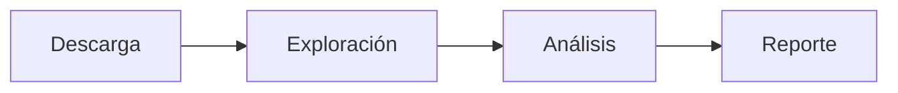
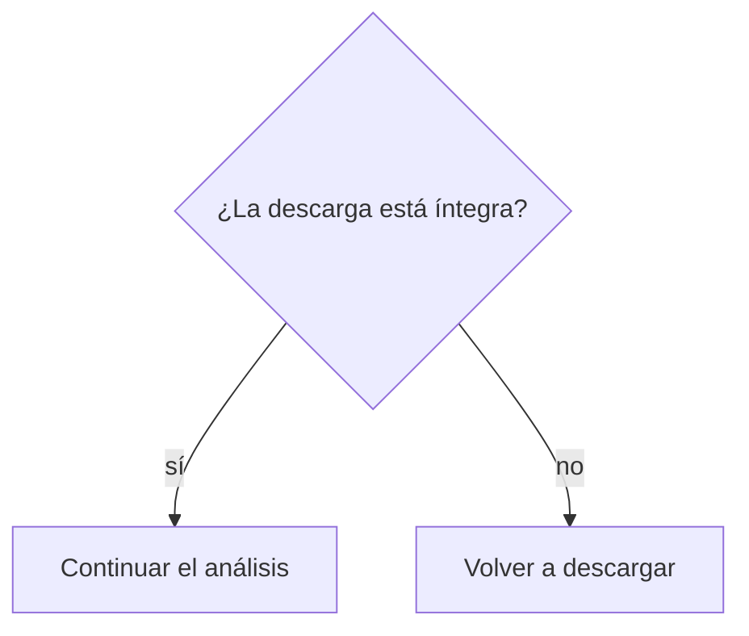

# Unidad 1. Trabajo reproducible y comunicación técnica

> **NOTA:** Este documento es **lectura previa**. Léelo antes de las sesiones S1–S2. En clase no
> repetiremos estas definiciones: usaremos el tiempo para practicar. Al final encontrarás la
> **práctica obligatoria** que debes entregar.

## Ficha de la unidad

| Elemento | Descripción |
| --- | --- |
| **Sesiones** | S1–S2 |
| **Competencias** | A (Trabajo reproducible y comunicación científica) · G (Uso responsable de IA) |
| **Propósito** | Establecer desde el arranque una cultura de trabajo reproducible y la capacidad de comunicar resultados por escrito, base sobre la que se apoya todo el curso. |
| **Ajustes integrados** | Introducción al prompting científico y uso responsable de IA **[Nuevo]** |
| **Lectura base** | Buffalo (2015), Cap. 1 y Cap. 2 |

### Resultados de aprendizaje (demostrables)

Al terminar la unidad, el estudiante es capaz de:

1. **Documentar** reportes y protocolos con Markdown de forma clara y estructurada.
2. **Explicar** las fases del análisis de datos en un problema bioinformático.
3. **Distinguir** investigación *reproducible* de investigación *robusta* y aplicar la "Regla de Oro" de la bioinformática.
4. **Aplicar** los principios FAIR y **crear** metadatos de datos y de software.
5. **Organizar** un proyecto bioinformático reproducible (estructura de directorios, `data_source/` intacta).
6. **Formular** prompts efectivos para un asistente de IA y **validar** sus resultados, identificando alucinaciones y usándolo de forma ética.

---

## 1. ¿Por qué empezar por la reproducibilidad?

Imagina que dentro de un año un revisor te pide repetir el análisis de tu tesis, o que un compañero
quiere partir de tu trabajo. Si no puedes regenerar exactamente los mismos resultados a partir de
los mismos datos, tu trabajo no es verificable. En ciencia, **un resultado que no puede repetirse
tiene poco valor**.

Conviene distinguir dos conceptos que se confunden y que Buffalo (2015, Cap. 1) trata en detalle:

- **Investigación reproducible:** otra persona (o tú en el futuro) puede **regenerar tus mismos
  resultados** a partir de tus datos y tu código. Es un requisito de comunicación y documentación.
- **Investigación robusta:** tu resultado es **correcto y no depende de detalles frágiles** (una
  ruta de archivo, un paso manual, un número tecleado a mano). Un análisis puede ser reproducible
  y aun así estar equivocado; por eso se necesitan ambas.

> **IMPORTANTE:** La **Regla de Oro de la Bioinformática** (Buffalo, 2015, Cap. 1): *nunca confíes
> en tus propias herramientas ni en tus datos*. Verifica todo — supuestos, formatos, resultados
> intermedios— porque en bioinformática los conjuntos de datos son enormes y un error silencioso
> puede propagarse sin que lo notes.

Reproducir un análisis exige tres cosas que trabajaremos durante todo el curso:

- **Datos** claramente identificados, con su origen y versión (metadatos).
- **Procedimiento** documentado paso a paso (protocolo / README).
- **Comunicación** clara de qué se hizo y qué se encontró (reporte).

Esta unidad construye las dos habilidades transversales que lo sostienen: **documentar** (Markdown)
y **organizar con buenas prácticas** (FAIR). Y, como herramienta de apoyo del semestre, introduce
el **uso responsable de la IA**.

> **NOTA:** No necesitas saber programar todavía. Aquí aprendes a *comunicar* y *organizar* el
> trabajo; los comandos de Unix llegan en la Unidad 2.

---

## 2. Las fases del análisis de datos en bioinformática

Casi cualquier problema bioinformático recorre las mismas fases. Reconocerlas te ayuda a planear el
trabajo y a estructurar tus proyectos. Cada fase se describe a continuación:

1. **Pregunta.** Formular con precisión qué se quiere responder. Ejemplo: *¿cuántos genes
   codificantes de proteína tiene el genoma de* E. coli *K-12?* Una pregunta clara define qué datos
   necesitas y qué resultado esperas.
2. **Obtención de datos.** Descargar de una base de datos confiable (NCBI, Ensembl…) y **registrar
   su origen y versión**. Los datos que entran al proyecto son la materia prima y no deben alterarse.
3. **Exploración y limpieza.** Antes de analizar, se revisa el archivo: ¿qué formato tiene?, ¿cuántos
   registros?, ¿hay filas vacías o columnas con datos faltantes?, ¿la descarga está íntegra? Esta
   fase evita conclusiones basadas en datos rotos.
4. **Análisis.** Filtrar, transformar, contar y comparar para producir resultados que respondan la
   pregunta.
5. **Interpretación.** Traducir los números a **significado biológico**. Un número sin
   interpretación no es un resultado.
6. **Comunicación.** Un reporte reproducible que incluye los datos, los comandos y las conclusiones,
   de modo que cualquiera pueda seguir el razonamiento.

El siguiente bloque de código ilustra el flujo en texto (no es un comando, es un esquema):

```text
Pregunta → Datos → Exploración → Análisis → Interpretación → Comunicación
   └──────────── documentación y metadatos en TODAS las fases ────────────┘
```

> **FIGURA SUGERIDA — Ciclo del análisis de datos.** Diagrama horizontal con las seis fases
> (Pregunta → … → Comunicación) y una banda inferior "documentación y metadatos" que abarca todas.
> Se puede **crear** como figura vectorial propia del curso (estilo institucional). No requiere
> fuente externa.

> **COMENTARIO:** La documentación no es la última fase: acompaña a todas. Por eso el curso empieza
> por ella y no por los comandos.

Cuando comunicamos un trabajo de investigación, estas fases se organizan en la **estructura de un
artículo científico**. La correspondencia es directa:

| Fase del análisis | Sección del reporte / protocolo (estilo artículo) |
| --- | --- |
| Pregunta | Introducción (objetivos / hipótesis) |
| Datos + Exploración | Metodología (Software, Datos) |
| Análisis | Resultados |
| **Interpretación** | **Discusión** |
| Comunicación | Resumen, Conclusiones y Referencias |

> **IMPORTANTE:** La **Interpretación** de tus resultados se escribe en la sección **Discusión**. En
> un trabajo de investigación es la parte donde explicas qué *significan* biológicamente tus
> hallazgos; sin ella, el reporte queda incompleto. Usarás esta estructura en la Práctica 1.

---

## 3. Markdown: comunicar y documentar

**Markdown** es un lenguaje de marcado ligero: se escribe texto plano con marcas simples (`#`, `*`,
`-`) que luego se convierten a HTML, PDF u otros formatos. Fue creado por John Gruber para que el
texto fuente sea **legible tal cual**, sin la sobrecarga de HTML (Buffalo, 2015, Cap. 2, "Markdown
for Project Notebooks"). Es el formato de los README de GitHub, de la documentación técnica y de
gran parte del material científico en línea.

Usamos Markdown por tres razones prácticas: es **legible en texto plano**, es **versionable** (se
lleva bien con control de versiones porque es texto), y es **portable** (se convierte a muchos
formatos con herramientas como Pandoc).

> **NOTA:** Página oficial de Markdown (especificación original de John Gruber):
> <https://daringfireball.net/projects/markdown/>. Una guía práctica y completa de referencia:
> <https://www.markdownguide.org/>.

Al tratarse de texto plano, un archivo Markdown se puede escribir en **cualquier editor de texto**.
Existen además herramientas especializadas que muestran una **vista previa** del resultado, lo que
facilita aprender. Algunas de las más usadas:

- **Editores en línea (en el navegador, sin instalar):** [StackEdit](https://stackedit.io),
  [Dillinger](https://dillinger.io) y [HackMD](https://hackmd.io) (útil para escribir en
  colaboración).
- **Editores de escritorio:** [Visual Studio Code](https://code.visualstudio.com) (con vista previa
  de Markdown integrada), [Obsidian](https://obsidian.md) y [Typora](https://typora.io).
- **Plataformas que renderizan Markdown automáticamente:** GitHub y GitLab, donde los archivos
  `README.md` se muestran ya con formato.

> **COMENTARIO:** No necesitas probarlas todas. En este curso trabajaremos con **StackEdit** porque
> es gratuito, funciona en el navegador y muestra el texto y su vista previa lado a lado, ideal para
> aprender. Lo conocemos a continuación.

### 3.1 La herramienta que usaremos: StackEdit

Antes de aprender las etiquetas de Markdown, conozcamos **la herramienta con la que las
practicaremos**. En este curso escribiremos y revisaremos nuestros documentos Markdown con
**StackEdit**, un editor **gratuito que funciona en el navegador**, sin necesidad de instalar nada.
Ábrelo en <https://stackedit.io> y haz clic en "Start writing". Su gran ventaja para aprender es que
muestra, al mismo tiempo, **lo que escribes** y **cómo se verá**; así, cada etiqueta que veamos en
las siguientes secciones podrás probarla y ver su efecto de inmediato.

Sus componentes principales son:

1. **Panel de edición (izquierda).** Aquí escribes el **texto fuente** en Markdown, con sus marcas
   (`#`, `*`, `-`, etc.).
2. **Panel de vista previa (derecha).** Muestra en **tiempo real** el resultado ya renderizado. Los
   dos paneles se desplazan sincronizados, así que ves de inmediato el efecto de cada marca.
3. **Barra de herramientas (toolbar).** Botones para aplicar formato (negrita, cursiva, títulos,
   listas, enlaces, imágenes) que **insertan la marca por ti**; útil mientras memorizas la sintaxis.
4. **Botón de menú (☰, esquina superior izquierda).** Da acceso a **importar y exportar** archivos y
   a la configuración.
5. **Explorador de documentos (icono de carpeta, esquina superior izquierda).** Lista tus documentos
   y carpetas dentro de StackEdit para organizarlos.
6. **Barra de estado (abajo).** Muestra información como el conteo de palabras y caracteres.
7. **Exportar / sincronizar.** Permite **descargar** tu trabajo como archivo `.md`, HTML o PDF, y
   sincronizarlo con servicios como Google Drive, Dropbox o GitHub.

> **ADVERTENCIA:** StackEdit guarda tus documentos en el **navegador**. Si limpias los datos del
> navegador o cambias de computadora, podrías perderlos. Para conservar tu trabajo, **exporta el
> archivo `.md`** (menú ☰ → Export) y guárdalo en la carpeta de tu proyecto. El `.md` exportado es
> lo que entregas.

> **FIGURA SUGERIDA — Interfaz de StackEdit.** Captura de pantalla de StackEdit con **etiquetas
> numeradas** sobre sus componentes: (1) panel de edición, (2) panel de vista previa, (3) barra de
> herramientas, (4) botón de menú, (5) explorador de documentos. **Crear** una captura propia desde
> <https://stackedit.io> y anotar los números. Atribuir la herramienta (StackEdit).

### 3.2 Sintaxis básica

Ahora que ya conoces la interfaz, exploremos las etiquetas de Markdown escribiéndolas en el panel de
edición de StackEdit y observando su efecto en la vista previa. El siguiente bloque muestra las
marcas más comunes y el resultado que producen:

```markdown
# Título de nivel 1
## Título de nivel 2

Texto normal con **negrita**, *cursiva* y `código en línea`.

- Lista con viñetas
- Segundo elemento

1. Lista numerada
2. Segundo elemento

[Un enlace](https://lcg-cursos.github.io/material/introbioinfo/)

> Una cita o nota.
```

Explicación marca por marca:

- `#`, `##`, `###`: títulos de nivel 1, 2, 3 (jerarquía del documento).
- `**texto**`: **negrita**; `*texto*`: *cursiva*.
- `` `texto` ``: código en línea, para nombres de comandos o archivos.
- `-` o `1.`: listas con viñetas o numeradas.
- `[texto](url)`: enlace.
- `>`: cita o nota.

### 3.3 Bloques de código

Los bloques delimitados por tres acentos graves (```` ``` ````) preservan el formato y permiten
indicar el lenguaje. Son esenciales para documentar comandos de forma que se distingan del texto:

````markdown
```bash
grep -c ">" genoma.fasta   # cuenta las secuencias de un archivo FASTA
```
````

> **NOTA:** Indicar el lenguaje (`bash`, `python`, `text`) activa el resaltado de sintaxis, que
> facilita leer y distinguir el código del texto.

### 3.4 Tablas

```markdown
| Archivo        | Formato | Descripción            |
| -------------- | ------- | ---------------------- |
| genoma.fasta   | FASTA   | Secuencia del genoma   |
| anotacion.gff3 | GFF3    | Anotación de features  |
```

Las columnas se separan con `|` y la segunda fila (`---`) marca el encabezado.

### 3.5 Diagramas con mermaid

**mermaid** permite crear diagramas **escribiéndolos como texto**, en lugar de dibujarlos a mano.
Se escribe dentro de un bloque de código etiquetado como `mermaid` y la herramienta lo convierte en
una figura. Es útil para representar flujos de trabajo, pasos de un análisis o decisiones. La
primera palabra del bloque indica el **tipo de diagrama**.

Documentación oficial: <https://mermaid.js.org/>. Editor en vivo para probar diagramas:
<https://mermaid.live>.

**a) Diagrama de flujo (`flowchart`) — el más frecuente.** El siguiente bloque genera un flujo de
izquierda a derecha:

````markdown

````

Elementos que se usan casi siempre:

- **Dirección:** `LR` (izquierda→derecha), `TD` o `TB` (arriba→abajo).
- **Nodos según su forma:** `A[texto]` rectángulo, `A(texto)` bordes redondeados,
  `A{texto}` rombo (se usa para **decisiones**), `A([texto])` tipo píldora.
- **Conexiones:** `-->` flecha, `---` línea sin punta, `-->|etiqueta|` flecha con texto.

**b) Diagrama de flujo con decisión.** El rombo `{}` y las flechas etiquetadas permiten representar
una bifurcación (sí/no):

````markdown

````

**c) Otros tipos frecuentes** (para consulta; no son necesarios en esta unidad):

- `sequenceDiagram`: mensajes o interacciones entre participantes a lo largo del tiempo.
- `mindmap`: mapas mentales para organizar ideas.
- `gantt`: cronogramas de tareas con fechas.

> **COMENTARIO:** Para este curso, el `flowchart` cubre prácticamente todo lo que necesitarás
> (representar las fases de un análisis o un flujo de comandos).

### 3.6 De Markdown a documento final

Una ventaja de Markdown es que un mismo archivo `.md` se puede convertir a HTML, PDF u otros
formatos con herramientas como **Pandoc** (Buffalo, 2015, Cap. 2, "Using Pandoc to Render Markdown
to HTML"). Esto significa que escribes una sola vez, en texto plano, y obtienes documentos con buen
formato sin reescribir nada.

### Práctica 1 — Templates en Markdown (Tarea 1)

Entrega dos archivos Markdown en tu carpeta de proyecto.

**1. `protocolo.md`** — Un protocolo de investigación se redacta con la **estructura de un artículo
científico**. No es una lista de comandos: es el documento donde planteas la pregunta, describes
cómo la resolverás, reportas los resultados y —sobre todo— los interpretas. Usa exactamente esta
plantilla (las líneas `<!-- ... -->` son **comentarios de ayuda** que explican cada sección y **no
aparecen** en el documento renderizado; puedes borrarlos al escribir tu contenido):

Cada sección de la plantilla lleva anotada, entre corchetes, la **fase del análisis** (sección 2) a
la que corresponde. Así el formato del reporte queda alineado con las fases del análisis de datos:

```markdown
# Título del proyecto

### Metadata
**Nombre del autor:**
**Email:** <usuario@lcg.unam.mx>
**Fecha:** dd/mm/yyyy

## Resumen (abstract)
<!-- [Fase: COMUNICACIÓN] Síntesis breve y autosuficiente: objetivo, métodos,
     resultados y conclusiones. -->

## Introducción
<!-- [Fase: PREGUNTA] Contexto del estudio, problema de investigación,
     objetivos o hipótesis. -->

## Metodología
### 1. Software
<!-- [Fase: DATOS] Servidor y software (con versiones) para reproducir los resultados. -->
### 2. Datos
<!-- [Fases: DATOS + EXPLORACIÓN] Origen de los datos (URL, ID, versión),
     exploración, formatos y limpieza. -->

## Resultados
<!-- [Fase: ANÁLISIS] Preguntas de investigación, cómo se van resolviendo y
     los resultados obtenidos. -->

## Discusión
<!-- [Fase: INTERPRETACIÓN] Qué SIGNIFICAN biológicamente los resultados,
     implicaciones y limitaciones. Esta sección es obligatoria. -->

## Conclusiones
<!-- [Fase: COMUNICACIÓN] Cierre: contribuciones más importantes del trabajo. -->

## Referencias
<!-- [Fase: COMUNICACIÓN] En formato APA. -->
```

> **NOTA:** Los corchetes `[Fase: ...]` indican a qué fase del análisis corresponde cada sección; son
> parte de la ayuda y puedes borrarlos al escribir. Esta plantilla es la misma de los ejemplos del
> curso: consulta la plantilla en blanco `ejemplos/formato_protocolo_v1.0.md` y un ejemplo ya
> trabajado en `ejemplos/ReporteGenomeEcoli_Formato_v2.md` para ver cómo se llena cada sección.

> **IMPORTANTE:** La sección **Discusión** es la que contiene la **interpretación** y distingue un
> protocolo de investigación de una simple lista de comandos. Como su formación es para la
> investigación, un resultado sin interpretación biológica está incompleto: no la omitas.

**2. `reporte-lectura.md`** con: `## Referencia` (cita completa), `## Resumen` (máximo 5 líneas),
`## Aportación principal`, `## Crítica o duda`.

**3.** Ambos archivos deben usar al menos: un título de nivel 1 y otro de nivel 2, una lista, una
tabla y un bloque de código.

**4.** Verifica que se ven bien en [StackEdit](https://stackedit.io) antes de entregar.

---

## 4. Buenas prácticas: datos y software FAIR

Los **principios FAIR** (Wilkinson et al., 2016) describen cómo deben gestionarse y publicarse los
datos —y el software— para que sean útiles más allá de quien los generó. FAIR es un acrónimo:

- **F**indable (localizable): tiene identificadores persistentes y metadatos que permiten encontrarlo.
- **A**ccessible (accesible): se puede recuperar mediante un protocolo claro y abierto.
- **I**nteroperable (interoperable): usa formatos y vocabularios estándar que otras herramientas entienden.
- **R**eusable (reutilizable): está bien documentado y con una licencia de uso explícita.

> **NOTA:** FAIR **no** significa necesariamente "abierto/gratis". Significa que, con los permisos
> que correspondan, el dato es localizable, accesible, interoperable y reutilizable gracias a sus
> metadatos (Wilkinson et al., 2016).

> **FIGURA SUGERIDA — Principios FAIR.** Infografía con los cuatro pilares (F-A-I-R) y una frase por
> cada uno. Fuente recomendada: sitio GO-FAIR, <https://www.go-fair.org/fair-principles/> (revisar
> licencia/atribución antes de reutilizar), o **crear** una versión propia con el estilo del curso.

### 4.1 Metadatos: los datos sobre los datos

Un **metadato** es información que describe un dato para que pueda interpretarse correctamente:
quién lo creó o de dónde se obtuvo, cuándo, en qué formato está, qué significa cada columna y qué
versión es. Sin metadatos, un archivo descargado hoy es un misterio dentro de seis meses.

El siguiente bloque es un ejemplo de archivo de metadatos que **acompaña** a un conjunto de datos:

```markdown
# Metadatos — genoma_ecoli.fasta

- Origen: NCBI Genomes, ensamble GCF_000005845.2 (Escherichia coli K-12 MG1655)
- URL: https://www.ncbi.nlm.nih.gov/datasets/genome/GCF_000005845.2/
- Fecha de descarga: 2026-08-20
- Formato: FASTA (nucleótidos)
- Descargado por: (nombre)
- Comando de descarga: (registrar el comando exacto)
- Notas: archivo ORIGINAL, no modificar.
```

Catálogos de estándares de metadatos por disciplina: [FAIRsharing.org](https://fairsharing.org).
Esquemas de metadatos ampliamente usados: **Dublin Core** y **DataCite**.

### 4.2 Organización de un proyecto reproducible

Un proyecto ordenado separa lo que **entra** (datos fuente, intocables) de lo que **se produce**
(resultados, siempre regenerables). Esta estructura sigue las recomendaciones de Buffalo (2015,
Cap. 2, "Project Directories and Directory Structures"). El siguiente bloque muestra un árbol de
directorios de ejemplo:

```text
mi-proyecto/
├── README.md          # documentación del proyecto: qué es y cómo reproducirlo
├── data_source/       # datos ORIGINALES + sus metadatos. NUNCA se modifican
│   ├── genoma_ecoli.fasta
│   └── genoma_ecoli.metadatos.md
├── results/           # todo lo que se genera a partir de los datos (regenerable)
├── src/               # scripts y comandos
└── doc/               # documentación y reportes (p. ej. protocolo.md)
```

> **IMPORTANTE:** Los datos de `data_source/` **no se tocan nunca**. Si necesitas filtrarlos o
> reformatearlos, hazlo en un paso documentado cuya salida viva en `results/`. Así cualquiera puede
> regresar al punto de partida y reproducir el trabajo.

Dos documentos cumplen papeles distintos y complementarios:

- El **README** es el **cuaderno del proyecto**: describe de qué trata y contiene los comandos
  necesarios para **reproducir** los resultados. Es la pieza que hace reproducible el proyecto.
- El **`protocolo.md`** (estilo artículo científico, sección de la Práctica 1) es el documento donde
  **comunicas e interpretas** los hallazgos: Introducción, Metodología, Resultados y Discusión.

### 4.3 Software FAIR

Si tu proyecto produce código o comandos, aplica las mismas ideas (Buffalo, 2015, Cap. 5, sobre
control de versiones): documenta cómo se ejecuta, indica versiones y dependencias, y usa control de
versiones (Git, que verás formalmente en *Programación Aplicada a la Bioinformática I*). Checklist:
[FAIR Software](https://fair-software.nl/recommendations/checklist).

### Práctica 2 — Ordenar un proyecto y sus metadatos (parte de la Tarea 2)

1. Crea la estructura de directorios mostrada arriba para el conjunto de datos que usarás en tu
   proyecto del semestre.
2. Coloca el dato original en `data_source/` **sin modificarlo**.
3. Redacta su archivo de metadatos (usa el ejemplo de la sección 4.1 como plantilla; completa todos
   los campos).
4. Escribe un `README.md` inicial que describa el proyecto y liste los pasos previstos.
5. Entrega el árbol de directorios (salida de `ls` o `tree`) junto con los archivos.

---

## 5. Introducción a la IA y al prompting científico  [Nuevo]

> **NOTA:** Esta sección es el **inicio del eje de IA en espiral**: aquí se dan las bases; a lo largo
> del curso se refuerza con tareas reales y se cierra con una discusión crítica en la última sesión.

Los asistentes de IA generativa (como ChatGPT) ya forman parte del trabajo cotidiano. En este curso
los usamos **como apoyo**, con criterios claros para que fortalezcan tu razonamiento en lugar de
sustituirlo.

### 5.1 ¿Qué es un modelo de lenguaje?

Un **modelo de lenguaje grande** (LLM, por *Large Language Model*) es un sistema entrenado con
enormes cantidades de texto que **predice la continuación más probable** de lo que le escribes. No
"comprende" ni "sabe" como una persona: **genera texto plausible** con base en patrones estadísticos.
De ahí se deriva una consecuencia central: **puede sonar seguro y estar equivocado**.

### 5.2 Alucinaciones

Una **alucinación** es una respuesta que parece correcta pero es falsa: un comando que no existe,
una opción de programa inventada, una cita bibliográfica inexistente. Ocurren porque el modelo
produce lo *probable*, no lo *verificado*. Por eso, en ciencia, **nada que provenga de una IA se
acepta sin comprobar**.

### 5.3 Prompting efectivo

Un *prompt* es la instrucción que le das a la IA. Un buen prompt mejora mucho la respuesta. El
siguiente bloque compara un prompt pobre con uno efectivo:

```text
Prompt pobre:
"dime cómo contar cosas en un archivo"

Prompt efectivo:
"Tengo un archivo FASTA de nucleótidos. Quiero contar cuántas secuencias contiene
usando la línea de comandos de Linux. Explícame el comando paso a paso y dime cómo
verificar que el conteo es correcto."
```

Un prompt efectivo incluye: **contexto** (qué datos tienes), **objetivo** (qué quieres lograr),
**formato** deseado (p. ej. explicación paso a paso) y una petición explícita de **verificación**.

### 5.4 Validación: el paso que no se salta

Después de recibir una respuesta de IA, sigue estos tres pasos:

1. **Entiéndela.** Si no puedes explicar qué hace un comando, no lo ejecutes.
2. **Pruébala** en datos pequeños de los que ya conozcas el resultado esperado.
3. **Contrástala** con la documentación oficial (`man`, docs del programa) o el material del curso.

### 5.5 Uso ético y responsable

- **Transparencia:** declara cuándo usaste IA y para qué.
- **Responsabilidad:** el resultado es **tuyo**, no del modelo; tú respondes por él.
- **Privacidad:** no compartas datos sensibles o no públicos en un asistente.
- **Aprendizaje:** si la IA te da la solución completa, te quita la práctica que después se evalúa.
  Úsala para entender, no para evitar pensar.

### 5.6 Herramientas del curso

- **GPT "Profesor de Unix":** asistente para consultar comandos y conceptos del dominio.
- **Bitácora de IA:** un archivo `bitacora-ia.md` donde registras, por tarea, qué le pediste a la
  IA, qué te respondió y **cómo validaste** el resultado. Forma parte de la evaluación (competencia G).

El siguiente bloque es un ejemplo de una entrada de bitácora:

```markdown
## Tarea 1 — 2026-08-22
- Pedí: ayuda para entender la sintaxis de una tabla en Markdown.
- Respuesta: ejemplo de tabla con | y -.
- Validación: la reproduje en StackEdit y se renderizó correctamente.
- Observación: la respuesta fue correcta; sin imprecisiones.
```

### Práctica 3 — Primer uso responsable de IA (parte de la Tarea 2)

1. Elige una **duda real** de esta unidad (p. ej. una marca de Markdown o un concepto FAIR).
2. Redacta un **prompt efectivo** siguiendo la sección 5.3 e inclúyelo en tu `bitacora-ia.md`.
3. Registra la respuesta y **valida** el resultado con los tres pasos de la sección 5.4.
4. Anota explícitamente si detectaste alguna **imprecisión o alucinación** y cómo la corregiste.

---

## 6. Cierre de la unidad

### Checklist de habilidades (¿lo puedo demostrar?)

- [ ] Escribo un documento en Markdown con títulos, listas, tablas, enlaces y bloques de código.
- [ ] Explico las fases del análisis de datos y ubico la documentación en ellas.
- [ ] Distingo reproducibilidad de robustez y aplico la Regla de Oro de la bioinformática.
- [ ] Redacto metadatos claros para un conjunto de datos.
- [ ] Organizo un proyecto con `data_source/` intacta, un README que lo documenta y reproduce, y un `protocolo.md` estilo artículo.
- [ ] Formulo un prompt efectivo, valido su respuesta y registro el uso de IA en mi bitácora.

### Tareas a entregar

- **Tarea 1 — Templates** (Práctica 1): `protocolo.md` y `reporte-lectura.md`.
- **Tarea 2 — Lectura + proyecto + IA** (Prácticas 2 y 3): reporte de lectura del Cap. 1 de Buffalo
  (2015), estructura de proyecto con `data_source/` y metadatos, y `bitacora-ia.md` con la primera
  entrada.

### Lecturas / consulta previa para la Unidad 2

- Buffalo (2015), Cap. 3 ("Remedial Unix Shell"): filosofía de Unix y por qué se usa en bioinformática.
- Instalar un cliente de transferencia de archivos (FileZilla) si aún no lo tienes.

---

## Referencias

- Buffalo, V. (2015). *Bioinformatics Data Skills: Reproducible and Robust Research with Open Source
  Tools*. O'Reilly Media. — Cap. 1 (investigación reproducible y robusta; Regla de Oro) y Cap. 2
  (organización de proyectos, documentación y Markdown). Disponible en `referencias/bioinformatics-data-skills.pdf`.
- Wilkinson, M. D., et al. (2016). The FAIR Guiding Principles for scientific data management and
  stewardship. *Scientific Data*, 3, 160018. doi:10.1038/sdata.2016.18.
- GO-FAIR. FAIR Principles. <https://www.go-fair.org/fair-principles/>
- FAIRsharing.org — catálogo de estándares de metadatos. <https://fairsharing.org>
- Markdown — página oficial (John Gruber). <https://daringfireball.net/projects/markdown/>
- Markdown Guide — guía de referencia. <https://www.markdownguide.org/>
- Markdown cheatsheet. <https://github.com/adam-p/markdown-here/wiki/Markdown-Cheatsheet>
- StackEdit — editor de Markdown en línea. <https://stackedit.io>
- mermaid — documentación oficial. <https://mermaid.js.org/>
- mermaid — editor en vivo. <https://mermaid.live>
